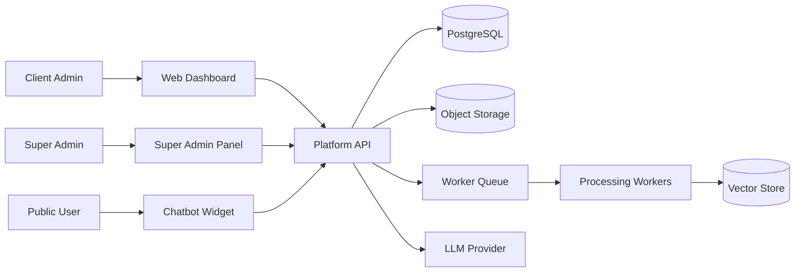

# Software Requirements Specification

Version: 0.1
Status: Draft

## 1. Introduction

This Software Requirements Specification defines the system-level requirements for the ChatBotWeb / Yoranix AI Platform MVP.

The platform is a multi-tenant SaaS system for creating, managing, and deploying client-specific RAG chatbots.

## 2. System scope

The MVP includes:

- Multi-tenant organisation and workspace model
- User authentication and role-based access
- Knowledge upload and processing
- Vector-based retrieval
- Chatbot answer generation
- Website widget
- Chat logs and basic analytics
- Audit events

## 3. System actors

### Platform super admin

Has access to platform-wide organisation management and operational views.

### Organisation owner

Owns a client organisation and can manage organisation-level settings and users.

### Client admin

Manages workspace knowledge, chatbot settings, and analytics.

### Knowledge contributor

Uploads and manages knowledge sources within allowed permissions.

### Viewer

Can view dashboards and analytics but cannot modify knowledge or settings.

### Public chatbot user

Asks questions through the website widget.

## 4. System context

## 5. External interfaces

### User interface

The system must provide:

- Super-admin web interface
- Client-admin web interface
- Public chatbot widget

### API interface

The backend must expose APIs for:

- Authentication session handling
- Organisation management
- Workspace management
- User and role management
- Document management
- Chatbot messaging
- Analytics
- Audit logs

### Storage interface

The platform must store original uploaded files in object storage.

### AI provider interface

The platform must call external or configured AI providers for embeddings and answer generation.

### Queue interface

Document processing and embedding tasks must run asynchronously through a queue.

## 6. Data requirements

The system must store:

- Organisations
- Workspaces
- Users
- Role memberships
- Documents
- Document versions
- Chunks
- Embeddings or vector references
- Chat sessions
- Chat messages
- Citations
- Analytics events
- Audit events
- Widget settings

## 7. Functional requirements

### SRS-FR-001 Authentication

The system must require authenticated access for all dashboards.

### SRS-FR-002 Tenant context

Every authenticated dashboard request must resolve organisation and workspace context before returning data.

### SRS-FR-003 Public widget key

Public chatbot requests must use a workspace public key or equivalent identifier that maps to one active workspace.

### SRS-FR-004 Organisation CRUD

Super admins must be able to create, read, update, and deactivate organisations.

### SRS-FR-005 Workspace CRUD

Authorised users must be able to create, read, update, and deactivate workspaces within their organisation.

### SRS-FR-006 Role enforcement

The system must enforce role permissions on all protected operations.

### SRS-FR-007 Document upload

Authorised users must be able to upload supported files to a workspace knowledge base.

### SRS-FR-008 Document processing queue

After upload, the system must enqueue a processing job and mark the document as processing.

### SRS-FR-009 Text extraction

Workers must extract text from supported files.

### SRS-FR-010 Chunk creation

Workers must split extracted text into retrievable chunks and attach metadata.

### SRS-FR-011 Embedding creation

Workers must generate embeddings for chunks and store them in the vector index.

### SRS-FR-012 Document status updates

The system must update document status to ready or failed after processing.

### SRS-FR-013 Retrieval

The chat system must retrieve chunks filtered by workspace and active document state.

### SRS-FR-014 Answer generation

The chat system must generate answers using retrieved context.

### SRS-FR-015 Source citation

When source context is used, the answer must return citation metadata.

### SRS-FR-016 Safe fallback

If retrieval confidence is low, the system must respond with a safe fallback rather than inventing an answer.

### SRS-FR-017 Chat persistence

The system must store chat sessions and messages.

### SRS-FR-018 Analytics event capture

The system must capture usage and quality-related events.

### SRS-FR-019 Audit event capture

The system must capture administrative actions as audit events.

### SRS-FR-020 Branding settings

Client admins must be able to configure basic chatbot branding.

## 8. Non-functional requirements

### SRS-NFR-001 Security

All tenant-scoped data access must be filtered by tenant or workspace.

### SRS-NFR-002 Privacy

The system must avoid collecting unnecessary personal data from public chatbot users.

### SRS-NFR-003 Reliability

Document processing failures must not crash the platform and must be visible to admins.

### SRS-NFR-004 Performance

Public chat requests should return within acceptable MVP latency targets.

### SRS-NFR-005 Scalability

The system must separate API request handling from long-running processing tasks.

### SRS-NFR-006 Maintainability

Backend, frontend, widget, and AI services should be modular.

### SRS-NFR-007 Observability

The platform must log request errors, processing errors, AI latency, and usage events.

### SRS-NFR-008 Portability

The MVP should run locally using Docker-based development infrastructure.

## 9. Permission matrix

| Capability | Super Admin | Org Owner | Client Admin | Contributor | Viewer |
|---|---:|---:|---:|---:|---:|
| Manage all organisations | Yes | No | No | No | No |
| Manage own organisation | Yes | Yes | No | No | No |
| Manage workspace settings | Yes | Yes | Yes | No | No |
| Upload knowledge | Yes | Yes | Yes | Yes | No |
| Archive knowledge | Yes | Yes | Yes | Limited | No |
| View chat history | Yes | Yes | Yes | No | Yes |
| View analytics | Yes | Yes | Yes | No | Yes |
| Manage users | Yes | Yes | Yes | No | No |

## 10. MVP system states

### Organisation states

- active
- suspended
- deactivated

### Workspace states

- active
- disabled

### Document states

- uploaded
- processing
- ready
- failed
- archived
- expired

### Chat answer states

- answered
- answered_with_low_confidence
- fallback
- escalated

## 11. Acceptance test examples

### Test 1: Tenant isolation

Given two organisations with uploaded documents, when a public user asks a question in Organisation A's widget, then the retrieval system must not return Organisation B's chunks.

### Test 2: Document upload and processing

Given a client admin uploads a PDF, when processing completes, then the document status becomes ready and its chunks are searchable.

### Test 3: Safe fallback

Given the knowledge base does not contain relevant information, when a user asks an unsupported question, then the chatbot must respond with a fallback and flag the question as unanswered.

### Test 4: Role enforcement

Given a viewer user attempts to upload a document, when the request is submitted, then the system must reject it.

## 12. Assumptions

- Initial pilots are English-language organisations.
- MVP traffic will be moderate.
- The first deployment can be single-region.
- Human handover can start as a simple contact form rather than live chat.

## 13. Constraints

- The system must be cost-aware because public chat widgets can generate uncontrolled usage.
- The system must remain simple enough for a small team to maintain.
- MVP decisions should not block future integrations.
