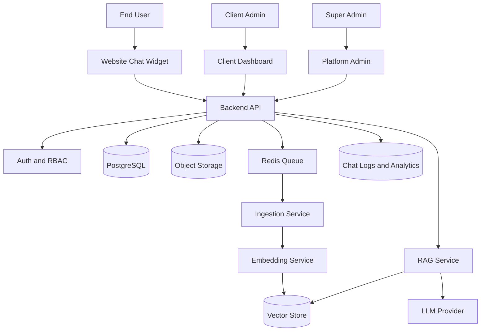
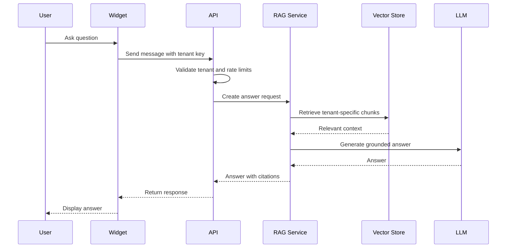

# System Architecture

Version: 0.1
Status: Draft

## Architecture goal

Build a modular multi-tenant SaaS platform that supports client-specific knowledge bases, RAG chatbots, website widgets, analytics, and future AI agents.

## High-level system

## Core applications

### apps/web

Client-facing dashboard and future public marketing site.

### apps/admin

Internal super-admin interface for platform operators.

### apps/widget

Embeddable JavaScript chatbot widget for client websites.

### apps/api

Main API entrypoint. Handles authentication, tenant resolution, documents, chats, analytics, and orchestration calls.

## Core services

### ingestion-service

Extracts text from uploaded documents and prepares content for indexing.

Responsibilities:

- File validation
- Text extraction
- Metadata extraction
- Chunking
- Deduplication
- Status updates

### embedding-service

Creates vector embeddings for document chunks.

Responsibilities:

- Embedding model selection
- Batch processing
- Retry handling
- Cost tracking

### rag-service

Handles retrieval and answer generation.

Responsibilities:

- Tenant-aware retrieval
- Hybrid search
- Reranking
- Context assembly
- Prompt construction
- Citation generation
- Confidence checks

### agent-service

Future orchestration layer for tool-using AI agents.

### evaluation-service

Measures answer quality, retrieval quality, hallucination risk, and regression quality.

## Data stores

### PostgreSQL

Primary relational database for tenants, users, roles, documents, chat sessions, messages, analytics, and audit events.

### Vector store

MVP: PostgreSQL with pgvector.

Scale option: Qdrant.

### Object storage

Stores original uploaded files and generated processed artefacts.

### Redis

Used for queues, caching, rate limiting, and short-lived runtime state.

## Tenant isolation

Every major table and vector record must include tenant_id.

Every API request must resolve tenant context before accessing data.

Every retrieval query must filter by tenant_id and active document status.

## Request lifecycle

## Deployment approach

MVP deployment should use Docker Compose.

Production deployment can later move to Kubernetes when scale requires it.

## Non-negotiable architecture rules

1. No cross-tenant retrieval.
2. No answer without tenant context.
3. All generated answers should include source references when possible.
4. Long-running work must run through queues.
5. Uploaded files must never be processed synchronously inside request-response paths.
6. Every AI call must be logged for cost, latency, and quality analysis.
