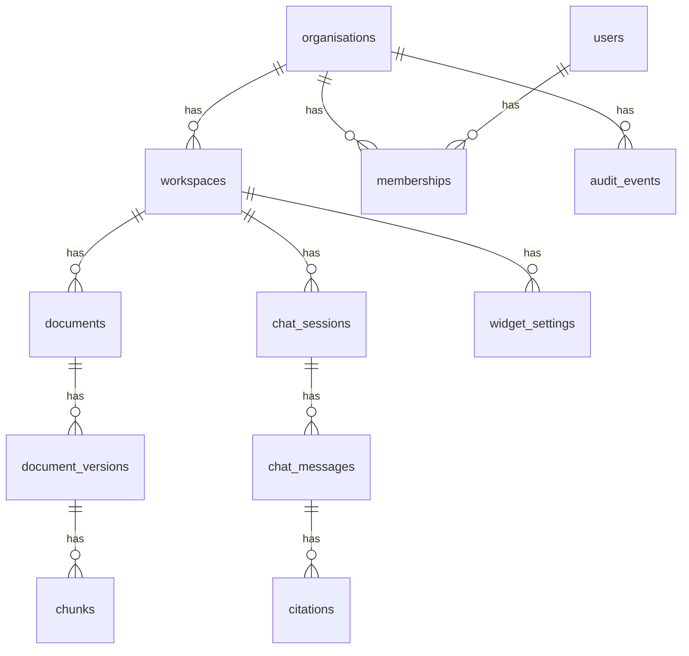

# Database Design

Version: 0.1
Status: Draft

## 1. Purpose

Define the initial relational data model for the ChatBotWeb / Yoranix AI Platform MVP.

The database must support multi-tenancy, knowledge management, document processing, RAG retrieval metadata, chat history, analytics, and auditability.

## 2. Database choice

MVP database: PostgreSQL.

Initial vector option: pgvector extension in PostgreSQL.

Future vector option: Qdrant if scale or retrieval performance requires it.

## 3. Design principles

1. Tenant-scoped tables must include organisation_id or workspace_id.
2. Workspace-level data must never be queried without workspace filtering.
3. Documents and chunks must keep lifecycle status.
4. Chat sessions and messages must be auditable.
5. AI usage must be tracked for cost and quality analysis.
6. Soft deletion should be preferred for business records.

## 4. Core entity model

## 5. Tables

### organisations

Represents a client organisation.

Fields:

- id
- name
- slug
- status
- plan_key
- created_at
- updated_at
- deleted_at

### workspaces

Represents a chatbot or assistant workspace within an organisation.

Fields:

- id
- organisation_id
- name
- slug
- status
- default_language
- created_at
- updated_at
- deleted_at

### users

Represents authenticated dashboard users.

Fields:

- id
- email
- full_name
- avatar_url
- auth_provider
- external_auth_id
- status
- created_at
- updated_at

### memberships

Connects users to organisations and roles.

Fields:

- id
- organisation_id
- user_id
- role
- status
- created_at
- updated_at

Roles:

- super_admin
- org_owner
- client_admin
- contributor
- viewer

### documents

Represents a knowledge source uploaded or created inside a workspace.

Fields:

- id
- organisation_id
- workspace_id
- title
- source_type
- status
- category
- created_by_user_id
- created_at
- updated_at
- archived_at
- deleted_at

Source types:

- pdf
- docx
- txt
- csv
- faq
- url_future
- integration_future

Statuses:

- uploaded
- processing
- ready
- failed
- archived
- expired

### document_versions

Represents a specific version of a document.

Fields:

- id
- document_id
- version_number
- original_file_path
- extracted_text_path
- checksum
- processing_status
- processing_error
- effective_from
- expires_at
- created_at
- created_by_user_id

### chunks

Represents retrievable text chunks.

Fields:

- id
- organisation_id
- workspace_id
- document_id
- document_version_id
- chunk_index
- content
- content_hash
- token_count
- metadata_json
- embedding_vector
- status
- created_at

Important metadata:

- page_number
- section_title
- source_title
- language

### widget_settings

Stores chatbot widget configuration.

Fields:

- id
- organisation_id
- workspace_id
- public_key
- bot_name
- welcome_message
- primary_colour
- logo_path
- allowed_domains_json
- suggested_questions_json
- fallback_contact_email
- status
- created_at
- updated_at

### chat_sessions

Represents a conversation.

Fields:

- id
- organisation_id
- workspace_id
- channel
- anonymous_user_id
- user_agent
- referrer_url
- status
- started_at
- ended_at

Channels:

- widget
- dashboard_test
- api_future

### chat_messages

Represents user and assistant messages.

Fields:

- id
- organisation_id
- workspace_id
- chat_session_id
- role
- content
- answer_state
- model_name
- prompt_tokens
- completion_tokens
- total_cost_estimate
- latency_ms
- created_at

Roles:

- user
- assistant
- system

Answer states:

- answered
- answered_with_low_confidence
- fallback
- escalated

### citations

Links assistant messages to source chunks.

Fields:

- id
- organisation_id
- workspace_id
- chat_message_id
- chunk_id
- document_id
- score
- quote
- created_at

### analytics_events

Stores usage and product events.

Fields:

- id
- organisation_id
- workspace_id
- event_type
- actor_type
- actor_id
- properties_json
- created_at

### audit_events

Stores administrative events.

Fields:

- id
- organisation_id
- workspace_id
- actor_user_id
- action
- entity_type
- entity_id
- before_json
- after_json
- ip_address
- created_at

## 6. Indexing strategy

Required indexes:

- organisations.slug
- workspaces.organisation_id
- workspaces.slug
- memberships.user_id
- memberships.organisation_id
- documents.workspace_id
- documents.status
- chunks.workspace_id
- chunks.document_id
- chunks.status
- chat_sessions.workspace_id
- chat_messages.chat_session_id
- audit_events.organisation_id
- analytics_events.workspace_id

Vector index:

- chunks.embedding_vector using pgvector index

## 7. Tenant isolation rules

Every query against tenant-owned data must include organisation_id or workspace_id.

The RAG service must filter chunks by:

- organisation_id
- workspace_id
- status active
- active document version
- non-expired document

## 8. Future database additions

- subscriptions
- invoices
- model configurations
- prompt versions
- evaluation datasets
- evaluation runs
- integrations
- sync jobs
- agent tools
- human handover tickets
