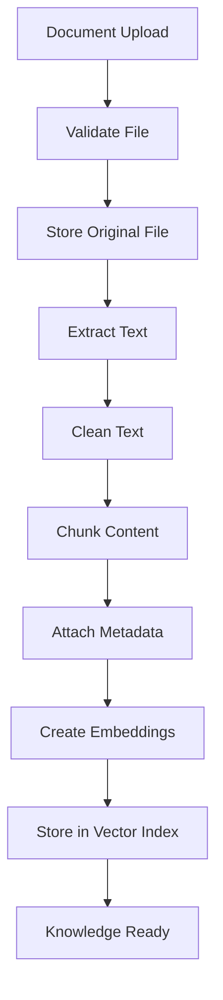
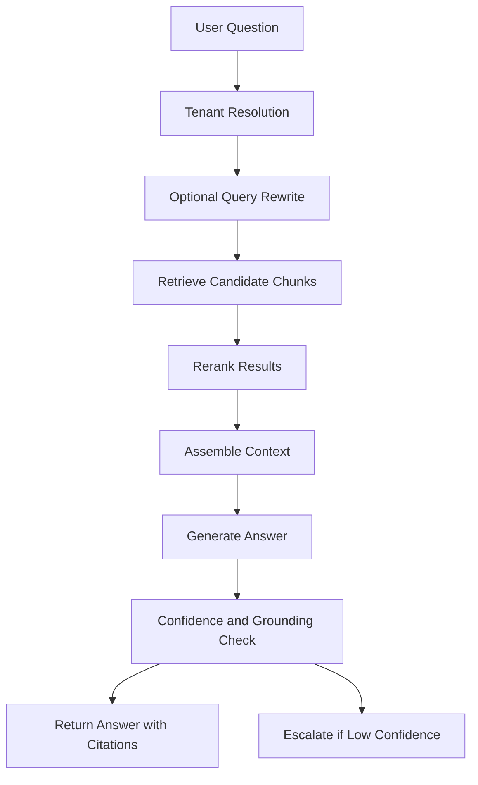

# RAG Architecture

Version: 0.1
Status: Draft

## Purpose

Define how the platform ingests knowledge, retrieves relevant context, and generates grounded answers for each tenant.

## RAG objective

The system must answer user questions using only the active knowledge sources available to the current tenant.

## Core pipeline

## Query pipeline

## Supported knowledge sources for MVP

- PDF
- DOCX
- TXT
- CSV
- Manual FAQ entries

## Future knowledge sources

- Website sitemap crawling
- SharePoint
- OneDrive
- Google Drive
- Notion
- Confluence
- Email inbox knowledge
- CRM records

## Document states

Documents must move through clear lifecycle states:

- uploaded
- processing
- ready
- failed
- archived
- expired

Only ready and active documents are available for retrieval.

## Chunking strategy

MVP strategy:

- Split by headings and paragraphs where possible.
- Use token-aware chunking.
- Keep overlap between chunks.
- Preserve document title, page number, section, and source metadata.

Initial target:

- Chunk size: 600 to 1,000 tokens
- Overlap: 100 to 150 tokens

These values should be tested and adjusted through evaluation.

## Metadata model

Each chunk should include:

- tenant_id
- workspace_id
- document_id
- document_version_id
- source_type
- source_title
- page_number
- section_title
- language
- status
- effective_from
- expires_at
- created_at

## Retrieval strategy

MVP retrieval:

- Tenant metadata filtering
- Vector similarity search
- Top-k candidate retrieval
- Context assembly

Phase 2 retrieval:

- Hybrid search: keyword + vector
- Reranking
- Query rewriting
- Metadata-aware routing
- Category-specific retrieval

## Answer generation rules

The assistant must:

1. Answer using retrieved context.
2. Avoid guessing when the knowledge base is insufficient.
3. Include source references when possible.
4. Ask a clarification question when the user question is vague.
5. Escalate or offer contact options when confidence is low.

## Failure behaviour

If no strong evidence is found, the assistant should not fabricate an answer.

Recommended response pattern:

"I could not find a confirmed answer in the available knowledge base. You may want to contact the organisation directly, or I can help send your enquiry to the right team."

## Evaluation metrics

RAG quality should be measured with:

- Answer correctness
- Faithfulness to sources
- Context relevance
- Retrieval precision
- Retrieval recall
- Citation accuracy
- Refusal quality
- Latency
- Cost per answer

## Cost controls

- Cache repeated questions.
- Use smaller models for simple answers.
- Limit context length.
- Batch embeddings.
- Track usage per tenant.
- Rate-limit public widgets.

## Security rules

- Retrieval must always include tenant_id filter.
- Archived and expired documents must be excluded.
- Private admin-only documents must not be exposed to public widgets.
- AI prompts must not expose system instructions or other tenant data.
