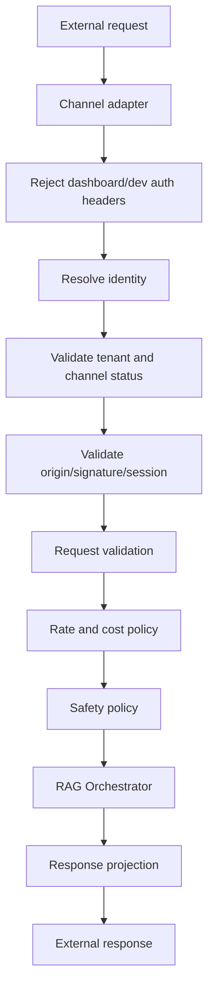

# Public Access Layer Architecture

Version: 0.1
Status: Proposed Architecture
Scope: Architecture only. No public endpoint, migration, widget code, session model, or runtime feature is implemented by this document.

## 1. Purpose

The Public Access Layer is the reusable bounded context that mediates all external, public, and semi-public channel traffic before it reaches the RAG Orchestrator, Knowledge Platform, or AI Core. It turns channel-specific requests into a tenant-safe, policy-checked, source-grounded platform request.

It exists so the website widget is not a special one-off path. The same layer must support future public REST API clients, Slack, Microsoft Teams, WhatsApp, voice, MCP clients, and other external channels without weakening tenant isolation or duplicating security logic.

## 2. Bounded Context

```text
External Channels
    ?
Public Access Layer
    ?
RAG Orchestrator
    ?
Knowledge Platform
    ?
AI Core
```

The Public Access Layer owns the boundary between untrusted external channels and internal tenant-scoped platform services.

It must answer these questions before orchestration starts:

1. What channel is calling?
2. Which tenant/workspace is this allowed to access?
3. Is the caller/key/session/origin/integration valid?
4. Is the request within rate, cost, content, and safety policy?
5. What normalised request should be sent to RAG Orchestrator?
6. What public-safe response should be returned?

## 3. Channel Reuse Targets

The layer must be reusable across:

- Website widget.
- Public REST API.
- Slack.
- Microsoft Teams.
- WhatsApp.
- Voice.
- MCP clients.
- Future external channels.

Each channel may have a different identity proof, transport, response format, and UX, but all must converge on shared tenant resolution, policy enforcement, abuse controls, request normalisation, and safe response handling.

## 4. Responsibilities

The Public Access Layer owns:

- Channel registration and capability metadata.
- Public/integration identity resolution.
- Tenant/workspace resolution from server-side mappings.
- Origin/domain or platform callback validation where relevant.
- Anonymous or external session validation.
- Request validation and normalisation.
- Rate limiting and cost guard checks.
- Public-safe error mapping.
- Public-safe response projection.
- Channel-specific event/security telemetry.
- Enforcement that public traffic never reuses dashboard authentication or development headers.

The Public Access Layer does not own:

- Retrieval algorithms.
- Prompt rendering internals.
- Provider routing internals.
- Vector store implementation.
- Dashboard RBAC.
- Document lifecycle and ingestion.
- Channel UI rendering beyond response contracts.
- Long-term conversation memory policies, except enforcing configured public limits.

## 5. Internal Module Shape

Future backend modules should preserve this logical shape even if implemented inside `apps/api` first:

```text
app/public_access/
  channels/
    widget.py
    rest_api.py
    slack.py
    teams.py
    whatsapp.py
    voice.py
    mcp.py
  identity.py
  tenant_resolution.py
  sessions.py
  domain_validation.py
  request_validation.py
  rate_limits.py
  cost_policy.py
  safety_policy.py
  response_projection.py
  errors.py
  events.py
  service.py
```

This is an architectural package boundary, not an instruction to implement files in this task.

## 6. Core Contracts

### PublicAccessRequest

A normalised input contract should include:

- `request_id`
- `channel`
- `channel_environment`
- `public_credential_type`
- `public_credential_value` or resolved credential reference
- `session_token` optional
- `origin` optional
- `source_url` optional
- `client_message_id` optional
- `message_text`
- `transport_metadata`
- `client_capabilities`

It must not accept trusted client-supplied `organisation_id`, `workspace_id`, provider keys, prompt keys, document IDs, chunk IDs, or model keys.

### ResolvedPublicContext

A resolved context should include:

- `organisation_id`
- `workspace_id`
- `channel`
- `channel_identity_id`
- `public_key_id` or integration credential ID
- `session_id` optional
- `conversation_id` optional
- `allowed_origin` optional
- `environment`
- `policy_profile`
- `limits_profile`

Only this server-resolved context may be passed to the RAG Orchestrator.

### PublicAccessResult

A normalised result should include:

- `request_id`
- `public_message_id` or internal message reference where safe
- `answer`
- `answer_state`
- public-safe `citations`
- `conversation_continuation_token` only if required by the channel
- `rate_limit_remaining` optional
- `retry_after` optional
- `safe_error` optional

Provider names, prompt text, stack traces, internal IDs, and hidden metadata must not be exposed unless intentionally whitelisted for that channel.

## 7. Tenant Resolution

Tenant resolution is the central invariant of the Public Access Layer.

Every external request must resolve through a server-owned mapping:

```text
external credential or channel identity
-> public access identity record
-> active workspace
-> active organisation
-> server-side tenant context
```

Examples:

| Channel | Credential or identity | Resolution source |
| --- | --- | --- |
| Website widget | `public_widget_key` | Public widget key table. |
| Public REST API | API key or OAuth client | Integration credential table. |
| Slack | Slack app/team/channel installation | Slack installation mapping. |
| Microsoft Teams | Tenant/app installation | Teams installation mapping. |
| WhatsApp | Business account/phone number | WhatsApp integration mapping. |
| Voice | Caller flow or provisioned voice agent ID | Voice integration mapping. |
| MCP client | MCP client credential or installation | MCP integration mapping. |

No external channel may pass trusted tenant identifiers directly to RAG Orchestrator.

## 8. Policy Pipeline

The Public Access Layer should process requests in this order:

1. Parse transport and channel metadata.
2. Reject dashboard/development auth headers on public surfaces.
3. Resolve external identity to tenant context.
4. Validate channel status, workspace status, organisation status, and environment.
5. Validate origin/domain/callback signature where applicable.
6. Validate anonymous or external session token where applicable.
7. Enforce request body, message, and content limits.
8. Enforce Redis rate limits.
9. Enforce cost/session/message quotas.
10. Apply content-safety and prompt-injection prechecks.
11. Convert to RAG Orchestrator request using resolved tenant context.
12. Project RAG result to channel-safe response.
13. Emit audit/security/operational events.



## 9. Channel Adapter Contract

Each channel adapter must implement the same logical interface:

- Parse external request.
- Extract public credential or integration identity.
- Extract origin/signature/session information.
- Convert inbound message to `PublicAccessRequest`.
- Convert `PublicAccessResult` to channel-specific response.
- Provide channel-specific capability flags.
- Provide channel-specific safe error mapping.

Adapters must not directly call retrieval, vector search, prompt rendering, provider execution, or database repositories outside the Public Access Layer boundary.

## 10. Public Identity Types

The architecture supports multiple public identity types:

- Public widget key: browser-visible, not secret, combined with origin/rate/session controls.
- Public REST API key: secret or OAuth-backed credential for server-to-server use.
- Channel installation identity: Slack/Teams/WhatsApp installation mapped by provider IDs.
- Voice agent identity: provisioned phone/voice flow mapped to workspace.
- MCP client identity: registered MCP client or integration credential.

Each identity must have:

- Stable ID.
- `organisation_id` and `workspace_id` mapping.
- Status and environment.
- Created/rotated/revoked timestamps where applicable.
- Allowed origin/domain/callback constraints where applicable.
- Audit trail for administrative changes.

## 11. Relationship To RAG Orchestrator

The RAG Orchestrator remains the internal coordinator for retrieval, prompt rendering, provider execution, conversation persistence, and citations. The Public Access Layer must not duplicate RAG logic.

Public Access Layer responsibilities before RAG:

- Resolve tenant context.
- Validate channel/session/request.
- Apply limits.
- Choose a permitted public channel policy.
- Create a safe orchestrator input.

RAG Orchestrator responsibilities:

- Tenant-scoped retrieval.
- Context assembly.
- Prompt rendering.
- AI Core execution.
- Assistant message persistence.
- Citation persistence.
- Provider-neutral answer result.

Public Access Layer responsibilities after RAG:

- Remove internal metadata.
- Map errors to public-safe codes.
- Limit citation fields to public-safe source information.
- Emit channel metrics and security events.

## 12. Conversation and Session Boundary

The existing `chat_sessions` and `chat_messages` model can support channel-labelled conversations, but public channels need a Public Access Layer session concept before messages are accepted.

Public session responsibilities:

- Bind external visitor/channel session to workspace and channel identity.
- Store token hash or provider session mapping.
- Enforce expiration, inactivity timeout, and message cap.
- Prevent cross-workspace token reuse.
- Provide the conversation ID to RAG Orchestrator only after validation.

For non-browser integrations, session identity may come from Slack thread IDs, Teams conversation IDs, WhatsApp user IDs, voice call IDs, or MCP client conversation handles. These provider identifiers are external IDs and must be mapped server-side.

## 13. Security Boundary Rules

- Public Access Layer APIs must be routed separately from dashboard APIs.
- Public routes must reject or ignore dashboard cookies, bearer tokens, and development headers.
- Public routes must not accept `organisation_id` or `workspace_id` as trusted request inputs.
- Public routes must not expose dashboard-only conversation history, review queues, audit logs, document admin APIs, or workspace settings.
- Public responses must not expose system prompts, rendered prompts, provider internals, stack traces, hidden metadata, or raw tenant identifiers.
- Public channel failures must use stable safe error codes.
- All public AI execution must be source-grounded and use safe fallback when evidence is missing.

## 14. Rate, Cost, and Abuse Controls

The layer owns shared public-channel protections:

- Redis rate limit checks by channel, credential, workspace, IP/provider user, and session.
- Global emergency limiter.
- Workspace daily message and cost quota placeholder.
- Session message cap.
- Message size and output token ceilings.
- Retrieval limit and context character ceilings.
- Provider timeout and bounded retry policy.
- Abuse event generation for repeated invalid sessions, origin failures, prompt extraction probes, repeated messages, and bot-like traffic.

Redis degraded mode:

- Low-risk config reads may use cached responses briefly.
- Chat/session/message writes should fail closed or return `unavailable`.

## 15. Privacy and Data Handling

The Public Access Layer should collect only what is needed for the channel workflow, safety, abuse prevention, and client review.

Rules:

- Do not collect lead data unless a separate explicit workflow is enabled.
- Do not log raw message content in security logs by default.
- Store provider/channel user IDs only as needed and scope them to workspace/channel.
- Hash or truncate IPs where long-term raw IP storage is unnecessary.
- Keep retention configurable by workspace and channel.
- Preserve deletion/redaction future paths.
- Avoid putting session tokens in URLs.

## 16. Error Model

Public Access Layer errors should be stable across channels, with channel-specific projection only at the adapter edge.

Core safe codes:

- `invalid_public_identity`
- `disabled_public_identity`
- `origin_not_allowed`
- `signature_invalid`
- `rate_limited`
- `invalid_session`
- `expired_session`
- `message_too_large`
- `unsupported_content`
- `quota_exceeded`
- `unavailable`
- `safe_internal_error`

Public errors must not reveal whether another tenant, workspace, key, or document exists.

## 17. Events and Observability

Administrative audit events:

- Public identity created, rotated, revoked, disabled, or re-enabled.
- Allowed domains/callback settings changed.
- Channel installation added or removed.
- Workspace public access policy changed.

Operational/security events:

- Origin denied.
- Signature invalid.
- Rate limited.
- Session created/expired/revoked.
- Message rejected.
- Abuse detected.
- Quota exceeded.
- Public RAG fallback/failed.

Metrics:

- Requests by channel/workspace.
- Sessions by channel/workspace.
- Messages by channel/workspace/session.
- Blocked origins/signatures.
- Invalid session attempts.
- Rate-limit hits.
- Provider failures.
- Fallback rate.
- Estimated cost.
- Latency by pipeline stage.

## 18. Implementation Sequence

Future implementation must be split into architecture and implementation tasks.

Recommended sequence:

1. Public Access Layer architecture approval. This task.
2. Public identity and configuration schema architecture.
3. Public identity and configuration schema implementation.
4. Public Access Layer service skeleton architecture.
5. Public Access Layer service skeleton implementation.
6. Domain/signature validation architecture and implementation.
7. Redis limiter architecture and implementation.
8. Anonymous/browser session architecture and implementation.
9. Public config endpoint architecture and implementation.
10. Public message endpoint architecture and implementation.
11. Widget iframe shell architecture and implementation.
12. Additional channel adapters, each with architecture then implementation tasks.

## 19. Acceptance Criteria

This architecture is ready when:

- The bounded context is explicit.
- It can support website widget, REST API, Slack, Teams, WhatsApp, voice, MCP, and future channels.
- The relationship to RAG Orchestrator and AI Core is clear.
- Tenant resolution never trusts public tenant IDs.
- Shared rate, cost, validation, privacy, and error policies are defined.
- Channel adapters have a clear contract.
- Future implementation tasks can be written from this document.

## 20. Implemented Foundation Module Paths

TASK-056B records the first internal code foundation under `apps/api/app/access` rather than the earlier placeholder `app/public_access` path. The implemented package remains an internal bounded context and exposes no public FastAPI route.

Concrete paths:

```text
apps/api/app/access/
  contracts.py
  errors.py
  gateway.py
  dependencies.py
  channels/base.py
  credentials/contracts.py
  credentials/registry.py
  tenant_resolution/service.py
  policies/models.py
  policies/registry.py
  observability/events.py
```

The implemented foundation covers contracts, registries, safe errors, tenant resolution, gateway validation, and safe event contracts only. Origin validation, Redis rate limiting, anonymous sessions, public credentials in the database, widget routes, and RAG execution remain future tasks.
