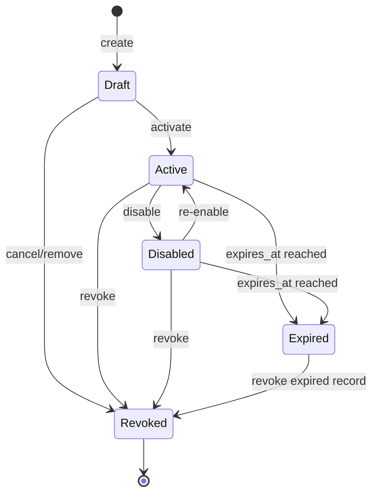
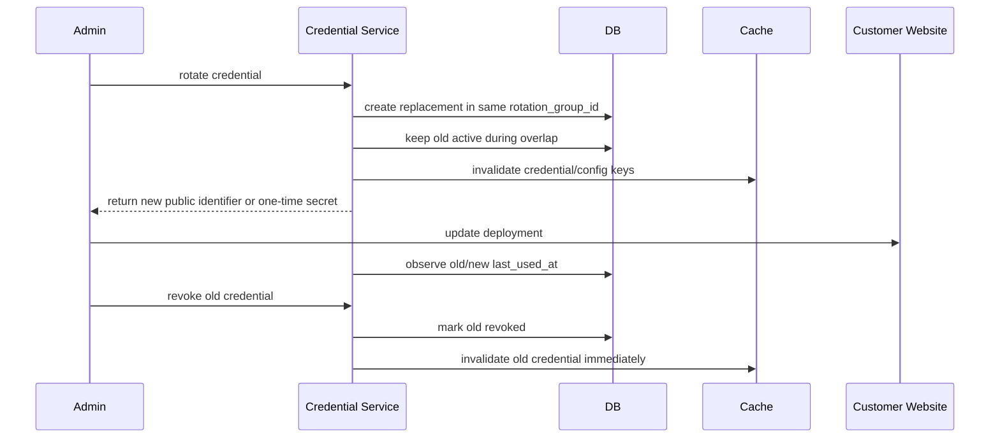
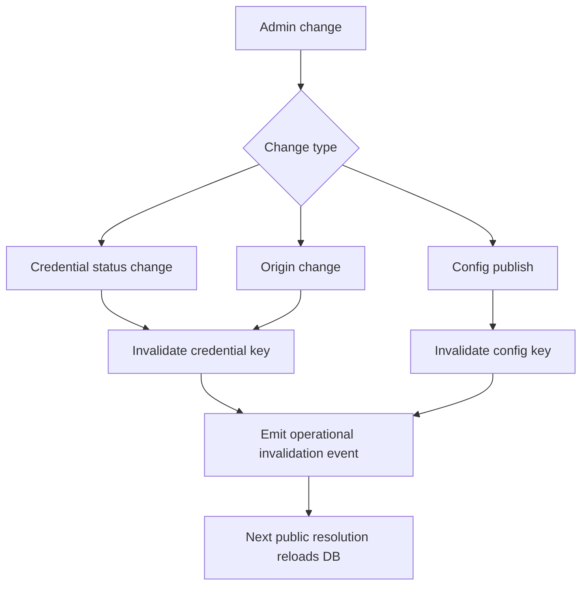
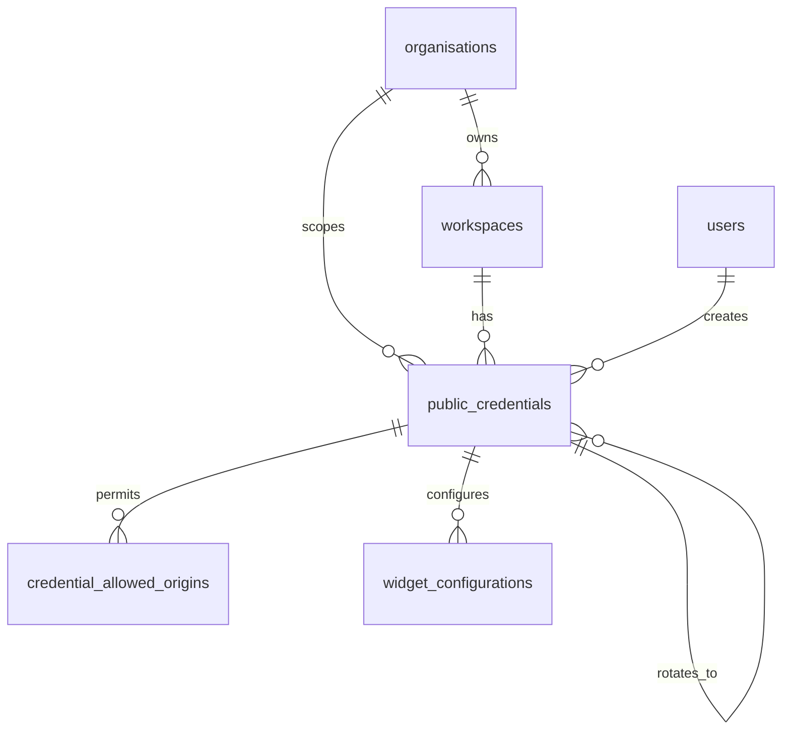
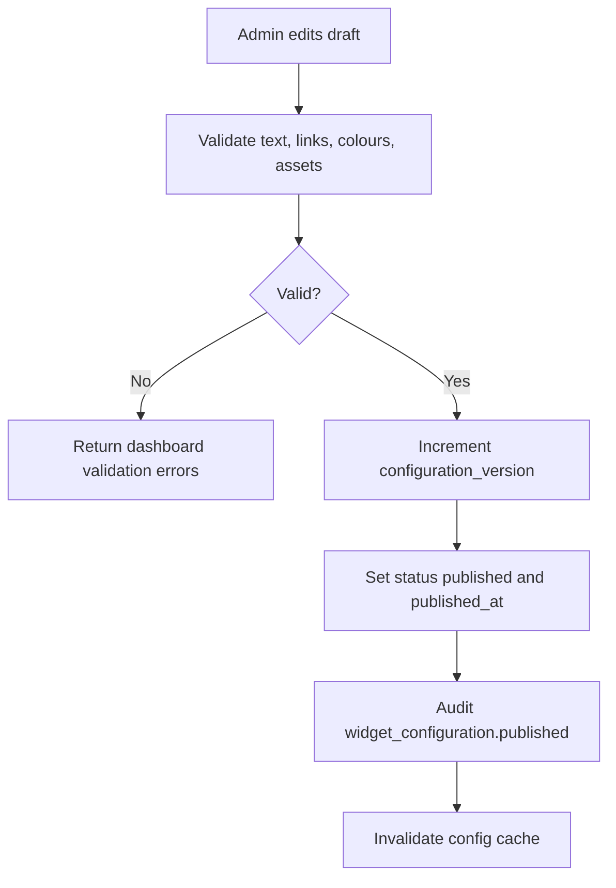
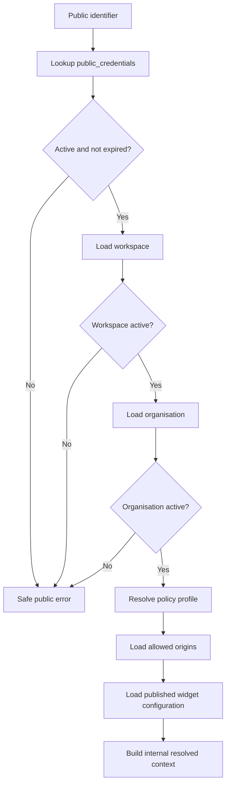

# Credential and Widget Configuration Architecture

Version: 0.1
Status: Proposed Architecture
Scope: Architecture and planning only. No code, migration, endpoint, widget UI, or public chat capability is implemented by this document.

## 1. Purpose

This document defines the persistent credential and widget-configuration subsystem for the Public Access Layer. It provides the database and service design needed for secure widget onboarding, key rotation, branding configuration, allowed-origin management, and future public channels.

The design must support at least 10,000 organisations, multiple workspaces per organisation, multiple environments, and future credential types without making any workspace publicly accessible by default.

## 2. Bounded Context

The subsystem sits inside the Public Access Layer bounded context.

```text
External Channels
    -> Public Access Layer
        -> Credential and Widget Configuration
        -> Origin Validation Future
        -> Rate Limiting Future
        -> Anonymous Sessions Future
    -> RAG Orchestrator
```

It owns:

- Public credential persistence.
- Public identifier generation.
- Secret hashing for secret-bearing credentials.
- Widget configuration persistence.
- Credential lifecycle.
- Credential rotation and revocation.
- Environment separation.
- Allowed-origin configuration storage.
- Channel capabilities.
- Policy-profile assignment.
- Dashboard credential management rules.
- Audit events for administrative changes.
- Cache invalidation signals.

It does not own:

- Origin validation execution.
- Redis rate limiting.
- Anonymous sessions.
- RAG execution.
- Public message processing.
- Widget rendering.
- Billing.

## 3. Credential Types

### widget_public_key

Widget public keys are public identifiers, not secrets. They are safe to embed in website code, but they must not grant dashboard access, administrative access, document access, audit access, or cross-tenant discovery.

A widget key only identifies a candidate workspace. The server must still validate credential status, environment, allowed origin, active workspace, active organisation, policy profile, and later rate/session controls before any public capability is used.

### partner_api_key

Partner API keys are secret-bearing credentials for future server-to-server integrations.

Rules:

- Show the full secret only once at creation or rotation.
- Store only a strong verification hash.
- Support capabilities, policy profile, expiration, and revocation.
- Compare secrets using constant-time verification.
- Never return the secret from list, detail, audit, public config, or logs.

### channel_installation

Channel installation credentials map external provider installations to one workspace. Examples include Slack team/channel installations, Microsoft Teams app installs, WhatsApp business account mappings, voice agent IDs, and MCP clients.

MVP stores only public identifiers and safe metadata. Future provider metadata should be encrypted with key versioning.

### webhook_secret

`webhook_secret` is reserved for future inbound webhooks. It is secret-bearing, should be verified through HMAC or signature validation, and should reuse the same lifecycle, hashing, and audit model as partner API keys.

## 4. Database Model

### public_credentials

`public_credentials` is the generic credential table for all public and external channel identities.

Fields:

| Field | Type | Notes |
| --- | --- | --- |
| `id` | UUID | Primary key. |
| `organisation_id` | UUID | FK to organisations. Required. |
| `workspace_id` | UUID | FK to workspaces. Required. |
| `credential_type` | text/enum | `widget_public_key`, `partner_api_key`, `channel_installation`, `webhook_secret`. |
| `public_identifier` | text | Globally unique public lookup key or public prefix. |
| `secret_hash` | text nullable | Only for secret-bearing credentials. Never returned. |
| `display_name` | text | Dashboard label. |
| `status` | text/enum | `draft`, `active`, `disabled`, `revoked`, `expired`. |
| `environment` | text/enum | `development`, `staging`, `production`. |
| `policy_profile` | text | Policy key resolved by Public Access Layer. |
| `capabilities_json` | jsonb | Bounded list/object of allowed capabilities. |
| `created_by_user_id` | UUID nullable | Dashboard actor. |
| `created_at` | timestamptz | Required. |
| `updated_at` | timestamptz | Required. |
| `activated_at` | timestamptz nullable | First activation timestamp. |
| `rotated_at` | timestamptz nullable | Last rotation timestamp. |
| `revoked_at` | timestamptz nullable | Revocation timestamp. |
| `expires_at` | timestamptz nullable | Expiration timestamp. |
| `last_used_at` | timestamptz nullable | Operational update, not an audit substitute. |
| `metadata_json` | jsonb | Safe internal metadata only. |
| `rotation_group_id` | UUID nullable | Groups old/new credentials during rotation. |
| `parent_credential_id` | UUID nullable | Previous credential when rotated. |
| `deleted_at` | timestamptz nullable | Soft deletion marker for admin views. |

Constraints:

- `public_identifier` unique globally among non-deleted rows.
- `credential_type` in approved set.
- `status` in approved set.
- `environment` in approved set.
- `secret_hash` must be null for `widget_public_key` unless a future architecture changes the key semantics.
- `secret_hash` must be non-null for active `partner_api_key` and `webhook_secret` credentials.
- `workspace_id` must belong to `organisation_id`.
- `deleted_at` does not make a credential usable; usable credentials must be `active` and not expired.

Indexes:

- Unique index on `public_identifier` where `deleted_at is null`.
- Composite index on `(organisation_id, workspace_id)`.
- Composite index on `(workspace_id, credential_type, environment)`.
- Index on `status`.
- Index on `expires_at` where `expires_at is not null`.
- Index on `deleted_at` for admin filtering.
- Index on `(rotation_group_id)` where not null.
- Optional partial index on active credentials: `(workspace_id, credential_type, environment) where status = 'active' and deleted_at is null`.

Multiple active widget keys are allowed only during explicit rotation overlap or when administrators intentionally create separate environment-specific credentials. Production should allow more than one active `widget_public_key` for the same workspace/environment only when they share a rotation group or a future policy explicitly permits parallel deployments.

## 5. Allowed Origins Model

Three options were evaluated.

| Option | Pros | Cons |
| --- | --- | --- |
| JSON array on credential | Simple migration, simple reads | Poor queryability, weak uniqueness, hard audit diffs, hard environment rules, encourages arbitrary strings. |
| Separate `credential_allowed_origins` table | Queryable, auditable, normalised, supports uniqueness and future validation | More joins and repository methods. |
| Workspace-level origin policy | Reusable across credentials, less duplication | Harder to rotate one credential with different rollout domains, less precise audit by credential. |

Decision: use a separate `credential_allowed_origins` table.

Rationale: origin configuration is security-sensitive, changes independently, needs auditability, and should not store arbitrary unvalidated strings. A normalised table supports exact and wildcard rules, environment separation, uniqueness, and future cache invalidation.

### credential_allowed_origins

Fields:

| Field | Type | Notes |
| --- | --- | --- |
| `id` | UUID | Primary key. |
| `organisation_id` | UUID | FK to organisations. |
| `workspace_id` | UUID | FK to workspaces. |
| `credential_id` | UUID | FK to public_credentials. |
| `scheme` | text | `https` normally; `http` only for localhost development. |
| `hostname` | text | Lowercase punycode-normalised hostname. No path/query/fragment. |
| `port` | integer nullable | Explicit port when required. |
| `wildcard_subdomains` | boolean | Allows `*.hostname`; apex remains separate unless configured. |
| `environment` | text/enum | Must align with credential unless future policy allows shared origins. |
| `active` | boolean | Soft enable/disable without deleting history. |
| `created_at` | timestamptz | Required. |
| `updated_at` | timestamptz | Required. |

Constraints and indexes:

- FK `credential_id` belongs to same organisation/workspace.
- Unique `(credential_id, scheme, hostname, port, wildcard_subdomains, environment)` where active.
- Index `(organisation_id, workspace_id)`.
- Index `(credential_id, active)`.
- Production origins may not be broad wildcard-only origins.
- Localhost and private development hosts allowed only in `development`.

Origin validation execution remains out of scope for this task. This table only defines how origin rules are stored.

## 6. Widget Configuration Model

Decision: one published widget configuration per credential for MVP, with future evolution to workspace/environment templates.

Rationale: tying configuration to the credential gives deterministic public config resolution and safe rotation. During rotation, the replacement credential can publish the same configuration version or a deliberate variant. It also avoids accidentally serving production styling from a staging credential.

### widget_configurations

Fields:

| Field | Type | Notes |
| --- | --- | --- |
| `id` | UUID | Primary key. |
| `organisation_id` | UUID | FK to organisations. |
| `workspace_id` | UUID | FK to workspaces. |
| `credential_id` | UUID | FK to public_credentials. One active/published config per credential. |
| `status` | text/enum | `draft`, `published`, `disabled`, `archived`. |
| `bot_name` | text | Display name. |
| `welcome_message` | text | Plain text only. |
| `launcher_label` | text | Button/launcher label. |
| `primary_colour` | text | Validated colour token or hex. |
| `secondary_colour` | text nullable | Validated colour token or hex. |
| `logo_path` | text nullable | Safe storage path or asset reference. |
| `avatar_path` | text nullable | Safe storage path or asset reference. |
| `position` | text | `bottom_right`, `bottom_left`, or future allowed values. |
| `theme_mode` | text | `light`, `dark`, `system`. |
| `suggested_questions_json` | jsonb | Bounded list of plain-text suggestions. |
| `fallback_contact_text` | text nullable | Plain text. No lead capture in MVP. |
| `privacy_notice_text` | text nullable | Plain text. |
| `privacy_notice_url` | text nullable | Safe URL. |
| `terms_url` | text nullable | Safe URL. |
| `language` | text | BCP-47 style language code. |
| `show_citations` | boolean | May be forced true by policy. |
| `allow_conversation_history` | boolean | Public session display flag only; no dashboard history exposure. |
| `max_initial_suggestions` | integer | Bounded by validation. |
| `configuration_version` | integer | Incremented on publish. |
| `published_at` | timestamptz nullable | Set when published. |
| `created_at` | timestamptz | Required. |
| `updated_at` | timestamptz | Required. |

Constraints and indexes:

- FK `credential_id` belongs to same organisation/workspace.
- Unique active configuration per `credential_id` where `status in ('draft', 'published')` can be enforced by service or partial index depending on versioning implementation.
- Index `(organisation_id, workspace_id)`.
- Index `(credential_id, status)`.
- Index `(workspace_id, status)`.

Future evolution: introduce workspace/environment templates and configuration inheritance if multiple credentials share identical widget branding. MVP keeps credential ownership explicit to reduce accidental cross-environment leakage.

## 7. Branding and Controlled Expressionism

Controlled Expressionism remains the product design principle, but public widget branding must remain accessible, safe, and recognisably part of the platform trust system.

Clients may configure:

- Logo.
- Bot name.
- Welcome message.
- Brand colours within accessibility limits.
- Suggested questions.
- Widget position.
- Privacy and terms links.

Clients may not override:

- Safe error wording categories.
- Accessibility labels.
- Security notices.
- Citation behaviour required by policy.
- Rate-limit messages.
- Dangerous HTML or JavaScript.
- Arbitrary CSS.
- System prompts.

Validation:

- Colours must parse to approved CSS colour formats and meet WCAG contrast for text and controls.
- If contrast fails, dashboard save should reject or offer a generated accessible alternative.
- Asset uploads must validate MIME type, size, dimensions, storage path, and malware scanning where available.
- Asset URLs returned publicly must be safe public asset URLs or signed asset references designed for public use.
- Text fields are plain text; no HTML/script/markdown execution in configuration fields.

## 8. Credential Lifecycle

Statuses:

- `draft`: created but not usable by public resolution.
- `active`: usable if not expired, not deleted, and tenant is active.
- `disabled`: temporarily not usable, can be reactivated.
- `revoked`: permanently not usable, cannot be reactivated.
- `expired`: not usable because `expires_at` has passed.

Valid transitions:



Rules:

- Revoked credentials cannot be reactivated.
- Expired credentials cannot be made active without explicit rotation or new credential creation.
- Disabled organisation or workspace makes all credentials unusable without mutating credential records.
- `last_used_at` updates must not revive credentials or replace audit records.
- Lifecycle changes are audited.

## 9. Rotation Model

Safe rotation sequence:



Design:

- `rotation_group_id` groups related credentials.
- `parent_credential_id` links replacement to previous credential.
- Default overlap should be short and configurable, for example 7 days for widget keys and shorter for compromised secrets.
- Emergency rotation creates a replacement and immediately revokes the compromised credential.
- Rollback is allowed only by reusing the still-active old credential during overlap; revoked credentials cannot be restored.
- Cache invalidation must run on create, activate, disable, revoke, rotate, origin change, and config publish.

## 10. Identifier Generation

Widget public identifier format:

```text
wpk_<env>_<random>
```

Examples:

- `wpk_dev_<random>`
- `wpk_stg_<random>`
- `wpk_live_<random>`

Requirements:

- At least 128 bits of entropy after the prefix.
- URL-safe alphabet.
- Non-sequential.
- No organisation, workspace, user, or client slug.
- Collision checked against `public_credentials.public_identifier`.
- Prefix indicates credential type/environment only, not tenant identity.
- Rotation creates a new identifier.

Secret-bearing credential format:

```text
pak_live_<public-id>.<secret-value>
```

The public part may be stored in `public_identifier`; the secret value is shown once and stored only as a hash. The full secret is never persisted or logged.

## 11. Encryption and Hashing

Rules:

- Widget public keys are identifiers, not secrets.
- Partner API keys and webhook secrets store only verification hashes.
- Use a strong keyed HMAC design or password/key hashing function selected during implementation. The design must support constant-time verification and key rotation.
- Secret values are returned once at creation/rotation.
- Secret values never appear in audit events, logs, API responses after creation, cache payloads, or error messages.
- Future provider installation metadata should be encrypted at rest with key versioning and a documented rotation process.
- Database exports containing public identifiers are sensitive operational data but should not reveal secret-bearing credential values.

## 12. Repository and Service Design

Proposed modules:

```text
apps/api/app/access/credentials/
  models.py
  repository.py
  service.py
  identifiers.py
  hashing.py
  rotation.py

apps/api/app/access/widget_config/
  repository.py
  service.py
  validation.py
  schemas.py
```

Credential repository responsibilities:

- Create credential records.
- List workspace credentials by organisation/workspace.
- Get credential by tenant-safe ID.
- Resolve by public identifier for gateway/public resolution.
- Update status and lifecycle timestamps.
- Update last-used timestamp.
- Manage allowed-origin records.

Credential service responsibilities:

- Generate identifiers and secrets.
- Validate type/environment/policy/capability combinations.
- Activate, disable, revoke, expire, and rotate credentials.
- Enforce valid lifecycle transitions.
- Emit audit events and cache invalidation events.
- Return safe DTOs with no secret hash.

Widget configuration service responsibilities:

- Create/update draft configuration.
- Validate branding, links, text, suggestions, assets, and accessibility constraints.
- Publish configuration with version increment.
- Return safe public configuration for public config endpoint future.
- Emit audit events and cache invalidation events.

Admin paths must never fetch tenant-owned credentials or widget configurations by ID alone. They must include `organisation_id`, `workspace_id`, and resource ID.

## 13. Admin API Design

These authenticated dashboard APIs are proposed only. Do not implement in this task.

Credential management:

- `GET /api/v1/workspaces/{workspace_id}/public-credentials?organisation_id=...`
- `POST /api/v1/workspaces/{workspace_id}/public-credentials?organisation_id=...`
- `GET /api/v1/workspaces/{workspace_id}/public-credentials/{credential_id}?organisation_id=...`
- `PATCH /api/v1/workspaces/{workspace_id}/public-credentials/{credential_id}?organisation_id=...`
- `POST /api/v1/workspaces/{workspace_id}/public-credentials/{credential_id}/activate?organisation_id=...`
- `POST /api/v1/workspaces/{workspace_id}/public-credentials/{credential_id}/disable?organisation_id=...`
- `POST /api/v1/workspaces/{workspace_id}/public-credentials/{credential_id}/revoke?organisation_id=...`
- `POST /api/v1/workspaces/{workspace_id}/public-credentials/{credential_id}/rotate?organisation_id=...`

Widget configuration:

- `GET /api/v1/workspaces/{workspace_id}/widget-config?organisation_id=...`
- `PUT /api/v1/workspaces/{workspace_id}/widget-config?organisation_id=...`
- `POST /api/v1/workspaces/{workspace_id}/widget-config/publish?organisation_id=...`

RBAC decision:

- `org_owner`: full read/write credential and widget configuration management.
- `client_admin`: full read/write credential and widget configuration management within workspaces they administer.
- `viewer`: no credential detail access and no write access. Viewer may see a high-level deployment status later, but not identifiers, origins, rotation controls, or configuration secrets.
- `contributor`: excluded.
- `super_admin`: platform override through future platform-admin path, audited separately.

Rationale: public credentials and allowed origins are security-sensitive deployment controls, not ordinary read-only dashboard content.

## 14. Public Resolution Contract

Future Public Access Layer resolution:

```text
public_identifier
-> public_credentials row
-> status/environment/expiry checks
-> active workspace
-> active organisation
-> policy profile
-> allowed-origin records
-> published widget configuration
-> NormalisedAccessContext and safe public configuration
```

Cacheable fields:

- Credential ID, type, status, environment, policy profile, capabilities, tenant IDs for internal use only.
- Normalised allowed-origin rules.
- Published widget configuration version and public-safe config fields.
- Expiration timestamp.

Non-cacheable or short-TTL fields:

- Revoked/disabled status after admin changes.
- Last-used timestamp updates.
- Secret hashes for partner credentials unless specifically needed by a secure verification cache.
- Audit metadata.

Do not expose database IDs publicly unless a future endpoint needs opaque references. Public responses should generally use the public identifier already present in the request and opaque request/session/message IDs where required.

## 15. Safe Public Configuration Contract

Future public config response may include:

- Bot name.
- Welcome message.
- Launcher label.
- Safe colours.
- Safe asset URLs.
- Position.
- Suggested questions.
- Privacy and terms links.
- Language.
- Citation display setting.
- Session behaviour flags.
- Configuration version.

It must exclude:

- `organisation_id`.
- `workspace_id`.
- Credential database ID.
- Policy internals.
- Model keys unless intentionally exposed by a future architecture decision.
- Provider details.
- Allowed-origin list.
- Audit metadata.
- Internal storage paths.
- Secret hashes.
- Dashboard URLs or internal admin metadata.

## 16. Validation Rules

Credential validation:

- Valid credential type.
- Valid environment.
- Valid policy profile.
- Expiration must be in the future for new active secret-bearing credentials.
- Capabilities must be from an allow-list for the credential type.
- Display name length and characters are bounded.
- Production widget credentials require at least one active production origin before activation.
- Secret-bearing credentials require one-time secret generation and hash storage.

Widget configuration validation:

- Bot name length and plain-text content.
- Welcome, launcher, fallback, privacy text length limits.
- URLs must be `https` except approved localhost development cases.
- Colours must be valid and meet contrast requirements.
- Suggested questions have bounded count and length.
- Asset MIME types, file size, dimensions, and storage location are restricted.
- HTML/script is rejected.
- Supported language list enforced.
- Position and theme mode must be in allowed sets.
- `max_initial_suggestions` cannot exceed stored suggestions or policy maximum.

Allowed-origin validation:

- Parse and normalise scheme, host, and port.
- Reject paths, queries, fragments, credentials, and arbitrary strings.
- Wildcard allowed only for subdomains of a concrete registrable domain.
- No broad wildcard production origins by default.
- Localhost/private IP origins only in development.
- Apex and wildcard subdomain are separate records.

## 17. Audit Events

Permanent audit events:

- `public_credential.created`
- `public_credential.activated`
- `public_credential.disabled`
- `public_credential.revoked`
- `public_credential.rotated`
- `public_credential.expired`
- `public_credential.origin.added`
- `public_credential.origin.removed`
- `widget_configuration.created`
- `widget_configuration.updated`
- `widget_configuration.published`

Each audit event includes actor user ID, organisation ID, workspace ID, entity type, entity ID, safe before/after metadata, timestamp, and request metadata where available.

Never include secret values, secret hashes, raw provider tokens, or private encryption material.

## 18. Operational Events

High-volume operational events should be separate from permanent audit records:

- `credential.resolved`
- `credential.invalid`
- `credential.expired`
- `credential.revoked_used`
- `widget_config.served`
- `config_version_mismatch`

Operational events may be sampled or aggregated. They should not include raw chat content, secrets, full public secrets, or dashboard-only metadata.

## 19. Caching

Caching design:

- Future Redis or in-process cache keyed by `public_identifier`.
- Short TTL for credential/config resolution.
- Negative caching only for malformed or clearly invalid identifiers and only with very short TTL.
- Immediate invalidation on activate, disable, revoke, rotate, origin add/remove, and widget config publish.
- Versioned widget configuration allows clients and caches to detect stale config.
- Fail closed for revoked/disabled credentials if cache certainty is lost.
- Public config reads may use short cached config only when credential status is known active and not stale.



## 20. Data Migration and Rollout

Implementation rollout:

1. Add schema for `public_credentials`, `credential_allowed_origins`, and `widget_configurations`.
2. Add repositories and services.
3. Seed no credentials automatically.
4. Add authenticated admin APIs.
5. Add dashboard management UI later.
6. Add origin validation runtime.
7. Add public config endpoint.
8. Add public sessions and messages later.

No existing workspace becomes publicly accessible automatically. Every credential must be created and activated intentionally by an authorised dashboard actor.

## 21. Entity Relationship Diagram



## 22. Widget Configuration Publish Flow



## 23. Public Resolution Flow



## 24. Threat Model

| Threat | Likelihood | Impact | Controls | Residual risk | Monitoring |
| --- | --- | --- | --- | --- | --- |
| Public identifier enumeration | Medium | Medium | High-entropy identifiers, rate limits future, generic errors, no tenant info | Botnets can still try random keys | Invalid credential volume by IP/key prefix |
| Leaked partner API secret | Medium | High | One-time display, hash only, rotation, revocation, scoped capabilities, expiry | Secret may be abused before detection | Unusual usage, revoked-used events, cost spikes |
| Revoked credential cache lag | Medium | High | Immediate invalidation, short TTL, fail-closed uncertain status | Distributed cache delay | Revoked credential usage attempts |
| Cross-tenant admin access | Medium | High | Tenant-safe repository methods, RBAC, audit, no ID-only fetches | Implementation bugs | 403/404 patterns, tenant isolation tests |
| Malicious origin configuration | Medium | High | Normalised origins, wildcard restrictions, admin-only writes, audit | Admin misconfiguration | Origin change audit review |
| Wildcard abuse | Medium | Medium | No broad wildcard production origins, explicit wildcard_subdomains flag | Legitimate broad subdomains still expand exposure | Origin denied/accepted metrics |
| Unsafe branding content | Medium | Medium | Plain text, URL validation, asset validation, no arbitrary CSS | Client may upload misleading branding | Config validation failures, asset scan alerts |
| XSS through welcome messages | Medium | High | Reject HTML/script, escaped rendering, iframe isolation future | Renderer bugs | CSP/client errors, security reports |
| Asset URL abuse | Medium | Medium | Safe asset storage, MIME/type limits, no internal paths | External image tracking if allowed later | Asset validation logs |
| Rotation race | Medium | Medium | Rotation group, overlap window, last_used_at observation, audit | Old key may remain active too long | Old/new usage dashboards |
| Duplicate active credentials | Medium | Medium | Rotation-group rules, partial indexes/service checks | Intentional multi-deploy complexity | Active credential counts per workspace |
| Secret logging | Low-medium | High | Secret DTO separation, logging filters, tests, one-time return only | Developer error | Secret scanning, log review |
| Database export leakage | Medium | Medium | Public keys not secret, secret hashes only, encryption future for provider metadata | Public identifiers can be copied | Export controls, hash presence checks |

## 25. Future Implementation Tasks

Recommended sequence:

1. `TASK-057B` credential/widget schema implementation.
2. Repository and service implementation.
3. Credential admin APIs.
4. Widget configuration APIs.
5. Rotation service hardening.
6. Dashboard credential UI.
7. Origin validation architecture and implementation.
8. Public config endpoint.
9. Security testing and abuse monitoring.

## 26. Test Strategy

Future implementation must test:

- Identifier uniqueness and collision handling.
- Widget public key non-secret behaviour.
- Partner secret one-time return and hash verification.
- Tenant-safe admin reads and writes.
- Cross-tenant denial with safe 404/403 behaviour.
- Lifecycle transition rules.
- Revoked credential resolution failure.
- Expired credential resolution failure.
- Multiple keys during rotation only when allowed.
- Origin normalisation.
- Wildcard restrictions.
- Widget configuration validation.
- XSS rejection.
- Public config privacy exclusions.
- Cache invalidation events.
- Disabled organisation/workspace behaviour.
- No automatic public exposure.

## 27. Acceptance Criteria

TASK-057A is complete when:

- Persistent credential and widget models are fully defined.
- Credential type and lifecycle rules are explicit.
- Allowed-origin model is selected.
- Rotation is defined.
- Safe public config contract is defined.
- RBAC and admin APIs are specified.
- Threat model and diagrams are complete.
- ADR records the chosen storage model.
- Implementation is sequenced.
- No code or migration is added.
