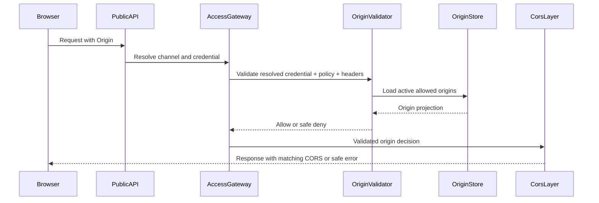
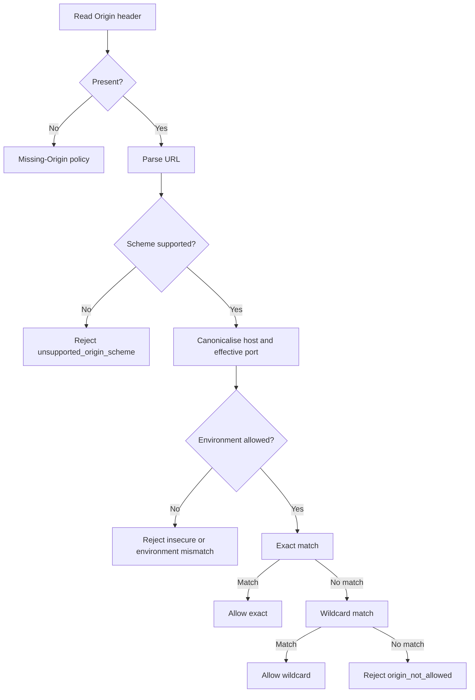
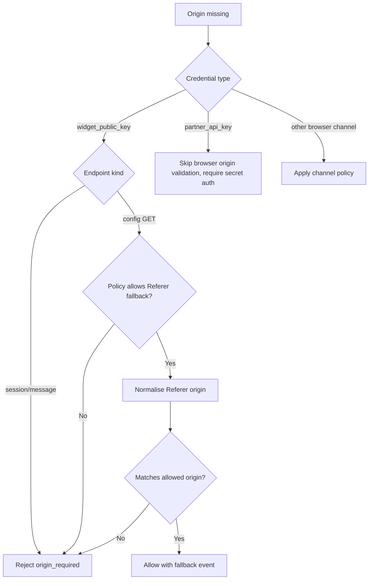
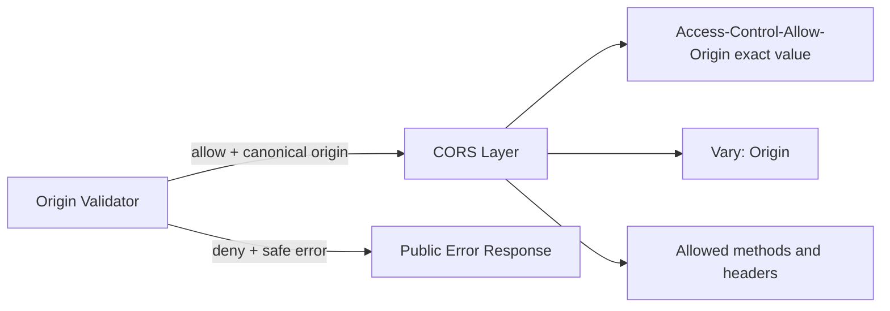
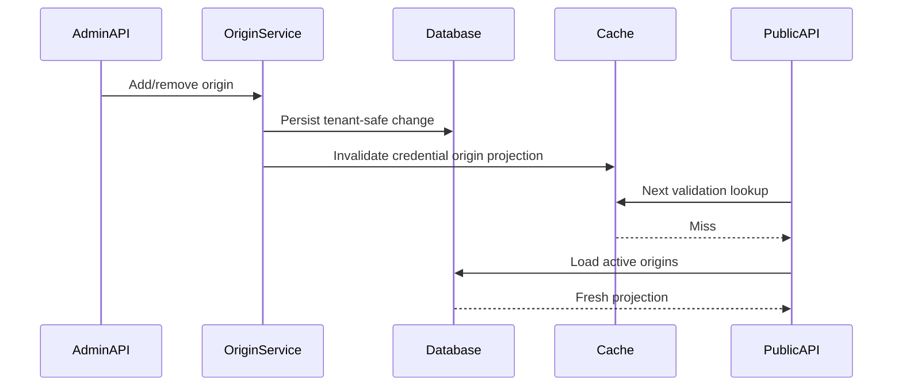
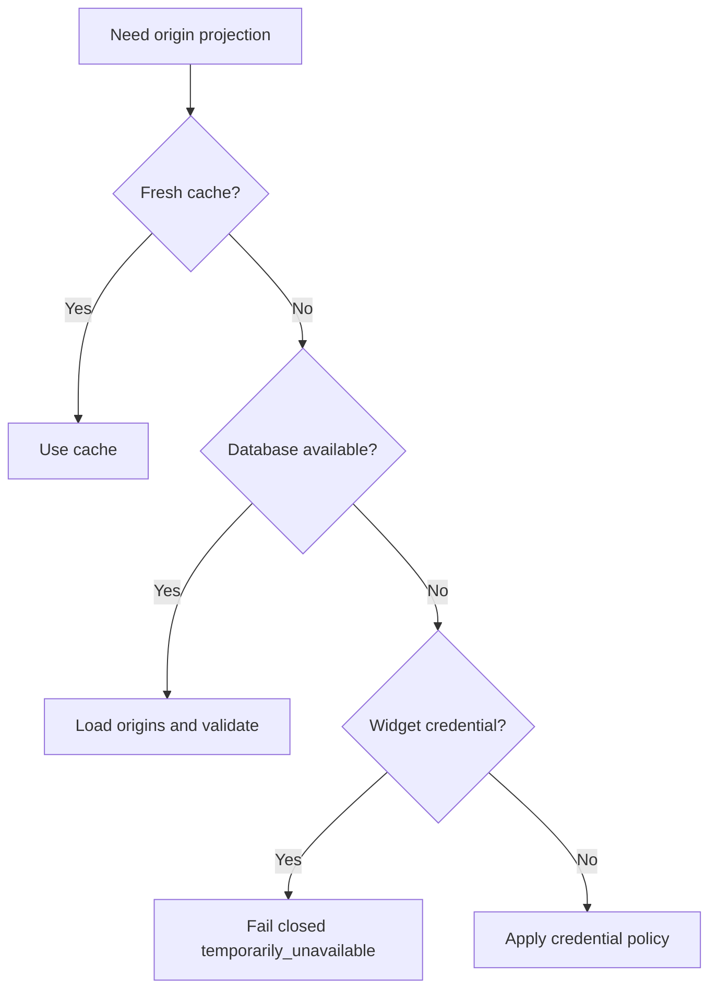

# Origin Validation Architecture

Status: Proposed architecture for TASK-058A. No runtime origin validation is implemented by this document.

## Objective

Define the runtime origin-validation system for future widget and browser-based public channels. The design is production-strict, local-development compatible, and reusable by future browser channels that enter through the Public Access Layer.

Origin validation is a security control, not authentication. It reduces browser embedding abuse and accidental exposure, but it does not prove domain ownership and does not replace credential resolution, rate limiting, session validation, or tenant isolation.

## Bounded Scope

Origin validation owns:

- `Origin` header parsing.
- Limited `Referer` fallback policy.
- Exact origin matching.
- Controlled subdomain wildcard matching.
- Scheme and effective-port matching.
- Environment-aware localhost and loopback rules.
- Missing-Origin decisions.
- Browser versus non-browser policy decisions.
- Normalised origin comparison.
- Safe public error generation.
- Security event emission.
- Audit and operational metric definitions.
- Cache behaviour for allowed-origin records.

Origin validation does not own:

- Public credential resolution.
- Redis rate limiting.
- Anonymous sessions.
- RAG orchestration.
- Widget rendering.
- Dashboard authentication.
- DNS ownership verification.
- CORS response generation, except for producing a decision CORS can consume.

## Security Boundary

Future browser-based public requests must flow through this sequence:

```text
Public credential resolution
  -> access policy resolution
  -> origin validation
  -> rate limiting
  -> anonymous session validation
  -> RAG orchestration
```

The origin validator receives a resolved credential and policy. It must never resolve organisation or workspace from request headers, `Host`, `Referer`, or any client-supplied tenant field.

## Origin Input Sources

### Origin

`Origin` is the primary input for browser widget and browser-based public channel requests. For widget session and message endpoints, it is required.

### Referer

`Referer` is a privacy-sensitive and spoofable fallback. It is not accepted for state-changing widget session or message endpoints. It may be considered only for future public configuration GET requests when a policy explicitly enables it.

### Host

`Host` identifies the API host, not the embedding client site. It must never be used as the client origin.

### X-Forwarded-Host and X-Forwarded-Proto

Forwarded headers are trusted only when inserted by configured trusted proxies. They are useful for reconstructing the API's own external URL and CORS infrastructure, not for trusting the browser client's origin.

### Proxy and Load Balancer Headers

Only explicitly configured proxy CIDR ranges may affect trusted proxy context. Spoofed forwarded headers from arbitrary clients must be ignored.

### Iframe Parent Context

Future iframe-based widgets may pass parent-origin information through a signed or challenge-bound `postMessage` flow, but that is an additional signal. It does not replace server-side `Origin` validation for message/session APIs.

## Trust Decisions

- Prefer `Origin` whenever present.
- Do not infer client origin from `Host`.
- Trust forwarded headers only from configured trusted proxies.
- Treat missing `Origin` as denied for widget session/message endpoints.
- Treat `Referer` as a policy-gated fallback only for non-state-changing configuration reads.
- Partner API credentials use separate secret authentication and are not browser-origin controlled.

## Canonical Origin Normalisation

The canonical internal representation is:

```text
<scheme>://<hostname>:<effective_port>
```

Example:

```text
https://example.com:443
```

Normalisation rules:

- Lower-case the scheme and hostname.
- Accept only `http` and `https` for browser origins.
- Convert IDN hostnames to ASCII punycode using UTS-46 compatible processing where available.
- Reject malformed Unicode and invalid punycode.
- Remove a trailing hostname dot after validation.
- Reject userinfo, paths, query strings, fragments, and empty hosts.
- Compute effective ports: `443` for HTTPS and `80` for HTTP when omitted.
- Preserve non-default explicit ports in canonical form.
- Canonicalise IPv6 literals with brackets removed internally and effective port stored separately.
- Treat IPv4 and IPv6 addresses as exact-match only.

Database storage may keep `port` nullable to represent the default port, but the matcher must compare using the effective port.

## Matching Rules

### Exact Match

Exact matching requires all of:

- Same scheme.
- Same canonical hostname.
- Same effective port.
- Same credential.
- Same environment.
- Active allowed-origin record.

### Wildcard Subdomains

Wildcard matching is allowed only through normalised allowed-origin records with `wildcard_subdomains = true`.

Rules:

- `*.example.com` matches `app.example.com`.
- `*.example.com` does not match `example.com`; the apex must be configured separately.
- `*.example.com` does not match `evil-example.com`.
- MVP matches one subdomain label only. `api.eu.example.com` requires `*.eu.example.com` or an exact origin.
- Wildcards apply only to hostnames, never schemes or ports.
- Public suffix wildcards are rejected, for example `*.com` and `*.co.uk`.
- Global `*` production origins are rejected.
- Wildcard localhost and wildcard IP ranges are rejected.

### IP Address Origins

IP address origins are exact-match only. Loopback IPs are allowed only for development credentials when explicitly configured. Production IP origins require HTTPS and explicit approval by policy.

## Environment Rules

### Development

- `localhost` and loopback IPs may be configured only for development credentials.
- Explicit ports are required unless the default port is intended.
- Development origins must not be accepted for staging or production credentials.
- Development-only missing-Origin exceptions require explicit policy and must emit `origin.validation.development_exception`.

### Staging

- Staging credentials may use staging domains and HTTPS by default.
- Localhost is disabled by default.
- HTTP requires an explicit policy exception.

### Production

- HTTPS is required by default.
- HTTP is rejected except for a documented, temporary, audited exception.
- Broad wildcard and public-suffix wildcard origins are rejected.
- Localhost, loopback, and private-network origins are rejected.

## Missing Origin Policy

Default behaviour:

- Widget session endpoint: `Origin` required, fail closed when missing.
- Widget message endpoint: `Origin` required, fail closed when missing.
- Widget configuration GET: `Origin` required by default. A policy may allow a limited `Referer` fallback for compatibility.
- Partner API credentials: browser-origin validation bypassed; secret authentication and rate limits apply instead.
- Server-to-server calls with widget public keys: denied when `Origin` is missing.
- Browser extensions, mobile webviews, and privacy tools that strip `Origin`: denied unless a future channel-specific policy is approved.

## Referer Fallback Decision

Chosen policy: configurable by policy profile, but disabled for state-changing widget endpoints.

- Widget session and message endpoints never accept `Referer` as a substitute for `Origin`.
- Public config GET may use `Referer` only if the credential policy explicitly enables `allow_referer_fallback_for_config`.
- The `Referer` URL is normalised to its origin before matching.
- Raw `Referer` values are not logged by default.
- Fallback decisions emit a distinct event and metric.

This balances strict production behaviour with limited compatibility for browser environments that omit `Origin` on safe reads.

## CORS Relationship

Origin validation and CORS are separate controls:

- Origin validation decides whether the request is allowed by platform policy.
- CORS decides whether a browser may read the response.

Both are required. Future CORS behaviour should use the origin-validation result:

- Dynamically echo the validated origin in `Access-Control-Allow-Origin`.
- Add `Vary: Origin`.
- Do not use wildcard CORS for widget APIs.
- Do not allow credentials with wildcard origins.
- Widget APIs should avoid browser cookies; session tokens should be explicit headers or request fields when future session architecture permits.
- Allowed methods should be minimal: `GET`, `POST`, and `OPTIONS` only where needed.
- Allowed headers should be explicit, for example `Content-Type`, public session header, and request ID header.
- Preflight responses must use the same origin decision path and fail safely.
- Rejected preflight requests return safe public errors without configured-origin lists.
- CORS max-age should be conservative so origin removals take effect quickly.

## Proposed Module Layout

Future implementation should use:

```text
apps/api/app/access/origin_validation/
  __init__.py
  contracts.py
  normalisation.py
  matcher.py
  service.py
  errors.py
  cache.py
```

`cache.py` is a future extension point and should not introduce Redis in the first matcher task unless explicitly approved.

## Contracts

### OriginValidationRequest

Fields:

- `request_id`
- `trace_id`
- `credential_id`
- `credential_environment`
- `policy_profile`
- `origin_header`
- `referer_header` optional
- `trusted_proxy_context` optional
- `request_method`
- `channel`
- `endpoint_kind` such as `config`, `session`, or `message`

### OriginValidationResult

Fields:

- `allowed`
- `canonical_origin` optional
- `matched_origin_id` optional
- `match_type` such as `exact`, `wildcard`, `referer_fallback`, `missing_origin`, or `none`
- `decision_source` such as `origin`, `referer`, `policy`, or `cache`
- `reason_code`
- `safe_metadata`

## Runtime Flow

1. Credential resolved by Public Access Layer.
2. Policy profile resolved.
3. Origin-related headers extracted by channel adapter or request dependency.
4. `Origin` normalised if present.
5. Environment restrictions applied.
6. Exact allowed-origin matches checked.
7. Controlled wildcard matches checked.
8. Missing-Origin policy applied.
9. Referer fallback considered only when endpoint and policy allow it.
10. Decision emitted as `OriginValidationResult`.
11. Security event recorded.
12. CORS layer consumes the decision.
13. Request proceeds or fails with a safe public error.

## Database Interaction

Use the existing `credential_allowed_origins` model from TASK-057B.

Query strategy:

- Load origins by `credential_id`.
- Filter to `active = true`.
- Filter to the credential environment.
- Project only matcher fields: origin ID, scheme, hostname, port, wildcard flag, environment.
- Do not expose organisation or workspace IDs publicly.

Expected indexes from the credential implementation are sufficient for MVP if they include credential ID, active state, environment, and the unique normalised origin per credential. If profiling shows lookup pressure, add a future covering index in an implementation task.

## Cache Design

- Cache allowed-origin projections by credential ID and environment.
- Use short TTLs, for example 30 to 120 seconds.
- Invalidate immediately after origin add, deactivate, credential disable, credential revoke, and credential rotation.
- Negative caching is allowed only for malformed identifiers or credentials already rejected before origin validation, not for active credential origin lists unless TTL is very short.
- Use in-process L1 cache first; Redis L2 can be added later.
- If cache is stale or uncertain and the database is unavailable, fail closed for widget credentials.
- Fresh positive cache entries may be used during transient database failures until TTL expires.

## Security Events

Events:

- `origin.validation.allowed`
- `origin.validation.denied`
- `origin.validation.missing`
- `origin.validation.malformed`
- `origin.validation.wildcard_matched`
- `origin.validation.development_exception`
- `origin.validation.cache_failure`

Safe metadata:

- request ID
- trace ID
- credential ID
- channel
- canonical origin hash or safe hostname
- decision
- reason code
- matched origin ID
- environment
- endpoint kind

Do not log full raw headers by default. Raw header capture, if ever needed, must be explicitly sampled, redacted, and treated as security-sensitive.

## Safe Public Errors

Origin failures map to stable public errors:

- `origin_not_allowed`
- `origin_required`
- `malformed_origin`
- `insecure_origin`
- `unsupported_origin_scheme`
- `temporarily_unavailable`

Errors must not reveal configured origin lists, tenant IDs, workspace IDs, internal credential IDs where not already public, stack traces, database errors, or proxy configuration.

## Failure Policy

| Condition | Behaviour |
| --- | --- |
| Database unavailable, fresh positive cache exists | Allow only if cache TTL is valid and credential is still active by earlier checks. |
| Database unavailable, cache miss or stale cache | Fail closed for widget credentials. |
| Cache unavailable | Query database; if database also unavailable, fail closed. |
| Malformed Origin | Fail closed with `malformed_origin`. |
| Unsupported scheme | Fail closed with `unsupported_origin_scheme`. |
| HTTP origin for production credential | Fail closed with `insecure_origin`. |
| No origins configured | Fail closed when policy requires origin validation. |
| Empty origin list | Fail closed for widget credentials. |
| `origin_required = false` | Allowed only for explicitly non-browser credential profiles such as partner API. |
| Origin removed but stale cache exists | Invalidate immediately; if invalidation uncertain, fail closed on version mismatch. |
| Proxy trust misconfiguration | Ignore untrusted forwarded headers and fail closed when required origin is missing or malformed. |
| Environment mismatch | Fail closed. |

Security-sensitive uncertainty fails closed.

## Performance and Scale

The design targets:

- 10,000 organisations.
- Multiple credentials per workspace.
- Origin validation on every browser public request.
- Stateless API nodes.
- Cache-first decisions.

Latency targets:

- L1 in-process cache: under 1 ms p95.
- Redis or shared cache future: under 5 ms p95.
- Database fallback: under 25 ms p95 for origin projection lookup.

## DNS and Ownership Verification

Allowed-origin configuration does not prove domain ownership. It records which origins the workspace administrator has allowed.

Future optional ownership verification may use:

- DNS TXT records.
- HTML file upload.
- Meta tag verification.
- Dashboard-generated verification tokens.

These mechanisms remain out of MVP until approved by a separate architecture task.

## Threat Model

| Threat | Likelihood | Impact | Controls | Residual risk | Monitoring |
| --- | --- | --- | --- | --- | --- |
| Origin spoofing outside browsers | High | Medium | Treat origin validation as browser control only; partner APIs require secrets. | Server-to-server callers can spoof headers but still need valid credential and pass other controls. | Invalid/denied origin rates by credential and IP. |
| Missing Origin bypass | Medium | High | Fail closed for widget session/message endpoints. | Some legitimate privacy tools may be blocked. | `origin.validation.missing`. |
| Referer spoofing | Medium | Medium | Disable for state-changing endpoints; policy-gate config fallback only. | Config GET compatibility exceptions may add risk. | Referer fallback metric. |
| Wildcard confusion | Medium | High | Exact-first matching, one-label wildcard, apex separate, suffix-safe matching. | Misconfigured origins can still broaden access. | Wildcard matched events and admin audit. |
| Public-suffix wildcard | Low | High | Reject public suffix wildcards at configuration and validation. | Public suffix list freshness. | Rejection counts. |
| Unicode hostname tricks | Medium | Medium | Punycode canonicalisation and malformed Unicode rejection. | Homograph domains can still be intentionally configured. | Canonical hostname audit. |
| IPv6 parsing issues | Medium | Medium | Structured URL parsing, canonical literals, exact-only matching. | Parser bugs. | Malformed origin metrics. |
| Proxy header spoofing | Medium | High | Trust forwarded headers only from configured proxies. | Proxy misconfiguration. | Proxy context errors. |
| Cache lag after origin removal | Medium | High | Immediate invalidation, short TTL, fail closed on version uncertainty. | Brief window if invalidation fails silently. | Cache invalidation and denied-after-remove metrics. |
| DNS rebinding | Low | Medium | Origin host matching only; future ownership checks. | Browser origin can stay same while DNS changes. | Abuse signals and IP anomaly metrics future. |
| Localhost misuse | Medium | Medium | Localhost only for development credentials. | Development keys embedded accidentally. | Development exception events. |
| Mixed-content HTTP | Medium | High | Production HTTPS required. | Temporary exceptions may weaken posture. | Insecure-origin rejections. |
| Malicious iframe embedding | Medium | Medium | Origin validation, future frame policy, postMessage checks. | Approved origins can still embed in hostile page sections. | Blocked origins and iframe telemetry future. |
| Preflight abuse | Medium | Low | Apply same decision path, conservative CORS headers, rate limits future. | OPTIONS traffic can still create load. | Preflight denied/allowed counts. |

## Diagrams

### Origin Validation Sequence



### Normalisation and Matching Flow



### Missing-Origin Decision Tree



### CORS Relationship



### Cache Invalidation Flow



### Failure-Mode Flow



## Future Test Strategy

Normalisation tests:

- Scheme, host, and port handling.
- Default ports.
- Trailing dots.
- Case folding.
- Unicode and punycode.
- IPv4 and IPv6 literals.
- Malformed URLs.

Matching tests:

- Exact match.
- One-level wildcard match.
- Multi-level wildcard rejection.
- Apex mismatch.
- Suffix confusion rejection.
- Environment mismatch.
- Localhost development acceptance.
- Production HTTPS enforcement.

Header tests:

- `Origin` preferred over `Referer`.
- Missing `Origin` fail-closed for widget messages.
- Referer fallback only where policy allows.
- Spoofed forwarded headers ignored.
- Trusted proxy context applied only from configured proxies.

Security tests:

- No configured-origin leakage in errors.
- Removed origins denied after invalidation.
- Public suffix wildcard rejected.
- Global production wildcard rejected.
- CORS decision consistent with validation result.
- Events exclude raw headers.

Tenant tests:

- Origin record from another credential never matches.
- Credential-origin relationship enforced.
- Tenant IDs are not accepted from request headers or bodies.

## Implementation Breakdown

Future tasks:

1. `TASK-058B` origin normalisation and matcher implementation.
2. Public Access Gateway integration.
3. Admin origin cache invalidation hooks.
4. CORS policy integration.
5. Security and tenant-isolation tests.
6. Future domain ownership verification architecture.

## Acceptance Criteria

TASK-058A is complete when:

- Header trust model is explicit.
- Normalisation rules are complete.
- Exact and wildcard matching are defined.
- Missing-Origin policy is chosen.
- Environment behaviour is defined.
- CORS relationship is clear.
- Cache and failure policies are explicit.
- Threat model and diagrams are complete.
- ADR-0008 records the decision.
- No runtime code is added.
