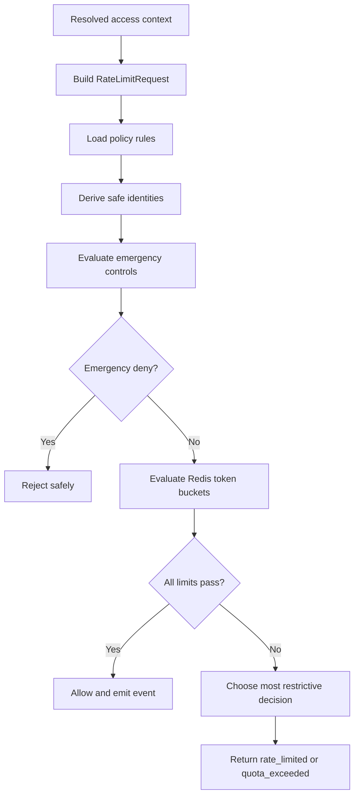
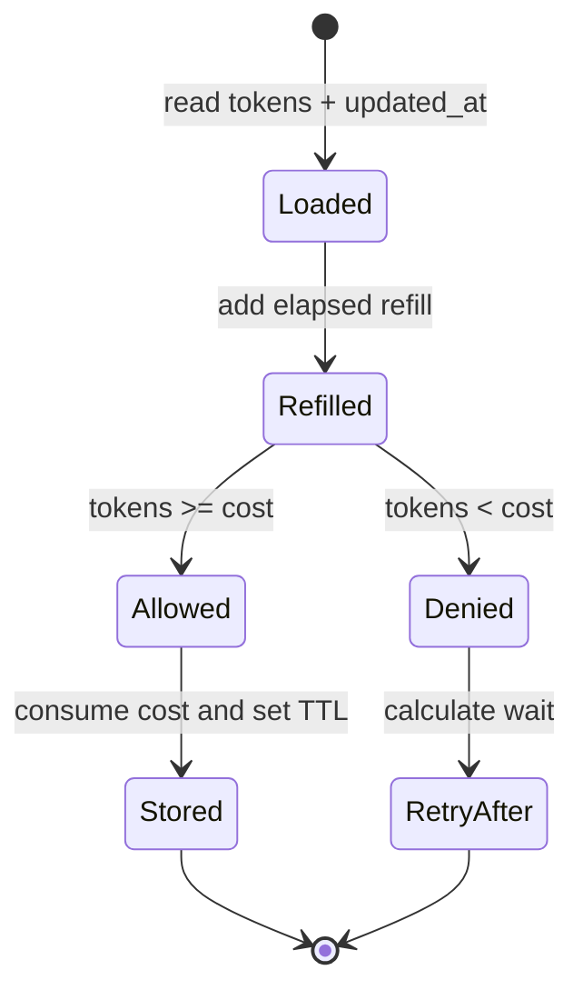
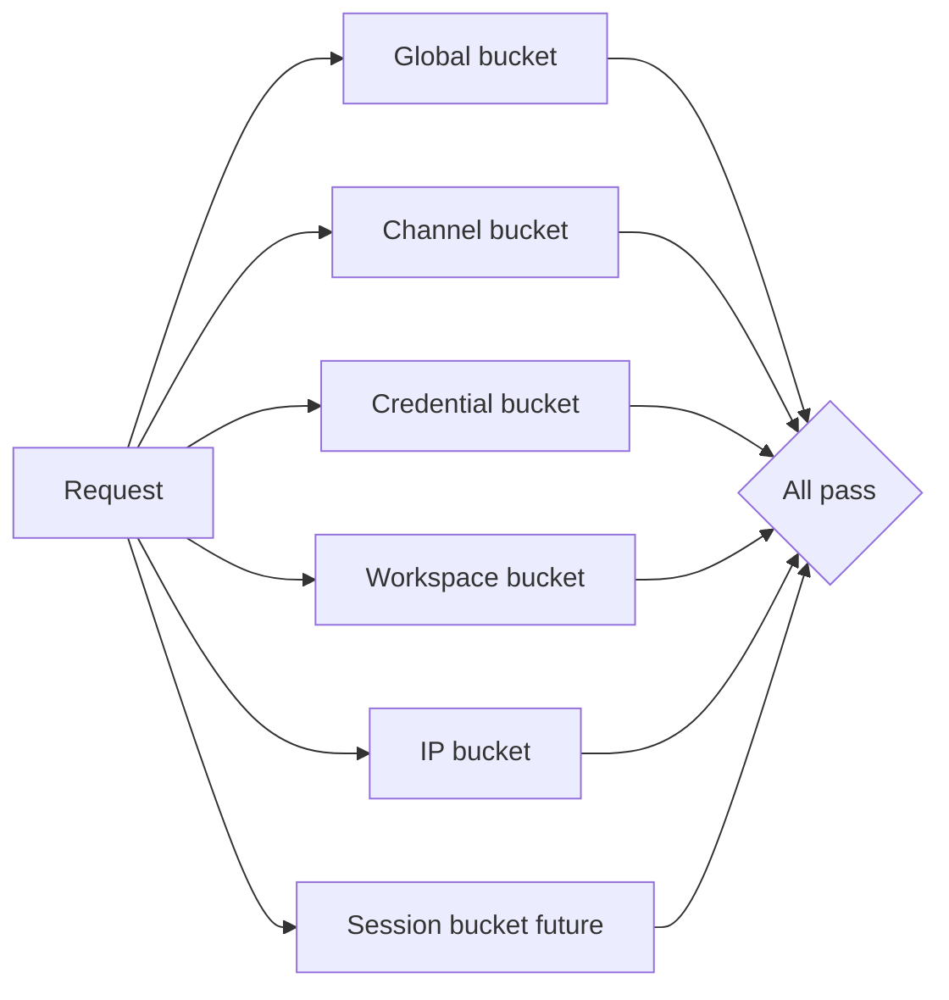
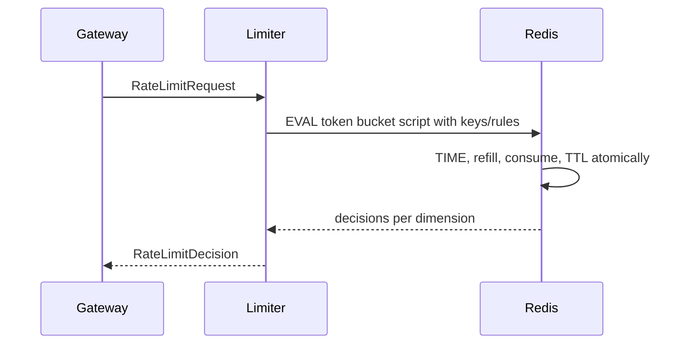
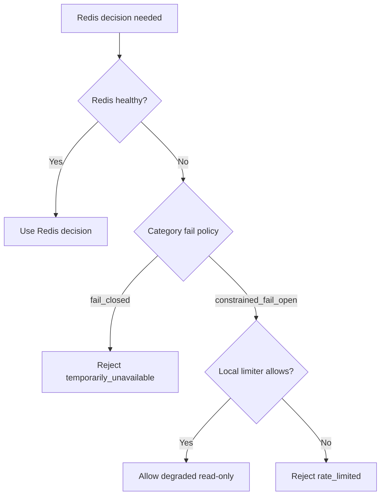
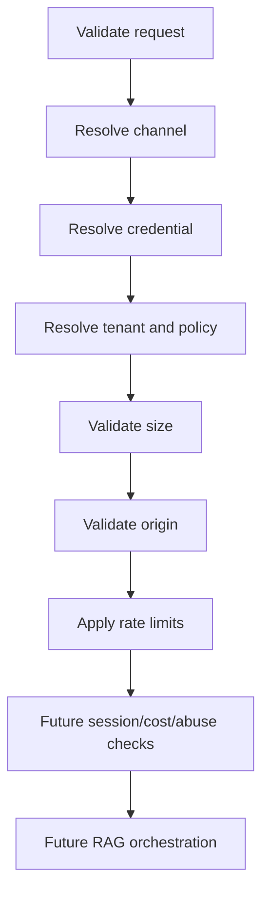
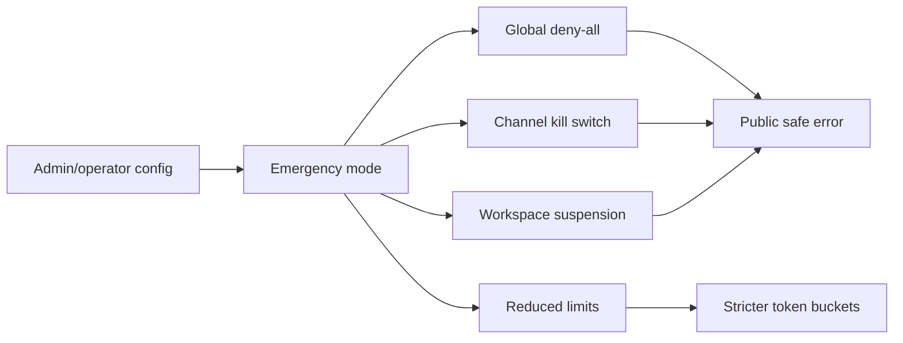

# Distributed Rate Limiting Architecture

Version: 0.1
Status: Proposed architecture for TASK-059A
Scope: Architecture and planning only. No Redis client, Lua script, middleware, public route, session model, widget code, or RAG call is implemented by this document.

## 1. Purpose

This document defines the distributed rate-limiting and quota-control subsystem for future public and external channels entering through the Public Access Layer.

The subsystem must support 10,000 organisations, multiple API instances, Redis-backed distributed decisions, tenant-level cost protection, and safe degradation when Redis is unavailable.

Rate limiting is one control in the public boundary. It does not authenticate users, prove origin ownership, create sessions, or perform RAG. It enforces traffic budgets after the Public Access Layer has resolved the credential, tenant, policy, and origin context.

## 2. Bounded Scope

Rate limiting owns:

- Request-rate enforcement.
- Burst protection.
- Sustained-rate limits.
- Per-IP limits.
- Per-credential limits.
- Per-workspace limits.
- Per-organisation limits.
- Per-session limits in the future.
- Global emergency limits.
- Daily and monthly quota placeholders.
- Retry-After calculation.
- Stable public errors.
- Rate-limit decision events.
- Redis-backed distributed state.
- Policy-profile integration.

Rate limiting does not own:

- Credential resolution.
- Origin validation.
- Anonymous session creation.
- RAG execution.
- Provider token accounting.
- Billing.
- Permanent analytics.
- Abuse classification beyond simple counters and decisions.

## 3. Position In Public Access Flow

Planned gateway order:

1. Validate request shape.
2. Resolve channel.
3. Resolve credential.
4. Resolve tenant and policy.
5. Validate message and request size.
6. Validate origin.
7. Apply rate limits.
8. Continue to future session, cost, abuse, and orchestration stages.

Origin validation should generally happen before the normal distributed rate-limit stage so disallowed origins do not consume full multi-dimensional Redis work. However, the edge may still apply a cheap global/IP limiter before origin validation to absorb obvious floods. That pre-origin guard must be coarse, low-cost, and must not replace tenant-aware limits.

## 4. Limit Dimensions

Supported dimensions:

- Global platform.
- Channel.
- Credential.
- Workspace.
- Organisation.
- IP address.
- Anonymous session future.
- Endpoint category.
- Message-cost bucket future.

Combination rule:

All applicable limits must pass. If any limit fails, the request is rejected with the most restrictive safe decision. The response exposes only a generic public code and a safe Retry-After value; it does not expose the full multidimensional policy.

Most restrictive decision is selected by:

1. Hard-deny emergency controls first.
2. Quota exhaustion before short-window rate limits.
3. Longest required Retry-After among failed rate rules, capped by each rule.
4. Highest priority rule when Retry-After is unavailable.

## 5. Endpoint Categories

Initial categories:

| Category | Purpose | Cost profile | Default posture |
| --- | --- | --- | --- |
| `widget_config_read` | Public widget bootstrap/config reads | Low, cacheable | Constrained fail-open allowed if local fallback is active. |
| `widget_session_create` | Future anonymous session creation | Medium, persistent state | Fail closed on Redis uncertainty. |
| `widget_message_send` | Future public chat message | High, AI-cost bearing | Fail closed or conservative local degraded fallback only if approved. |
| `partner_api_request` | Future server-to-server public API | Medium/high | Fail closed. |
| `public_health_or_metadata` | Future public metadata checks | Low | Strict global/IP limits, optional fail-open if static. |

Each category can define burst capacity, sustained refill, request cost, retry cap, queueing posture, and fail mode.

Maximum queueing for public APIs should be zero for MVP. Public callers receive `rate_limited` instead of waiting behind a server queue.

## 6. Algorithm Selection

Algorithms considered:

| Algorithm | Strengths | Weaknesses | Decision |
| --- | --- | --- | --- |
| Fixed window | Simple and cheap | Boundary bursts and unfairness | Rejected for public chat. |
| Sliding window log | Accurate | High memory at scale | Rejected for MVP. |
| Sliding window counter | Smoother than fixed | More complex and less intuitive than token bucket | Deferred. |
| Token bucket | Clear burst plus sustained control | Requires atomic state update | Chosen. |
| Leaky bucket | Smooths traffic | Less natural for burst allowances | Rejected. |
| Redis module/cell | Mature if available | Adds deployment dependency | Deferred. |

MVP choice: Redis-backed atomic token bucket for burst and sustained control.

Token bucket model:

- `capacity`: maximum tokens in bucket.
- `refill_tokens`: tokens added every refill period.
- `refill_period_seconds`: refill interval.
- `request_cost`: tokens consumed by one request or cost bucket.
- `remaining`: tokens after a successful consume.
- `retry_after_seconds`: estimated time until enough tokens exist.
- `reset_at`: approximate time bucket reaches capacity if no further requests arrive.

Atomicity:

- Use a Redis Lua script or transaction-safe equivalent for read-refill-consume-write.
- Each rule evaluation must be atomic for its key.
- Multi-dimensional evaluation may use a single script with multiple keys where cluster slot strategy permits, or a deterministic two-phase check/consume design with compensation explicitly tested.

Clock assumptions:

- Prefer Redis server time inside Lua to avoid API-node clock skew.
- If Redis TIME is unavailable in a fallback implementation, use monotonic app time only for local degraded limits.

## 7. Redis Key Model

Conceptual key format:

```text
rate:{environment}:{dimension}:{hashed_identity}:{category}
quota:{environment}:{period}:{dimension}:{hashed_identity}:{category}
```

Requirements:

- Use stable keyed hashes for public identifiers, IPs, session tokens, and secrets.
- Do not store raw public keys, partner secrets, IP addresses, session tokens, message content, or PII in keys.
- Keep key length bounded.
- Include environment separation.
- Include dimension and category for operational visibility without exposing identity.
- Use TTL based on the maximum refill/reset horizon plus safety margin.

Example key concepts:

- Global: `rate:production:global:platform:widget_message_send`
- Channel: `rate:production:channel:h(widget):widget_message_send`
- Credential: `rate:production:credential:h(credential_id):widget_message_send`
- Workspace: `rate:production:workspace:h(workspace_id):widget_message_send`
- Organisation: `rate:production:organisation:h(organisation_id):widget_message_send`
- IP: `rate:production:ip:h(canonical_ip_or_prefix):widget_message_send`
- Session future: `rate:production:session:h(session_id):widget_message_send`
- Quota: `quota:production:2026-07-15:workspace:h(workspace_id):messages`

Hashing should use an application-managed secret or stable keyed HMAC for public/client-derived values. Internal IDs may still be hashed to reduce leakage from Redis dumps and operational logs.

## 8. Identity Derivation

Credential identity:

- Use credential database ID or keyed hash of it.
- Never use raw partner secret or raw public key in Redis keys.

Workspace and organisation identity:

- Use server-resolved internal IDs, preferably hashed in keys.
- Never accept tenant IDs from public request bodies or query strings.

IP identity:

- Canonicalise IPv4 and IPv6.
- Prefer keyed hash in keys and safe events.
- For IPv6, apply a configurable prefix aggregation such as /64 for public-widget abuse controls to reduce address-rotation bypass. Keep exact IPv6 available for security investigation only under policy.
- NAT and shared networks create false-positive risk; combine IP limits with credential, workspace, and session dimensions.

Session identity future:

- Use internal session ID or server-side token hash.
- Never use raw session token.

Message-cost bucket future:

- Assign cost units from request class or estimated token cost before execution.
- After AI accounting exists, feed actual token/cost usage into quota counters separately.

## 9. Trusted Client IP Model

Default source is direct socket peer address.

Forwarded headers:

- `X-Forwarded-For` is trusted only when the immediate peer is a configured trusted proxy.
- Use first untrusted hop strategy: parse from right to left, skip trusted proxy hops, and select the first untrusted client hop.
- `X-Real-IP` is trusted only from configured trusted proxies and only when `X-Forwarded-For` is absent or policy allows it.
- Cloudflare or similar headers are future provider-specific adapters and require configured trusted proxy ranges.
- Malformed forwarded headers are ignored or rejected according to policy; they must never reduce rate-limit identity strength.
- Arbitrary forwarded headers from direct public clients are ignored.

Missing IP:

- If no trustworthy IP can be derived, apply credential/workspace/global limits and use a strict `unknown_ip` bucket for IP dimension where configured.

## 10. Policy Model

Extend access policy profiles with rate-limit rule sets.

Proposed `RateLimitRule`:

- `category`
- `dimension`
- `capacity`
- `refill_tokens`
- `refill_period_seconds`
- `request_cost`
- `enabled`
- `fail_mode`: `fail_closed`, `constrained_fail_open`, or `local_degraded`
- `priority`
- `retry_after_cap_seconds`

Policy examples:

Widget config read:

- Global platform rule.
- Credential rule.
- Workspace rule.
- IP safety rule.
- Fail mode: constrained fail-open with local limiter only for read-only config.

Widget session create:

- Global platform rule.
- Credential rule.
- Workspace rule.
- IP rule.
- Future session not yet applicable.
- Fail mode: fail closed.

Widget message send:

- Global platform rule.
- Credential rule.
- Workspace rule.
- IP rule.
- Future session rule.
- Future message-cost bucket rule.
- Fail mode: fail closed by default.

Partner API:

- Credential rule.
- Workspace/organisation quota rule.
- IP safety rule.
- Fail mode: fail closed.

Internal test:

- Deterministic in-memory or fake Redis rules in tests only.
- No production public endpoint may use internal test policy.

## 11. Decision Contract

`RateLimitRequest` fields:

- `request_id`
- `trace_id`
- `channel`
- `category`
- `credential_id`
- `organisation_id`
- `workspace_id`
- `client_ip_identity`
- `session_id` optional
- `policy_profile`
- `request_cost`
- `received_at`

`RateLimitDecision` fields:

- `allowed`
- `reason_code`
- `limiting_dimension` optional
- `limit`
- `remaining`
- `retry_after_seconds` optional
- `reset_at` optional
- `decision_metadata` safe only
- `degraded` boolean

Safe metadata must not include Redis keys, raw public identifiers, raw IP addresses, raw session tokens, policy internals, or message content.

## 12. Global and Emergency Controls

Controls separate from Redis counters:

- Global platform rate limit.
- Per-channel kill switch.
- Per-workspace suspension.
- Per-credential disable, already owned by credential lifecycle.
- Emergency deny-all.
- Emergency reduced limits.
- Provider-outage degraded limits.

Configuration flags should be loaded from trusted server-side configuration or database-backed admin settings in a future task. Redis counters should not be the source of truth for administrative suspension.

Emergency controls are evaluated before normal token consumption when available. If emergency state is uncertain, security-sensitive public message/session categories fail closed.

## 13. Quotas Versus Rate Limits

Rate limits are short-window traffic controls. Quotas are daily/monthly usage ceilings.

Future quota placeholders:

- Messages per day.
- Sessions per day.
- Estimated tokens per day.
- Estimated cost per day.
- Monthly workspace or organisation cap.

Quota counters can initially live in Redis for enforcement speed, with durable accounting later sourced from AI execution/token accounting records. Billing remains out of scope.

AI accounting integration:

- Pre-request quota checks use estimated cost buckets.
- Post-execution accounting records actual tokens and estimated cost.
- Future reconciliation updates durable quota usage and can adjust future policy decisions.

## 14. Redis Failure Policy

Category posture:

| Category | Redis unavailable or uncertain | Reason |
| --- | --- | --- |
| `widget_config_read` | Constrained fail-open with local emergency limiter and short TTL cache only if config is already safe to serve. | Read-only and low cost. |
| `widget_session_create` | Fail closed. | Creates persistent state and abuse surface. |
| `widget_message_send` | Fail closed by default; local degraded fallback requires explicit future approval. | AI-cost bearing and abuse-sensitive. |
| `partner_api_request` | Fail closed. | Secret-bearing server API must be strongly controlled. |
| Global emergency limit | Fail closed if state is uncertain. | Platform safety. |

Local in-process emergency limiter:

- Per-instance only.
- Very conservative.
- Short-lived.
- Explicitly marked degraded.
- Used only for selected read-only categories.
- Not a substitute for Redis.

## 15. Atomicity and Concurrency

- Use Redis Lua or equivalent transaction-safe logic to refill and consume tokens atomically.
- Concurrent duplicate requests consume tokens independently unless a future idempotency key is approved.
- Multi-instance consistency depends on Redis atomic operations, not API node memory.
- Redis Cluster compatibility requires key hash tags or a script strategy that keeps keys for one decision in a valid slot, or else evaluates dimensions independently with tested failure semantics.
- Script versions must be named and loaded deterministically.
- Time should come from Redis server time for distributed decisions.

## 16. Retry-After and Headers

Future response headers:

- `Retry-After`
- `X-RateLimit-Limit` optional
- `X-RateLimit-Remaining` optional
- `X-RateLimit-Reset` optional
- public-safe request ID header

Public widget endpoints should return `Retry-After` and a stable safe error. Detailed limit headers are optional and should be conservative because they can help attackers tune traffic. Partner APIs may receive more detailed headers if authenticated and documented.

Do not expose internal multidimensional policy details.

## 17. Safe Error Model

Map failures to existing public-safe codes:

- `rate_limited`
- `quota_exceeded`
- `temporarily_unavailable`
- `safe_internal_error`

Errors must not reveal:

- Other tenants' limits.
- Infrastructure details.
- Redis keys.
- Raw credential identities.
- Raw IP identities.
- Internal policy definitions.

## 18. Observability

Events:

- `rate_limit.allowed`
- `rate_limit.denied`
- `rate_limit.redis_unavailable`
- `rate_limit.degraded_local_fallback`
- `quota.denied`
- `rate_limit.emergency_mode`

Safe metadata:

- request ID
- trace ID
- channel
- category
- credential ID
- workspace ID for internal operational context
- limiting dimension
- outcome
- retry_after
- degraded flag

Do not log raw public keys, raw partner secrets, raw session tokens, message content, or full IP addresses in general logs unless a separate security policy permits it.

Metrics:

- Allowed and denied requests by category.
- Denial rate.
- Redis latency.
- Redis error rate.
- Degraded-mode count.
- Top limited workspaces.
- Global saturation.
- Retry-After distribution.

## 19. Privacy

- Hash or truncate IP identities for general events.
- Keep security logs separate from product analytics.
- Apply short retention to high-volume rate-limit events unless security investigation requires longer retention.
- Avoid raw message content entirely.
- Treat public identifiers and IP-derived identities as operational/security data.
- Document GDPR/privacy implications before public launch.

## 20. Performance and Scale

Targets:

- 10,000 organisations.
- Horizontally scaled API nodes.
- Low single-digit millisecond Redis decision p95.
- Bounded Lua execution time.
- Connection pooling.
- Pipeline opportunities for independent rule checks.
- Redis Cluster compatibility path.

Hot-key considerations:

- Global keys are intentionally hot; keep operations minimal and consider sharded global buckets later.
- Large workspaces can become hot; workspace-level keys may need per-category sharding at scale.
- IP keys can be high-cardinality; TTL must be tight.
- Credential and session keys distribute naturally.

## 21. Failure Modes

| Failure | Behaviour |
| --- | --- |
| Redis unavailable | Apply category fail policy; fail closed for message/session/API. |
| Redis timeout | Treat as unavailable after strict timeout budget. |
| Redis partial outage | Fail closed unless selected read-only local fallback is configured. |
| Stale policy | Use last-known-good only if signed/versioned and within TTL; otherwise fail closed for sensitive categories. |
| Malformed rule | Disable deployment or fail closed for that category; emit configuration alert. |
| Missing identity | Use stricter fallback bucket or fail closed depending dimension. |
| Missing IP | Use `unknown_ip` bucket plus tenant/credential limits. |
| Global limit unavailable | Fail closed for public write/cost-bearing endpoints. |
| One tenant hot key | Enforce workspace limits and alert; future sharding if needed. |
| Local fallback exhausted | Return `rate_limited` or `temporarily_unavailable`. |
| Configuration reload failure | Continue last-known-good briefly for read-only; fail closed for sensitive categories after TTL. |

## 22. Threat Model

| Threat | Likelihood | Impact | Controls | Residual risk | Monitoring |
| --- | --- | --- | --- | --- | --- |
| Public key abuse | High | High | Credential, origin, IP, workspace, and global limits. | Copied keys can still cause traffic until blocked. | Credential denial spikes. |
| Distributed bot traffic | High | High | Multi-dimensional limits and global emergency controls. | IP rotation may bypass IP limits. | Global/channel saturation. |
| IP rotation | High | Medium | Credential/workspace/session limits. | Large botnets remain difficult. | Unique IP per credential. |
| NAT/shared-IP false positives | Medium | Medium | Combine IP with tenant/session dimensions; tune caps. | Shared campuses may be throttled. | Denials by ASN/future signals. |
| IPv6 rotation | Medium | Medium | IPv6 prefix aggregation. | Privacy addresses still vary. | IPv6 prefix denial metrics. |
| Rate-limit key enumeration | Low | Medium | Keyed hashes and no raw secrets in keys. | Redis access compromise still serious. | Redis access auditing. |
| Redis denial of service | Medium | High | Bounded scripts, timeouts, pooling, emergency mode. | Platform may fail closed. | Redis latency/error alerts. |
| Lua script abuse | Low | High | Versioned scripts, bounded keys, no user code. | Script bugs affect decisions. | Script error metrics. |
| Forwarded-header spoofing | Medium | High | Trust proxies only by configured source. | Proxy config mistakes. | Malformed/spoofed header events. |
| Multiple credential bypass | Medium | Medium | Workspace and organisation limits. | Multiple workspaces can still spread load. | Org-level metrics. |
| Race conditions | Medium | High | Atomic Redis consume. | Multi-key cluster decisions are harder. | Concurrent stress tests. |
| Fail-open exploitation | Medium | High | Fail-open only for constrained read-only categories. | Attackers may target config reads. | Degraded fallback count. |
| Quota evasion | Medium | High | Workspace/org quotas and post-execution accounting. | Estimate/actual drift. | Accounting reconciliation. |
| Clock manipulation | Low | Medium | Redis TIME for distributed decisions. | Local fallback uses app clock. | Clock skew alerts. |
| Replay | Medium | Medium | Future session/idempotency controls plus rate limits. | No session task yet. | Duplicate request signals. |

## 23. Test Strategy

Algorithm tests:

- Initial capacity.
- Refill over time.
- Burst exhaustion.
- Retry-After calculation.
- Request cost greater than one.
- Concurrent atomicity.
- Window boundary behaviour.

Dimension tests:

- IP.
- Credential.
- Workspace.
- Organisation.
- Global.
- Multiple limits combined.

Security tests:

- Raw key absent from Redis key.
- Forwarded-header spoofing rejected.
- Cross-tenant identity isolation.
- IPv4 and IPv6 canonicalisation.
- No raw IP in safe events.

Failure tests:

- Redis unavailable.
- Redis timeout.
- Degraded local fallback.
- Fail-closed categories.
- Constrained fail-open config read category.
- Emergency kill switch.

Gateway tests:

- Origin denial occurs before normal rate stage.
- Rate denial prevents session/RAG stages.
- Safe public error returned.
- Events emitted.

## 24. Diagrams

### Rate-Limit Decision Flow



### Token-Bucket Lifecycle



### Multi-Dimensional Evaluation



### Redis Atomic Operation Sequence



### Redis Outage And Degraded Mode



### Gateway Integration



### Emergency Controls



## 25. Future Implementation Breakdown

1. `TASK-059B` rate-limit contracts and policy models.
2. Redis client foundation and connection configuration.
3. Atomic token-bucket implementation.
4. Trusted client IP extraction.
5. Public Access Gateway integration.
6. Local degraded fallback for approved read-only categories.
7. Security, concurrency, and chaos tests.
8. Future quota accounting integration.

## 26. Acceptance Criteria

TASK-059A is complete when:

- Algorithm is selected.
- Dimensions and combination rules are explicit.
- Redis key and identity model is safe.
- Proxy/IP trust model is defined.
- Gateway order is clear.
- Failure policies are explicit per category.
- Quota boundary is defined.
- Threat model and diagrams are complete.
- ADR-0009 records the decision.
- No runtime code is added.

## TASK-059B Implementation Note

Implemented module paths:

```text
apps/api/app/access/rate_limit/
  __init__.py
  contracts.py
  errors.py
  identities.py
  policies.py
  token_bucket.py
  redis_store.py
  local_fallback.py
  service.py
  client_ip.py
```

The implementation provides serialisable contracts, HMAC identity hashing, safe Redis key generation, trusted client-IP extraction, token-bucket math, Redis Lua script wrapper, injectable in-memory test store, constrained local degraded fallback, safe events, safe errors, and optional Public Access Gateway integration.

No public endpoint, Redis-backed quota persistence, anonymous session, billing workflow, CORS middleware, widget SDK/UI, or RAG invocation is implemented by TASK-059B.
