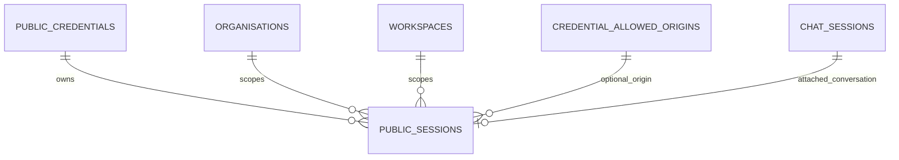
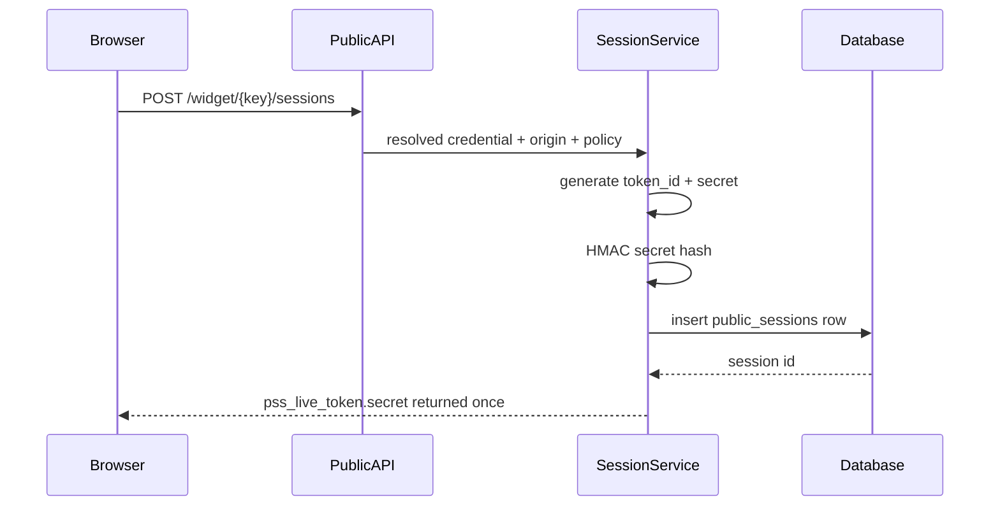
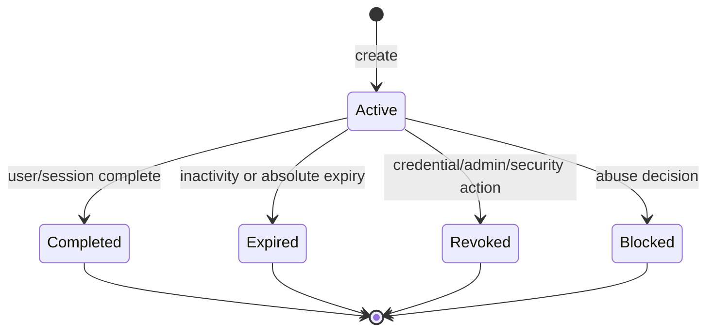
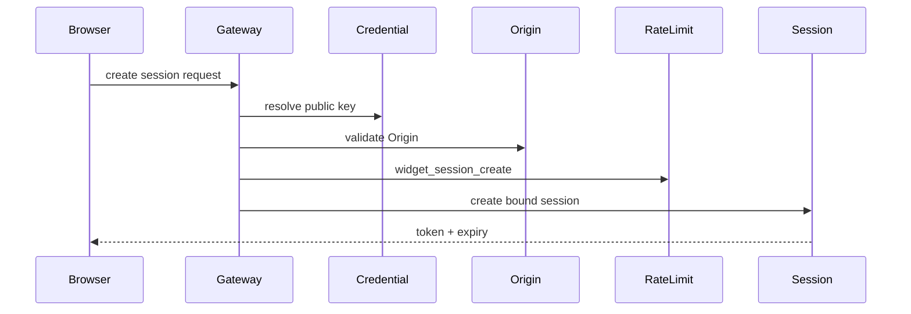
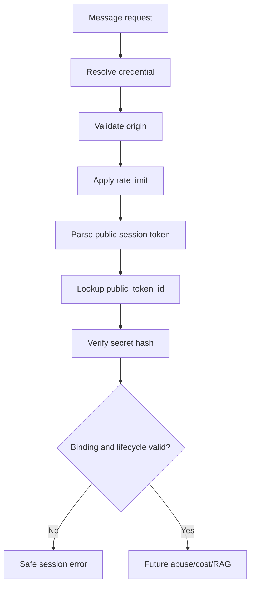
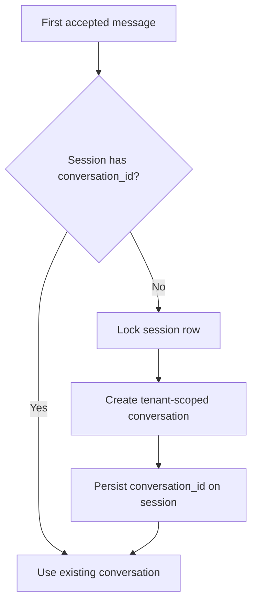
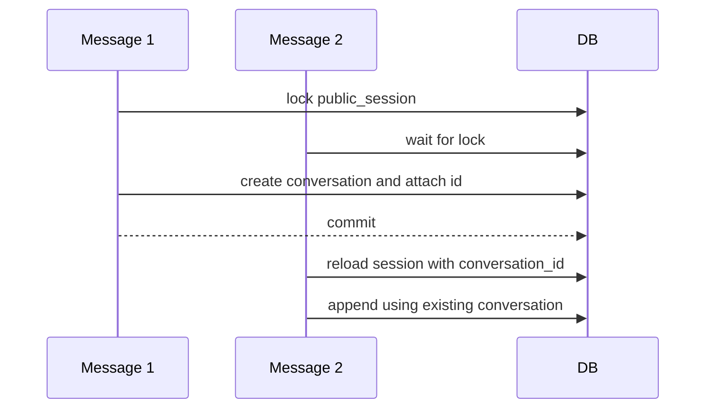
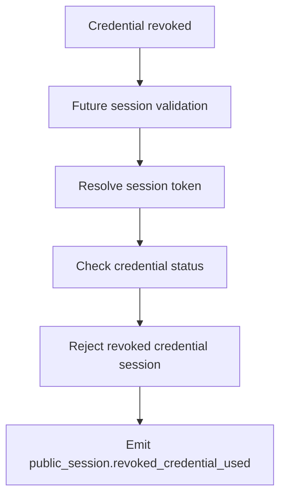
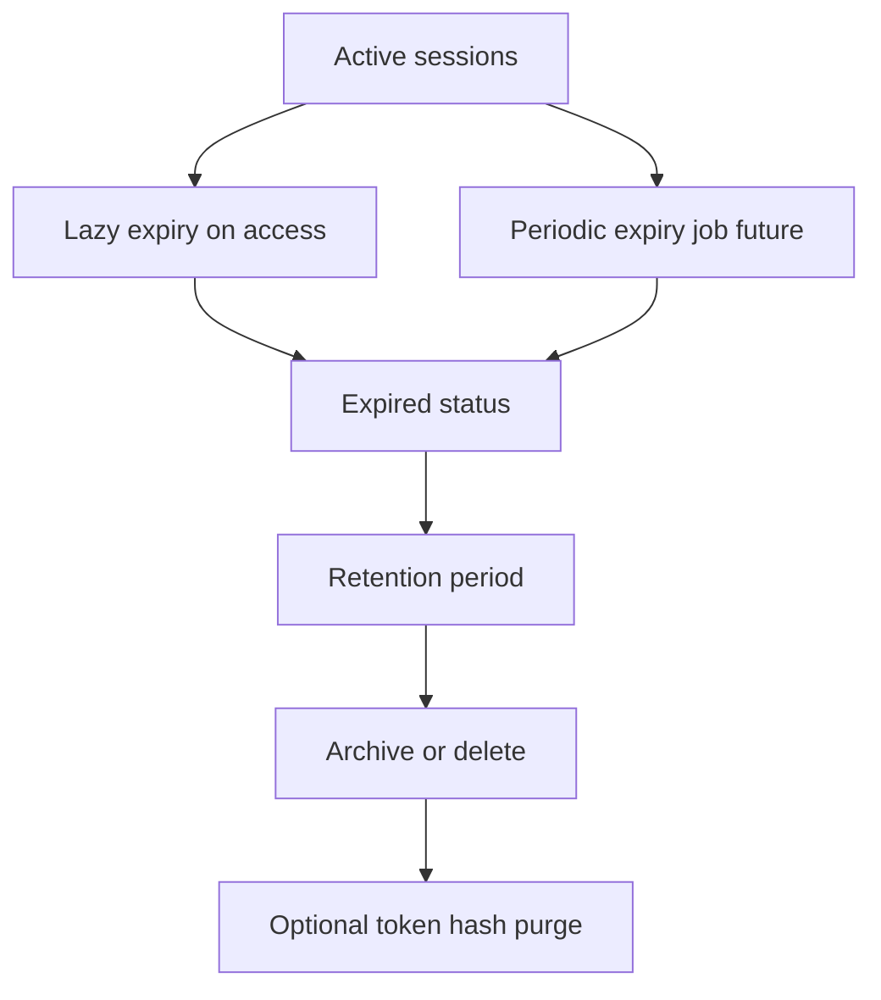

# Anonymous Public Session Architecture

Version: 0.1
Status: Proposed architecture for TASK-060A
Scope: Architecture and planning only. No database model, migration, token generator, repository/service, public endpoint, Redis session cache, widget code, CORS change, or RAG call is implemented by this document.

## 1. Purpose

This document defines the anonymous public-session subsystem for future widget and browser-based public channels.

The subsystem securely binds anonymous browser sessions to one public credential, organisation, workspace, channel, origin, and policy profile. It must not trust client-supplied tenant IDs, raw conversation IDs, provider configuration, prompt keys, document IDs, or other internal identifiers.

The design supports thousands of organisations and horizontally scaled API instances through a PostgreSQL source of truth, indexed token lookup, explicit lifecycle state, and future cache acceleration.

## 2. Bounded Scope

Anonymous public sessions own:

- Cryptographically secure public session tokens.
- Server-side session records.
- Credential/workspace/channel binding.
- Origin binding or origin-policy reference.
- Session lifecycle.
- Expiration and inactivity timeout.
- Maximum session lifetime.
- Message-count limits.
- Replay-risk reduction.
- Token rotation future.
- Session revocation.
- Safe session lookup.
- Session-to-conversation mapping.
- Rate-limit session identity.
- Session operational events.
- Session privacy and retention rules.

Anonymous public sessions do not own:

- Credential creation.
- Origin matching.
- Rate-limit algorithm.
- RAG execution.
- Conversation content generation.
- Widget rendering.
- Lead capture.
- Production user identity.
- Billing.

## 3. Security Boundary

Public sessions sit inside the Public Access Layer after credential, tenant, origin, and rate-limit checks.

A future widget message request must prove:

```text
public credential -> active credential -> active tenant -> validated origin -> rate limit passed -> valid public session -> future RAG
```

The session token is bearer material. Possession of the token is not enough by itself: the token must match the resolved credential, workspace, channel, environment, origin binding, lifecycle state, expiry policy, and rate-limit/session policy.

## 4. Session Identity Model

Use two separate identifiers.

### Public session token

- Returned to the browser only at session creation.
- High entropy.
- URL-safe.
- Non-sequential.
- Contains no tenant information.
- Treated as bearer material.
- Never stored in plaintext.
- Never logged in full.

### Internal session ID

- Database primary key.
- Never trusted from the client.
- Used for internal relationships, rate-limit session dimension, events, and conversation mapping.

## 5. Token Model Alternatives

| Option | Strengths | Weaknesses | Decision |
| --- | --- | --- | --- |
| A. Store full random token hash and query by hash | Simple; no token ID parsing | Requires hashing full token on every lookup; less operationally useful | Rejected for MVP. |
| B. Public token ID plus secret hash | Efficient lookup; logs can safely include token ID; secret still verified | Slightly more token format complexity | Chosen. |
| C. Signed self-contained token | No DB lookup for basic validation | Harder immediate revocation; tenant/policy state can become stale | Rejected for MVP. |
| D. Encrypted token | Can hide claims from browser | Still needs key rotation and revocation story; unnecessary state exposure | Rejected for MVP. |

Chosen MVP: opaque random token with public token ID plus high-entropy secret. Store token ID and secret hash separately for efficient lookup and safer verification.

## 6. Token Format

Conceptual format:

```text
pss_live_<token_id>.<secret>
```

Prefixes:

- `pss_dev_` for development.
- `pss_stg_` for staging.
- `pss_live_` for production.

Requirements:

- URL-safe characters only.
- Bounded length, target under 180 characters.
- Versionable prefix if future formats change.
- Token ID has enough randomness to prevent enumeration, minimum 96 bits.
- Secret portion has at least 192 bits of entropy; 256 bits preferred.
- No organisation ID, workspace ID, credential ID, domain, slug, or user data.
- Collision handling by regenerating token ID before insert.
- Logs may include token ID only, never the secret or full token.

## 7. Hashing And Verification

Store:

- `public_token_id` in plaintext for lookup.
- `token_secret_hash` for verification.

Recommended verification:

- Derive `token_secret_hash = HMAC(session_secret_key, token_id || secret || token_version)`.
- Compare using constant-time comparison.
- Include token version/key version in metadata or a future explicit column if key rotation is needed.
- Never store the raw secret or full token.
- Never emit the raw token in audit/events/logs.

Why keyed HMAC is acceptable:

- Session secrets are high-entropy random values, not human passwords.
- Brute forcing a 192-256 bit random secret is infeasible.
- HMAC is fast enough for high-volume public validation.
- Password hashing would add latency without material benefit for random secrets.

If token secrets ever become user-chosen or low entropy, use a password-hash strategy instead.

## 8. Database Model

Future table: `public_sessions`.

Required fields:

| Field | Notes |
| --- | --- |
| `id` | Internal UUID primary key. |
| `organisation_id` | Server-resolved tenant. Required. |
| `workspace_id` | Server-resolved workspace. Required. |
| `credential_id` | Public credential ID. Required. |
| `channel` | Widget or future browser channel. Required. |
| `environment` | Credential/session environment. Required. |
| `public_token_id` | Unique public token lookup ID. Required. |
| `token_secret_hash` | HMAC/digest of secret. Required. |
| `status` | `active`, `expired`, `revoked`, `completed`, `blocked`. |
| `policy_profile` | Policy key at creation. Required. |
| `origin_id` | Allowed-origin record ID when available. Optional. |
| `canonical_origin_hash` | HMAC/hash of canonical origin. Optional but recommended for widget sessions. |
| `conversation_id` | Existing `chat_sessions`/conversation ID. Optional until first message. |
| `anonymous_user_id` | Optional random anonymous user identifier. |
| `message_count` | Count of accepted user messages. Required, default 0. |
| `created_at` | Required. |
| `updated_at` | Required. |
| `last_activity_at` | Required. |
| `expires_at` | Inactivity expiry. Required. |
| `absolute_expires_at` | Hard lifetime expiry. Required. |
| `revoked_at` | Optional. |
| `completed_at` | Optional. |
| `metadata_json` | Bounded safe metadata only. |
| `deleted_at` | Optional soft-delete/retention marker. |

Constraints and indexes:

- Unique `public_token_id`.
- Index `organisation_id, workspace_id`.
- Index `credential_id, status`.
- Index `workspace_id, status, expires_at`.
- Index `status, expires_at`.
- Index `last_activity_at`.
- Index `conversation_id`.
- Index `deleted_at` for retention cleanup.
- Optional unique partial index for active token ID where database supports it; plain unique token ID is acceptable for MVP.

Rules:

- No session is created during credential creation.
- No workspace becomes public by session schema alone.
- Session lookup by admin paths must include tenant scope; runtime token lookup first resolves by public token ID, then verifies tenant/credential binding before use.

## 9. Session Lifecycle

Statuses:

- `active`
- `completed`
- `expired`
- `revoked`
- `blocked`

Transitions:

```text
create -> active
active -> completed
active -> expired
active -> revoked
active -> blocked
```

Terminal states:

- `completed`
- `expired`
- `revoked`
- `blocked`

Blocked is terminal for MVP. Any future administrator unblock should create a separate review/annotation or a new session; it must not silently reactivate the same token.

Credential/workspace behaviour:

- Disabled/revoked/expired credential makes existing sessions unusable.
- Disabled workspace or organisation makes existing sessions unusable.
- Credential rotation does not migrate sessions automatically unless explicitly approved later.

## 10. Expiry Model

Inactivity expiry:

- `expires_at` extends on valid session activity.
- Extension is capped by `absolute_expires_at`.
- Example MVP policy: 30 minutes inactivity, policy-driven.

Absolute expiry:

- `absolute_expires_at` is never extended.
- Example MVP policy: 24 hours, policy-driven.

Message cap:

- Session stops accepting messages when `message_count >= policy.max_messages_per_session`.
- Config/session creation does not increment message count.
- Count only accepted user messages that proceed to future message processing.

Expiration checks happen on every session use before any conversation/RAG side effect.

## 11. Credential And Origin Binding

A public session binds to:

- credential ID
- organisation ID
- workspace ID
- channel
- environment
- policy profile
- origin ID where available
- canonical origin hash where applicable

On each message:

- Credential must still be active and match the session credential.
- Organisation/workspace must still be active and match the session tenant.
- Session must match channel and environment.
- Validated origin must match the session origin binding.
- Session token cannot be reused across credentials, workspaces, channels, environments, or origins.

Decision: widget browser sessions bind to the canonical validated origin and reject a different origin. Origin changes within a session are not allowed for MVP.

If an allowed-origin record is removed after session creation, validation should fail either through current origin validation or session-origin mismatch depending implementation order.

## 12. Conversation Relationship

Options:

| Option | Strengths | Weaknesses | Decision |
| --- | --- | --- | --- |
| A. Create conversation during session creation | Simple later message flow | Creates empty conversations for abandoned sessions | Rejected. |
| B. Create conversation on first accepted message | Avoids empty records; aligns persistence with actual chat | Requires concurrency guard | Chosen. |
| C. Keep session separate from conversation permanently | Maximum separation | Duplicates conversation state and breaks existing review/history flow | Rejected. |

Chosen: create public session first; lazily create the existing tenant-scoped conversation on the first accepted message. Persist `conversation_id` onto `public_sessions`.

Race handling:

- Use row-level lock or atomic compare-and-set on the session row.
- If two first messages arrive concurrently, only one creates/attaches the conversation.
- The loser reloads the attached conversation and appends to it if still valid.
- Conversation creation and `conversation_id` assignment should be in one transaction where practical.

## 13. PostgreSQL Versus Redis

Options:

| Storage | Strengths | Weaknesses | Decision |
| --- | --- | --- | --- |
| PostgreSQL source of truth | Revocable, auditable, tenant-safe, relational mapping to conversations | DB lookup per request | Chosen. |
| Redis only | Fast, TTL-native | Weak auditability, harder durable revocation/history | Rejected. |
| PostgreSQL plus Redis cache | Good future performance | More invalidation complexity | Future enhancement. |
| Stateless signed token | Fast lookup | Revocation and tenant-policy freshness problems | Rejected. |

MVP choice: PostgreSQL source of truth, optional Redis cache later.

Reasons:

- Immediate revocation and blocking.
- Tenant-safe relationships to credential/workspace/conversation.
- Auditability and lifecycle visibility.
- Horizontal API scaling through indexed lookup.
- Cache acceleration can be added without changing token protocol.

## 14. Session Contracts

### CreatePublicSessionRequest

Server-owned inputs:

- Resolved public credential context.
- Channel.
- Validated origin context.
- Policy profile.
- Safe request metadata.

Client must not supply trusted organisation ID, workspace ID, credential DB ID, conversation ID, policy profile, or origin result.

### CreatePublicSessionResponse

Fields:

- public session token, returned once.
- `expires_at`.
- `absolute_expires_at` optional if safe.
- `inactivity_timeout_seconds`.
- `max_messages`.
- session capabilities.
- safe request ID.

### ValidatePublicSessionRequest

Fields:

- public session token.
- resolved credential context.
- channel.
- validated origin.
- received timestamp.
- request ID and trace ID.

### ValidatedPublicSessionContext

Fields:

- internal session ID.
- organisation ID.
- workspace ID.
- credential ID.
- channel.
- conversation ID optional.
- message count.
- policy profile.
- expiry data.
- rate-limit identity.
- trace ID.

Public session tokens must not be reflected in response metadata after creation.

## 15. Gateway Integration Order

Future Public Access Gateway flow:

1. Validate request.
2. Resolve channel.
3. Resolve credential.
4. Resolve tenant and policy.
5. Validate request/message size.
6. Validate Origin.
7. Apply rate limits.
8. Create or validate public session.
9. Apply future abuse checks.
10. Apply future cost controls.
11. Call RAG orchestrator.

Session creation endpoint:

- Resolves credential and tenant.
- Validates origin.
- Applies `widget_session_create` rate limits.
- Creates public session.
- Does not call RAG.

Message endpoint:

- Resolves credential and tenant.
- Validates origin.
- Applies message rate limits.
- Validates existing public session.
- Does not trust a conversation ID from the client.

## 16. Session Creation Rules

Allow creation only when:

- Credential is active.
- Credential environment matches request environment.
- Organisation/workspace are active.
- Origin is allowed where required.
- Session-create rate limit passed.
- Policy permits public sessions.
- Channel adapter supports sessions.

Future placeholders:

- Maximum simultaneous active sessions per credential.
- Maximum simultaneous active sessions per workspace.
- Abuse blocklists.

No email, phone, lead details, or production user identity are collected in MVP session creation.

## 17. Replay Protection And Residual Risk

Bearer session tokens cannot fully prevent replay if stolen. Controls reduce impact:

- Origin binding.
- Channel binding.
- Credential binding.
- Workspace/organisation binding.
- Rate-limit session identity.
- Message-count cap.
- Expiry and inactivity timeout.
- Future request ID/idempotency key.
- Future sequence number or session lock for message concurrency.
- Revocation/blocking.

Residual risk:

- A malicious browser extension or host-site XSS can steal token material from browser storage.
- Duplicated tabs may share a valid session.
- A stolen token from the same origin may work until expiry/revocation.

## 18. Concurrency And Idempotency

Design for:

- Two simultaneous first messages.
- Double session creation.
- Repeated message requests.
- Duplicate assistant generation risk.
- Message-count races.

Controls:

- Use database row locking or atomic update on session validation and message-count increment.
- Attach one conversation with compare-and-set semantics.
- Increment `message_count` atomically before future RAG side effects or in a transaction that can safely roll back.
- Add future idempotency key for message requests.
- Add optional version column if optimistic concurrency is chosen.

Do not claim exactly-once assistant generation until idempotency is implemented.

## 19. Safe Public Errors

Stable codes:

- `invalid_session`
- `expired_session`
- `revoked_session`
- `blocked_session`
- `session_limit_reached`
- `session_origin_mismatch`
- `session_credential_mismatch`
- `session_channel_mismatch`
- `temporarily_unavailable`
- `safe_internal_error`

Errors must not reveal:

- Whether another tenant/session exists.
- Internal session ID.
- Conversation ID unless intentionally part of a future public protocol.
- Credential database ID.
- Expiry-policy internals beyond safe client guidance.
- Token hashes.

## 20. Privacy And Retention

Rules:

- No direct personal data is required.
- `anonymous_user_id` is optional and random.
- IP address is not stored in session rows unless a future policy justifies it; rate limiting handles IP-derived identity separately.
- User agent/referrer may be stored only as bounded safe metadata if needed.
- Store `canonical_origin_hash` rather than raw origin where practical.
- Keep security logs separate from conversation content.
- No raw token retention.

Retention:

- Expiry marks a session unusable.
- Deletion/archival follows a separate retention policy.
- Expired/completed sessions can be retained long enough for abuse investigation and conversation linkage, then archived or deleted.
- Token secret hash can be deleted after retention if no longer needed for investigation.

## 21. Events And Observability

Permanent administrative audit events only for future admin actions:

- `public_session.revoked_by_admin`
- `public_session.blocked_by_admin`
- policy changes affecting sessions

High-volume operational events:

- `public_session.created`
- `public_session.validated`
- `public_session.expired`
- `public_session.rejected`
- `public_session.origin_mismatch`
- `public_session.message_limit_reached`
- `public_session.conversation_attached`
- `public_session.revoked_credential_used`

Do not create permanent audit records for every normal session request.

Metrics:

- Sessions created by workspace/channel.
- Active session estimate.
- Validation failures.
- Expiry rate.
- Origin mismatch rate.
- Average messages per session.
- Message-cap exhaustion.
- Conversation-attachment failures.
- DB lookup latency.
- Token verification failures.

No raw tokens in logs or metrics.

## 22. Browser Storage Recommendation

Options:

| Storage | Strengths | Weaknesses | Recommendation |
| --- | --- | --- | --- |
| In-memory only | Best against persistent theft | Lost on refresh; awkward UX | Good for highest-risk mode. |
| sessionStorage | Survives refresh in same tab; isolated per tab | Exposed to XSS in frame context | Preferred MVP for iframe widget. |
| localStorage | Persists across sessions | Higher theft and retention risk | Avoid for MVP. |
| Cookie | Browser managed; HttpOnly possible only same site/server-set | Third-party cookie restrictions; CSRF/cross-site complexity | Avoid for MVP widget. |
| IndexedDB | Large/structured storage | Overkill and XSS-accessible | Avoid. |

Recommendation: for sandboxed iframe widget MVP, store public session token in iframe `sessionStorage`, with in-memory option for stricter deployments. Do not use localStorage by default. Do not use cookies unless a later widget delivery architecture explicitly chooses a same-site hosted flow.

## 23. Failure Behaviour

| Failure | Behaviour |
| --- | --- |
| Database unavailable | Fail closed for session create/validate with `temporarily_unavailable`. |
| Token verification service unavailable | Fail closed. |
| Session record missing | `invalid_session` safe error. |
| Session expired during message | Mark or treat as expired; return `expired_session`; do not call RAG. |
| Credential disabled after validation | Recheck before session use where practical; fail closed. |
| Origin changes | Reject with `session_origin_mismatch`. |
| Rate limit consumed but session creation fails | Do not refund for MVP; emit failure metric. Future compensation may be considered. |
| Conversation creation fails | Keep session valid but no conversation ID assigned if transaction permits; return safe unavailable for message. |
| Event sink fails | Do not block otherwise valid session action; emit local diagnostic where possible. |

Security-sensitive failures fail closed. Telemetry failure should not block a valid request.

## 24. Performance And Scale

Design targets:

- 10,000 organisations.
- High anonymous session volume.
- Horizontally scaled API instances.
- Indexed token-ID lookup.
- Bounded session row size.
- Cleanup jobs future.
- Partitioning/archive future.
- Redis cache acceleration future.

Target latency:

- Token ID lookup and verification under 20 ms p95 on PostgreSQL with proper index.
- Future cache lookup under 5 ms p95.

## 25. Cleanup And Expiry Processing

Future cleanup:

- Lazy expiry during access.
- Periodic expiry job.
- Retention cleanup job.
- Token-hash deletion after retention if appropriate.
- Completed/expired row archival.
- Optional partitioning by creation month or workspace at scale.

No cleanup implementation is included in TASK-060A.

## 26. Public API Design

Proposed, not implemented:

```text
POST /api/v1/widget/{public_key}/sessions
```

Request:

- No tenant IDs.
- Optional bounded widget metadata.
- `Origin` required for widget credentials.
- No user PII.

Required stages:

- Resolve public credential.
- Validate origin.
- Apply `widget_session_create` rate limit.
- Create session.

Response:

- Public session token, returned once.
- Expiry data.
- Capability flags.
- Safe request ID.

Headers:

- `Origin` required.
- `Content-Type: application/json`.
- Optional public request ID header.

Future status endpoint should be added only if a clear widget need emerges.

## 27. Threat Model

| Threat | Likelihood | Impact | Controls | Residual risk | Monitoring |
| --- | --- | --- | --- | --- | --- |
| Token theft | Medium | High | Bearer token secrecy, origin binding, expiry, revocation. | Same-origin stolen token may work. | Token verification failures and anomaly signals. |
| Token guessing | Low | High | 192-256 bit secret, random token ID, rate limits. | RNG failure catastrophic. | Invalid token rate. |
| DB token-hash leakage | Low | High | HMAC with secret key, no raw token storage. | Secret key compromise enables offline checks. | Secret access audit. |
| Cross-tenant token replay | Medium | High | Credential/workspace/org binding. | Implementation bug risk. | Cross-binding rejection metrics. |
| Cross-origin replay | Medium | High | Canonical origin hash binding. | Host-site XSS on same origin remains. | Origin mismatch events. |
| Session fixation | Low | Medium | Server-generated tokens only; client cannot choose token. | None material if enforced. | Session create anomalies. |
| Concurrent first-message race | Medium | Medium | Row lock/atomic conversation assignment. | Duplicate message ordering complexity. | Conversation attach failures. |
| Message-count bypass | Medium | Medium | Atomic increment/lock. | Race bugs possible. | Message cap metrics. |
| Expired-session reuse | Medium | Medium | Check expiry on every use. | Clock/config bugs. | Expired-session events. |
| Credential revoked after creation | Medium | High | Recheck credential status on use. | Cache staleness if later added. | Revoked credential used events. |
| Workspace disabled after creation | Low | High | Recheck tenant active state. | Cache staleness if later added. | Tenant disabled session attempts. |
| Token logging | Medium | High | Never log full token; token ID only. | Developer mistakes. | Log scanning. |
| Malicious browser extension | Medium | Medium | Short lifetime, origin/session rate limits. | Browser compromise cannot be fully prevented. | Abuse signals. |
| localStorage theft | Medium | High | Avoid localStorage by default. | Custom clients may ignore guidance. | Client guidance and CSP docs. |
| XSS on host site | Medium | High | Sandboxed iframe, sessionStorage, sanitised widget. | Same-frame XSS still risky. | CSP/security incident metrics. |
| CSRF relevance | Low | Medium | Bearer token not cookie-based for MVP; Origin validation. | Cookie future would require CSRF review. | Origin mismatch rate. |
| DB outage | Medium | High | Fail closed; no stateless fallback. | Public chat unavailable. | DB latency/error alerts. |
| Stale cache future | Medium | High | PostgreSQL source of truth, invalidation, short TTL. | Cache bugs. | Revocation mismatch metrics. |

## 28. Diagrams

### Session Entity Relationship



### Token Creation And Verification



### Session Lifecycle



### Session-Creation Sequence



### Message Session Validation Flow



### Lazy Conversation Attachment



### Concurrent First-Message Handling



### Credential Revocation Impact



### Cleanup Lifecycle



## 29. Future Test Strategy

Token tests:

- Format.
- Entropy and length.
- Collision handling.
- Secret hash verification.
- No raw storage.
- Constant-time comparison path.

Lifecycle tests:

- Create.
- Inactivity expiry.
- Absolute expiry.
- Completed/revoked/blocked terminal states.
- Message cap.

Binding tests:

- Credential.
- Workspace.
- Channel.
- Environment.
- Origin.
- Cross-tenant replay rejection.

Concurrency tests:

- Atomic message count.
- First-conversation assignment.
- Double message.
- Duplicate session creation.

Security tests:

- Raw token absent from logs/events.
- Disabled credential invalidates session.
- Revoked credential invalidates session.
- Missing/invalid token safe error.
- No dashboard headers accepted.
- Browser storage guidance reflected in widget docs future.

Failure tests:

- DB unavailable.
- Telemetry unavailable.
- Rate limit consumed but session creation fails.
- Safe rollback/compensation decision.

## 30. Implementation Breakdown

Future tasks:

1. `TASK-060B` session models and migration.
2. Token generation and hashing utilities.
3. Session repository and service.
4. Gateway session-stage integration.
5. Session creation internal contracts.
6. Concurrency protections for message count and first conversation attachment.
7. Cleanup extension points.
8. Public session endpoint later under approved public API architecture.
9. Security tests.

## 31. Acceptance Criteria

TASK-060A is complete when:

- Token model selected.
- Persistent session schema defined.
- Credential/origin/channel binding is explicit.
- Session lifecycle and expiry are defined.
- Conversation relationship is decided.
- Concurrency and replay risks are covered.
- Safe errors/events are defined.
- Threat model and diagrams are complete.
- ADR-0010 records the decision.
- No runtime code or public endpoint is added.

## 32. TASK-060B Implementation Note

Implemented module paths:

```text
apps/api/app/access/sessions/
  __init__.py
  contracts.py
  errors.py
  tokens.py
  repository.py
  service.py
  dependencies.py
```

TASK-060B implements the PostgreSQL-backed `public_sessions` schema, opaque `pss_<environment>_<token_id>.<secret>` tokens, keyed-HMAC secret verification, tenant/credential/channel/environment/policy/origin binding, lifecycle transitions, inactivity and absolute expiry, atomic message-slot consumption, lazy conversation attachment, safe errors/events, and optional Public Access Gateway session-stage integration.

The gateway integration is explicitly operation-based: `session_creation` creates a session and stops before RAG; `session_validation` validates a token, optionally consumes a message slot, returns an internal validated context, and stops before RAG.

No public endpoint, Redis session cache, CORS middleware, widget SDK/UI, conversation creation from public requests, cleanup scheduler, or RAG invocation is implemented by TASK-060B.
