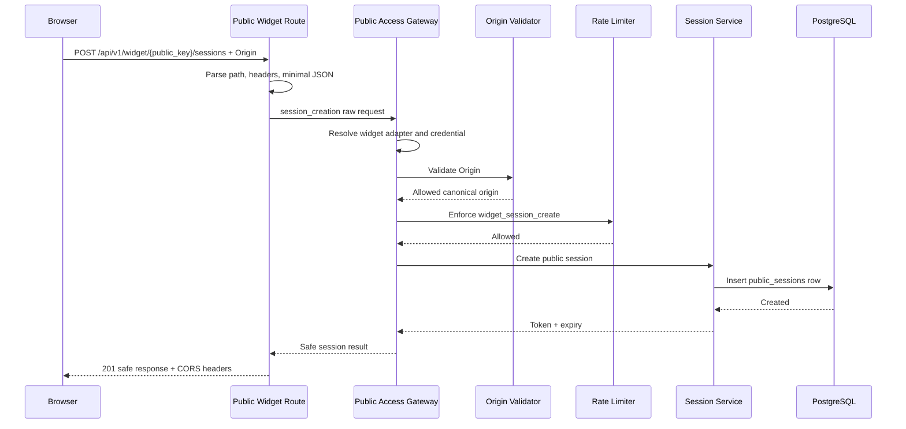
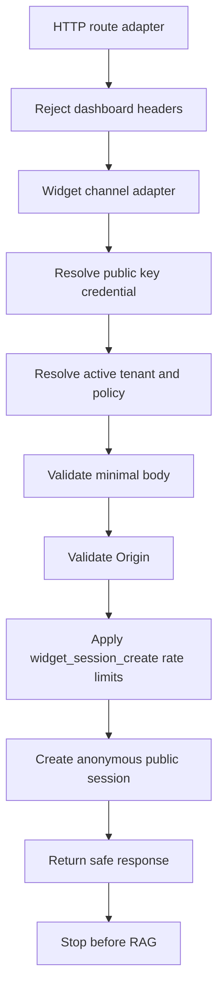
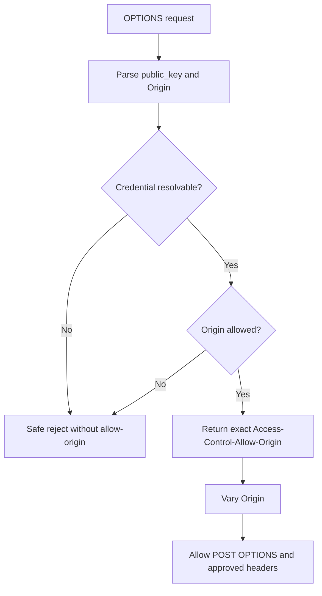
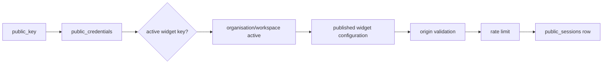
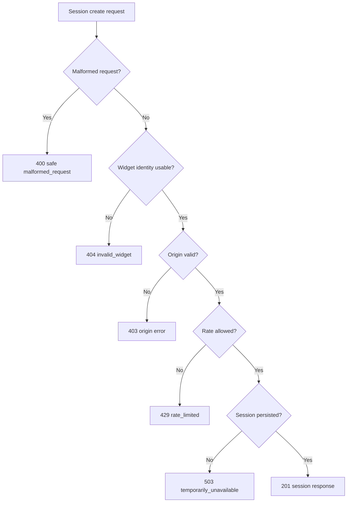
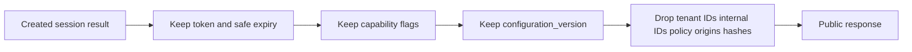
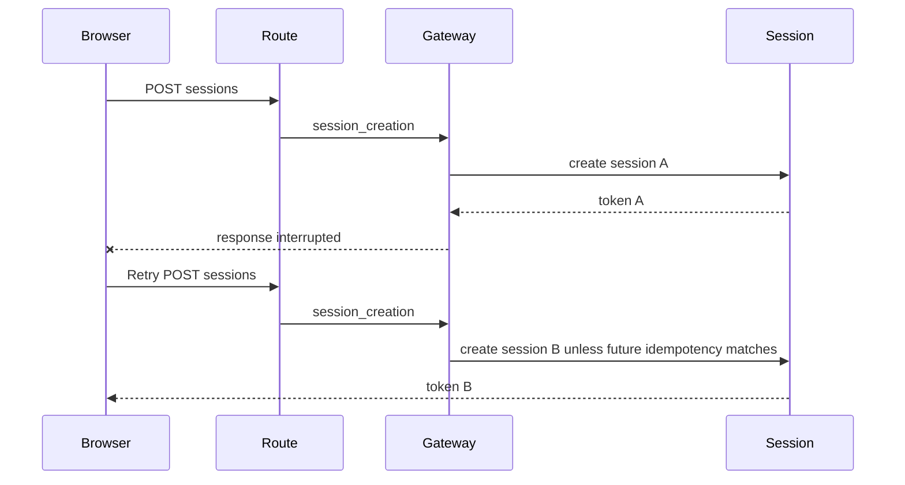

# Public Widget Session Endpoint Architecture

Version: 0.1
Status: Implemented by TASK-061B
Scope: TASK-061B implements only the public widget session creation endpoint. Public config, public message, RAG, conversation creation, widget SDK/UI, and migrations remain out of scope.

## 1. Purpose

This document defines the first public endpoint for the platform:

```text
POST /api/v1/widget/{public_key}/sessions
```

The endpoint creates an anonymous public session for the website widget channel. It resolves a public widget credential, validates the calling origin, applies session-create rate limits, creates a credential-bound public session, and returns safe session metadata.

It must not accept messages, create conversations, call retrieval, call AI Core, expose internal configuration data, or reuse dashboard/internal authentication paths.

## 2. Endpoint Boundary

### Route

```text
POST /api/v1/widget/{public_key}/sessions
```

### Purpose

- Resolve an active `widget_public_key` credential by the `public_key` path parameter.
- Resolve active organisation and workspace through server-owned credential mapping.
- Validate `Origin` against active allowed origins.
- Apply `widget_session_create` rate limits.
- Create an anonymous public session bound to credential, organisation, workspace, channel, environment, policy profile, and canonical origin.
- Return a safe session token and public session capabilities.

### Must Not Do

The endpoint must not:

- Accept `organisation_id`.
- Accept `workspace_id`.
- Accept `conversation_id`.
- Accept or trust dashboard development headers.
- Accept a chat message.
- Accept user PII such as email or phone.
- Accept model, provider, prompt, policy, document, or tenant overrides.
- Accept Origin or client IP in the request body.
- Call retrieval.
- Call AI Core or providers.
- Create chat messages.
- Create an empty conversation.
- Expose internal credential, configuration, policy, origin, model, provider, or tenant data.

## 3. Route Placement

Recommended implementation path:

```text
apps/api/app/api/v1/public_widget.py
```

The router should be included under the normal API v1 prefix so the public route becomes:

```text
/api/v1/widget/{public_key}/sessions
```

Rationale:

- The route is publicly exposed but still belongs to the v1 API surface.
- Naming it `public_widget.py` makes the public boundary visible during code review.
- It remains clearly separate from authenticated dashboard routes such as `public_credentials.py`.
- It remains separate from `/api/v1/ai/*`, RAG orchestration endpoints, and development-only dashboard APIs.

Alternative acceptable layout:

```text
apps/api/app/api/public/widget_sessions.py
```

If chosen, it must still be mounted deliberately under `/api/v1/widget`. The implementation task should avoid mixing public widget route handlers into dashboard routers.

## 4. Request Contract

Prefer an empty JSON object:

```json
{}
```

Optional MVP-compatible fields:

```json
{
  "client_request_id": "optional bounded opaque client value",
  "widget_metadata": {
    "page_kind": "optional bounded scalar"
  },
  "requested_language": "en"
}
```

Rules:

- `client_request_id` is optional, bounded, opaque, and not an idempotency guarantee in MVP.
- `widget_metadata` is optional, scalar-only, bounded by key count, key length, and value length, and must not contain PII.
- `requested_language` is accepted only if supported by widget configuration and policy. It is a preference, not an override.
- The request body should be optional when `Content-Length: 0` is sent, but `Content-Type: application/json` is required when a body exists.

Forbidden fields:

- `message`
- `organisation_id`
- `workspace_id`
- `conversation_id`
- `credential_id`
- `origin`
- `client_ip`
- `email`
- `phone`
- `name`
- model/provider/prompt keys
- policy overrides
- document/chunk identifiers
- dashboard or internal flags

Unknown fields should be rejected or ignored only if explicitly documented. MVP recommendation: reject unknown top-level fields with a safe malformed request error to avoid silent trust expansion.

## 5. Required HTTP Context

Required:

- `Origin` header.
- `Content-Type: application/json` for requests with a body.
- Path parameter `public_key`.
- Direct peer IP or trusted-proxy-derived client IP.

Optional:

- Bounded `User-Agent` for operational diagnostics. It should not be stored in session rows by default.
- Public request ID header, for example `X-Request-ID`, accepted only after length and character validation. Otherwise generate server-side.
- Future `Idempotency-Key`, if TASK-061B explicitly implements idempotency.

Not required:

- Cookies.
- Dashboard bearer token.
- Dashboard session.
- Development auth headers.
- CSRF token.

CSRF rationale:

- The endpoint uses no cookie credentials and returns an explicit bearer token.
- Origin validation still applies because cross-origin browser abuse and token farming remain relevant.
- If cookie-backed public sessions are introduced later, CSRF must be redesigned.

Development/dashboard headers:

- `Authorization` dashboard bearer tokens, dashboard cookies, `X-Development-User-Email`, `X-Development-Role`, and dashboard tenant parameters must be rejected on public widget routes.

## 6. Public Key Resolution

Flow:

```text
public_key path parameter
-> lookup public_credentials.public_identifier
-> credential_type == widget_public_key
-> credential status active
-> credential not expired
-> credential environment matches route/runtime environment policy
-> organisation active
-> workspace active
-> policy profile resolved
-> widget configuration eligibility checked
```

Resolution must never trust tenant IDs from request body, query string, headers, or hostnames.

### Widget Configuration Eligibility

Production recommendation:

- Active credential with a published widget configuration is required.
- Published configuration must not be disabled or archived.
- Configuration must belong to the same organisation, workspace, and credential.
- Configuration version is returned in the session response.

If widget configuration is:

| Configuration State | Production Session Creation |
| --- | --- |
| Missing | Reject with `widget_not_published` |
| Draft only | Reject with `widget_not_published` |
| Unpublished | Reject with `widget_not_published` |
| Disabled | Reject with `disabled_widget` or `widget_not_published` according to safe error policy |
| Published | Allow if all other checks pass |

Development behaviour:

- Development credentials may allow session creation without a published configuration only under an explicit development policy flag.
- Even in development, origin validation and rate limiting remain required unless an isolated test-only policy is used.
- Production must never inherit development exceptions.

## 7. Public Access Gateway Usage

The endpoint must call the existing Public Access Gateway in `session_creation` mode.

Required stages:

1. Parse route/request.
2. Reject dashboard/development auth headers.
3. Resolve widget channel adapter.
4. Resolve credential and tenant.
5. Resolve policy.
6. Validate request size/body.
7. Validate Origin.
8. Apply `widget_session_create` rate limits.
9. Create anonymous public session.
10. Return safe public response.

The route should be a thin HTTP adapter. It may adapt path parameters, headers, peer IP, and JSON body into the gateway's raw request shape, but it must not duplicate tenant, origin, rate-limit, or session logic outside the gateway unless a small HTTP-specific concern cannot reasonably live in the gateway.

## 8. Widget Channel Adapter

TASK-061B should introduce the first real widget channel adapter.

Responsibilities:

- Channel key: `widget`.
- Display name: `Website Widget`.
- Extract public credential from the route path parameter.
- Set credential type to `widget_public_key`.
- Extract `Origin` from HTTP headers.
- Extract direct/trusted-proxy client IP from HTTP context.
- Reject dashboard/development auth headers.
- Validate empty or minimal request body.
- Normalise bounded widget metadata.
- Supply or select the widget policy profile from credential/policy resolution.
- Format session creation response.
- Format safe public errors.

Not responsible yet:

- Message formatting.
- RAG response formatting.
- Citation formatting.
- Conversation creation.
- Widget configuration rendering.

The adapter should not call repositories directly except through existing injected gateway dependencies and registries.

## 9. Session Policy Resolution

Session settings come from server-owned sources only:

1. Credential policy profile.
2. Published widget configuration.
3. Platform safe defaults.

Fields:

- `inactivity_timeout_seconds`.
- `absolute_lifetime_seconds`.
- `max_messages`.
- `conversation_history_enabled`.
- `language`.
- `safe capabilities`.
- `configuration_version`.
- `show_citations`.

Policy rules:

- Clients cannot override session policy values.
- `requested_language` may select from supported configuration languages if present; otherwise use widget configuration language.
- Session lifetime and message caps come from policy, with platform defaults as a fallback.
- `allow_conversation_history` and `show_citations` come from the published widget configuration, subject to policy forcing stricter behaviour.

## 10. Response Contract

Success response shape:

```json
{
  "data": {
    "session_token": "pss_live_<token_id>.<secret>",
    "expires_at": "2026-07-15T00:30:00Z",
    "absolute_expires_at": "2026-07-16T00:00:00Z",
    "inactivity_timeout_seconds": 1800,
    "max_messages": 30,
    "remaining_messages": 30,
    "capabilities": {
      "can_send_messages": true,
      "conversation_history_enabled": true,
      "citations_enabled": true
    },
    "configuration_version": 3,
    "request_id": "req_public_..."
  }
}
```

`trace_id` may be included only if the platform intentionally treats it as public-safe. MVP recommendation: omit `trace_id` from public body and return it only in logs and internal events. A public-safe request ID is enough for support.

Do not return:

- `organisation_id`
- `workspace_id`
- internal session ID
- internal credential ID
- conversation ID
- token hash
- token ID by itself
- allowed origins
- policy profile key
- rate-limit rule details
- model/provider details
- prompt details
- internal environment, unless a future public config contract explicitly exposes a safe environment label
- widget branding details, except configuration version and capability flags

## 11. Safe Errors And HTTP Mapping

Recommended public error shape:

```json
{
  "error": {
    "code": "origin_not_allowed",
    "message": "This widget is not available from this site.",
    "request_id": "req_public_..."
  }
}
```

Safe errors:

| Code | HTTP | Notes |
| --- | ---: | --- |
| `invalid_widget` | 404 | Missing, malformed, revoked, expired, wrong-type, cross-environment, or otherwise unusable public key. Enumeration-resistant default. |
| `disabled_widget` | 404 or 403 | Prefer 404 for disabled/revoked credentials if enumeration resistance matters; 403 only when the identity is already safely established. |
| `expired_widget` | 404 | Prefer folded into `invalid_widget`. |
| `widget_not_published` | 404 | Avoid revealing whether a credential exists but lacks config. |
| `origin_required` | 403 | Missing Origin for widget session creation. |
| `origin_not_allowed` | 403 | Origin denied; never include configured origins. |
| `malformed_request` | 400 | Invalid JSON, invalid content type, invalid field shape. |
| `rate_limited` | 429 | Include safe `Retry-After` when known. |
| `temporarily_unavailable` | 503 | Redis/origin/session dependency unavailable and fail-closed. |
| `safe_internal_error` | 500 | Unexpected failure with no internals. |

Enumeration policy:

- Invalid, revoked, expired, wrong-type, deleted, wrong-environment, and unpublished public keys should generally map to the same safe not-found style response.
- Origin denial can be `403` because the request has already supplied a key and Origin, but the response must not reveal configured allowed origins or tenant data.
- Rate limits return `429` and may include `Retry-After`.

## 12. CORS Architecture

CORS is required for browser widget use. TASK-061B implements route-scoped dynamic CORS for the session endpoint only.

Requirements:

- Support `OPTIONS` preflight for the sessions endpoint.
- Allow only validated configured Origin.
- Dynamically set `Access-Control-Allow-Origin` to the exact validated Origin.
- Set `Vary: Origin`.
- Allow methods: `POST`, `OPTIONS`.
- Allow headers: `Content-Type`, `X-Request-ID`, and future explicitly approved public session/idempotency headers.
- Do not allow browser credentials.
- Do not use wildcard Origin.
- Reject preflight safely without configured-origin leakage.
- CORS output must consume the same origin-validation decision path as POST where practical.

Preflight decision:

- `OPTIONS /api/v1/widget/{public_key}/sessions` should perform public key lookup and Origin validation.
- It should not create a session.
- It should not consume normal `widget_session_create` credential/workspace limits.
- A future low-cost global/IP preflight limiter may be added to absorb floods.
- If credential or origin repositories are unavailable, preflight fails closed with no CORS allow headers.

POST decision:

- POST validates Origin through the gateway before rate limiting and session creation.
- The route adapter should use the origin-validation result to set CORS headers on success and safe denial responses when appropriate.

## 13. Rate-Limit Category

Use:

```text
widget_session_create
```

Applicable dimensions:

- global
- channel
- credential
- workspace
- organisation
- IP

No session dimension exists before creation.

Failure and consumption policy:

- Invalid or unresolvable credentials cannot consume normal credential/workspace limits because no tenant context exists.
- Invalid Origin should not consume normal credential/workspace limits because origin validation happens before rate limiting.
- Both invalid credentials and invalid origins should be coverable by a future low-cost global/IP pre-filter.
- If rate limiting passes but session creation fails, MVP does not refund rate-limit tokens.
- Redis uncertainty fails closed for this endpoint.

## 14. Session Creation Consistency And Idempotency

Failure scenarios:

- Rate limit passes but DB insert fails: return `temporarily_unavailable`; do not refund rate limit in MVP.
- Token generated but DB insert fails: discard token; it was never valid because no row was persisted.
- DB insert succeeds but response delivery fails: client may retry and create another session.
- Browser retries after timeout: request may create another session unless idempotency is implemented.

MVP decision:

- Do not implement idempotency in the first public session endpoint unless TASK-061B explicitly scopes it.
- Protect duplicate session creation with `widget_session_create` rate limits and short lifetimes.
- Allow optional bounded `client_request_id` for telemetry and duplicate/retry estimation only, not as an idempotency key.

Future idempotency:

- Add `Idempotency-Key` or a bounded `client_request_id` with server-side dedupe per credential/origin/IP/time window.
- Never trust idempotency keys as tenant context.
- Store only safe keyed hashes of idempotency values.

## 15. Widget Configuration Dependency

Published widget configuration contributes only session-safe fields:

- `configuration_version`.
- `allow_conversation_history`.
- `show_citations`.
- `language`.

Branding details, welcome text, suggested questions, privacy links, launcher labels, colours, and asset references should come from a separate future public config endpoint. Session creation should not become a public config endpoint by accident.

## 16. Privacy

Rules:

- Collect no PII.
- Accept no message content.
- Do not store raw User-Agent or Referer in session rows by default.
- Use client IP for rate limiting, but do not return it.
- Store only bounded safe widget metadata if needed.
- Return the session token once.
- Use no cookies.
- Avoid putting tokens in URLs.
- Browser storage guidance belongs to the future widget SDK; preferred future guidance remains iframe `sessionStorage`, with stricter in-memory mode where needed.

## 17. Observability

Operational events:

- `widget.session.requested`
- `widget.session.created`
- `widget.session.rejected`
- `widget.session.rate_limited`
- `widget.session.origin_denied`
- `widget.session.unavailable`

Safe metadata:

- request ID
- channel
- credential ID for internal operational context
- workspace ID for internal operational context
- outcome
- reason code
- latency
- environment

Never include:

- raw public key
- raw Origin
- session token
- token secret
- token hash
- configured origin list
- user PII

Metrics:

- Session creation success rate.
- Origin denial rate.
- Rate-limit rate.
- DB failure rate.
- Latency by stage.
- Sessions by workspace.
- Duplicate/retry estimate.

Telemetry failure should not block otherwise valid session creation.

## 18. Threat Model

| Threat | Likelihood | Impact | Controls | Residual risk | Monitoring |
| --- | --- | --- | --- | --- | --- |
| Public-key enumeration | Medium | Medium | High-entropy keys, generic 404, no tenant data, future IP pre-filter | Botnets can still spray guesses | Invalid widget rate by IP/prefix |
| Stolen public key | High | Medium | Key is not secret, Origin validation, rate limits, revocation | Server-to-server spoofing can still try requests | Unusual key/IP/origin volume |
| Malicious website embedding | Medium | Medium | Strict Origin match, no wildcard CORS, iframe future | Approved origins can still host hostile pages | Origin denial and abuse metrics |
| Origin spoofing outside browsers | High | Medium | Treat Origin as browser control only, rate limits, credential lifecycle | Non-browser callers can spoof Origin | IP/key anomaly metrics |
| Bot session farming | High | High | `widget_session_create` limits by global/channel/key/workspace/org/IP | Distributed IP rotation remains hard | Session creation velocity |
| IP rotation | High | Medium | Credential/workspace/org/global limits | Large botnets can spread load | Unique IP per credential |
| Session-token interception | Medium | High | HTTPS, no URL tokens, short lifetime, origin binding, no cookies | Same-origin XSS can steal token | Token misuse and origin mismatch |
| Replayed session-creation requests | Medium | Medium | Rate limits, future idempotency option | Duplicate sessions possible in MVP | Duplicate client_request_id estimates |
| CORS misconfiguration | Medium | High | Dynamic validated Origin only, no wildcard, no credentials, tests | Route-specific header bugs | CORS failure/security tests |
| Path-parameter injection | Low | Medium | Strict public key pattern/length, no path traversal semantics | Parser bugs | Malformed key rejection counts |
| Oversized body | Medium | Medium | Small request-size limit, JSON validation | Edge buffering pressure | 400/413 metrics |
| Metadata abuse | Medium | Medium | Scalar-only bounded metadata, reject unknown fields | Creative low-volume abuse | Metadata validation failures |
| DB exhaustion | Medium | High | Rate limits, session lifetime, future cleanup/retention | Legitimate spikes can create rows | DB latency/session insert failures |
| Token-generation failure | Low | High | Cryptographic standard library, fail closed | OS entropy failure is severe | Session unavailable events |
| Redis outage | Medium | Medium | Fail closed for session creation | Widget cannot start sessions | Redis unavailable metrics |
| Credential revoked during request | Medium | Medium | Recheck credential in gateway/session service, fail closed | Race around in-flight success | Revoked-used events |
| Widget unpublished during request | Medium | Medium | Config eligibility check in route/gateway dependency | Race after check may allow one session | Config version mismatch metrics |

## 19. Failure-Mode Matrix

| Failure | Behaviour |
| --- | --- |
| Credential DB unavailable | Fail closed with `temporarily_unavailable`; no CORS allow unless Origin was safely validated from fresh data. |
| Origin repository unavailable | Fail closed with `temporarily_unavailable`; do not create session. |
| Redis unavailable | Fail closed with `temporarily_unavailable`; session creation is security-sensitive. |
| Session DB insert failure | Return `temporarily_unavailable`; token is invalid unless persisted. |
| Event sink failure | Do not block successful session creation; emit local diagnostic if available. |
| Token generator failure | Fail closed with `temporarily_unavailable` or `safe_internal_error`; no partial token returned. |
| Widget configuration missing | Reject with safe `widget_not_published` folded to not-found policy. |
| Widget configuration changed during request | Use the configuration version resolved before session creation; future requests see new version. |
| Organisation/workspace disabled during request | Fail closed if detected before persistence; future validations reject existing sessions. |
| Response interrupted after creation | Session remains valid; client retry may create another session in MVP. |

Security controls fail closed. Telemetry failure may be non-blocking.

## 20. API / OpenAPI Exposure

MVP choice: include the route in the standard FastAPI OpenAPI document with a clear `public-widget` tag once implemented.

Rationale:

- This is a real supported public API surface, not an internal hidden endpoint.
- OpenAPI visibility helps client SDK and widget development.
- Clear tags and descriptions can document that no dashboard auth, cookies, tenant IDs, or messages are accepted.

Implementation notes:

- The route documentation must state that it creates sessions only and does not call RAG.
- If public API documentation grows, a separate public OpenAPI document can be generated later.
- Do not expose internal gateway contracts as public schemas.

## 21. Future Implementation Tests

Routing and security:

- Session endpoint exists only under `/api/v1/widget/{public_key}/sessions`.
- Dashboard auth headers rejected.
- No tenant IDs accepted.
- Wrong credential type rejected.
- Invalid, revoked, expired, deleted, or wrong-environment keys use safe response.
- Unpublished widget rejected.

Origin:

- Allowed Origin succeeds.
- Missing Origin rejected.
- Disallowed Origin rejected.
- No configured-origin leakage.
- Preflight policy and headers.

Rate limiting:

- `widget_session_create` category used.
- Credential, workspace, organisation, global, and IP limits applied.
- `429` and `Retry-After`.
- Redis outage fails closed.

Session:

- Token returned once.
- No raw token logged.
- Session correctly bound to credential, tenant, channel, environment, policy, and origin.
- No conversation created.
- No RAG call.
- Safe capabilities returned.

Privacy:

- Internal fields excluded.
- PII rejected.
- Safe events.

Reliability:

- DB failure.
- Duplicate retry behaviour.
- Telemetry failure.
- Credential disabled mid-request.

Existing tests:

- Public Access, origin-validation, rate-limit, session-service, dashboard API, and RAG tests must remain passing.

## 22. Diagrams

### HTTP Session-Creation Sequence



### Gateway Session-Creation Flow



### CORS And Preflight Flow



### Credential Config Session Dependency Flow



### Failure Decision Tree



### Public Response Sanitisation



### Duplicate Retry Scenario



## 23. Implementation Breakdown For TASK-061B

TASK-061B should implement:

- `widget` channel adapter.
- Public request/response schemas.
- Thin public widget session route.
- Dynamic CORS helper specific to validated Origin.
- Gateway `session_creation` wiring.
- Widget configuration eligibility check.
- Safe error mapper.
- Tests.
- Documentation updates.

TASK-061B must not implement:

- Public message endpoint.
- Public config endpoint.
- RAG.
- Conversation creation.
- Widget SDK/UI.
- New migration.
- Redis changes beyond using existing limiter.

## 24. Acceptance Criteria

TASK-061A is complete when:

- Endpoint boundary is explicit.
- Request is minimal.
- Tenant, conversation, and message input are forbidden.
- Public Access Gateway usage is mandatory.
- CORS policy is defined.
- Safe response and error contracts are complete.
- Credential/config/session dependencies are defined.
- Threat and failure models are complete.
- ADR-0011 records the route design.
- No code/public route is added.


## 25. TASK-061B Implementation Status

TASK-061B implements this architecture as the only public widget endpoint currently exposed:

```text
POST /api/v1/widget/{public_key}/sessions
OPTIONS /api/v1/widget/{public_key}/sessions
```

Implementation files:

- `apps/api/app/api/v1/public_widget.py`
- `apps/api/app/access/channels/widget.py`
- `apps/api/app/schemas/public_widget.py`
- `apps/api/tests/test_public_widget_session_endpoint.py`
- `docs/04_Engineering/Public_Widget_Session_Endpoint.md`

The implementation keeps the public route separate from dashboard APIs, uses the Public Access Gateway in `session_creation` mode, performs route-scoped dynamic CORS, requires published widget configuration, uses `widget_session_create` rate limits, and returns only the approved session capability response. No public message/config route, RAG call, conversation creation, widget SDK/UI, cookie-backed session, global wildcard CORS, hard idempotency store, or migration is added.