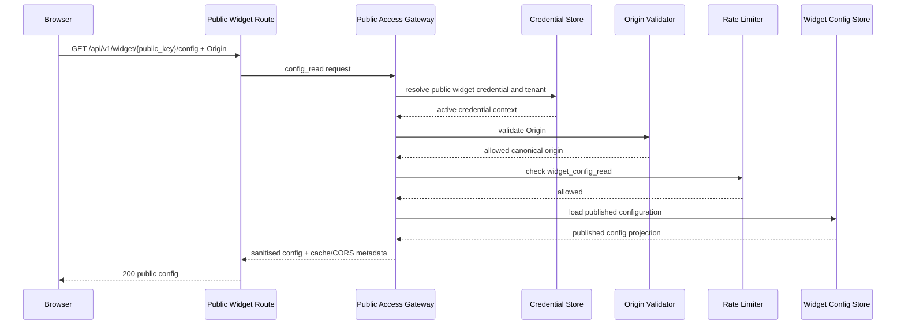
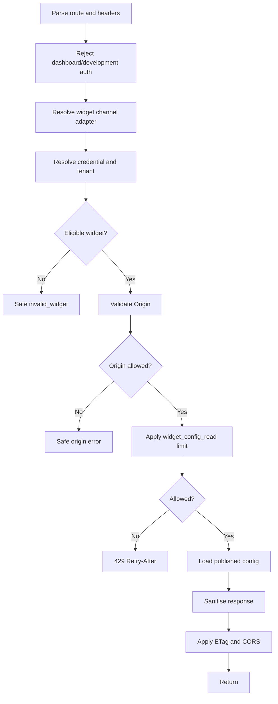
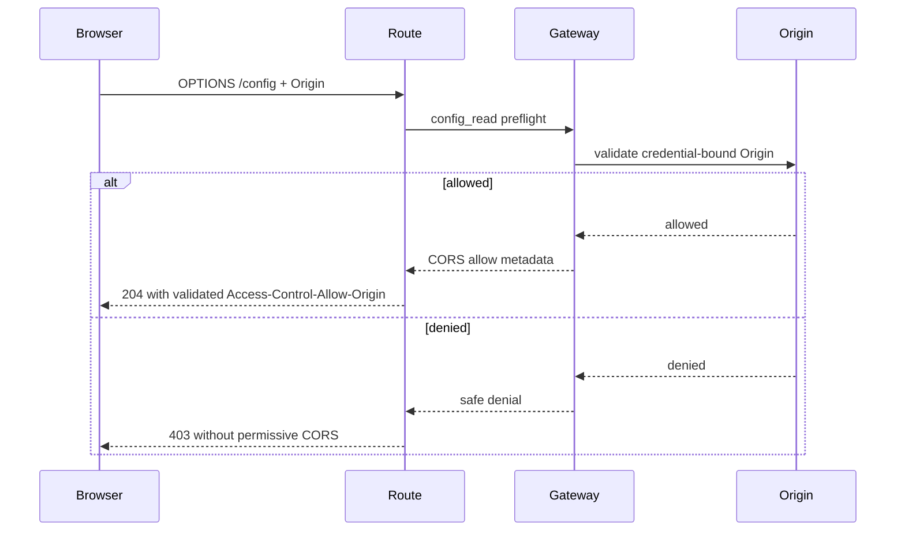
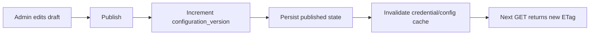
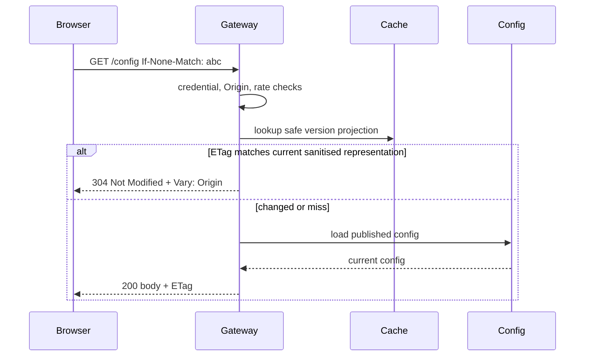
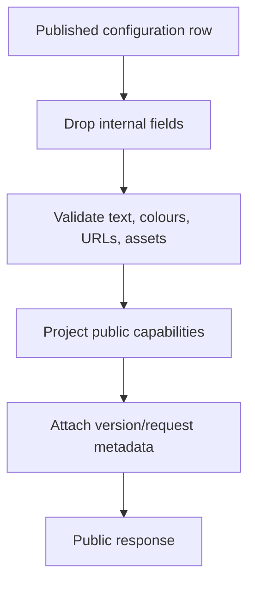
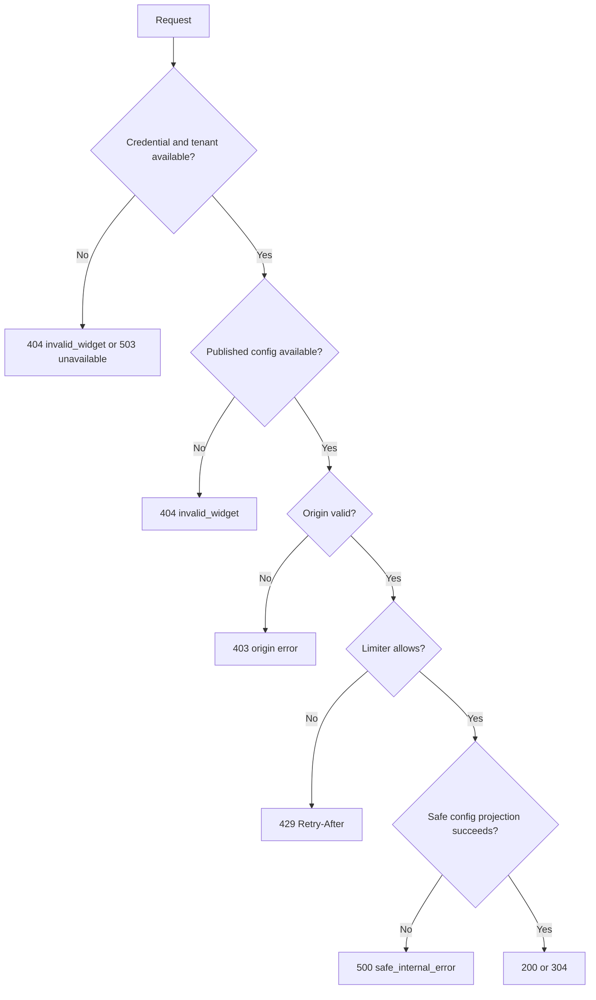
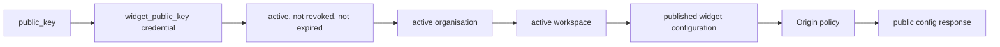

# Public Widget Configuration Endpoint Architecture

Status: Implemented in TASK-062B
Scope: Architecture and planning only. This document does not implement routes, schemas, CORS code, caching, widget SDK/UI, sessions, messages, RAG, or migrations.

## 1. Purpose

The platform will expose a dedicated public read-only widget configuration endpoint:

```text
GET /api/v1/widget/{public_key}/config
OPTIONS /api/v1/widget/{public_key}/config
```

The endpoint returns only published, sanitised, public-safe widget configuration for browser-hosted widgets. It is separate from anonymous session creation so the widget can preload branding and behaviour without creating server-side session state.

The endpoint must not create a session, return a session token, create a conversation, accept a message, invoke retrieval, invoke RAG, call AI Core, expose tenant identity, expose allowed origins, or expose provider/model/prompt/policy internals.

## 2. Endpoint Boundary

Purpose:

- Resolve an active widget public key.
- Resolve active organisation and workspace server-side.
- Validate the browser `Origin`.
- Apply `widget_config_read` rate limits.
- Load the published widget configuration.
- Return sanitised branding, behaviour, privacy, capability, and version data.
- Support safe cache and version behaviour.

Forbidden inputs and effects:

- No request body is required or processed for business state.
- No `organisation_id`, `workspace_id`, `credential_id`, tenant slug, or internal ID is accepted.
- No session token, conversation ID, message, model/provider/prompt key, policy override, branding override, or language override is accepted in MVP.
- Dashboard bearer tokens and development-user headers are rejected or ignored safely, never treated as authentication.
- No conversation, session, chat message, retrieval, RAG, AI Core, or production analytics side effect occurs.

## 3. Request Contract

Path parameter:

- `public_key`: opaque public widget credential identifier.

HTTP context extracted server-side:

- `Origin`, required by default.
- HTTP method.
- Request ID, generated or accepted only after safe validation.
- Trusted client IP for rate limiting, using the existing trusted-proxy policy.
- Optional bounded `User-Agent` for operational telemetry only.

MVP query policy:

- No functional query parameters.
- Cache validation uses `If-None-Match` rather than query parameters.
- Unknown query parameters should be ignored only if they cannot influence policy, or rejected consistently if the framework contract prefers strict validation.

The route must not accept tenant IDs, credential IDs, session tokens, messages, language overrides, branding overrides, policy overrides, model/provider selection, development auth headers, or dashboard `Authorization` as public request inputs.

## 4. Credential And Configuration Eligibility

Resolution flow:

```text
public_key
  -> public credential lookup by public identifier
  -> credential type must be widget_public_key
  -> credential status, environment, expiry, disabled, revoked, and deleted checks
  -> active organisation
  -> active workspace belonging to organisation
  -> valid policy profile
  -> published active widget configuration
```

Production/staging policy:

- Missing, draft, disabled, unpublished, or inaccessible configuration is not public.
- Published configuration must have a valid published state and safe version.
- Draft changes never appear publicly.

Development policy:

- Development localhost origins are allowed only for development credentials and matching development policy.
- Development credentials do not silently expose draft or missing configuration unless a future architecture task explicitly changes that rule.

Enumeration-resistant policy:

- Invalid, missing, wrong-type, revoked, expired, disabled, deleted, inaccessible, draft, unpublished, and missing-configuration widgets should generally return the same safe `invalid_widget` 404-style response in production.
- Internal operational events may record restricted reason codes without exposing them to the caller.

## 5. Origin Validation Policy

Origin is required by default for production and staging config reads. The endpoint uses the existing origin validator for exact and approved wildcard matching.

Policy decisions:

- No `Referer` fallback in MVP.
- Do not infer origin from `Host`.
- Do not trust origin fields from a request body or query parameter.
- Production public configuration requires HTTPS origins except for explicitly allowed development credentials.
- Missing, malformed, or disallowed Origin fails closed.
- Configured allowed origins are never returned.

Trade-offs:

- Requiring Origin strengthens embed control and reduces drive-by scraping from browsers.
- It limits direct curl/search-engine/preload access unless callers supply a valid Origin.
- CDN and browser caches must include `Vary: Origin` because the CORS decision varies by request Origin.

## 6. Public Access Gateway Usage

The route must use the Public Access Gateway with an explicit `config_read` operation mode.

Required stages:

1. Parse route, method, headers, and safe request metadata.
2. Reject dashboard authentication and development-user headers.
3. Resolve the `widget` channel adapter.
4. Resolve credential and tenant context server-side.
5. Validate request size and method.
6. Validate Origin.
7. Apply `widget_config_read` rate limits.
8. Load the published widget configuration.
9. Sanitise the public response.
10. Apply safe cache and CORS headers.
11. Return.

The gateway must stop before session creation, session validation, RAG, conversation persistence, chat-message persistence, provider calls, and AI Core calls. Route handlers should not duplicate tenant, credential, origin, rate-limit, or safe-error logic outside HTTP adaptation.

## 7. Response Contract

The response is versioned JSON. Suggested MVP shape:

```json
{
  "widget": {
    "bot_name": "Admissions Assistant",
    "welcome_message": "Ask us about courses, fees, and applications.",
    "launcher_label": "Chat",
    "primary_colour": "#0F766E",
    "secondary_colour": "#111827",
    "logo_url": "https://assets.example.com/widgets/logo.png",
    "avatar_url": "https://assets.example.com/widgets/avatar.png",
    "position": "bottom_right",
    "theme_mode": "system",
    "language": "en"
  },
  "behaviour": {
    "suggested_questions": ["How do I apply?"],
    "max_initial_suggestions": 4,
    "show_citations": true,
    "allow_conversation_history": false,
    "session_required": true,
    "messages_enabled": true
  },
  "privacy": {
    "privacy_notice_text": "Your chat may be reviewed to improve support.",
    "privacy_notice_url": "https://example.com/privacy",
    "terms_url": "https://example.com/terms",
    "fallback_contact_text": "Contact support if chat is unavailable."
  },
  "versioning": {
    "configuration_version": 12,
    "published_at": "2026-07-15T00:00:00Z",
    "response_schema_version": "widget_config.v1"
  },
  "capabilities": {
    "can_create_session": true,
    "can_send_messages": true,
    "citations_enabled": true,
    "conversation_history_enabled": false
  },
  "request": {
    "request_id": "req_..."
  }
}
```

The response must not include organisation ID, workspace ID, internal credential ID, internal config ID, allowed origins, policy profile, rate limits, max context/retrieval/token rules, provider/model/prompt information, internal asset paths, audit metadata, created_by fields, secret/hash fields, or internal environment unless a future task explicitly approves a safe public value.

## 8. Asset Delivery Model

Options considered:

- Direct public storage URLs: simple, but risks exposing storage layout and inconsistent revocation.
- Signed temporary URLs: revocable, but more complex for public cache and image loading.
- Platform asset proxy or platform-controlled public asset URLs: centralises validation, MIME policy, cache headers, and path hiding.
- Data URLs: easy for tiny images, but bloats responses and complicates content validation.

MVP choice:

Use platform-controlled public asset URLs or proxy URLs for published widget logo/avatar assets. Only raster formats are public until SVG sanitisation exists.

Requirements:

- No local or internal filesystem paths.
- HTTPS production URLs.
- MIME allow-list such as PNG, JPEG, WebP, and AVIF.
- Size and dimension restrictions.
- No SVG unless sanitised and explicitly approved by a later task.
- Safe cache headers.
- Deleted or missing assets are omitted or replaced with a platform fallback asset.
- Asset upload, processing, and proxy implementation remain outside TASK-062A.

## 9. Configuration Versioning And Publishing

The endpoint serves only published state.

Rules:

- Draft changes never appear publicly.
- Publish increments `configuration_version`.
- Response includes `configuration_version` and a safe `published_at` if available.
- Clients use version and ETag to detect changes.
- Rollback is a future publishing capability.
- Public responses must not be partially updated.

Existing-model note:

If the current widget configuration table stores draft and published state in one row, draft edits may make the public-serving semantics harder to guarantee without a separate published snapshot. TASK-062B should not silently expose draft data. If the model cannot guarantee simultaneous draft editing and stable public reads, the implementation should document the limitation and serve only rows that are explicitly published, with future snapshot tables considered separately.

## 10. Caching Strategy

Browser/CDN caching:

- Emit an ETag derived from a safe representation of credential public identity, configuration version, response schema version, and sanitised response content.
- ETag must not expose tenant, workspace, credential database, or policy details.
- Support `If-None-Match` and return `304 Not Modified` after credential, origin, and rate-limit decisions pass.
- Emit `Cache-Control` with a short public max age, such as 60 seconds, plus optional stale revalidation only if revocation uncertainty is handled safely.
- Emit `Vary: Origin` because CORS output varies by Origin.
- Do not cache unsafe errors for long periods; prefer `no-store` or very short negative caching.

Server-side caching:

- Future cache may store a credential/config projection by public key and configuration version with a short TTL.
- Invalidate immediately after config publish, credential disable/revoke/delete, or origin changes.
- Fail closed if credential or revocation state is uncertain.
- No cache implementation is part of TASK-062A.

CDN risk:

The response body may be shared for a credential, but the CORS decision varies by Origin. CDN and browser caches must respect `Vary: Origin` to avoid serving permissive CORS headers to the wrong site.

## 11. Rate-Limit Policy

Use category:

```text
widget_config_read
```

Dimensions:

- Global.
- Channel.
- Credential.
- Workspace.
- Organisation.
- IP.

Failure policy:

- Config read may use the constrained local read-only fallback approved by the rate-limit architecture.
- Degraded limiter decisions must be observable.
- There is no unlimited fail-open mode.
- `429` responses include safe `Retry-After` where available.
- Responses must not expose Redis details, limits, policies, or internal keys.

## 12. CORS Behaviour

CORS is route-specific and dynamic.

Requirements:

- Validate public key and Origin before allowing CORS on both GET and OPTIONS.
- Echo only the validated canonical request Origin in `Access-Control-Allow-Origin`.
- Emit `Vary: Origin`.
- Allow methods `GET` and `OPTIONS` only.
- Set `Access-Control-Allow-Credentials: false`.
- Use no wildcard Origin.
- Limit request headers to safe headers such as `If-None-Match` and `X-Request-ID` if accepted.
- Rejected Origin receives no permissive CORS headers.
- Preflight failures use safe public errors without configured-origin leakage.

## 13. Safe Errors

Public error codes:

- `invalid_widget`
- `origin_required`
- `origin_not_allowed`
- `malformed_origin`
- `rate_limited`
- `temporarily_unavailable`
- `safe_internal_error`

Suggested HTTP mapping:

- Invalid or unavailable widget identity/configuration: `404`.
- Origin denial: `403`.
- Malformed Origin: `400`.
- Rate limited: `429` with `Retry-After` where available.
- Dependency unavailable: `503`.
- Unexpected internal error: safe `500`.

Do not expose configured origin lists, tenant IDs, internal IDs, database/Redis details, asset internal paths, policy rules, or whether credential, tenant, origin, or configuration was the failing element.

## 14. Expressionism And Branding Safety

Public configuration enables controlled Expressionism while the platform keeps design and security boundaries.

Clients may configure:

- Bot name.
- Welcome text.
- Launcher label.
- Brand colours.
- Logo/avatar.
- Suggested questions.
- Widget position.
- Light/dark/system theme.
- Privacy and terms links.

Clients may not configure:

- Arbitrary CSS.
- JavaScript.
- Raw HTML.
- Custom fonts loaded from arbitrary URLs.
- Unsafe SVG.
- Hidden accessibility labels.
- Security-error wording.
- Citation-policy bypass.
- Session, rate, token, or retrieval limits.
- Model, provider, prompt, or policy choices.

Sanitisation expectations:

- Text is plain text with length bounds and control-character removal.
- URLs are HTTPS in production and pass an allow-list of schemes and host rules.
- Colours use validated hex or approved token values.
- Colour contrast should meet accessible defaults or be corrected/fallbacked by the widget client.
- Suggested questions are bounded in count and length and cannot contain script/HTML payloads.

## 15. Privacy

The endpoint collects no message content and no public PII by contract. Client IP is used for rate limiting and not returned. User-Agent should not be persisted unless operationally necessary. Privacy and terms URLs in the response are client-provided public links after validation. The endpoint uses no cookies and returns no session token.

## 16. Observability

Events:

- `widget.config.requested`
- `widget.config.served`
- `widget.config.not_modified`
- `widget.config.rejected`
- `widget.config.origin_denied`
- `widget.config.rate_limited`
- `widget.config.unavailable`
- `widget.config.cache_hit`
- `widget.config.cache_miss`

Safe metadata:

- Request ID.
- Channel.
- Restricted internal credential/workspace IDs where policy permits.
- Configuration version.
- Outcome.
- Reason code.
- Latency.
- Degraded rate-limit flag.

Never log raw public key, raw Origin, full response body, private URLs, internal paths, token material, tenant-identifying public response fields, or message content.

Metrics:

- Config request count.
- Success, denial, and rate-limit rates.
- Cache-hit and 304 rates.
- Latency.
- Invalid widget probes.
- Dependency failures.

## 17. Threat Model

| Threat | Likelihood | Impact | Controls | Residual Risk | Monitoring |
| --- | --- | --- | --- | --- | --- |
| Public-key enumeration | Medium | Medium | Opaque public keys, enumeration-resistant 404, rate limits | Probe traffic still possible | Invalid widget probe rate |
| Malicious website embedding | Medium | High | Required Origin validation, dynamic CORS, no wildcard | Non-browser clients can spoof Origin | Origin denial rate, unusual IPs |
| Config scraping | Medium | Low/Medium | Public-safe response only, rate limits, no internal fields | Published branding is intentionally public to allowed origins | Request volume by credential/IP |
| Origin spoofing outside browsers | Medium | Medium | Origin treated as browser control only, no authentication claim | Server-to-server spoofing remains possible | IP anomaly and high-rate detection |
| Cache poisoning | Low/Medium | High | ETag from server representation, no query override, sanitised response | CDN misconfiguration possible | Cache anomaly metrics |
| CORS cache confusion | Medium | High | `Vary: Origin`, no wildcard, validate per Origin | Misconfigured proxies may ignore Vary | CORS header audits |
| Stale config after revoke | Medium | High | Short TTL, invalidation on revoke, fail closed on uncertainty | Short cache window remains | Revoke-to-denial latency |
| Leaked internal asset path | Low | Medium | Asset URL projector/proxy, no internal paths | Legacy data may contain bad paths | Sanitiser rejection events |
| XSS through text fields | Medium | High | Plain-text fields, HTML/script stripping, widget client escapes | Client rendering bugs | Sanitiser metrics, security tests |
| Unsafe links | Medium | Medium | URL validation, HTTPS production requirement | Destination content can change | Link validation failures |
| Malicious SVG/image | Medium | High | Raster-only MVP, MIME/size validation, no unsanitised SVG | Image decoder risks | Asset rejection metrics |
| Oversized config | Low/Medium | Medium | Field/count/body bounds, response size cap | Large published configs need cleanup | Response-size metrics |
| Suggested-question injection | Medium | Medium | Plain text, length/count bounds, no HTML | Client display bugs | Sanitiser/test coverage |
| ETag information leakage | Low | Medium | Non-tenant hash, no raw IDs or version internals | Timing can reveal existence after valid Origin | 304/404 ratio |
| CDN serving wrong tenant config | Low | High | Cache key includes route/public key and `Vary: Origin` | CDN config errors | Synthetic cache tests |
| Wildcard-origin mistakes | Medium | High | Existing wildcard policy, canonical matching, tests | Admin misconfiguration | Origin policy audit events |
| Redis failure exploitation | Medium | Medium | Constrained fallback only, degraded observability, no unlimited fail-open | Lower precision during outage | Degraded limiter alerts |
| Database outage | Low/Medium | High | Fail closed with `temporarily_unavailable` | Legitimate widgets unavailable | Dependency health alerts |
| Publication race | Medium | Medium | Published state/version checks, future snapshot model | One-row model may limit zero-downtime draft editing | Version mismatch metrics |

## 18. Failure Matrix

| Failure | Public Behaviour | Security Posture | Observability |
| --- | --- | --- | --- |
| Credential DB unavailable | `temporarily_unavailable` 503 | Fail closed | `widget.config.unavailable` |
| Config missing | Safe `invalid_widget` 404 | Fail closed | Restricted reason `config_missing` |
| Config unpublished/draft | Safe `invalid_widget` 404 | Fail closed | Restricted reason `config_unpublished` |
| Origin repository unavailable | `temporarily_unavailable` 503 | Fail closed | Origin dependency failure metric |
| Rate-limit Redis unavailable | Use approved constrained fallback or 503 if unavailable | No unlimited fail-open | Degraded limiter flag |
| Local degraded limiter unavailable | `temporarily_unavailable` 503 | Fail closed | Limiter unavailable event |
| Asset missing | Omit URL or return fallback asset | Continue if rest of config is safe | Asset projection warning |
| Cache stale | Serve only within short TTL and after active credential checks where possible | Prefer fail closed on revoke uncertainty | Cache age metrics |
| Cache invalidation failure | Short TTL limits exposure; revoke uncertainty fails closed | Conservative | Invalidation failure alert |
| ETag mismatch | Return 200 with current representation | Safe | ETag mismatch metric |
| Event sink failure | Serve safe config if core controls passed | Telemetry non-blocking | Local error log/metric |
| Organisation/workspace disabled during request | Final active checks fail with safe unavailable/invalid response | Fail closed | Restricted reason code |

## 19. API Documentation And OpenAPI

MVP should include the endpoint in the standard OpenAPI document under a clear `public-widget` tag. It must be labelled public and read-only. Examples must use fake public keys and generic client branding. Documentation must clearly state that the route does not create sessions, conversations, messages, or RAG calls.

## 20. Future Implementation Tests

Success:

- Active credential, published configuration, allowed Origin, safe config response.
- No session created.
- No conversation created.
- No RAG or AI call.

Credential/config:

- Invalid key, wrong type, draft, disabled, revoked, expired, inactive tenant/workspace, missing config, unpublished config.
- Enumeration-resistant response.

Origin/CORS:

- Exact and wildcard allowed origins.
- Missing, disallowed, malformed, and production HTTP origins rejected.
- Allowed preflight, `Vary: Origin`, no wildcard, credentials disabled.

Caching:

- ETag emitted.
- `304 Not Modified` works.
- Version changes ETag.
- Origin included in cache variation.
- Revoke/publish invalidation semantics.
- Safe negative caching.

Rate limiting:

- `widget_config_read` category.
- Local degraded fallback.
- `429` and `Retry-After`.
- No unlimited fail-open.

Privacy and validation:

- Internal fields absent.
- Safe asset URLs only.
- No raw public key or raw Origin in events.
- No session/conversation created.
- HTML/script rejected.
- Unsafe URLs absent.
- Excessive suggestions bounded.
- Safe colour fields.

## 21. Diagrams

### Public Config GET Sequence



### Gateway Config-Read Flow



### CORS And Preflight



### Publish To Cache Invalidation



### ETag And 304 Flow



### Response Sanitisation



### Failure Decision Tree



### Credential And Config Eligibility



## 22. TASK-062B Implementation Breakdown

TASK-062B should implement:

- Public config schemas.
- Widget adapter config-read support.
- Thin `GET` and `OPTIONS /api/v1/widget/{public_key}/config` route.
- Public Access Gateway `config_read` mode.
- Published configuration resolver.
- Response sanitiser.
- Asset URL projector.
- ETag helper.
- Dynamic CORS integration.
- Safe error mapper.
- Tests and docs.

It must not combine public session creation, public message handling, RAG, conversation creation, widget SDK, or asset-upload work.

## 23. Acceptance Criteria

TASK-062A is complete when:

- Endpoint scope is read-only.
- Gateway usage is mandatory.
- Origin/CORS policy is defined.
- Public response schema and exclusions are complete.
- Published-config rules are explicit.
- Caching/ETag strategy is defined.
- Branding safety boundaries are explicit.
- Rate-limit policy is defined.
- Threat and failure models are complete.
- ADR-0012 records the decision.
- No code or route is added.
## 24. TASK-062B Implementation Result

TASK-062B implemented the read-only public configuration endpoint using the Public Access Gateway `config_read` mode. The implementation includes route-scoped GET/OPTIONS handlers, safe public schemas, sanitised projection, asset URL omission/projection, dynamic validated-Origin CORS, `widget_config_read` rate limiting, ETag/conditional GET support, conservative cache headers, safe public error mapping, and tests.

No public message endpoint, session validation endpoint, RAG invocation, conversation/message persistence, widget SDK/UI, asset upload/proxy streaming, Redis configuration cache, hard CDN integration, or migration was added.
