# Public Widget Message RAG Architecture

Status: Proposed architecture for TASK-063A
Scope: Architecture and planning only. No route, schema, session validation wiring, RAG call, abuse control, cost control, streaming, widget UI, or migration is implemented by this document.

## 1. Purpose

Design the first public message endpoint:

```text
POST /api/v1/widget/{public_key}/messages
OPTIONS /api/v1/widget/{public_key}/messages
```

The endpoint safely connects a browser widget message to the existing tenant-scoped RAG Orchestrator only after Public Access Gateway security stages validate credential, tenant, Origin, rate limits, and anonymous public session state.

The endpoint must prevent tenant leakage, token/session replay, prompt abuse, denial of wallet, unsafe model output, duplicate message processing, and public exposure of internal AI metadata.

## 2. Endpoint Boundary

Purpose:

- Resolve and validate the widget credential.
- Resolve active organisation, workspace, and policy server-side.
- Validate Origin.
- Apply `widget_message_send` distributed rate limits.
- Validate the anonymous public session and all bindings.
- Validate and normalise the user message.
- Apply abuse/input safety controls.
- Apply cost/token ceilings.
- Consume one atomic public-session message slot.
- Lazily create or reuse the session conversation.
- Invoke the existing RAG Orchestrator through a public-safe adapter.
- Persist tenant-scoped user/assistant messages through existing conversation/RAG paths.
- Return sanitised public answer and citations.

Must not:

- Accept `organisation_id`, `workspace_id`, `credential_id`, `conversation_id`, or internal session ID.
- Trust client-supplied tenant context.
- Allow model, provider, prompt, retrieval, context, output, token, policy, or system-instruction overrides.
- Expose prompt text, provider/model names, token/cost usage, internal execution IDs, stack traces, raw context, retrieval scores, chunk IDs, or database IDs.
- Let dashboard bearer tokens or development headers alter access.

## 3. Request Contract

Minimal JSON body:

```json
{
  "session_token": "pss_live_<token_id>.<secret>",
  "message": "What courses are available?",
  "client_request_id": "optional bounded telemetry id",
  "metadata": {}
}
```

Optional if approved for implementation:

- `Idempotency-Key` HTTP header, preferred over body field.

Rules:

- `session_token` is required bearer material and never logged.
- `message` is required, trimmed at boundaries, and preserved internally after safe normalisation.
- `client_request_id` is telemetry only unless a future task explicitly promotes it.
- `metadata` is scalar-only, bounded by item count, key length, and value length.

Do not accept tenant IDs, conversation ID, credential ID, model/provider/prompt keys, retrieval limit, context size, output token limit, system instructions, raw conversation history, email, phone, arbitrary identity data, Origin/IP in body, file uploads, tool definitions, or arbitrary channel capabilities.

Recommended MVP limits:

- Body: 32 KiB.
- Message: 4,000 characters and 12 KiB UTF-8 bytes.
- Metadata: existing Public Access metadata limits or stricter.

## 4. Required HTTP Context

Required:

- `Origin`.
- `Content-Type: application/json`.
- `public_key` path parameter.
- Trusted client IP context using TASK-059B rules.
- Generated bounded request ID and internal trace ID.

Optional:

- Bounded `User-Agent` only for operational diagnostics if retained.
- `Idempotency-Key` if implemented.

Not used:

- Cookies.
- Dashboard bearer token.
- `X-Development-User-Email`.
- `X-Development-Role`.
- CSRF token.

CSRF rationale: MVP public messages use explicit bearer session tokens and no cookies. Origin validation remains required because browsers and malicious sites can otherwise farm or replay requests. If cookies are added later, CSRF must be redesigned.

## 5. Gateway Operation Mode

Add explicit operation:

```text
message_send
```

Required stages:

1. Parse and validate request.
2. Reject dashboard/development auth context.
3. Resolve widget adapter.
4. Resolve public credential.
5. Resolve tenant/workspace/policy server-side.
6. Validate request and message size.
7. Validate Origin.
8. Apply `widget_message_send` distributed rate limits.
9. Validate public session token and bindings.
10. Apply low-cost abuse/input safety controls.
11. Apply cost/token ceilings.
12. Consume one atomic session message slot.
13. Attach or create the internal conversation.
14. Invoke RAG through the public RAG adapter.
15. Sanitise answer and citations.
16. Record safe events.
17. Return public response.

The route remains an HTTP adapter only. Credential, tenant, Origin, rate-limit, and session validation logic must remain inside Public Access services.

## 6. Public Session Validation

Every message validates:

- Token structure and environment prefix.
- Secret hash with constant-time comparison.
- Active status.
- Inactivity expiry.
- Absolute expiry.
- Message cap.
- Credential binding.
- Organisation/workspace binding.
- Channel = `widget`.
- Environment.
- Policy profile.
- Canonical Origin binding.
- Credential remains active.
- Organisation/workspace remain active.

The browser never submits a trusted conversation ID.

Message-slot decision:

- Validate request, credential, tenant, Origin, rate limit, session, message shape, and low-cost abuse first.
- Consume one atomic message slot immediately before expensive retrieval/RAG.
- Provider/RAG failure still consumes the slot.

Rationale: this avoids charging obviously invalid/unsafe traffic while preventing replay loops and denial-of-wallet amplification after expensive work starts. Residual impact: a transient provider failure can consume a user message; the response should include safe retry guidance where appropriate.

## 7. Conversation Attachment

Public sessions initially have no conversation. On first accepted message:

1. Create one tenant-scoped `chat_session` with channel `widget`.
2. Atomically attach it to `public_sessions.conversation_id`.
3. If another concurrent request already attached a conversation, reuse it and discard/avoid the duplicate conversation.
4. Append subsequent messages to the attached conversation.

No client-supplied conversation ID is trusted.

Implementation should use row lock or compare-and-set semantics. Avoid holding a DB transaction open during provider execution.

## 8. Message Idempotency

Options:

| Option | Strengths | Weaknesses | Decision |
| --- | --- | --- | --- |
| Rate limiting only | Simple | Duplicate generations after retry | Rejected for message MVP |
| Client request ID in message | Easy telemetry | Ambiguous semantics | Telemetry only |
| `Idempotency-Key` | Standard HTTP behaviour | Needs persistence | Chosen |
| Request digest + Redis lock | Fast | Less durable on crash | Supplement later |
| DB idempotency records | Durable, auditable | Needs migration | Chosen MVP persistence |

MVP decision: accept bounded `Idempotency-Key` header. Scope by public session and endpoint. Store only keyed hashes. Duplicate completed requests return the same safe response snapshot. Duplicate in-progress requests return `request_in_progress` with HTTP 409. TTL/retention is bounded.

If response delivery fails after successful generation, retry with the same key returns the same safe response.

## 9. Input Validation

Rules:

- Message required.
- Trim surrounding whitespace.
- Reject empty or whitespace-only content.
- Enforce max characters and max UTF-8 bytes.
- Reject excessive control characters except normal whitespace.
- Normalise line endings to `\n`.
- Reject binary and unsupported structured content.
- Reject excessive repeated characters where useful.
- Bound metadata count/key/value sizes.
- Reject malformed JSON.
- No raw HTML execution.
- No client-supplied prompt roles.
- Preserve meaningful Unicode.

## 10. Abuse Controls

MVP abuse layer is lightweight and separate from full provider moderation.

Checks:

- Repeated identical messages.
- Rapid replay.
- Obvious system-prompt extraction attempts.
- Instruction-override patterns.
- Cross-tenant probing phrases.
- Excessive URL payloads.
- Excessive encoded/base64-like content.
- Unsupported/dangerous payload structure.
- Bot-like automation patterns.
- Repeated fallback exploitation.

Outcomes:

- `allow`.
- `allow_with_restrictions`.
- `reject`.
- `block_session` future.
- `require_moderation` future.

Do not claim deterministic prompt-injection prevention. Add extension points for future moderation providers.

## 11. Prompt Injection And Knowledge Protection

Input layer:

- Bounded validation.
- Abuse pattern checks.

Retrieval:

- Strict organisation/workspace filters.
- Active document/version/chunk filters.
- Fixed server-side retrieval limits.

Prompt:

- Treat user input and retrieved text as untrusted.
- Prohibit system-prompt disclosure.
- Require source-only grounding and safe fallback.

Execution:

- Fixed model/provider selected server-side.
- No tool calling.
- No arbitrary JSON/tool mode.

Output:

- Citation validation.
- Secret/internal-field scanning.
- Safe fallback on invalid output.
- Markdown sanitisation contract.

Monitoring:

- Injection-attempt events.
- Fallback rates.
- Abnormal retrieval patterns.

## 12. Cost Protection

Server-controlled ceilings:

- Maximum input message length.
- Maximum retrieval chunks.
- Maximum context characters/tokens.
- Maximum output tokens.
- Provider timeout.
- Session message count.
- Short-window rate limits.
- Workspace daily-message placeholder.
- Workspace daily-token/cost placeholder.
- Emergency workspace/channel kill switch.

Public clients cannot override limits.

If estimated budget is exceeded before execution, reject with safe `quota_exceeded` and do not call the provider. If actual usage exceeds estimate, record actual usage and reconcile in future quota accounting.

## 13. RAG Orchestrator Integration

Use a dedicated public RAG adapter. The public route must not reproduce retrieval, prompt, provider, citation, or conversation logic.

Adapter input:

- Resolved organisation/workspace.
- Internal conversation ID.
- User query.
- Fixed model/prompt policy.
- Server-owned retrieval/context/output limits.
- Channel `widget`.
- Safe public metadata only.

Adapter output:

- Answer.
- Answer state.
- Authorised citations.
- Internal execution ID for restricted telemetry only.
- Token/cost/latency internally.
- Fallback flag.

## 14. Public Response Contract

Success response:

```json
{
  "message_id": "public opaque id",
  "answer": "...",
  "answer_state": "answered",
  "citations": [
    {
      "citation_index": 1,
      "source_title": "Admissions Guide",
      "source_type": "document",
      "page_number": 4,
      "section_title": "Fees",
      "quoted_text": "Optional bounded excerpt"
    }
  ],
  "session": {
    "remaining_messages": 12,
    "expires_at": "2026-07-15T12:30:00Z"
  },
  "request_id": "access_...",
  "response_schema_version": "1.0"
}
```

Answer states:

- `answered`.
- `fallback`.
- `low_confidence`.
- `failed` only if safe to expose.

Do not expose organisation/workspace IDs, internal conversation/session IDs, chunk/document/version DB IDs, similarity scores by default, provider/model names, prompt key/version/hash, token usage/cost, execution ID, retrieval scores, internal errors, stack traces, system prompts, raw context, or database metadata.

## 15. Citation Safety

Only return citations authorised by the Orchestrator.

Rules:

- Preserve citation order.
- Include source title/type.
- Include safe page/section where available.
- Optional quoted text is bounded.
- No local/internal file paths.
- No raw storage URLs.
- No tenant identifiers.
- No chunk IDs.
- No similarity score by default.
- Deduplicate repeated citations.
- Enforce maximum citation count, recommended 5.
- If answer cites unavailable sources, downgrade to fallback or remove invalid markers.

Opaque public citation references may be added later.

## 16. Output Sanitisation

Use a dedicated public response sanitiser.

Responsibilities:

- Bound answer length.
- Normalise safe text/Markdown.
- Remove or escape unsafe HTML.
- Strip scripts and event handlers.
- Allow safe HTTPS links only.
- Enforce restricted Markdown subset.
- Omit internal metadata.
- Validate citation markers.
- Remove unsupported model disclosures.
- Detect likely system-prompt leakage.
- Replace with safe fallback if output violates policy.

Widget UI must sanitise again before rendering.

## 17. Markdown And Link Policy

MVP formatting:

- Paragraphs.
- Line breaks.
- Bullet and numbered lists.
- Bold/italic.
- Safe HTTPS links.

Forbidden:

- Raw HTML.
- Images.
- Iframes.
- Style attributes.
- JavaScript/data/file links.
- Downloadable files unless separately approved.

## 18. Failure Behaviour

| Failure | Behaviour |
| --- | --- |
| Retrieval empty | Return 200 fallback answer, zero citations, `answer_state=fallback`. |
| Provider failure | Persist failed assistant state if possible; public response safe `temporarily_unavailable`; slot remains consumed. |
| Provider timeout | 503 or structured unavailable response; no provider internals. |
| Conversation persistence fails before provider | Do not call provider; return safe unavailable. |
| Provider succeeds but assistant persistence fails | Persist failure/compensation record where possible; return safe unavailable unless idempotent response snapshot exists. |
| Session attachment race | Resolve to one conversation. |
| Output sanitisation failure | Replace with safe fallback and emit security event. |
| Event sink failure | Non-blocking unless a future legal/security policy requires blocking. |

## 19. HTTP Error Model

Codes:

- `invalid_widget`
- `invalid_session`
- `expired_session`
- `session_limit_reached`
- `origin_required`
- `origin_not_allowed`
- `rate_limited`
- `invalid_message`
- `message_too_large`
- `unsafe_request`
- `quota_exceeded`
- `request_in_progress`
- `temporarily_unavailable`
- `safe_internal_error`

Mapping:

- Invalid widget: 404.
- Invalid/expired session: 401, with no cross-tenant hint.
- Origin denial: 403.
- Invalid message: 400.
- Message too large: 413.
- Rate limit: 429 with `Retry-After`.
- Quota: 429.
- Duplicate in progress: 409.
- Dependency failure: 503.
- Unexpected: safe 500.

## 20. CORS

Use validated Origin.

Requirements:

- POST/OPTIONS.
- Dynamic `Access-Control-Allow-Origin`.
- `Vary: Origin`.
- Credentials false.
- Allow `Content-Type`.
- Allow `Idempotency-Key` if implemented.
- No wildcard.
- Rejected Origin gets no permissive CORS headers.
- Preflight does not consume session slot or invoke RAG.
- OPTIONS may use low-cost public key/Origin validation and future IP prefilter, but not `widget_message_send` normal consumption.

## 21. Rate Limiting

Use category:

```text
widget_message_send
```

Dimensions:

- Global.
- Channel.
- Credential.
- Workspace.
- Organisation.
- IP.
- Session.

Redis uncertainty fails closed. No local read-only fallback. Rate denial occurs before session slot consumption and RAG. Session identity uses internal session ID or safe token hash, never raw token. Invalid session probes need future global/IP prefilter consideration.

## 22. Abuse And Security Events

Events:

- `widget.message.requested`
- `widget.message.accepted`
- `widget.message.rejected`
- `widget.message.rate_limited`
- `widget.message.session_invalid`
- `widget.message.unsafe`
- `widget.message.rag_started`
- `widget.message.rag_completed`
- `widget.message.rag_failed`
- `widget.message.output_sanitised`
- `widget.message.fallback`
- `widget.message.duplicate`
- `widget.message.quota_denied`

Safe metadata:

- Request ID.
- Trace ID.
- Restricted internal session/credential/workspace IDs where policy permits.
- Outcome.
- Reason code.
- Answer state.
- Citation count.
- Latency.
- Token/cost internally where permitted.

Do not log raw messages or answers in security events by default.

## 23. Privacy And Retention

Message content persists in existing conversation tables. The public session remains anonymous. No email/phone collection is part of MVP. IP is used only for rate limiting/security according to policy. Public responses include no internal IDs. Conversation retention remains future configurable policy. Reviewer/dashboard access remains tenant-controlled. The user-facing privacy notice comes from public widget config. Widget UI may later display a sensitive-information warning.

## 24. Threat Model

| Threat | Likelihood | Impact | Controls | Residual Risk | Monitoring |
| --- | --- | --- | --- | --- | --- |
| Stolen session token | Medium | High | Origin/credential binding, expiry, message cap, rate limits | Same-origin stolen token may work | Invalid/session anomaly rate |
| Cross-origin replay | Medium | High | Origin validation and session origin binding | Non-browser spoofing possible | Origin mismatch events |
| Cross-tenant probing | Medium | High | Server-resolved tenant, session binding, retrieval filters | Implementation bugs | Cross-binding rejection metrics |
| Prompt injection | High | Medium | Input checks, prompt rules, output sanitiser | Cannot fully prevent | Injection-attempt events |
| System-prompt extraction | Medium | High | Prompt rules, output scan, safe fallback | Model may leak if prompt weak | Leakage/fallback metrics |
| Retrieval exfiltration | Medium | High | Tenant filters, active document filters, citation sanitiser | Bad metadata may leak | Retrieval anomaly metrics |
| Denial of wallet | High | High | Rate, slot, quota, cost ceilings, kill switch | Distributed attacks | Cost/latency alerts |
| Bot flooding | High | Medium | Redis limits, abuse checks, global/IP/session dimensions | IP rotation | Rate-limit metrics |
| Idempotency bypass | Medium | Medium | Session-scoped key hashes, request hash | Multiple keys still possible | Duplicate generation metrics |
| Concurrent duplicate generation | Medium | High | Idempotency row and processing lock | Crash windows | In-progress conflicts |
| Malicious Markdown | High | Medium | Restricted Markdown sanitiser | Client rendering bugs | Sanitiser events |
| XSS through model output | Medium | High | Server and widget sanitisation | UI bug residual | Security tests |
| Unsafe external links | Medium | Medium | HTTPS link allow policy | Destination changes later | Link sanitiser metrics |
| Citation spoofing | Medium | Medium | Orchestrator-authorised citations only | Model text can imply sources | Citation validation failures |
| Provider hallucination | Medium | Medium | Source grounding, fallback, low confidence | Imperfect generation | Fallback/feedback metrics |
| Provider outage | Medium | Medium | Timeout and safe unavailable | Slot consumed | Provider failure metrics |
| Redis outage | Medium | High | Fail closed | Public messages unavailable | Redis alerts |
| DB outage | Medium | High | Fail closed before provider | Public messages unavailable | DB alerts |
| Session race | Medium | Medium | Row lock/CAS, atomic slot | Ordering complexity | Attach/slot failures |
| Response interception | Low | High | HTTPS, no tokens in URLs | Client compromise | TLS/security monitoring |
| Browser extension compromise | Medium | High | Short session lifetime, no localStorage guidance | Cannot prevent | Abuse signals |
| Malicious host website | Medium | High | Origin binding but approved host trusted | Approved site can abuse | Workspace abuse metrics |

## 25. Failure-Mode Matrix

| Stage | Failure Behaviour | Slot Consumed | Persisted | Retry Safe | Compensation |
| --- | --- | ---: | --- | --- | --- |
| Credential resolution | Safe invalid/unavailable | No | No | Yes | None |
| Tenant resolution | Safe invalid/unavailable | No | No | Yes | None |
| Origin | 403 safe denial | No | No | Yes after fix | None |
| Rate limit | 429 Retry-After | No | No | After reset | None |
| Session validation | Safe session error | No | No | If token fixed | None |
| Message-slot consumption | Limit/unavailable | No if denied | No | Yes | None |
| Abuse checks | Reject/unsafe | No | Optional security event | Maybe | None |
| Budget check | Quota/capacity | No | No | After quota reset | None |
| Conversation attachment | 503 before provider | No | Maybe conversation only | Yes | Cleanup orphan if needed |
| Retrieval | Fallback or 503 | Yes | User message persisted | Maybe | Record failure |
| Prompt rendering | 503 safe | Yes | User message/failure | Maybe | Record failure |
| Provider execution | 503 safe | Yes | Failed assistant if possible | Maybe idempotent | Record failure |
| Assistant persistence | 503 safe | Yes | User message plus failure | Retry with same key | Reconcile response snapshot |
| Citation persistence | Omit/fallback or 503 | Yes | Assistant maybe | Retry with key | Repair citations future |
| Output sanitisation | Safe fallback | Yes | Sanitised/fallback assistant | No need | Security event |
| Response delivery | Client may retry | Yes | Completed response snapshot | Yes with same idempotency key | None |
| Observability | Non-blocking | Unchanged | Main state unaffected | N/A | Local diagnostic |

## 26. Transaction Boundaries

Recommended state flow:

1. Validate request outside long transaction.
2. Start short transaction: create/read idempotency row, validate session current state, perform low-cost DB checks, optionally create conversation, persist user message placeholder, consume slot, mark request processing.
3. Commit before provider execution.
4. Run retrieval/RAG outside DB transaction.
5. Start short transaction: persist assistant message/citations/failure state, store safe response snapshot, mark idempotency completed/failed.
6. Return sanitised response.

Avoid holding DB transactions during provider calls. If the process crashes after slot consumption and before completion, idempotency row remains `processing` until timeout/cleanup marks it failed or retryable.

## 27. Idempotency Data Model

Future table: `public_message_requests`.

Fields:

- `id`
- `organisation_id`
- `workspace_id`
- `public_session_id`
- `credential_id`
- `idempotency_key_hash`
- `request_hash`
- `status`
- `user_message_id` nullable
- `assistant_message_id` nullable
- `response_snapshot_json` nullable safe projection
- `created_at`
- `updated_at`
- `expires_at`
- `error_code` nullable

Statuses:

- `received`
- `processing`
- `completed`
- `failed`

Uniqueness:

- Unique active `(public_session_id, idempotency_key_hash)`.
- Request hash mismatch for same key returns safe conflict.

Cleanup:

- Delete/archive after bounded retention, for example 24-72 hours.
- No migration in TASK-063A.

## 28. API/OpenAPI

Future implementation should include the route under `public-widget` with safe examples using fake keys/tokens. Never include real tenant IDs, secrets, raw prompts, or provider details.

## 29. Future Tests

Security path:

- Tenant IDs rejected.
- Dashboard headers rejected.
- Invalid key safe response.
- Origin required.
- Rate limit before session/RAG.
- Session bound to credential/origin/channel.
- Expired/revoked/session-cap rejected.
- Cross-tenant replay rejected.

Message validation:

- Empty, too long, control characters, forbidden fields, malformed JSON, metadata bounds.

RAG:

- First message creates/attaches one conversation.
- Subsequent message reuses it.
- Tenant-scoped retrieval.
- Safe citations.
- Fallback, provider failure, timeout.
- No model/provider override.

Idempotency/concurrency:

- Duplicate completed returns same response.
- Duplicate processing returns safe conflict.
- Simultaneous first messages attach one conversation.
- No duplicate assistant generation.
- Message-slot atomicity.

Output:

- Unsafe HTML removed.
- JavaScript URLs removed.
- Internal IDs absent.
- Prompt/system leakage blocked.
- Citation limits.
- Safe Markdown.

Failures:

- Redis unavailable, DB unavailable, RAG failure, persistence failure after provider, sanitiser failure, telemetry failure.

## 30. Diagrams

### Public Message HTTP Sequence

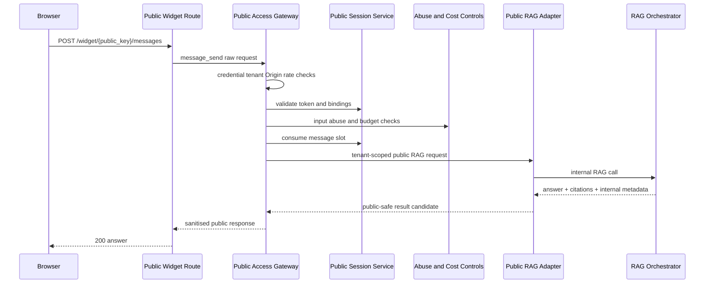

### Gateway message_send Flow

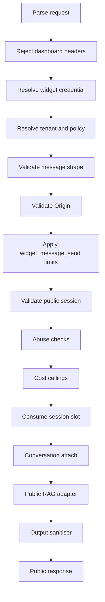

### Session Validation And Slot Consumption

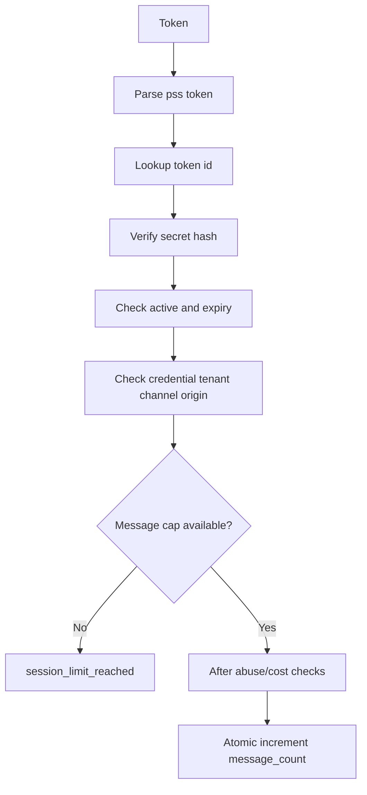

### Lazy Conversation Attachment

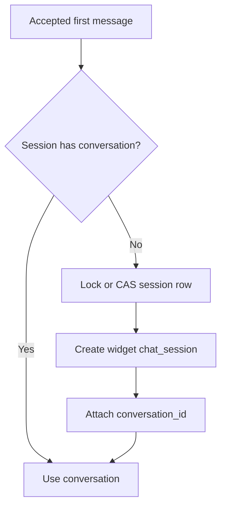

### RAG Orchestration Sequence

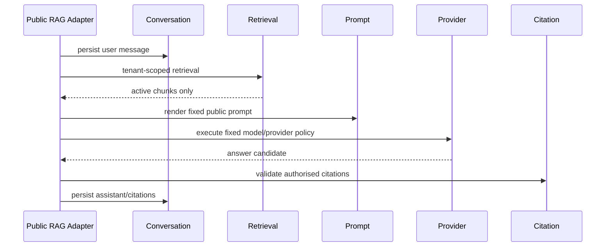

### Idempotency State Machine

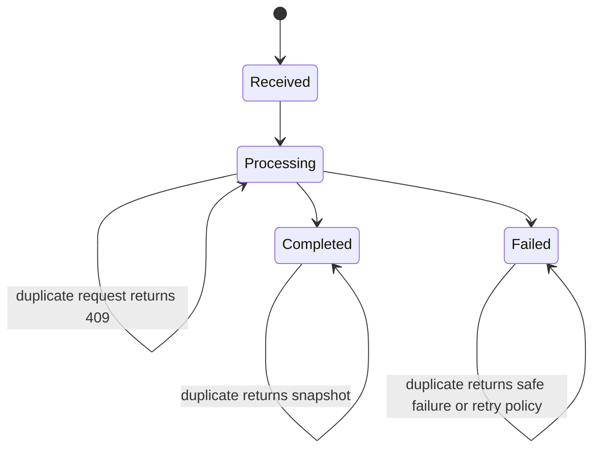

### Transaction And Failure Boundaries

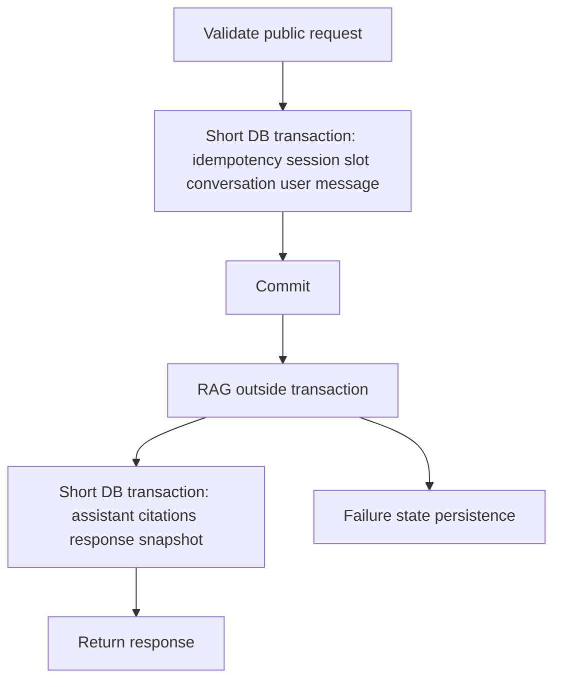

### Public Response Sanitisation

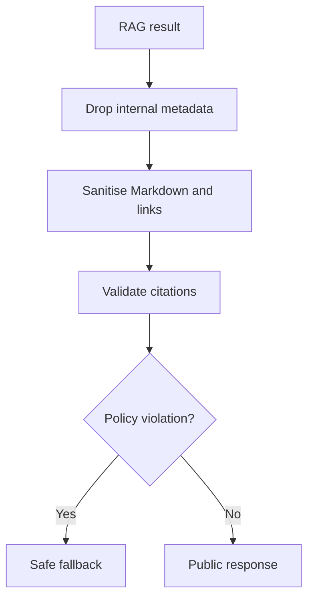

### Abuse And Cost-Control Flow

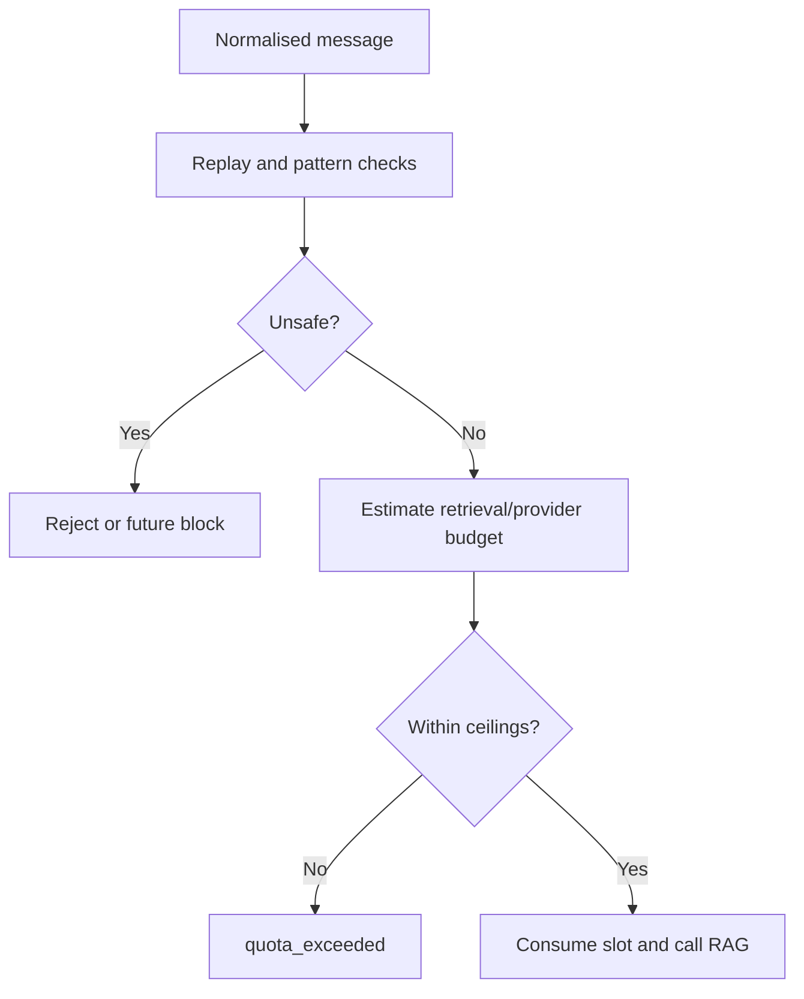

### CORS Preflight

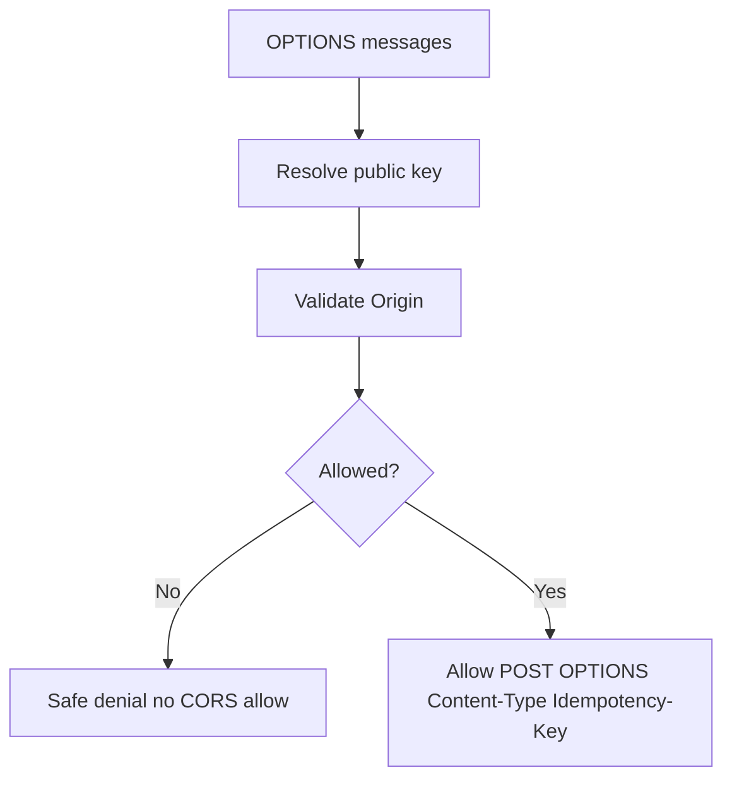

### Failure Decision Tree

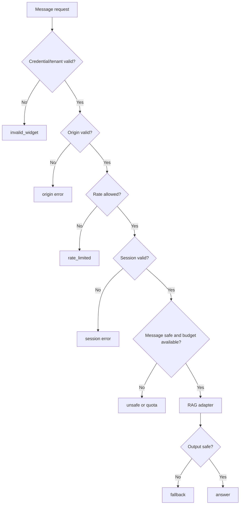

## 31. ADR And Implementation Breakdown

ADR-0013 chooses a thin public widget route using Public Access Gateway for all public security stages, then a dedicated public RAG adapter calling the existing RAG Orchestrator.

Recommended implementation split:

- `TASK-063B1` message contracts, idempotency persistence, session validation/slot preparation, transaction scaffolding.
- `TASK-063B2` abuse/input safety service and public cost-control service.
- `TASK-063B3` public RAG adapter, conversation attachment, route, and CORS.
- `TASK-063B4` output/citation sanitisation, security tests, docs.

## 32. Acceptance Criteria

TASK-063A is complete when endpoint boundary, session validation, slot timing, conversation attachment, idempotency, abuse controls, cost ceilings, RAG adapter boundary, response/citation exclusions, output sanitisation, transaction/failure policy, CORS/rate limits, threat model, diagrams, ADR decision, and implementation-task split are documented, and no runtime code or route is added.
