# Embeddable Widget SDK Architecture

Status: Proposed architecture for TASK-064A
Scope: Architecture and planning only. No SDK bundle, iframe page, widget UI, build config, package publishing, backend endpoint, public history, or analytics implementation is included.

## 1. Purpose

Design the browser SDK that customer websites install to bootstrap the Yoranix website-chat widget. The SDK must remain separate from the visual chat application and must safely support thousands of customer websites, gradual upgrades, and strict public-channel security.

The SDK is a channel shell. Public configuration, anonymous sessions, public messages, and RAG remain backend/platform capabilities behind the already implemented public widget endpoints.

## 2. Product Boundary

The SDK owns:

- Installation/bootstrap script.
- Public-key discovery and validation of installation options.
- Iframe creation, mounting, sandboxing, sizing, and destruction.
- Iframe URL generation.
- Loader/iframe version negotiation.
- postMessage transport and event dispatch.
- Launcher open/close/toggle commands exposed to the host page.
- Responsive container sizing and visibility events.
- Safe degraded/failure states.

The SDK does not own:

- Chat UI rendering.
- Message bubble design.
- Markdown rendering.
- RAG, retrieval, prompt, provider, or model logic.
- Tenant resolution, credential management, or dashboard authentication.
- Lead capture, analytics dashboard, or arbitrary host DOM control.

## 3. Delivery Architecture

Options evaluated:

| Option | Strengths | Weaknesses | Decision |
| --- | --- | --- | --- |
| Script injects DOM directly | Simple and flexible | Host CSS/JS conflicts, weak token isolation, XSS blast radius | Rejected |
| Sandboxed iframe | Strong CSS/security isolation, independent deploy, token isolated to widget origin | postMessage/focus/CSP complexity | Chosen MVP |
| Web Component | Better style isolation than raw DOM | Still shares host JS context and storage | Future wrapper only |
| npm package only | Good for app integrations | Poor no-code website install path | Not MVP alone |
| iframe plus optional npm wrapper | Secure default with future developer ergonomics | More artifacts to version | Chosen direction |

MVP decision: small versioned loader script plus platform-hosted sandboxed iframe. Optional npm wrapper can later call the same loader/runtime API.

Rationale:

- CSS isolation from customer sites.
- Better containment if widget renderer has a bug.
- Session token can remain in iframe origin storage.
- Visual app can ship independently from loader.
- CSP and accessibility costs are manageable and explicit.

## 4. Installation Contract

Primary snippet:

```html
<script
  src="https://widget.yoranix.com/sdk/v1/loader.js"
  data-widget-key="wpk_live_example"
  async
></script>
```

Allowed installation inputs:

- `data-widget-key`: required widget public key.
- `data-mount-mode`: optional, `fixed` default, future `inline`.
- `data-launcher-container`: optional selector only for approved host-owned launcher mode, not MVP default.
- `data-initial-open`: optional boolean.
- `data-locale`: optional hint, iframe/backend remains authoritative.
- `data-debug`: development keys only.
- `nonce`: pass-through support for host CSP when script tag uses nonce.

Optional explicit init:

```js
window.YoranixWidget.init({ widgetKey: "wpk_live_example", initialOpen: false })
```

Rejected inputs:

- Tenant/workspace/organisation IDs.
- API base URL override in production.
- Model/provider/prompt/retrieval/token options.
- Arbitrary iframe URL.
- Arbitrary HTML/CSS/JavaScript.
- Security-policy overrides.
- Allowed-Origin bypass.
- Host-supplied session token by default.

## 5. SDK Public API

MVP global API:

```ts
type YoranixWidget = {
  init(options?: InitOptions): Promise<WidgetHandle>;
  open(): Promise<void>;
  close(): Promise<void>;
  toggle(): Promise<void>;
  destroy(): Promise<void>;
  isOpen(): boolean;
  on(event: WidgetEventName, handler: WidgetEventHandler): () => void;
  off(event: WidgetEventName, handler: WidgetEventHandler): void;
  ready: Promise<WidgetHandle>;
};
```

Events:

- `ready`
- `opened`
- `closed`
- `unread_count_changed`
- `error`
- `destroyed`

Rules:

- `init` is idempotent for the same widget key and options.
- Duplicate loaders reuse the first singleton where protocol-compatible.
- MVP supports one widget instance per page.
- Commands before readiness queue until timeout or fail with a safe SDK error.
- `destroy` tears down iframe, listeners, timers, and public API state for reinitialisation.

Future APIs:

- `resetSession()` only after explicit UX/security design.
- `setLocale()` as a hint only.
- `identify()` only as a separately approved lead/auth workflow.

## 6. Lifecycle State Machine

States:

- `uninitialised`
- `loading_sdk`
- `loading_config` optional/deferred
- `mounting_iframe`
- `awaiting_iframe_ready`
- `ready_closed`
- `ready_open`
- `degraded`
- `failed`
- `destroyed`

Valid transitions:

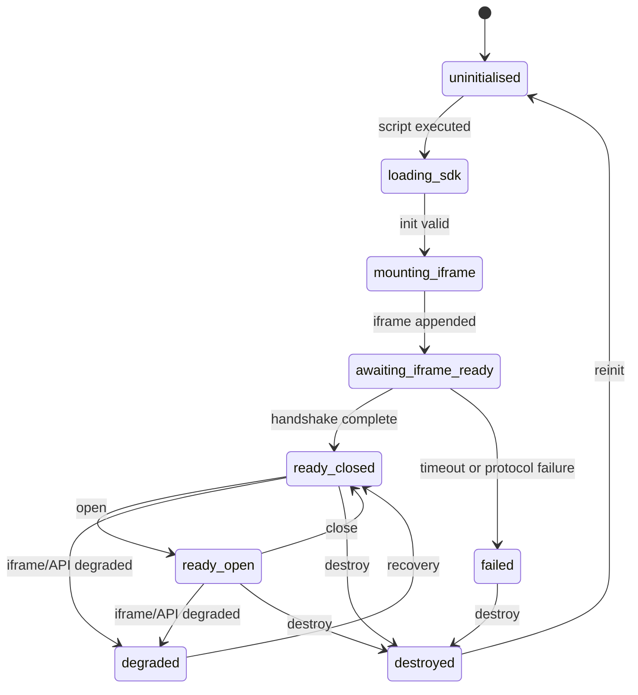

Special cases:

- Duplicate init with same key returns existing handle.
- Duplicate init with conflicting key returns `already_initialised` unless multi-instance mode is introduced later.
- Host removes iframe: SDK transitions to `degraded`, attempts one remount if not destroyed, then `failed`.
- SPA route change: SDK persists mounted iframe; host may call `destroy` explicitly.
- Protocol mismatch: fail closed and expose safe error.

## 7. API-Call Ownership

Decision: iframe owns all public config/session/message API calls.

| Endpoint | Caller | Rationale |
| --- | --- | --- |
| `GET /api/v1/widget/{public_key}/config` | Iframe | Keeps config parsing and public capabilities authoritative inside widget app. |
| `POST /api/v1/widget/{public_key}/sessions` | Iframe | Keeps session token out of host page JS context. |
| `POST /api/v1/widget/{public_key}/messages` | Iframe | Keeps idempotency/session/message state inside isolated widget origin. |

The loader may optionally preload a minimal non-sensitive bootstrap health/config status in a future task only if needed for launcher appearance. MVP loader does not call public APIs.

## 8. Session Token Storage

Rules:

- Store anonymous public session token inside iframe origin `sessionStorage`.
- Use in-memory fallback when storage is unavailable.
- Never use host-page `localStorage` or cookies.
- Never include token in iframe URL, postMessage payload, telemetry, logs, or host callbacks.
- Reset on explicit future `resetSession`, expiry, terminal session error, or iframe destruction.
- Same-tab refresh may preserve session through iframe `sessionStorage`.
- Cross-tab sharing is not required for MVP.

Residual risk: XSS inside the iframe origin could read iframe storage. Mitigations are output sanitisation, iframe CSP, no arbitrary HTML, and short session lifetimes.

## 9. Iframe URL And Bootstrap

Pattern:

```text
https://widget.yoranix.com/embed/{public_key}?sdk=v1&protocol=1
```

Rules:

- Only public widget key appears in path.
- No session token, tenant IDs, conversation IDs, message history, secrets, or arbitrary callback URLs.
- Query params are bounded and versioned: `sdk`, `protocol`, optional locale hint.
- Production keys use production widget origin by default.
- Development/staging keys map to their environment widget hosts.

Parent Origin verification uses a combination:

- Backend Origin validation remains authoritative for API calls.
- postMessage handshake validates `event.origin` and `event.source`.
- Iframe can observe `document.referrer` only as a diagnostic hint, not authority.

## 10. Iframe Security Attributes

MVP iframe attributes:

```html
<iframe
  title="Yoranix chat widget"
  sandbox="allow-scripts allow-forms allow-popups allow-popups-to-escape-sandbox"
  allow=""
  referrerpolicy="strict-origin-when-cross-origin"
  loading="lazy"
></iframe>
```

Notes:

- Omit `allow-same-origin` initially if the iframe app can operate under an opaque sandbox origin. If same-origin storage/API behavior requires `allow-same-origin`, use a dedicated widget origin and document the increased risk of combining `allow-scripts` and `allow-same-origin`.
- No microphone/camera/clipboard/download permissions in MVP.
- Popups only for safe external links after sanitisation.
- Loader sets a stable title and supports focus management.

## 11. CSP Compatibility

Host pages may need:

```text
script-src https://widget.yoranix.com
frame-src https://widget.yoranix.com
child-src https://widget.yoranix.com
```

If the loader never calls APIs, host `connect-src` changes are not required for loader operation. The iframe origin controls its own `connect-src` to API domains.

Future directives:

- `img-src` for platform-hosted assets if host-owned launcher is added.
- SRI for pinned loader URL.
- Trusted Types support for iframe app later.

Blocked script or frame produces no backend side effect. Loader may expose a safe `failed` state if script ran but frame creation/loading is blocked.

## 12. SRI And Versioning

URLs:

- Immutable: `/sdk/v1.2.3/loader.js`.
- Stable major: `/sdk/v1/loader.js`.

Policy:

- Semantic versioning for loader package.
- Separate `protocol` version for postMessage envelope.
- Stable major URL receives backwards-compatible fixes only.
- Pinned immutable URL supports SRI.
- Critical security updates may force iframe-side protocol minimums and return `sdk_upgrade_required`.
- Cache headers: immutable versions `public, max-age=31536000, immutable`; major alias short TTL with CDN purge.

## 13. postMessage Protocol

Envelope:

```ts
type WidgetProtocolEnvelope<T = unknown> = {
  protocol: "yoranix.widget";
  version: 1;
  message_id: string;
  type: string;
  source: "yoranix-loader" | "yoranix-iframe";
  payload: T;
  sent_at: string;
};
```

Iframe to parent:

- `iframe_ready`
- `widget_ready`
- `widget_opened`
- `widget_closed`
- `resize_request`
- `unread_count_changed`
- `error`
- `navigation_request`
- `telemetry_event` future

Parent to iframe:

- `initialise`
- `open`
- `close`
- `toggle`
- `host_visibility_changed`
- `theme_hint` optional
- `locale_hint` optional
- `destroy`

Rules:

- Use exact `targetOrigin`; never `*` after bootstrap.
- Validate `event.origin`, `event.source`, `protocol`, `version`, `source`, `type`, payload schema, and payload size.
- Unknown types are ignored safely.
- No session token, message content, answer content, internal IDs, raw public config, or raw backend errors cross the boundary.
- Use `message_id` for correlation where acknowledgements are needed.

## 14. Bootstrap Handshake

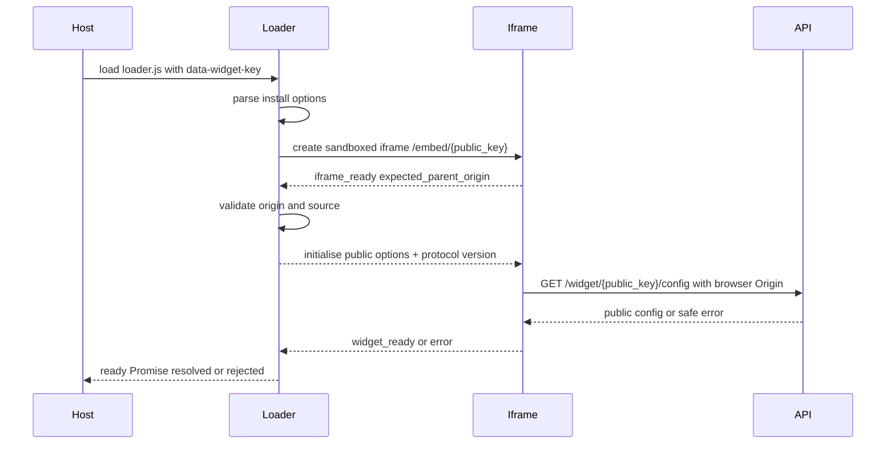

Timeouts:

- Iframe ready timeout: 10 seconds.
- Config readiness timeout reported as degraded UI, not host-page exception.
- Protocol mismatch returns `sdk_protocol_mismatch` and fails closed.

## 15. Resizing And Positioning

MVP:

- Launcher and panel live inside one iframe/container shell.
- Desktop panel max width/height, bottom-inline positioning, safe z-index range.
- Mobile uses viewport-safe full-screen or near full-screen panel.
- Respect safe-area insets.
- Loader validates `resize_request` dimensions with min/max caps.
- No arbitrary negative positions or unbounded z-index from iframe messages.
- Orientation/viewport changes trigger bounded resize recalculation.
- Virtual keyboard behavior handled by iframe app where possible.

## 16. Accessibility Boundary

MVP decision: launcher and panel live inside one iframe shell for styling/security isolation.

Loader responsibilities:

- Iframe `title`.
- Focus transfer into iframe on open where browser permits.
- Restore focus to previous host element on close when known.
- Escape-key coordination through postMessage.
- Reduced-motion hint forwarding.
- Safe failure fallback for unsupported browsers.

Iframe app responsibilities:

- Launcher button semantics.
- Internal focus trap and keyboard navigation.
- Chat transcript semantics and live regions.
- Message/citation accessibility.
- Contrast, reduced motion, and source/fallback visibility.

## 17. Host-Page Isolation

The host page is not fully trusted. Controls:

- Token stays in iframe origin.
- Loader exposes minimal API only.
- No internal state, token, messages, or answers sent to parent.
- Global namespace is one bounded `window.YoranixWidget` object.
- Duplicate loader detection prevents multi-instance confusion.
- postMessage validates origin/source/protocol.
- Iframe protects against host CSS and most host JS reads.
- Host can still remove, hide, overlay, or clickjack its own embed; this is residual risk for any embedded widget.

## 18. Environments

Hosts:

- Development: `https://widget-dev.yoranix.com` or localhost during development.
- Staging: `https://widget-staging.yoranix.com`.
- Production: `https://widget.yoranix.com`.

Rules:

- Public key prefix/environment must match SDK and API environment.
- Production installs cannot override API or iframe origin.
- Localhost development requires development credentials and explicit localhost origins.
- Environment mismatch fails with safe `invalid_widget_environment` SDK error.

## 19. Network And Retry Behaviour

Config:

- Iframe uses `GET /config` with ETag and conservative retry.
- Config failure shows unavailable/degraded UI.

Session:

- Create anonymous session on first open or first message, not page load.
- Preferred MVP: first open creates session if messaging is enabled; this reduces first-message latency while avoiding page-load session floods.

Message:

- Generate `Idempotency-Key` per user send inside iframe.
- Retry with same key after transport uncertainty.
- `request_in_progress` shows pending/retry UI.
- `expired_session` triggers one session recreation and message retry only after user intent is preserved safely.
- Offline state queues no provider work; user can retry when online.

## 20. Error UX Contract

Safe categories:

- `widget_unavailable`
- `connection_problem`
- `session_expired`
- `rate_limited`
- `message_not_sent`
- `service_temporarily_unavailable`
- `unsupported_browser`
- `configuration_invalid`
- `sdk_protocol_mismatch`

SDK error object:

```ts
type WidgetSdkError = {
  code: string;
  message: string;
  retryable: boolean;
  phase: "bootstrap" | "config" | "session" | "message" | "runtime";
  request_id?: string;
};
```

Raw backend errors are normalised before host callbacks.

## 21. Telemetry And Privacy

Optional future operational telemetry:

- Loader success/failure.
- Iframe ready latency.
- Open/close counts.
- Config/session/message availability.
- SDK and protocol version.

Do not include:

- Message content.
- Answers.
- Session tokens.
- Raw public key where avoidable.
- PII.
- Full host URL unless separately approved.

Consent and tenant configuration boundaries must be explicit before implementation.

## 22. Asset And Deployment Strategy

Recommended:

- Dedicated widget origin/domain for loader, iframe app, and widget static assets.
- API remains on API origin with explicit CORS.
- CDN in front of immutable loader and iframe assets.
- Rollback by switching major alias and iframe app deployment version.

Cache:

- Loader immutable version: one year immutable.
- Loader major alias: short TTL plus purge.
- Iframe app shell: short TTL or deployment hash assets.
- Static assets: hashed immutable.

## 23. Build And Package Structure

Recommended future structure:

```text
apps/widget/
  app/ or src/
  public/
  tests/

packages/widget-sdk/
  src/
    loader.ts
    client.ts
    protocol.ts
    lifecycle.ts
    iframe.ts
    events.ts
    errors.ts
  test/
  package.json
  tsconfig.json
  build config
```

Start as a separate lightweight TypeScript SDK package and a dedicated widget app. Do not fold the visual widget into the current dashboard app long-term; the dashboard is authenticated/client-admin focused, while the widget is anonymous/public and must deploy independently.

## 24. Browser Support

MVP supports current Chrome, Edge, Firefox, Safari, iOS Safari, and Android Chrome.

Graceful failure:

- No `postMessage`: unsupported browser.
- Storage blocked: in-memory session and user warning on refresh persistence.
- Strict CSP blocks script/frame: no backend side effect; optional console-safe debug message.
- Offline: iframe shows connection problem and retry.
- Old browsers: fail closed, no polyfill-heavy loader.

## 25. Performance Budgets

Targets:

- Loader compressed size: under 10 KB gzip.
- Loader has no runtime dependencies by default.
- Loader never blocks host rendering; async/defer recommended.
- Iframe created lazily after loader parse; heavy UI loads on interaction where practical.
- Time to iframe mount: under 300 ms after script execution on typical broadband.
- First open: under 1 s to visible shell, excluding API outages.
- No host page layout shift beyond fixed launcher/container bounds.
- Iframe bundle budget: under 150 KB gzip initial shell before chat UI expansion target review.
- Memory: one instance only; destroy removes listeners and DOM.

## 26. Threat Model

| Threat | Likelihood | Impact | Controls | Residual Risk | Monitoring |
| --- | --- | --- | --- | --- | --- |
| Malicious host page | Medium | High | Token in iframe only, minimal API, no message content to parent | Host can hide/overlay widget | Origin abuse and embed telemetry |
| Iframe origin spoofing | Medium | High | Exact origin/source validation, protocol envelope | Misconfiguration | Protocol mismatch/error rate |
| postMessage origin confusion | Medium | High | No wildcard target after bootstrap, schema validation | Browser/plugin bugs | Invalid message counters |
| Session-token leakage | Medium | High | No token in parent, URL, postMessage, or cookies | Iframe XSS | Sanitiser/CSP reports |
| Iframe URL injection | Low | High | SDK generates fixed URL from public key only | Loader bug | URL validation tests |
| CSP bypass | Low | High | Document required directives, no eval, no inline dependency | Host misconfig | CSP support reports |
| XSS in iframe | Medium | High | Output sanitiser, iframe CSP, no arbitrary HTML | UI renderer bug | Sanitiser/security events |
| Compromised SDK CDN | Low | Critical | SRI pinned URLs, immutable versions, CDN controls | Rolling v1 users exposed | Integrity/deployment monitoring |
| Supply-chain attack | Medium | High | Dependency-light loader, lockfiles, audits | Transitive risk | Dependency audit |
| Downgrade to vulnerable SDK | Medium | Medium | Protocol minimums, deprecation, critical upgrade block | Pinned old scripts | Version telemetry |
| Clickjacking/overlay abuse | Medium | Medium | Iframe isolation, visible branding, host still owns page | Host can overlay | Customer guidance |
| Resize abuse | Medium | Medium | Dimension caps and source validation | UI bug | Resize rejection metrics |
| Navigation abuse | Medium | Medium | Navigation requests validated, safe links only | User clicks unsafe host content | Navigation events |
| Multiple-instance confusion | Medium | Low | Singleton MVP, duplicate detection | Complex host scripts | Init error metrics |
| Debug-mode leakage | Low | Medium | Dev keys only, no secrets in debug | Misconfigured build | Debug flag events |
| Telemetry leakage | Medium | Medium | No content/tokens/raw URLs | Future feature creep | Privacy review |

## 27. Failure Matrix

| Failure | SDK State | Behaviour | Retry |
| --- | --- | --- | --- |
| Loader blocked | N/A | Widget absent, no backend call | Host CSP fix |
| Iframe blocked | `failed` | Emit safe error if loader ran | Host CSP/frame fix |
| Config 404/invalid | `failed` or iframe unavailable | Safe unavailable UI | No automatic spam retry |
| Origin denied | `failed` | Site not authorised | Admin fixes origin |
| Config rate-limited | `degraded` | Retry after header if available | Bounded |
| Session creation fails | `degraded` | Ask user to retry later | Bounded |
| Message rate-limited | `ready_open` | Show rate limit message | After Retry-After |
| API outage | `degraded` | Safe unavailable | Exponential backoff |
| Protocol mismatch | `failed` | `sdk_protocol_mismatch` | Upgrade SDK |
| postMessage lost | `degraded` | Timeout and retry command once | Bounded |
| Host removes iframe | `degraded` then `failed` | One remount attempt unless destroyed | Once |
| Storage unavailable | `ready_*` with memory | Session lost on refresh | Inform UI |
| Browser offline | `degraded` | Queue no RAG work | Retry on online |
| Deployment rollback | Depends | Version alias rollback | CDN purge |
| Asset CDN outage | `failed` | Safe unavailable | CDN failover |

## 28. Test Strategy

Unit tests:

- Config parsing.
- Lifecycle transitions.
- Duplicate init.
- postMessage envelope validation.
- Origin/source validation.
- Resize bounds.
- Error normalisation.
- Storage abstraction.
- Version compatibility.

Browser integration tests:

- Host page embeds SDK.
- Iframe loads and handshakes.
- Allowed Origin works.
- Disallowed Origin fails safely.
- Token stays inside iframe.
- Open/close/focus restore.
- Mobile sizing.
- CSP examples.
- SPA route changes.
- Multiple script loads.
- Offline/retry.

Security tests:

- Forged postMessage ignored.
- Wildcard targetOrigin absent after bootstrap.
- Token absent from parent memory/messages/URL.
- Unsafe iframe URL rejected.
- Debug disabled in production.
- Host script cannot read iframe storage.
- Resize/navigation abuse rejected.

## 29. Diagrams

### Component Architecture

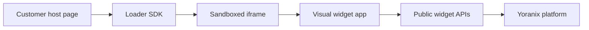

### SDK Lifecycle

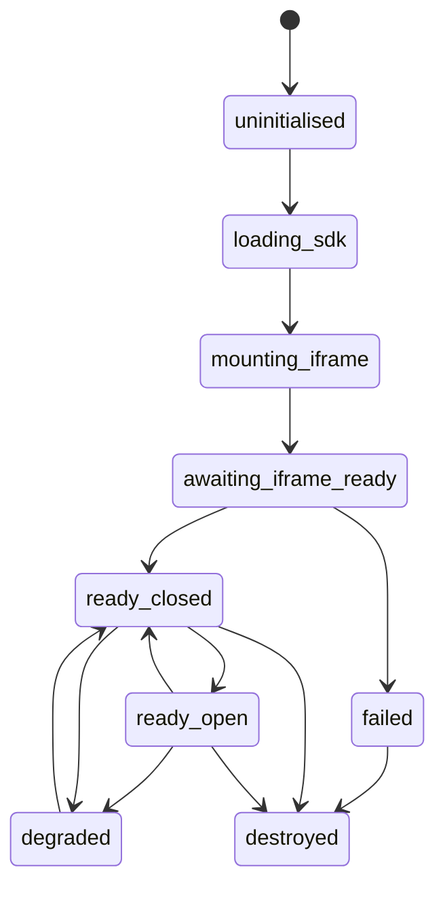

### Bootstrap Handshake

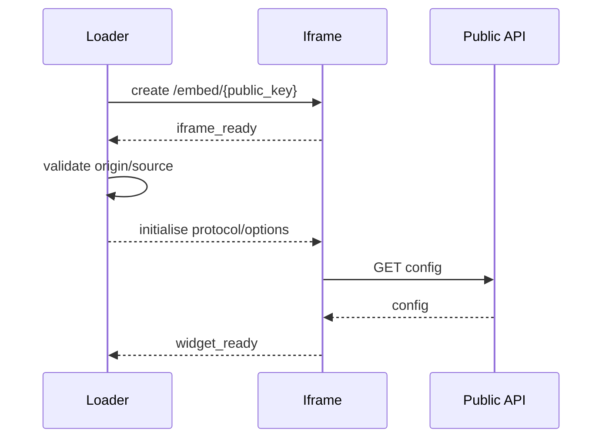

### postMessage Sequence

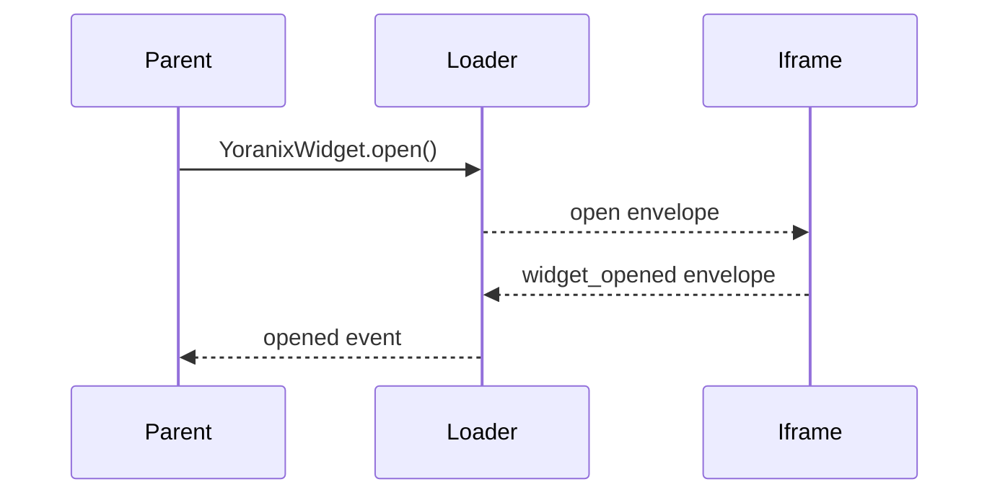

### Config Session Message Ownership

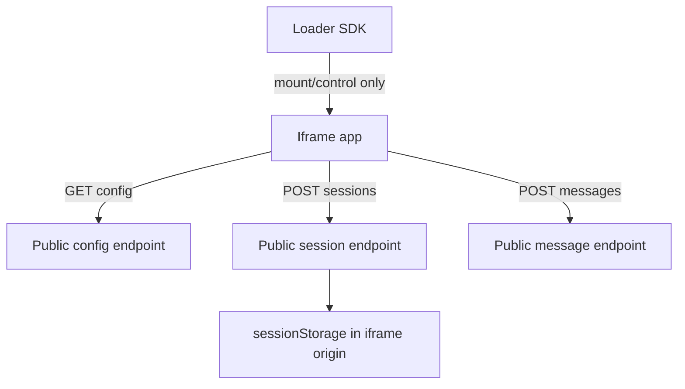

### Open Close Focus Flow

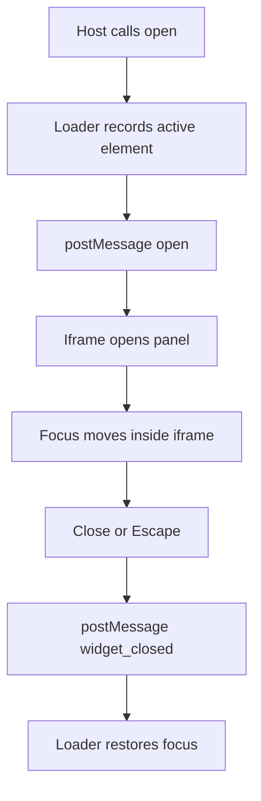

### Version Negotiation

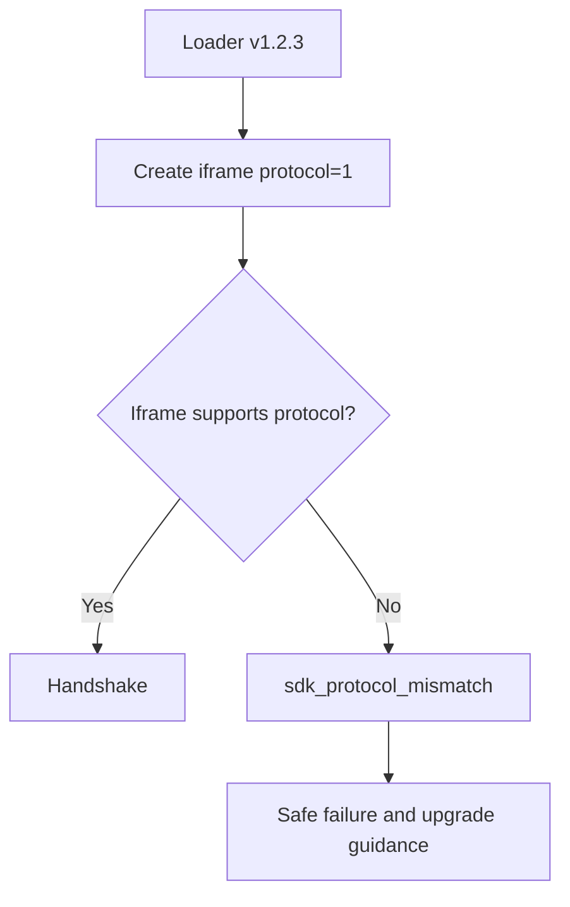

### Deployment Version Flow

```mermaid
flowchart LR
    Commit --> Build[Build loader and iframe]
    Build --> Immutable[/sdk/v1.2.3/loader.js]
    Build --> Alias[/sdk/v1/loader.js]
    Build --> Iframe[Widget app release]
    Alias --> CDN[CDN cache]
    Iframe --> CDN
```

### Failure Retry Flow

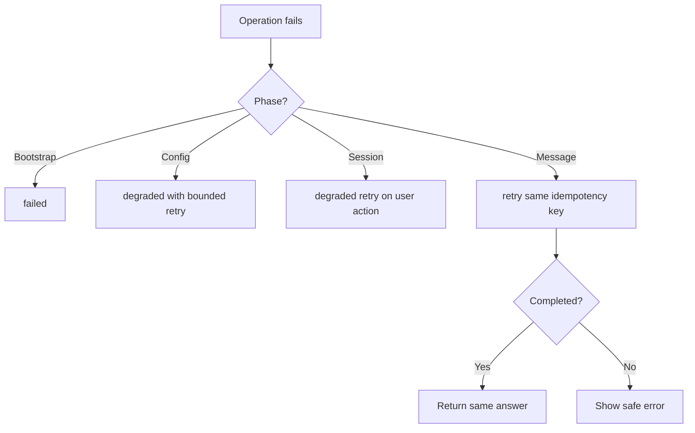

### Security Trust Boundaries

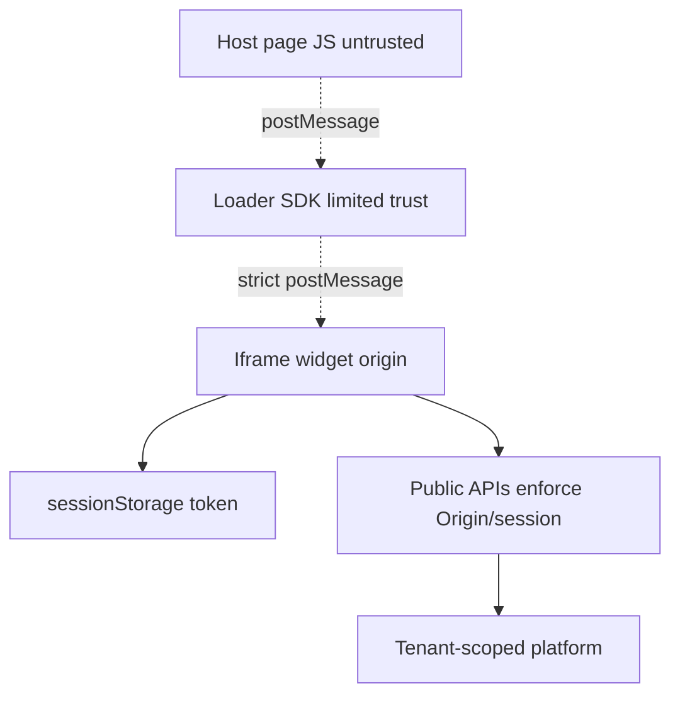

## 30. ADR And Implementation Split

ADR-0014 records the choice: small loader SDK plus platform-hosted sandboxed iframe, with iframe-owned config/session/message API calls and iframe-origin session storage.

Future tasks:

- `TASK-064B1` SDK package/build foundation.
- `TASK-064B2` iframe shell and secure handshake.
- `TASK-064B3` SDK lifecycle, mounting, public API.
- `TASK-064B4` iframe API client/session storage.
- `TASK-064B5` browser integration/security tests.
- `TASK-065A` Widget UI and Interaction Architecture.
- `TASK-065B` Widget UI Implementation.

## 31. Acceptance Criteria

TASK-064A is complete when SDK/UI boundaries, iframe delivery, token isolation, API-call ownership, postMessage protocol, lifecycle/failure behavior, CSP, accessibility, versioning, performance, threat model, diagrams, ADR, and implementation split are documented, and no runtime code is added.
## Browser Test Foundation

TASK-064B5 adds a Playwright browser integration/security foundation for the widget SDK and iframe.

The browser tests use real built SDK and iframe artifacts with separate host, widget, and mock API origins. Chromium is required in normal verification; Firefox/WebKit remain an explicit extended suite. Test-only iframe hooks are compiled only in Vite `test` mode and must never become host SDK APIs.
