# Widget Controlled-Pilot Deployment and Operations Architecture

Status: Proposed architecture for TASK-066A
Scope: Architecture, infrastructure planning, deployment design, security policy, release operations, observability design, and controlled-pilot planning only. No production infrastructure, DNS, CDN, backend/runtime behavior, public API, monitoring vendor, or admin/publishing UI changes are implemented by this document.

## 1. Purpose

Define how the current locally verified embeddable widget moves into a controlled production pilot. The widget already has a framework-free loader SDK, iframe-owned public config/session/message API calls, token isolation, safe plain-text rendering, citation disclosure, responsive hardening, browser security tests, visual regression, and release-readiness evidence. This document defines the deployment and operating architecture around those artifacts.

The design preserves tenant isolation, source grounding, observable operations, secure defaults, explicit lifecycle/versioning, and accessibility.

## 2. Architecture Boundary

Covered: SDK loader hosting, iframe application hosting, public widget API hosting, CDN/static delivery, domain topology, TLS, cache behavior, asset versioning, release channels, environment separation, configuration delivery, CORS, CSP, iframe security headers, referrer policy, permissions policy, logging policy, monitoring architecture, health checks, synthetic smoke tests, real-backend pilot smoke path, rollback, incident response, and pilot gating.

Not covered: admin portal implementation, widget design changes, new widget functionality, analytics product features, user-behavior tracking, lead capture, backend RAG redesign, or a new auth model.

## 3. Environment Model

| Environment | Purpose | Domains | Data | Notes |
| --- | --- | --- | --- | --- |
| Local | Developer work | localhost ports | Fake/local | Allows HTTP localhost and development overrides only. |
| Test | Automated browser/unit tests | local test origins | Fake deterministic | No production credentials or customer data. |
| Development | Shared integration | dev subdomains | Non-customer | Can use development keys and debug. |
| Staging | Production-like release validation | staging subdomains | Synthetic and approved test data | Mirrors headers/cache/release flow. |
| Pilot/production | Controlled customer pilot | production domains | Approved pilot tenants plus synthetic tenant | Production-grade infrastructure with enablement controls. |

Decision: pilot uses production-grade infrastructure with restricted tenant/widget enablement rather than a permanently separate pilot stack.

Rationale: avoid configuration drift, test real TLS/domains/headers/CORS/CDN/rollback paths, reduce long-term operational complexity, and control customer exposure through allowlists and channels.

Residual risk: a production-grade pilot shares infrastructure blast radius. Controls are tenant/widget allowlisting, synthetic smoke, kill switches, alerting, rollback, and tight pilot volume.

## 4. Domain Architecture

Recommended placeholder topology:

| Domain | Purpose | Trust profile |
| --- | --- | --- |
| `app.yoranix.com` | Administration/dashboard application | Authenticated users and dashboard cookies. |
| `api.yoranix.com` | Authenticated platform API | Dashboard/API auth boundary. |
| `cdn.yoranix.com` | SDK loader and immutable static assets | Public static assets, no cookies required. |
| `widget.yoranix.com` | Iframe HTML/application shell | Public embedded iframe origin. |
| `widget-api.yoranix.com` | Public widget config/session/message endpoints | Anonymous public API with Origin, key, rate, and session controls. |

Decision: use `widget-api.yoranix.com` for public widget APIs rather than sharing dashboard API origin externally. This separates anonymous traffic, simplifies CSP/CORS, avoids dashboard cookie confusion, enables distinct CDN/WAF/rate policies, and reduces blast radius.

## 5. Delivery Topology

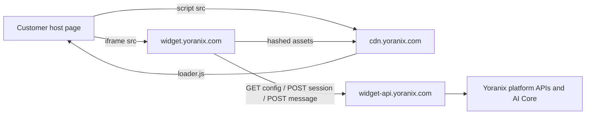

Rules:

- Host page loads only the SDK loader from CDN.
- SDK mounts iframe from widget origin.
- Iframe owns public API calls to widget API origin.
- Public session token never enters host page, SDK state, postMessage, URL, logs, or telemetry.
- Dashboard API and public widget API are externally separated even if backend deployment is shared internally.

## 6. SDK Loader Delivery

Supported paths:

```text
https://cdn.yoranix.com/widget-sdk/v1.2.3/loader.js
https://cdn.yoranix.com/widget-sdk/v1/loader.js
```

Policy:

- `/widget-sdk/v1.2.3/loader.js` is immutable and content never changes after release.
- `/widget-sdk/v1/loader.js` is a major-version alias for backward-compatible updates and emergency rollback.
- No uncontrolled `/latest/loader.js` for production customer snippets.
- Pinned immutable URLs may use SRI.
- Major alias uses short TTL and purge capability.
- Loader contains no secrets and no per-client generated JavaScript.
- Brotli/gzip compression is enabled.

Controlled pilot customers should initially use `/widget-sdk/v1/loader.js` unless strict change control requires a pinned semver URL.

## 7. Versioning And Compatibility

| Artifact | Version | Compatibility rule |
| --- | --- | --- |
| Loader SDK | Semver, for example `1.2.3` | Major version indicates public loader API compatibility. |
| postMessage protocol | Protocol major/minor, for example `1.0` | Exact major required; minor backward-compatible. |
| Iframe app | Release ID plus semver/channel | Must support active loader protocol majors. |
| Public API contract | `/api/v1` schema versions | Backward-compatible within v1; breaking changes require v2. |

Decision: use versioned immutable SDK plus independently deployable backward-compatible iframe app. The iframe application can release independently behind a controlled channel as long as it supports active protocol major 1 and public API v1.

Compatibility window:

- Support SDK major `v1` throughout controlled pilot.
- Support at least the two most recent minor SDK versions after GA unless security requires revocation.
- Protocol major changes require a new SDK major alias and migration plan.
- Backend public API v1 must preserve existing response fields and safe fallback behavior.

## 8. Loader-To-Iframe Version Resolution

Options evaluated:

| Option | Strengths | Weaknesses | Decision |
| --- | --- | --- | --- |
| Hardcoded matching iframe version in SDK | Deterministic | Forces customer script changes or SDK rollout for every iframe release | Rejected |
| Version manifest | Flexible | Adds mutable bootstrap dependency | Future option |
| Stable iframe URL with compatible app | Simple and rollback-friendly | Requires strict protocol compatibility tests | Chosen |
| Config-provided iframe version | Per-widget control | Config path depends on iframe/API already working | Rejected for bootstrap |

Policy: SDK v1 builds iframe URLs under `https://widget.yoranix.com/embed/{public_key}` with protocol/version hints. Widget origin serves the promoted compatible iframe release. Pilot widgets may be assigned canary server-side or through deployment routing, not host-provided arbitrary URLs.

## 9. Artifact And Cache Model

Immutable assets:

- Versioned SDK loader files.
- Hashed widget JS chunks.
- Hashed widget CSS chunks.
- Local icons/assets with content hashes.

Immutable headers:

```text
Cache-Control: public, max-age=31536000, immutable
X-Content-Type-Options: nosniff
```

Mutable/revalidated resources:

| Resource | Cache policy | Reason |
| --- | --- | --- |
| Iframe HTML/bootstrap | `Cache-Control: no-cache` or short max-age with ETag | Must roll forward/back quickly and reference latest hashed assets. |
| Major SDK alias | Short TTL, ETag, purge support | Alias can receive compatible fixes or emergency rollback. |
| Public config | ETag revalidation, scoped by widget/environment/origin where relevant | Config can change through publishing. |
| Sessions | `Cache-Control: no-store` | Contains session state. |
| Messages | `Cache-Control: no-store` | Contains user/answer/session state. |

Do not cache session-specific data publicly.

## 10. Public Configuration Caching

Preserve the iframe ETag architecture:

- Iframe cache is sessionStorage or memory, scoped by widget key and environment.
- 304 is accepted only with a validated cached config.
- CDN may cache public config only after review of tenant/config sensitivity and `Vary` behavior.
- Publishing latency target for pilot: minutes, not hours.
- Draft/internal configuration values must never be returned by public config endpoint.

## 11. Session And Message API Caching

Required headers for sessions/messages and request-specific public errors:

```text
Cache-Control: no-store
Pragma: no-cache
```

Apply to `POST /api/v1/widget/{public_key}/sessions`, `POST /api/v1/widget/{public_key}/messages`, and any response carrying session expiry, remaining messages, answer text, citations, fallback status, or request-specific errors.

## 12. CORS Architecture

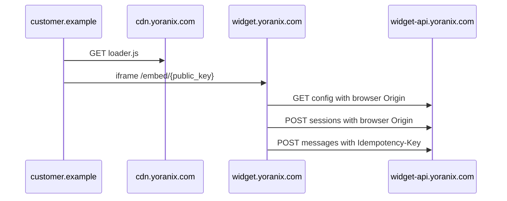

Policy:

- Explicit allowlist matching for customer host origins and/or widget origin depending endpoint design.
- Browser CORS is not authentication; backend public key, allowed origin, session token, rate limits, and tenant-scoped retrieval remain authoritative.
- `Access-Control-Allow-Credentials: false`.
- No cookies required.
- Methods: route-specific `GET`, `POST`, `OPTIONS`.
- Headers: `Content-Type`, `Idempotency-Key`, `If-None-Match` where needed.
- Exposed: `ETag`, `Retry-After`, `X-Request-ID` where safe.
- Denied preflight fails closed.

## 13. Host-Origin Policy

Production policy:

- Exact scheme/host/port matching after normalization.
- HTTPS required for production and staging customer origins.
- HTTP allowed only for localhost/development keys.
- Default ports normalize: `https:443`, `http:80`.
- Punycode/IDN normalized before comparison.
- No wildcard all-origin policy.
- Wildcard subdomains disabled for pilot unless separately reviewed.
- Origin changes are scoped to widget/tenant and audited.

Iframe handshake validates parent origin/source for protocol safety; backend Origin validation remains authoritative for public API access.
## 14. CSP Architecture

### Customer Host Page

Minimum placeholders:

```text
script-src 'self' https://cdn.yoranix.com;
frame-src https://widget.yoranix.com;
child-src https://widget.yoranix.com;
```

The loader should not require host `connect-src` because API calls occur inside the iframe.

### Widget Iframe Application

Recommended baseline:

```text
default-src 'none';
script-src 'self';
style-src 'self';
connect-src https://widget-api.yoranix.com;
img-src 'self' https:;
font-src 'none';
object-src 'none';
frame-src 'none';
base-uri 'none';
form-action 'none';
worker-src 'none';
```

`frame-ancestors` is difficult because approved customer domains vary per tenant. Pilot preference is dynamic `frame-ancestors` if the deployment can resolve the widget key before serving iframe HTML. If not feasible in TASK-066B1, document the limitation and rely on strict runtime handshake plus backend Origin validation. Do not use `frame-ancestors *` without a separate security review.

## 15. Security Headers

| Header | SDK/CDN | Iframe app | Public API | Notes |
| --- | --- | --- | --- | --- |
| `Content-Security-Policy` | Optional defensive | Required | Optional/route minimal | Iframe CSP must allow API origin only. |
| `X-Content-Type-Options: nosniff` | Required | Required | Required | Prevent MIME confusion. |
| `Referrer-Policy` | `strict-origin-when-cross-origin` | `strict-origin-when-cross-origin` or stricter | `no-referrer` or strict origin | Avoid leaking full customer paths. |
| `Permissions-Policy` | Disable unused | Disable unused | Disable unused | No camera/mic/geolocation/payment. |
| `Strict-Transport-Security` | Required after TLS validation | Required after TLS validation | Required after TLS validation | Include subdomains only after domain inventory review. |
| `Cross-Origin-Resource-Policy` | `cross-origin` for public assets | Evaluate | N/A | Too strict can break embedding/asset use. |
| `Cross-Origin-Opener-Policy` | Avoid or `same-origin-allow-popups` where needed | Avoid strict COOP for embedded iframe | N/A | Strict COOP can break cross-origin embedding assumptions. |
| `Cross-Origin-Embedder-Policy` | Avoid initially | Avoid initially | N/A | COEP can break embeds and third-party assets. |

## 16. Iframe Sandbox Policy

Check implementation reality before production. Because the widget uses iframe-origin `sessionStorage`, stable same-origin storage, and same-origin static asset execution, pilot architecture accepts `allow-same-origin` only on a dedicated widget origin with no same-site sensitive cookies.

Pilot sandbox:

```text
sandbox="allow-scripts allow-same-origin allow-forms allow-popups allow-popups-to-escape-sandbox"
```

Rationale:

- `allow-scripts`: required for widget app.
- `allow-same-origin`: required for stable iframe-origin storage/app behavior; mitigated by dedicated widget origin and strict CSP.
- `allow-forms`: supports form/textarea semantics, not arbitrary form posting.
- `allow-popups` and `allow-popups-to-escape-sandbox`: reserved for safe external privacy/citation links.

Avoid top navigation, downloads, camera, microphone, geolocation, clipboard, payment, and presentation capabilities.

## 17. Permissions Policy

Recommended iframe/app response header:

```text
Permissions-Policy: camera=(), microphone=(), geolocation=(), payment=(), usb=(), bluetooth=(), accelerometer=(), gyroscope=(), magnetometer=(), clipboard-read=(), clipboard-write=()
```

Do not disable browser fundamentals needed for rendering, focus, storage, or network access.

## 18. TLS

Requirements:

- HTTPS-only in staging/pilot/production.
- TLS 1.2 minimum; TLS 1.3 preferred.
- Automatic certificate renewal.
- HSTS after domain and subdomain inventory is verified.
- No mixed content.
- Certificate expiry alert before 30 days and critical before 7 days.

Pilot checklist: valid certificate for CDN/widget/API domains, reviewed HSTS scope, and no production customer origin over HTTP.

## 19. CDN Architecture

Vendor-neutral responsibilities:

- Serve immutable SDK and widget static assets.
- Brotli/gzip compression.
- Correct MIME types and `nosniff`.
- Edge caching with safe cache keys.
- Origin shielding where supported.
- Cache purge for aliases and iframe HTML.
- DDoS/bot pressure absorption for static assets.
- Request logs with privacy-preserving fields.

Vendor mapping can later target Cloudflare, CloudFront, Azure Front Door, or another provider. TASK-066A does not choose or configure a vendor.

CDN security:

- Public SDK does not require signed URLs.
- Session/message API responses are never cached.
- Query string handling for assets rejects or ignores unrecognised params to prevent cache poisoning.
- Deployment credentials and purge permissions use least privilege.

## 20. WAF And Abuse Protection

Infrastructure controls complement application controls:

- IP/ASN rate limits for obvious abuse.
- Widget-key scoped rate visibility.
- Route body-size limits.
- Malformed request blocking before app where safe.
- OPTIONS/preflight rate limits.
- Bot mitigation that does not break legitimate customer visitors.
- Geographic policy only if required by business/legal policy.

Application controls remain authoritative for widget key, origin, session, message quotas, idempotency, and RAG cost controls.

## 21. Release Channels

Channels:

- `development`: local/dev keys only.
- `staging`: production-like verification.
- `pilot`: approved customer and synthetic widgets only.
- `stable`: future GA default.
- `canary`: optional controlled subset during pilot.

Pilot rollout policy:

- Prefer explicit widget allowlist over percentage rollout initially.
- Canary release goes to synthetic widget first, then one low-risk pilot widget.
- Promotion requires successful unit, browser, visual, production inspection, staging smoke, and pilot synthetic smoke.
- Rollback triggers include synthetic smoke failure, 5xx/latency spike, token/security regression, CSP/header breakage, or pilot customer P1.

## 22. Controlled-Pilot Tenant Enablement

Before admin publishing UI exists, pilot enablement should be operational and audited.

Preferred temporary control:

- Existing public credential/widget status plus explicit server-side allowlist.
- Enablement scoped by tenant/workspace/widget public key and allowed origins.
- Changes require release owner approval and audit event.
- Revocation disables public config/session/message for that widget without deleting configuration.

Pilot scale: synthetic tenant plus 1-3 approved customer widgets initially, with existing public endpoint limits and a known support path.

## 23. Publishing Concept

A widget is published only when configuration is publishable, public key exists and matches environment, allowed host origins are configured, knowledge/retrieval resources are ready or fallback-only behavior is accepted, public config resolves, session endpoint is enabled, message endpoint is healthy, release channel/version is supported, and pilot allowlist permits exposure.

This definition informs future `TASK-067A` administration architecture.

## 24. Real-Backend Smoke Path

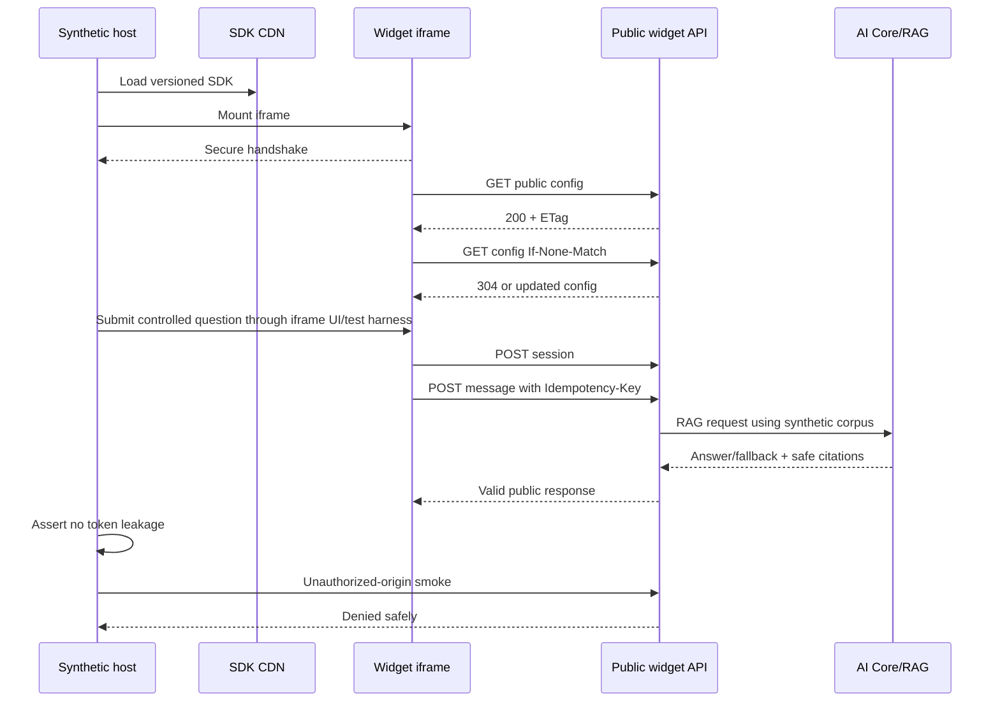

Must test actual versioned SDK load, iframe mount/handshake, real config with ETag, lazy session creation, controlled message response, safe citations if available, session reuse, no token leakage, close/reopen, unauthorized-origin denial, and safe rate/error behavior where practical.

No customer production data is used.

## 25. Synthetic Test Tenant

Create a dedicated synthetic tenant/widget later:

- Non-customer tenant.
- Deterministic public key and allowed synthetic host origin.
- Safe fake knowledge corpus and expected questions/answers.
- No PII or confidential content.
- Clearly labelled synthetic logs.

Uses: deployment smoke, scheduled synthetic availability, API contract validation, tenant-isolation smoke, release verification, and rollback verification.

## 26. Health Checks

Infrastructure health:

- SDK loader URL returns expected status/MIME/hash.
- Iframe HTML returns expected status/MIME/headers.
- Public API health endpoint returns healthy.
- CDN origin reachable.

Functional health:

- Config request succeeds for synthetic widget.
- Session creation succeeds.
- Controlled message completes.

Cadence: static/API health frequently, config/session smoke at deployment and moderate schedule, full RAG message smoke at deployment and less frequent schedule to control provider/cost load.

## 27. Observability Architecture

| Area | Metrics |
| --- | --- |
| SDK/static | request count, 4xx/5xx, latency, cache-hit ratio, bytes served. |
| Iframe HTML/assets | availability, latency, cache status, release version. |
| Public config | request rate, 304 rate, 4xx/5xx, latency, invalid widget/origin. |
| Sessions | create success/failure, rate limits, invalid widget/origin, latency. |
| Messages | request rate, success, fallback, low-confidence if supported, unsafe rejection, rate limits, timeout, 5xx, latency. |
| RAG dependencies | retrieval latency, provider latency, provider errors, vector store availability. |
| Security | denied origins, invalid session, malformed requests, suspicious rate spikes. |

Do not log message bodies, answers, citation excerpts, session tokens, idempotency keys, internal prompts, provider payloads, or PII by default.

## 28. Privacy-Preserving Logging

Allowed fields: timestamp, environment, route/method, HTTP status, duration, request/correlation ID, safe error category, release version/build ID, pseudonymous widget identifier where needed, and origin category or hashed origin if approved.

Prohibited fields: session token, idempotency key, raw public key unless access-controlled and required, message body, answer body, citation quoted text, draft text, PII, credentials/secrets, internal prompts/provider payloads, and raw browser storage.

Redaction must happen before logs leave the application boundary.

## 29. Correlation IDs

Server generates request ID when absent. Client-supplied IDs, if accepted, must be bounded and validated. Safe request IDs may be returned to iframe and shown only where appropriate. Internal trace/provider/prompt/cost identifiers are not exposed publicly.

## 30. Metrics Versus Product Analytics

Operational telemetry for reliability/security is allowed. Product analytics or behavioral tracking is excluded unless separately designed, reviewed, and approved. TASK-066A introduces no silent user-behavior tracking.

## 31. Alerting And Pilot SLOs

Alerts:

- Public API 5xx/config/session/message failure spikes.
- Latency degradation.
- Static asset unavailable.
- Synthetic smoke failure.
- Certificate expiry.
- CDN origin failure.
- Abuse/rate-limit spike.
- Security signals such as denied-origin spikes or suspected token/log anomaly.

Pilot internal SLO targets, not contractual SLA:

- SDK loader availability: 99.9% monthly target.
- Iframe HTML availability: 99.9% monthly target.
- Public config/session API availability: 99.5% pilot target.
- Message endpoint successful safe response: 99% excluding upstream AI/provider outages and policy rejections.
- p95 config/session latency under 1 second in production region.
- Message latency measured separately for retrieval/provider time; no contractual pilot target.

## 32. AI/RAG Dependency Degradation

When embedding service, vector store, model provider, provider quota, or retrieval is unavailable, public message endpoint returns safe fallback/unavailable behavior. Raw provider errors never reach widget UI or host page. Alert on sustained provider errors, retrieval timeouts, vector-store failures, and fallback spikes above corpus-specific expectations. Do not treat all fallback as outage.
## 33. Deployment Pipeline

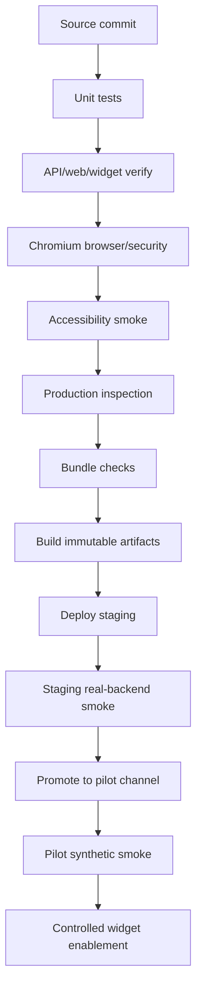

Evidence per release: Git commit SHA, artifact build IDs and versions, unit/browser/security/accessibility/visual results, production inspection, bundle sizes, header/cache validation, synthetic smoke result, and rollback target.

## 34. Artifact Model

Artifacts:

- SDK bundle: immutable semver path plus optional major alias.
- Iframe static bundle: HTML release plus hashed JS/CSS/assets.
- Backend deployment artifact/container.
- Migration artifact if future backend changes require it.

Each artifact records Git commit SHA, build ID, release version, build timestamp, environment/channel, and checksum. Client-visible assets must not include secrets, test hooks, localhost test hosts, mock responses, or production-inappropriate console logging.

## 35. Database Migration Policy

No migration is introduced by TASK-066A. Future production rules: backward-compatible migrations first, deploy migration before code when needed, no destructive migration during pilot without backup and rollback plan, document rollback limitations, and verify migrations in staging before pilot.

## 36. Rollback Architecture

| Component | Rollback method | Constraint |
| --- | --- | --- |
| SDK immutable version | Cannot mutate; customer changes embed or alias users roll back | Pinned broken versions require customer remediation. |
| SDK major alias | Atomically repoint `/widget-sdk/v1/loader.js` to previous known-good | Short TTL and purge required. |
| Iframe app | Repoint widget origin/channel to previous known-good release | Must remain protocol-compatible. |
| Backend | Deploy previous compatible artifact | Schema compatibility matters. |

Rollback requires previous known-good artifacts, no rebuild, synthetic smoke after rollback, and an incident record.

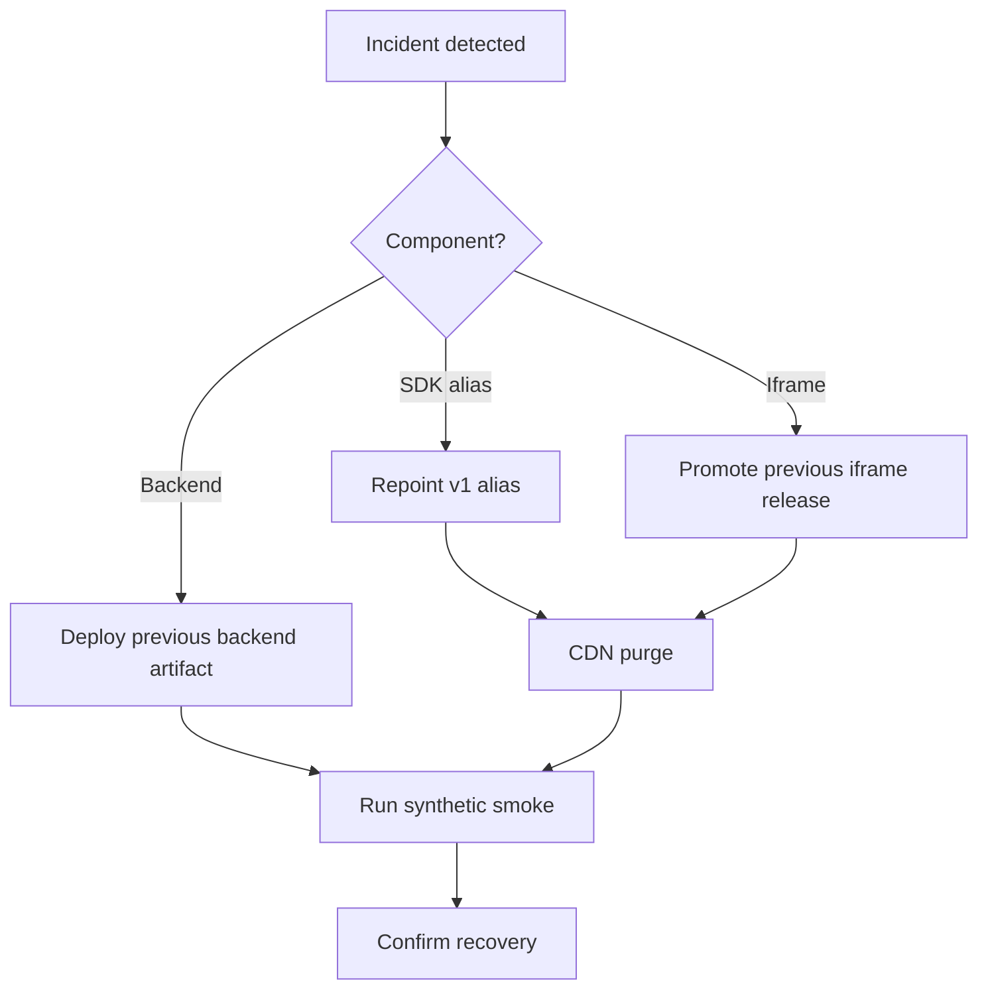

## 37. SDK Rollback And Customer Pinning

Immutable SDK assets remain immutable forever. Major alias cache TTL must be short enough for emergency rollback. Customers pinned to a broken immutable version require explicit outreach or host-page snippet update. Critical security revocation may be enforced by iframe/backend protocol minimums returning safe upgrade failure. SRI is recommended for pinned immutable URLs, not mutable aliases.

## 38. Kill Switches And Feature Flags

Architecture-only kill-switch scopes:

- Disable one widget public exposure.
- Disable one tenant's public widgets.
- Disable message sending globally while allowing config/launcher unavailable state.
- Disable entire public widget service.

Controls are authenticated internal/admin control, audit events, server-authoritative decisions, and fail-safe endpoint behavior.

Minimal feature flags: pilot enablement, canary iframe release assignment, and emergency message disable. Avoid a broad feature-flag platform for MVP.

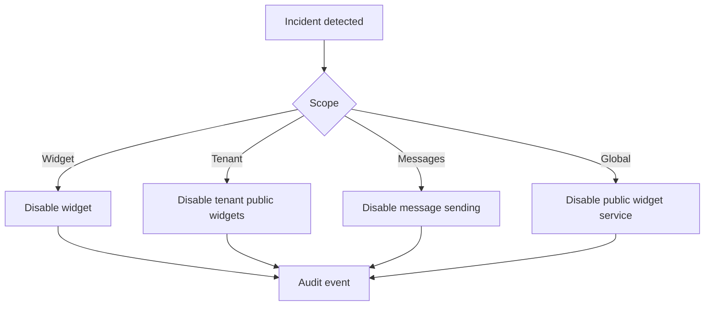

## 39. Incident Scenarios

| Scenario | Detection | Containment | Recovery |
| --- | --- | --- | --- |
| Bad iframe deployment | Synthetic smoke, browser errors | Roll back iframe release | Smoke and monitor. |
| Broken SDK alias | Loader errors, smoke fail | Repoint alias | Purge CDN, notify pinned customers if needed. |
| Backend outage | 5xx/latency alerts | Disable message sending if needed | Restore backend/rollback. |
| AI provider outage | Provider errors/fallback spike | Safe unavailable/fallback | Provider recovery or future failover. |
| Public key misuse | Origin/rate alerts | Rotate/revoke key | Reissue embed config. |
| Origin misconfiguration | Denied-origin spike/support | Fix allowed origin | Smoke authorized host. |
| CDN outage | Asset health check | CDN failover/manual bypass future | Restore CDN/origin. |
| Certificate issue | Certificate alerts | Renew/reissue | Validate TLS/HSTS. |
| Abuse traffic | WAF/app rate alerts | Rate-limit/block | Review logs. |
| Tenant isolation incident | Smoke/security alert | Disable affected widgets/public service | Incident response and root-cause review. |

## 40. Public-Key Compromise

A public widget key is intentionally public and is not a secret. Security relies on registered allowed origins, environment/prefix validation, session token policy, rate limits, abuse controls, and tenant-scoped public configuration/retrieval.

Rotation: generate replacement public key, update customer embed snippet, revoke old key after grace period or immediately for abuse, and audit the rotation.

## 41. Tenant-Isolation Smoke Tests

Use two or more synthetic tenants/widgets.

Required checks:

- Widget A cannot retrieve Widget B configuration.
- Widget A session token cannot access Widget B message endpoint.
- Widget A message cannot retrieve Widget B knowledge/citations.
- Wrong public key/origin pair is rejected.
- Cross-tenant session token is rejected.
- Caches do not cross widget, tenant, environment, or origin boundaries.

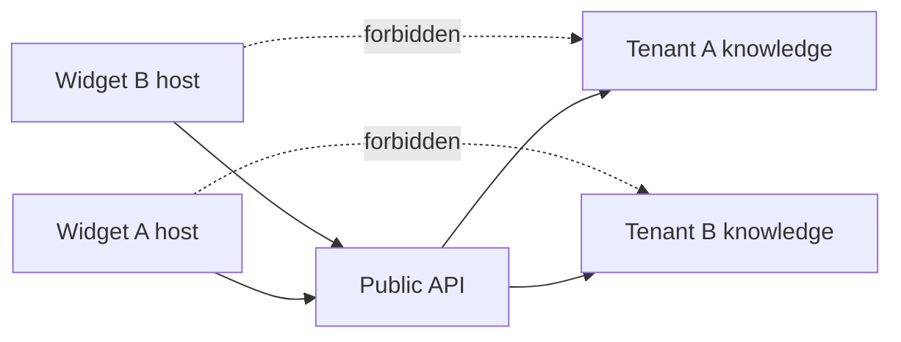

## 42. Cache Isolation

Cache keys must include public key/widget identifier, environment, asset version/hash for static assets, Origin where response varies by Origin, and API schema/config version where relevant.

Required `Vary`: `Origin` when CORS or eligibility depends on Origin; `Accept-Encoding` for compressed assets.

Prevent cross-widget public configuration delivery, CDN cache poisoning by arbitrary query strings, and serving staging/test artifacts on production aliases.

## 43. Secret And Configuration Management

Public values: SDK CDN URL, iframe URL, public API origin, and public widget keys.

Private values: database credentials, signing keys, AI provider credentials, infrastructure credentials, and internal deployment tokens.

Build-time values: public widget host/CDN/API origins for browser bundles.

Runtime values: operational flags, pilot allowlist, release channel assignment.

Rules: no secrets in client bundles, Git, logs, source maps, or test fixtures; no production test API injection; secret manager/environment injection with least privilege and rotation.

## 44. Source Maps And Error Monitoring

Production source maps should not be publicly served during initial pilot unless explicitly approved. Future private source-map upload to an error-monitoring service is allowed only after vendor/privacy review.

Vendor-neutral error monitoring may capture release version, safe error category, phase, browser class, and request ID where safe. It must not capture messages, answers, citations, drafts, session tokens, DOM snapshots containing conversations, or full host URLs. Redact URLs/query strings, use sampling, and tag environment/release.

## 45. Browser Monitoring

Recommended: deployment-time real smoke in staging and pilot, scheduled lightweight synthetic availability, less frequent full message-flow synthetic, and CI browser tests for code changes. Do not overload AI/RAG systems.

## 46. Pilot Scale And Gates

Initial pilot bounds: synthetic tenant plus a small number of approved customer widgets, manual enablement, bounded public session/message volume through existing controls, and close monitoring during rollout windows.

Pilot can begin only when production domains resolve, TLS is valid, headers are validated, SDK and iframe are served, public API access is constrained as designed, staging tests pass, synthetic tenant is configured, real-backend smoke passes, tenant-isolation smoke passes, token isolation passes in deployed environment, rollback is tested, monitoring/alerting is defined, release checklist is signed off, and known limitations are accepted.

Pilot success criteria: no tenant isolation incident, no token leakage, stable SDK/iframe availability, acceptable message success rate, corpus-contextual fallback rate, no unresolved P0/P1 security defect, no critical accessibility blocker from manual review, rollback demonstrated, and support/incident process functional.

GA requires production operational history, real customer traffic stability, manual screen-reader testing, monitoring maturity, incident-response readiness, capacity/load validation, backup/recovery validation, support docs, admin/publishing workflow, configuration lifecycle, and release/version support policy. TASK-066A does not declare GA readiness.

## 47. Manual Accessibility Validation

Pilot manual plan: NVDA with Chromium/Firefox on Windows, VoiceOver with Safari on macOS/iOS where available, keyboard-only flows, 200-400% zoom/reflow, Windows high contrast/forced colours, mobile orientation and virtual keyboard behavior. Automated browser tests do not replace manual assistive-technology validation.

## 48. Operational Ownership And Support Diagnostics

Roles: release owner, incident owner, security escalation, infrastructure owner, and application owner.

Safe support diagnostics: request ID, timestamp, widget public identifier or pseudonymous widget ID, release version, safe error category, and configured customer origin. Do not ask customers for session tokens, secrets, raw browser storage, raw conversations, or traces containing message content unless a privacy-reviewed support process exists.

Future safe diagnostic mode may expose SDK version, iframe reachability, handshake success, public configuration status, and allowed-origin result. It must not expose tokens, messages, answers, internal config, or raw backend details.

## 49. Additional Diagrams

### Production Domain Topology

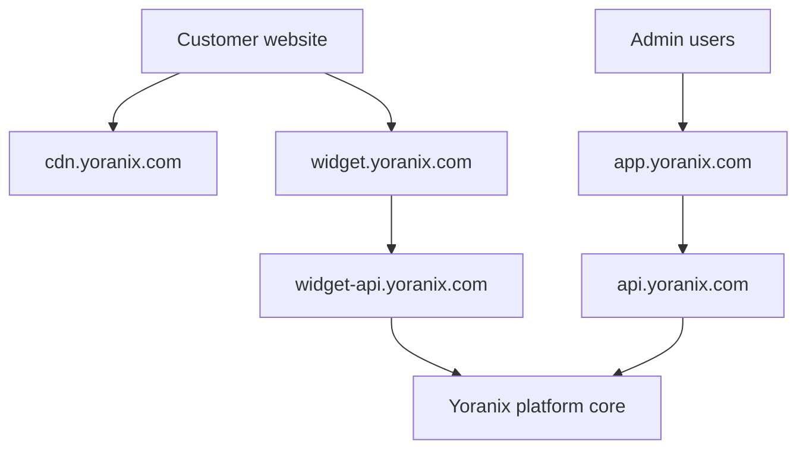

### Version Resolution

```mermaid
flowchart LR
    Embed[/widget-sdk/v1/loader.js] --> Loader[SDK v1.x]
    Loader --> Protocol[Protocol major 1]
    Protocol --> Iframe[Current compatible iframe release]
    Iframe --> API[Public API v1]
```

### Cache Model

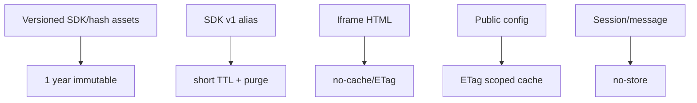

### Observability Flow

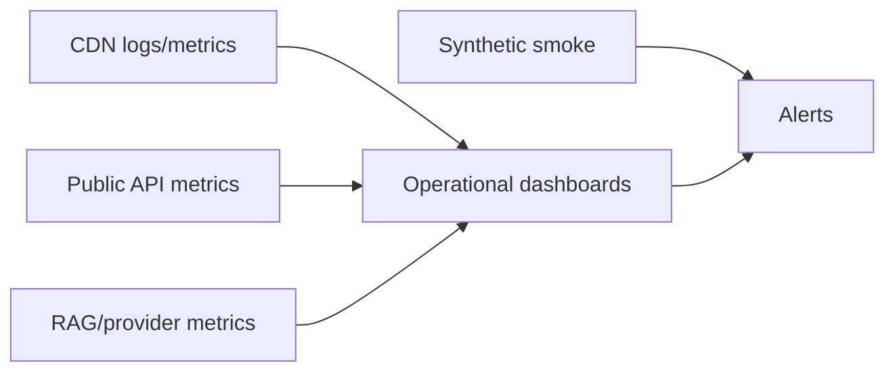

### Deployment Environments

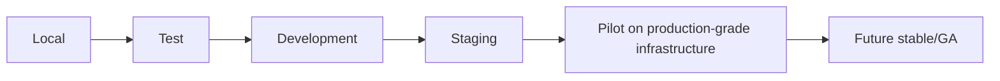

## 50. Implementation Split

`TASK-066B1` - Production deployment configuration, domains/environment wiring, CDN/static delivery, security headers, caching/versioning.

`TASK-066B2` - Synthetic widget/tenant, real-backend smoke tests, tenant-isolation smoke, release verification.

`TASK-066B3` - Operational metrics/logging/health checks, alerts, runbooks, rollback and kill-switch operational controls.

## 51. Acceptance Criteria

TASK-066A is complete when deployment topology, domain boundaries, SDK/iframe/API delivery architecture, versioning and compatibility, cache policy, CORS/security headers, pilot environment model, synthetic real-backend smoke, tenant-isolation production smoke, logging/privacy, observability, alerting, rollback, release channels, pilot/GA gates, ADR-0016, implementation split, and diagrams are documented, and no production infrastructure is deployed.
## TASK-066B1 Production Delivery Foundation

TASK-066B1 implements repository-local, provider-neutral release artifacts, origin validation, cache/header policy, manifest/checksum generation, production inspection, and versioned-loader browser smoke coverage. It does not deploy production infrastructure. See `docs/04_Engineering/Widget_Production_Delivery_Security_and_Versioning.md` and `docs/06_Operations/Widget_Deployment_Runbook.md`.
