# Widget Administration, Publishing, and Embed Management Architecture

Status: Proposed architecture for TASK-067A
Scope: Architecture and planning only. No admin UI, publishing API, migration, production runtime behavior, deployment infrastructure, or deployment is implemented by this document.

## 1. Purpose

Define how authenticated organisation administrators safely create, configure, preview, publish, disable, roll back, and embed Yoranix website-chat widgets while preserving the public widget boundaries established in TASK-061 through TASK-066.

The design keeps four concepts separate:

- Configuration publication: whether a safe published revision exists.
- Operational state: whether the widget is enabled or disabled.
- Pilot enablement: whether controlled-pilot policy permits traffic.
- Deployment release/channel: which SDK/iframe release is served.

The public widget runtime remains iframe-owned for config/session/message calls. Admin APIs are authenticated dashboard APIs and must never reuse anonymous public session authentication.

## 2. Existing System Context

Current implementation has:

- `PublicCredential` for public identifiers such as widget public keys.
- `CredentialAllowedOrigin` for normalized allowed host origins.
- `WidgetConfiguration` as one mutable row per credential.
- Public config endpoint serving only `status="published"` configuration.
- Public widget config/session/message endpoints guarded by public key, Origin, rate limits, session policy, and operational kill switches.
- Development-header RBAC with `super_admin`, `org_owner`, `client_admin`, `viewer`, and organisation membership checks.
- `AuditEvent` records with actor, organisation, workspace, action, entity, status changes, and safe metadata.
- TASK-066B3 server-side pilot allowlist and global/message/widget kill-switch controls.

Architecture gap:

The current one-row `WidgetConfiguration` model cannot support immutable published revisions plus ongoing draft edits without losing the active public snapshot. TASK-067B must introduce a revision model before a full production publishing workflow is implemented.

## 3. Bounded Context

Owned by widget administration:

- Authenticated widget list/detail administration.
- Draft configuration editing.
- Published configuration revisions.
- Allowed-origin management.
- Public key visibility and rotation workflow.
- Embed snippet generation.
- Preview grants for drafts.
- Publish, rollback, disable, archive, and audit.
- Admin-facing status and operational health summaries.

Not owned by widget administration:

- Public anonymous sessions.
- Public message processing.
- RAG orchestration.
- SDK loader runtime.
- Iframe visual UI behavior.
- Deployment/CDN rollout.
- Global operational incident controls.
- Product analytics.

## 4. Lifecycle Model

Widget lifecycle is a composition of separate state axes.

| Axis | States | Owner | Public effect |
| --- | --- | --- | --- |
| Configuration | `no_draft`, `draft`, `published`, `draft_with_published`, `superseded` revisions | Tenant admin publish flow | Public config reads active published revision only |
| Credential/public key | `draft`, `active`, `disabled`, `revoked`, `expired` | Tenant admin and internal operators | Public key resolution succeeds only when active |
| Operational state | `enabled`, `disabled`, `archived` | Tenant admin for own widget; internal for tenant/global | Disabled denies config/session/message |
| Pilot state | `not_approved`, `pilot_enabled` | Internal operator | Pilot era requires enabled and pilot-approved |
| Release channel | `pilot`, `stable`, optional `canary` | Internal release operator | Determines compatible SDK/iframe release |

Do not model these as one ambiguous `status`.

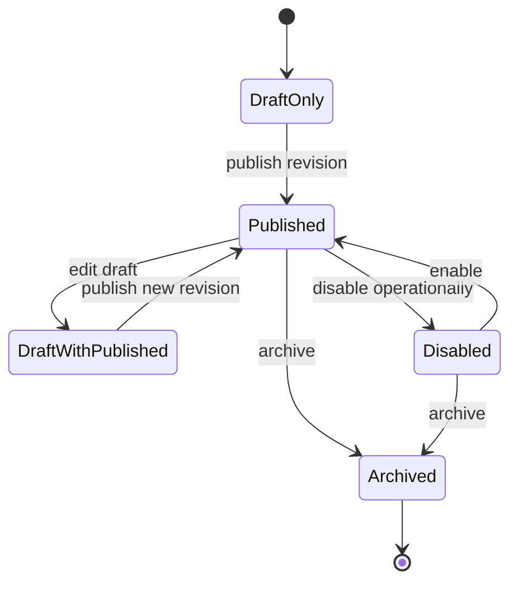

Pilot era public eligibility:

```text
active public key
+ active published revision
+ enabled widget
+ active tenant/workspace
+ allowed origin
+ pilot enabled
+ supported release channel
```

Stable/GA era public eligibility can remove the pilot-enabled requirement without changing the core publication model.

## 5. Target Data Model

Recommended target: stable widget identity plus immutable versioned configuration revisions.

Conceptual entities:

### Widget

- `id`
- `organisation_id`
- `workspace_id`
- `display_name`
- `public_credential_id`
- `operational_status`: `enabled`, `disabled`, `archived`
- `pilot_status`: `not_approved`, `pilot_enabled`
- `release_channel`: `pilot`, `stable`, optional `canary`
- `active_published_revision_id`
- `draft_revision_id` or latest draft pointer
- `created_by_user_id`
- timestamps

### WidgetConfigurationRevision

- `id`
- `widget_id`
- `organisation_id`
- `workspace_id`
- `revision_number`
- `status`: `draft`, `published`, `superseded`, `archived`
- validated configuration fields
- optional materialized public snapshot JSON
- content hash
- created/published actor and timestamps
- optimistic concurrency version

### WidgetAllowedOrigin

Existing `CredentialAllowedOrigin` can continue initially, but target architecture should attach origins to the widget/public credential boundary with:

- exact normalized origin fields
- active/inactive state
- environment
- actor/time audit
- optional future ownership verification status

### WidgetPublication

Either a separate publication event table or audit-backed publication record:

- widget
- active revision
- actor/time
- previous active revision
- publish reason

The implementation may retain `PublicCredential` for public key identity. The term `Widget` is the product-level abstraction; `PublicCredential` is the public access mechanism.

## 6. Draft Versus Published Configuration

Chosen model: immutable versioned configuration revisions.

Rules:

- Editing draft never changes the currently published public configuration.
- Publishing validates a draft and creates/promotes an immutable published revision.
- Public config endpoint reads only `active_published_revision_id`.
- Previous published revisions are retained for rollback.
- Draft can continue after publication.
- Revision content is immutable after publication.

Current-model migration note:

The current single-row `WidgetConfiguration` can seed the first `WidgetConfigurationRevision`, but the target implementation must not continue the one-row mutation model for production publishing.

## 7. Publish Transaction

Publishing must be one server-side transaction:

1. Authorize actor for `widget:publish`.
2. Load widget by organisation/workspace scope, not ID alone.
3. Load exact draft revision and verify optimistic concurrency.
4. Validate identity, branding, URLs, suggested questions, origins, knowledge scope, privacy/legal fields, and release compatibility.
5. Verify credential is active or publish can produce a clear non-public state.
6. Verify at least one valid allowed origin for production widgets.
7. Verify knowledge readiness or explicit fallback-only policy if approved.
8. Freeze immutable published revision with content hash.
9. Atomically update active published revision pointer.
10. Supersede prior active published revision.
11. Update publication metadata.
12. Ensure public config ETag changes.
13. Record audit event.
14. Return revision/version and status.

Publishing does not automatically enable pilot traffic.

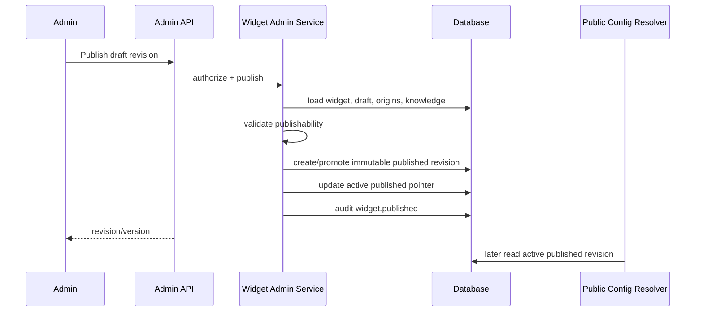

## 8. Public Configuration Propagation

Public configuration endpoint reads the active published revision only.

ETag should derive from:

- active revision ID or revision number
- response schema version
- content hash of sanitized public projection

Publishing changes the ETag. Existing iframe clients revalidate through the current ETag mechanism. No session/message cache invalidation is needed. Manual CDN purge should not be required for normal configuration changes if `Vary: Origin` and revalidation policies are correct.

Expected propagation in pilot: bounded by public config cache TTL/revalidation, target under a few minutes.

## 9. Configuration Rollback

Rollback is configuration-level, not SDK/backend rollback.

Rules:

- Do not mutate historical revisions.
- Select a prior published revision.
- Validate it against current widget state, origins, release compatibility, and knowledge readiness.
- Create a new publication event and either:
  - point active published revision to the historical immutable revision, or
  - clone it into a new published revision if the audit model requires monotonic active version numbers.
- ETag changes.
- Operational status, pilot status, and public key are unchanged unless separately modified.
- Audit actor/time/reason.

Recommended initial implementation: clone prior revision into a new published revision to keep active publication version monotonic and avoid ambiguity in support.

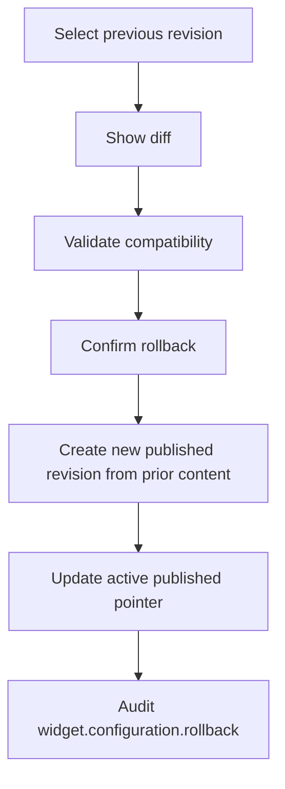

## 10. Public Key Lifecycle

Public widget keys are intentionally public identifiers, not secrets.

Generation:

- Use existing `wpk_{env}_...` pattern.
- Unique across credentials.
- Bound to organisation, workspace, environment, policy profile, and credential capabilities.

Visibility:

- Authorized admins may view/copy public key and embed snippet.
- Do not use password/secret UI metaphors.

Rotation:

- Requires `widget:key_rotate`.
- Shows impact warning.
- Creates a replacement public key.
- Initial policy: immediate cutover after new key activation; old key becomes disabled/revoked when operator confirms.
- Dual-key grace is future work only if backend can enforce it cleanly.
- Existing sessions tied to the old credential should be rejected once old credential is disabled/revoked.
- Audit required.

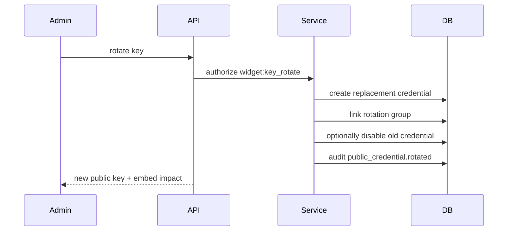

## 11. Allowed-Origin Management

Policy:

- Exact origins only for initial production administration.
- Origin format: scheme + hostname + optional non-default port.
- No path, query, fragment, credentials, wildcard `*`, or production HTTP.
- HTTPS required outside development/test.
- Localhost only for development credentials/environments.
- Punycode/IDN normalization.
- Duplicate prevention after normalization.
- Wildcard subdomains remain disabled for tenant admins during pilot; any future wildcard requires separate review and likely internal approval.

Workflow:

1. Admin enters origin.
2. Server normalizes and validates.
3. UI displays normalized value.
4. Add/remove is audited.
5. Removing an origin used by an active embed requires confirmation.

Domain ownership verification is not required for controlled pilot if origins are manually approved and pilot allowlist controls exist. GA should add ownership verification or an internal approval workflow for high-risk domains.

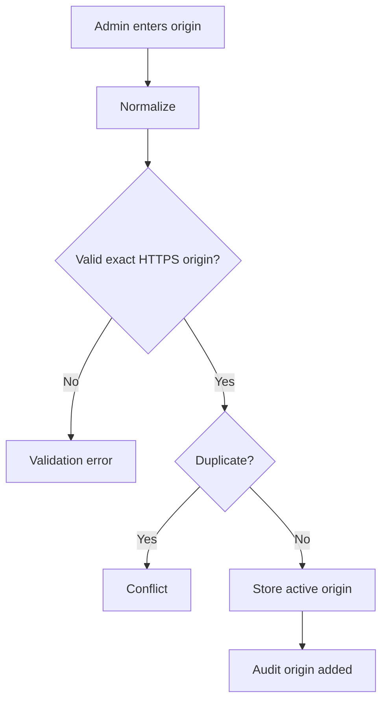

## 12. Configuration Fields

Target admin supports current public configuration fields only unless later architecture expands the public contract.

| Field | Required | Validation | Notes |
| --- | --- | --- | --- |
| Bot name | Yes | plain text, max 120 | Header and accessible labels |
| Welcome message | Yes | plain text, max 500 | Welcome state |
| Launcher label | Yes | plain text, max 80 | Accessible button label |
| Primary colour | Yes | hex, runtime contrast fallback | Admin previews fallback |
| Secondary colour | No | hex | Accent only |
| Logo/avatar | No | safe HTTPS raster or managed asset future | No remote SVG |
| Position | Yes | allowed enum | bottom left/right initially |
| Theme mode | Yes | light/dark/system | Runtime authoritative |
| Suggested questions | No | max count/length, plain text | Reorder supported |
| Fallback contact text | No | plain text, max 500 | Safe support guidance |
| Privacy notice text | No | plain text, max 1000 | No generated legal claims |
| Privacy/terms URLs | No | HTTPS production | Safe external links |
| Language | Yes | BCP-like bounded string | Future localization |
| Show citations | Yes | boolean | Only if backend supports citations |
| Conversation history | Yes | boolean | Disabled until history endpoint exists |
| Max suggestions | Yes | bounded against suggestion count | Current cap <= 6 |

Admin validation helps users; server validation is authoritative.

## 13. Branding Assets

Options:

- External HTTPS URL entry: simplest, but creates external dependency/tracking concerns.
- Managed upload: safer long-term, needs asset storage, processing, and lifecycle.
- Hybrid: allow URL initially, managed upload later.

Decision:

- Initial architecture may keep safe HTTPS raster URL/path fields matching current runtime.
- Long-term target is managed platform asset upload with MIME, size, dimension, malware/sanitization, cache, and deletion controls.
- Remote SVG remains unsupported until a dedicated sanitization architecture exists.

## 14. Suggested Questions

Admin UX:

- Add, edit, remove, reorder.
- Show count against limit.
- Reject empty, duplicate-after-trim if product chooses, overlong, HTML/control-heavy text.
- Display exactly as text, no Markdown/links.
- Publishing validates hidden overflow cannot be sent.

Recommended max visible runtime remains 4 desktop / 3 mobile; admin may store up to the current backend cap only if runtime supports selection.

## 15. Knowledge Scope

Widget knowledge scope must be tenant-bound and source-grounded.

Initial options:

- All ready public/published workspace knowledge.
- Selected documents or collections.
- Future knowledge bases.

Recommended target:

- Explicit widget knowledge scope using tenant-scoped resource selectors.
- If no selection model exists in implementation phase, default to all active ready workspace knowledge and document the limitation.
- Admin cannot select resources outside organisation/workspace.
- Publishing blocks when selected knowledge is not ready unless fallback-only publication is explicitly approved.

Readiness states:

- `ready`
- `indexing`
- `failed`
- `unavailable`
- `empty`

Do not expose vector IDs, chunk IDs, storage paths, provider names, or internal embedding details.

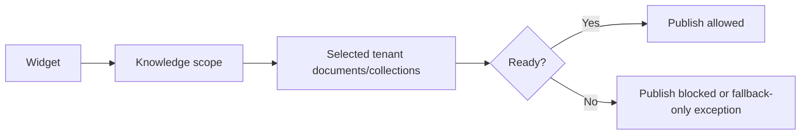

## 16. Preview Architecture

Preview must show saved draft configuration without exposing it through the public config endpoint.

Options:

- Admin app renders separate fake preview: rejected, low fidelity.
- Draft public key: rejected, creates public bypass risk.
- Authenticated short-lived preview grant/token: chosen target.

Preview grant properties:

- Authenticated admin only.
- Short lived.
- Signed/opaque.
- Widget-bound, organisation-bound, workspace-bound, draft-revision-bound.
- Cannot call normal anonymous public routes beyond preview scope.
- Not stored in host page embed snippets.
- Not a general public bypass.

Preview should use the same iframe visual application and config serializer where possible, with a preview config endpoint requiring authenticated preview authorization.

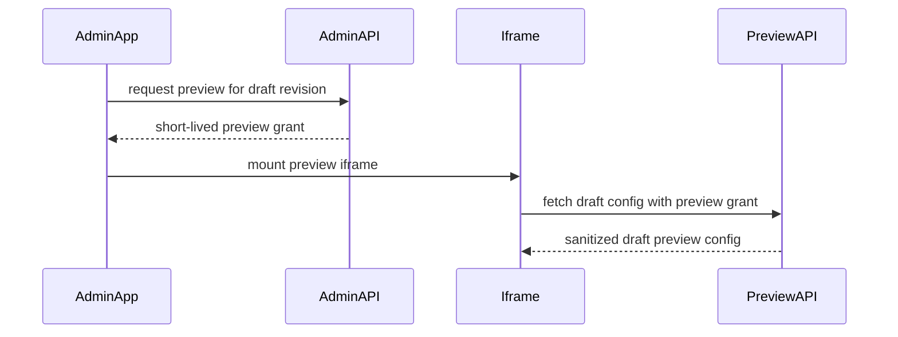

Preview conversations:

- Use preview sessions separated from public anonymous sessions.
- No customer-host Origin requirement when embedded inside authenticated admin app.
- Do not persist preview messages into public customer conversations unless explicitly approved.

## 17. Embed Management

Embed page shows:

- Public key.
- Current publication status.
- Allowed origins.
- Active published revision.
- SDK major alias default.
- Advanced pinned semantic SDK URL.
- Release channel/status.
- Copyable snippet.
- CSP guidance.
- Installation verification future hook.

Default snippet uses major alias:

```html
<script
  async
  src="https://cdn.example.com/widget-sdk/v1/loader.js"
  data-widget-key="PUBLIC_WIDGET_KEY">
</script>
```

Pinned semantic version is advanced:

```html
<script
  async
  src="https://cdn.example.com/widget-sdk/v0.1.0-foundation.0/loader.js"
  data-widget-key="PUBLIC_WIDGET_KEY"
  integrity="sha384-..."
  crossorigin="anonymous">
</script>
```

Do not offer uncontrolled `latest`, API URL overrides, iframe URL overrides, session tokens, or secret values.

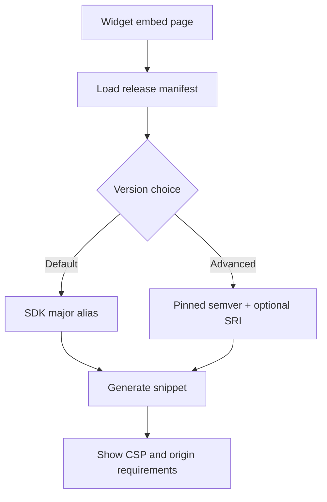

## 18. SDK Version And Release Channel Policy

- Normal tenant admins use platform-managed major alias.
- Exact pinned SDK version is advanced and only from supported release manifests.
- Tenant admins cannot select arbitrary SDK URLs.
- Internal operators control pilot/stable/canary release-channel assignment.
- Published configuration does not imply release-channel promotion.
- Unsupported SDK versions cannot be selected.

## 19. Pilot And Operational Status Presentation

Admin UI must distinguish:

- Published: safe configuration is available.
- Pilot enabled: controlled-pilot allowlist permits traffic.
- Enabled/disabled: operational policy permits or denies traffic.
- Release channel: deployment routing.

Tenant admins may disable their own widget if permitted. Global kill switches and release-channel controls belong to internal operational surfaces, not ordinary tenant administration.

## 20. Roles And Permissions

Current implementation uses role checks. Target architecture should move toward permission checks while mapping existing roles.

Permissions:

- `widget:view`
- `widget:create`
- `widget:edit`
- `widget:publish`
- `widget:disable`
- `widget:archive`
- `widget:key_rotate`
- `widget:origins_manage`
- `widget:embed_view`
- `widget:preview`
- `widget:rollback`

Internal-only:

- `widget:pilot_enable`
- `widget:release_channel_manage`
- `widget:tenant_disable`
- `widget:global_operations`

Suggested mapping:

| Role | Tenant permissions |
| --- | --- |
| `org_owner` | all tenant widget admin permissions |
| `client_admin` | create/edit/publish/origins/embed/preview/disable depending product policy |
| `viewer` | view/embed status only if approved |
| `super_admin` | internal operational permissions |

Tenant isolation rule: every admin operation must verify organisation/workspace membership and resource ownership before fetching or mutating widget resources.

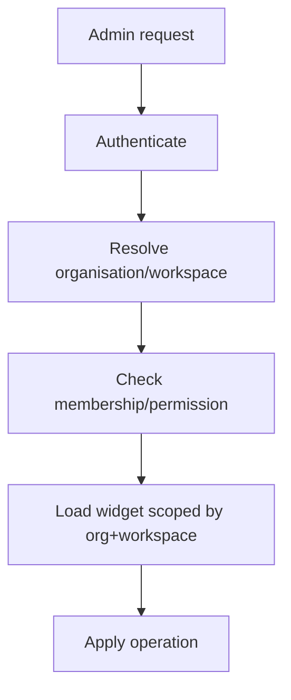

## 21. Audit Model

Audit events:

- `widget.created`
- `widget.draft.updated`
- `widget.origin.added`
- `widget.origin.removed`
- `widget.public_key.rotated`
- `widget.published`
- `widget.configuration.rollback`
- `widget.disabled`
- `widget.enabled`
- `widget.archived`
- `widget.pilot.enabled`
- `widget.pilot.disabled`
- `widget.release_channel.changed`
- `widget.preview.created`

Fields:

- actor user
- organisation/workspace
- widget
- action
- revision
- previous/new status where relevant
- safe metadata

Do not store session tokens, messages, answers, citation quotes, raw provider prompts, or secrets in audit metadata.

Configuration diffs should be field-level summaries, not whole unbounded blobs:

- `bot_name changed`
- `2 suggested questions added`
- `origin removed`
- `knowledge scope changed`

## 22. Optimistic Concurrency And Draft Editing

Initial admin model: explicit Save with dirty-state warning.

Rationale:

- Publishing is operationally sensitive.
- Autosave complicates preview/publish conflict semantics.
- Existing admin UI is not collaborative.

Concurrency:

- Use revision number, `updated_at`, or ETag/If-Match.
- Server rejects stale draft update/publish with 409 or 412.
- Publish targets an exact draft revision.
- Repeated publish of an already published exact revision should be idempotent or return current publication, not create uncontrolled duplicates.

## 23. Admin API Architecture

Conceptual endpoints under existing authenticated API conventions:

```text
GET    /api/v1/workspaces/{workspace_id}/widgets
POST   /api/v1/workspaces/{workspace_id}/widgets
GET    /api/v1/workspaces/{workspace_id}/widgets/{widget_id}
PATCH  /api/v1/workspaces/{workspace_id}/widgets/{widget_id}/draft
POST   /api/v1/workspaces/{workspace_id}/widgets/{widget_id}/publish
POST   /api/v1/workspaces/{workspace_id}/widgets/{widget_id}/rollback
GET    /api/v1/workspaces/{workspace_id}/widgets/{widget_id}/origins
POST   /api/v1/workspaces/{workspace_id}/widgets/{widget_id}/origins
DELETE /api/v1/workspaces/{workspace_id}/widgets/{widget_id}/origins/{origin_id}
POST   /api/v1/workspaces/{workspace_id}/widgets/{widget_id}/rotate-key
GET    /api/v1/workspaces/{workspace_id}/widgets/{widget_id}/embed
POST   /api/v1/workspaces/{workspace_id}/widgets/{widget_id}/disable
POST   /api/v1/workspaces/{workspace_id}/widgets/{widget_id}/enable
GET    /api/v1/workspaces/{workspace_id}/widgets/{widget_id}/revisions
POST   /api/v1/workspaces/{workspace_id}/widgets/{widget_id}/preview-grants
```

All routes require `organisation_id` by current convention or a future cleaner tenant route pattern. Do not accept tenant IDs from body. Do not return session tokens or internal signing/config details.

## 24. Admin Frontend Information Architecture

Suggested pages:

- Widget list.
- Widget overview.
- Appearance.
- Conversation.
- Knowledge.
- Domains.
- Privacy.
- Preview.
- Publish.
- Embed.
- Activity/revisions.

Operational/internal controls are permission-gated and visually separated.

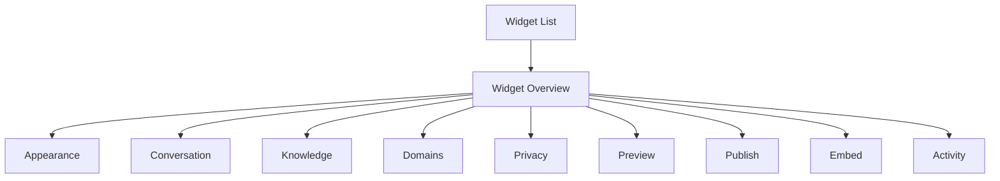

UI principles:

- Work-focused dashboard UI, not marketing hero.
- Clear status chips for published, draft changes, disabled, pilot, and release channel.
- Diff and validation before publish.
- Safe copyable embed snippet.
- Coarse health for tenant admins; detailed operational state for internal operators only.

## 25. Page Responsibilities

Widget list:

- bot/display name
- status
- pilot state
- last published
- draft changes
- origin count

Overview:

- active revision
- draft status
- public key state
- allowed origins
- knowledge readiness
- embed availability

Appearance:

- bot name, launcher label, colours, logo/avatar, theme, position
- draft preview using same token validation

Conversation:

- welcome message, suggestions, language, citation/history capability controls

Knowledge:

- tenant-scoped resource selection, indexing status, readiness

Domains:

- normalized origin list, add/remove, status, audit metadata

Privacy:

- privacy notice, privacy URL, terms URL, fallback contact text

Preview:

- desktop/mobile draft preview, reset preview session

Publish:

- validation status, diff, origins, knowledge readiness, confirmation, publish action

Embed:

- snippet, SDK version/channel, CSP guidance, allowed origins, future verify-installation

Activity:

- audit and revision history, compare, rollback

## 26. Error Model

Admin errors use structured responses:

- `permission_denied`
- `widget_not_found`
- `stale_revision`
- `validation_failed`
- `origin_duplicate`
- `invalid_origin`
- `knowledge_not_ready`
- `publish_failed`
- `unsupported_sdk_version`
- `preview_grant_denied`
- `rollback_not_allowed`

Never expose stack traces, raw DB errors, secrets, token material, internal provider details, or cross-tenant existence.

## 27. Security Threats And Controls

| Threat | Controls |
| --- | --- |
| Cross-tenant widget editing | Scope every query by organisation/workspace; membership checks; tests |
| Forged widget IDs | Never load by ID alone |
| Stale draft overwrite | Revision/ETag concurrency |
| Public key abuse | Origin validation, rate limits, rotation, disable |
| Origin wildcard misuse | Exact origins only for pilot; wildcard internal review |
| Malicious HTML in config | Plain-text validation and runtime text rendering |
| Unsafe URLs/assets | HTTPS/raster validation; managed upload future |
| External asset tracking | Admin warning; managed asset target |
| Preview token leakage | Short-lived draft-bound grants; no public routes |
| Unauthorized publish | `widget:publish` permission and audit |
| Unauthorized pilot enablement | Internal-only permission/control plane |
| Audit tampering | Append-only audit model and restricted writes |
| Config cache poisoning | Revision-derived ETag and `Vary: Origin` |
| Rollback confusion | New publication event, diff, explicit revision |

## 28. Testing Strategy

Future implementation tests:

API:

- widget CRUD
- draft update
- publish exact revision
- rollback
- key rotation
- origin add/remove
- embed snippet generation
- preview grant
- tenant isolation
- RBAC/permissions
- stale revision conflicts
- validation errors

Security:

- Tenant A cannot view/edit/publish/rotate/generate embed for Tenant B.
- Viewer cannot publish.
- Tenant admin cannot pilot-enable.
- Host/client cannot set operational flags.
- Preview grant cannot access normal public routes.
- Malicious config remains inert.

Browser/UI:

- list/detail IA
- forms and validation
- diff and publish confirmation
- preview desktop/mobile
- embed copy
- revision history and rollback
- permission-gated controls

Public regression:

- public config still reads only active published revision.
- draft edits do not affect public ETag/body.
- publish changes ETag.
- rollback changes ETag.

## 29. Implementation Split

`TASK-067B1` - Data model, revisioning, admin service layer, RBAC, draft and publish APIs.

`TASK-067B2` - Allowed origins, public-key lifecycle, embed/version management APIs.

`TASK-067B3` - Admin frontend widget list, settings, draft editing, validation.

`TASK-067B4` - Preview, publish workflow, revision history, rollback, embed page.

`TASK-067B5` - Security/browser/integration hardening and pilot admin release gate.

## 30. Diagrams

### Revision Model

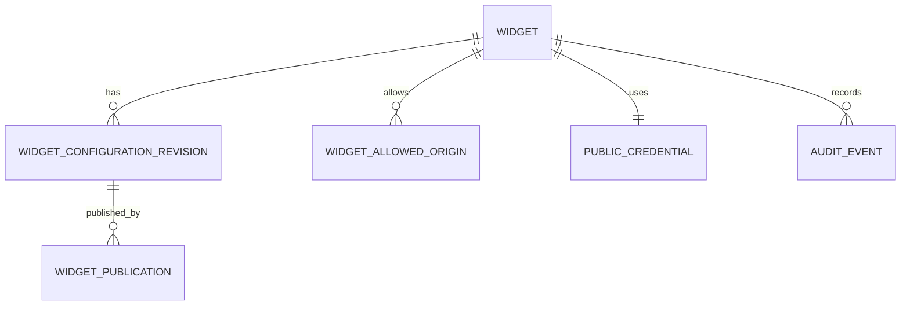

### Public Config Resolution

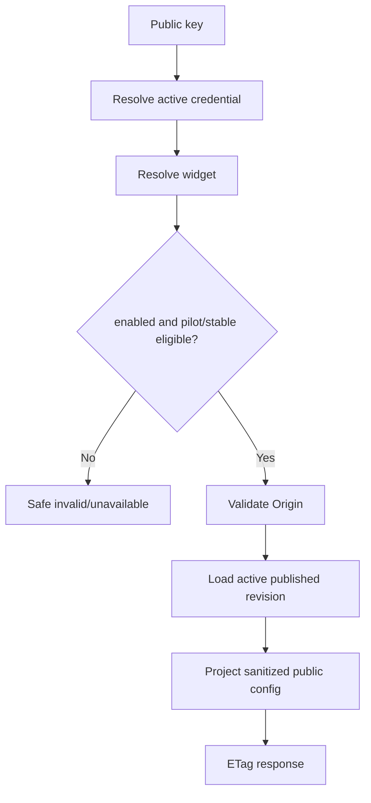

### Preview Boundary

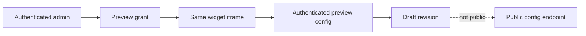

### Pilot To Stable Evolution

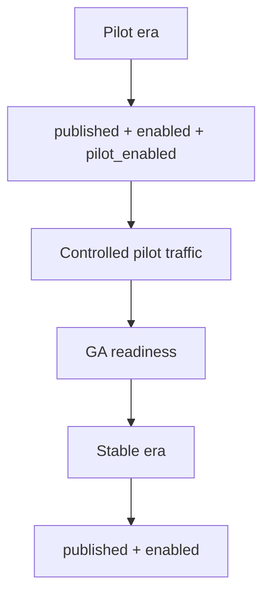

## 31. Acceptance Criteria

TASK-067A is complete when lifecycle, draft/published model, revision architecture, public key lifecycle, origin management, preview, publishing, rollback, embed management, SDK version/channel policy, pilot separation, RBAC, tenant isolation, audit, admin IA, tests, implementation split, diagrams, and ADR-0017 are documented, and no runtime/admin implementation is added.

## TASK-067B1 Implementation Note

Widget administration now has a backend revisioning foundation: stable `Widget` identity, immutable `WidgetConfigurationRevision` snapshots, draft updates with optimistic concurrency, publish and rollback APIs, and public configuration resolution through the active published revision. Allowed-origin CRUD, public-key rotation, embed management, preview grants, and admin frontend work remain deferred to later TASK-067B tasks.

## TASK-067B2 Implementation Note

Allowed-origin CRUD, public-key rotation, SDK embed-version preference, supported-version listing, and embed metadata/snippet APIs are now implemented in the authenticated backend. Origins and embed preferences are stable widget/public-credential metadata, not configuration revision fields. Public key rotation is immediate cutover and does not mutate published configuration history. Preview grants, frontend screens, installation verification, and dual-key grace periods remain deferred.

## TASK-067B3 Implementation Note

The first authenticated widget administration frontend is implemented in the Next.js dashboard. It covers list, creation, settings, domains, embed snippet management, approved SDK version selection, and public-key rotation. Preview grants, publish UI, revision history, rollback UI, knowledge selection, and installation verification remain deferred to later tasks.
