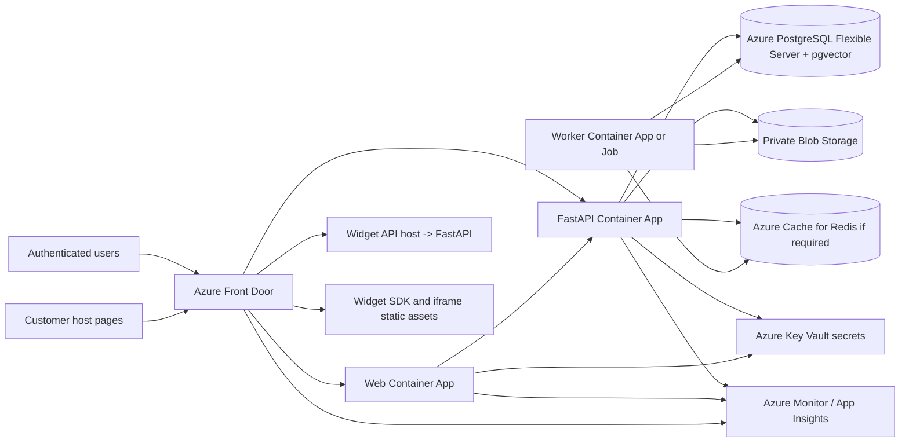
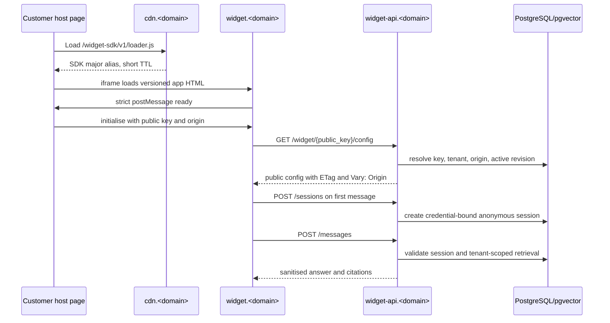
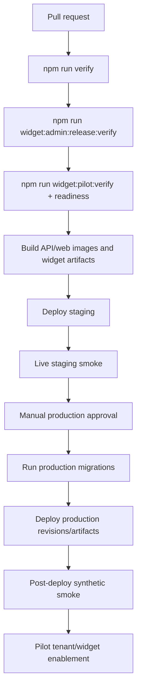
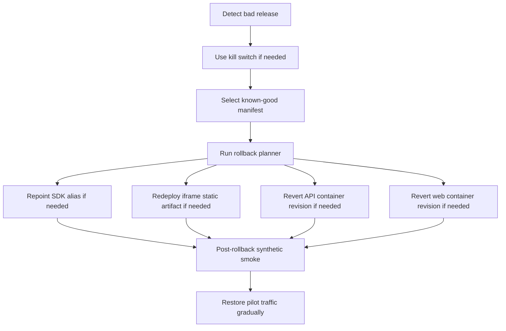
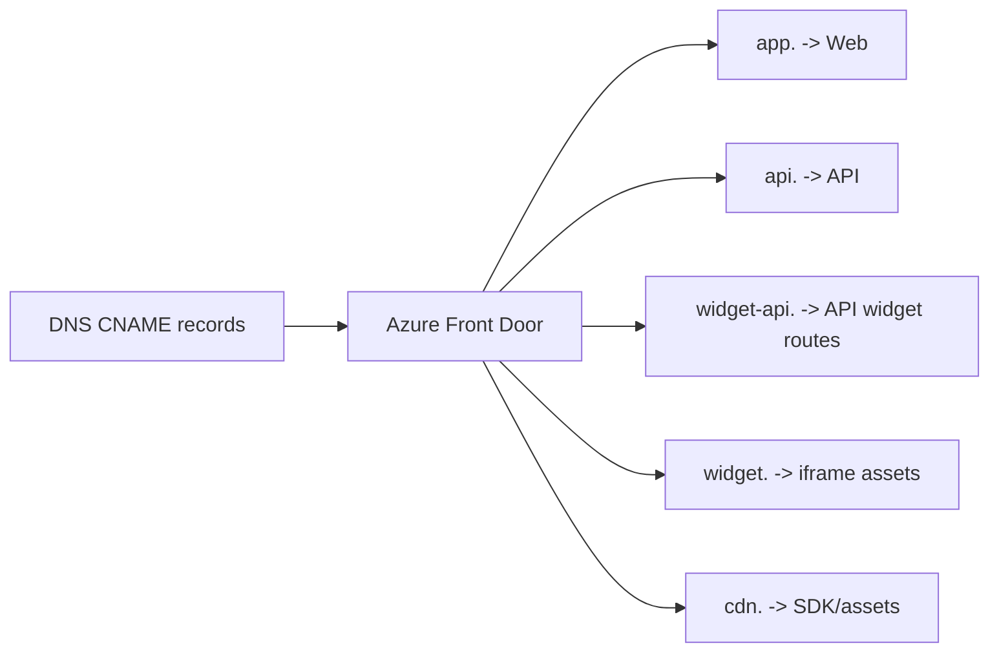
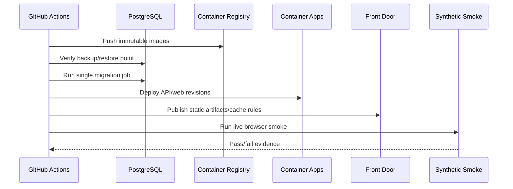
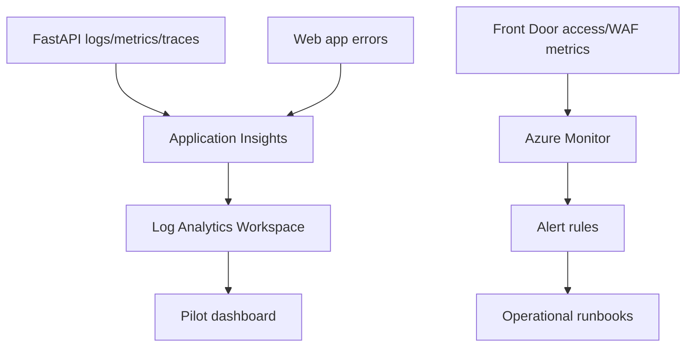
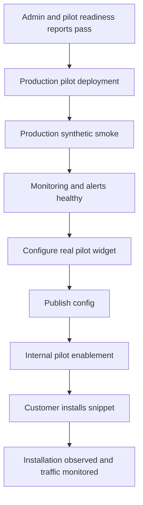

# Controlled Pilot Production Deployment and Validation Architecture

## 1. Purpose

This document defines the controlled-production-pilot deployment architecture for the Yoranix AI Platform and embeddable widget system.

The repository is currently ready for controlled-pilot administration and repository-local widget verification, but production deployment has not occurred. This architecture turns that readiness into a concrete deployment model for staging and production pilot.

This document is planning only. It does not provision infrastructure, change DNS, create credentials, deploy services, or modify live environments.

## 2. Non-Goals

TASK-068A does not cover:

- Production deployment execution
- DNS changes
- Cloud account creation
- Live secret creation
- Production tenant enablement
- GA readiness
- Product analytics
- Lead capture
- Human handoff
- Monitoring vendor implementation code
- Kubernetes implementation

## 3. Infrastructure Discovery

The repository currently has a Docker-first local/runtime model and provider-neutral widget delivery artifacts.

Discovered files:

- `docker-compose.yml` defines local PostgreSQL with pgvector, Redis, API, and web services.
- `apps/api/Dockerfile` defines a FastAPI container, currently with a development-style `uvicorn --reload` command that must be productionized in TASK-068B1.
- `apps/web/Dockerfile` defines a Next.js container, currently with a development-style command that must be productionized in TASK-068B1.
- `deployment/widget/headers.json` defines cache/security header policy for widget assets.
- `deployment/widget/alerts.json` defines provider-neutral alert definitions.
- `deployment/widget/sdk-versions.json` defines supported SDK metadata.
- `.env.example` defines local placeholders for widget public, API, iframe, and SDK origins.
- `.github/workflows/verify.yml` runs repository verification, widget pilot readiness, admin readiness, and artifact upload. It does not deploy.
- `infrastructure/README.md` describes planned infrastructure folders but no committed cloud implementation.

No production provider is currently committed through Terraform, Pulumi, Helm, Kubernetes, Cloudflare, Azure, AWS, Render, Railway, Fly, Vercel, Netlify, nginx, Caddy, or Traefik configuration.

## 4. Hosting Options Considered

| Option | Fit | Strengths | Risks | Decision |
| --- | --- | --- | --- | --- |
| Azure-first | High | Matches enterprise direction, supports managed containers, PostgreSQL Flexible Server with pgvector, Key Vault, Front Door, Blob Storage, Azure Monitor, GitHub OIDC | Azure networking and Front Door setup require care | Selected |
| AWS-first | High | Mature ECS/App Runner, RDS/Aurora PostgreSQL, S3, CloudFront, CloudWatch | More service assembly; project context is not AWS-first | Rejected for pilot |
| Cloudflare plus managed app/database | Medium | Excellent CDN/static edge, R2, WAF, Workers | FastAPI/container, PostgreSQL/pgvector, and private network story depends on another provider | Rejected for pilot |
| Single VPS/container host | Medium for cost | Simple, low entry cost, Docker Compose alignment | Weaker managed backups, secrets, monitoring, HA, and rollback safety | Rejected for production pilot |

## 5. Selected Model

The controlled pilot uses Azure-first hosting:

- Azure Front Door Standard or Premium for public ingress, TLS, routing, WAF, CDN behavior, and header/cache attachment.
- Azure Container Apps for the FastAPI API, Next.js web app, and optional background workers.
- Azure Container Registry for immutable container images.
- Azure Database for PostgreSQL Flexible Server with the `vector` extension for pgvector-backed retrieval.
- Azure Blob Storage for private object/document storage and public static widget artifact origins.
- Azure Key Vault for secrets.
- Azure Cache for Redis only if required by the distributed limiter or queue implementation at deployment time.
- Azure Monitor, Log Analytics, and Application Insights OpenTelemetry for monitoring and error visibility.
- GitHub Actions for CI/CD, release gates, deployment approval, smoke tests, and rollback planning.

The model intentionally avoids Kubernetes for pilot. Azure Container Apps gives container revisions, health probes, managed ingress, autoscaling, secrets integration, and private environment networking without requiring cluster operations.

## 6. Pilot Scale

Initial controlled pilot assumptions:

- Fewer than 10 approved pilot tenants.
- Fewer than 50 public widgets.
- Low to moderate message volume.
- Exact-origin customer domains only.
- Manual production approval and manual tenant enablement.
- No GA autoscaling guarantees.
- Rollback target must be known before deployment.
- Staging must prove the release before production.

Pilot sizing is conservative and should be revised after observed traffic.

## 7. Production Topology

## 8. Environment Topology

| Environment | Purpose | Data | Deployment |
| --- | --- | --- | --- |
| Local | Developer work | Local synthetic/dev data | Docker Compose |
| Test/CI | Automated tests | Ephemeral synthetic data | GitHub Actions services |
| Staging | Production-like release validation | Synthetic staging tenants only | Azure staging resources |
| Production pilot | Real controlled pilot | Approved pilot tenants plus synthetic smoke tenants | Azure production resources |

The production pilot is a production-grade environment with controlled tenant/widget enablement, not a throwaway pilot environment. This preserves real domain, TLS, CORS, CSP, cache, monitoring, and rollback behavior while limiting exposure through pilot allowlists and operational controls.

## 9. Domain Model

Final domain names remain placeholders until the organisation approves the production domain. TASK-068B1 must replace `<domain>` with the approved domain through code-reviewed DNS/IaC.

| Host | Purpose | Azure Target | DNS | TLS |
| --- | --- | --- | --- | --- |
| `app.<domain>` | Authenticated dashboard/admin web app | Front Door -> Web Container App | CNAME to Front Door | Front Door managed cert |
| `api.<domain>` | Authenticated platform API | Front Door -> API Container App | CNAME to Front Door | Front Door managed cert |
| `widget-api.<domain>` | Public widget config/session/message API | Front Door -> same API Container App with widget host routing | CNAME to Front Door | Front Door managed cert |
| `widget.<domain>` | Widget iframe HTML/app | Front Door -> Blob static origin | CNAME to Front Door | Front Door managed cert |
| `cdn.<domain>` | Widget SDK and hashed iframe assets | Front Door -> Blob static origin | CNAME to Front Door | Front Door managed cert |

HSTS is enabled after domain validation. No production CORS wildcard is allowed.

## 10. Request Flow

## 11. Web Application Hosting

The authenticated Next.js application runs as an Azure Container App behind Azure Front Door.

Starting pilot configuration:

- Minimum replicas: 1
- Maximum replicas: 2 or 3
- CPU/memory: start at 0.5 vCPU / 1 GiB and tune from observed load
- No production dev server command
- Secure auth/session configuration
- API origin configured as `https://api.<domain>`
- Source maps private or disabled; never publicly exposed if they reveal source internals

TASK-068B1 must replace the current development Docker command with a production Next.js start command or standalone build pattern.

## 12. API Hosting

FastAPI runs as an Azure Container App behind Azure Front Door.

Starting pilot configuration:

- Minimum replicas: 1
- Maximum replicas: 2 or 3
- CPU/memory: start at 1 vCPU / 2 GiB and tune from metrics
- No `--reload` in production
- Health probes:
  - `/health/live` for liveness
  - `/health/ready` for readiness
- No automatic migration execution from every API instance
- Structured logs with request IDs
- Public widget API host routed through `widget-api.<domain>`

TASK-068B1 must define the production ASGI command and worker count. The default should avoid multiplying DB connections beyond the managed PostgreSQL pool.

## 13. Database and Vector Search

Use Azure Database for PostgreSQL Flexible Server with the `vector` extension enabled for pgvector retrieval.

Pilot requirements:

- Private network access from Container Apps environment where feasible
- TLS required in transit
- Encryption at rest
- Automated backups and PITR where available
- Least-privilege application database user
- Migration user separated where practical
- Connection pooling configured conservatively
- `vector` extension created through migration/setup procedure

Vector search remains in PostgreSQL for pilot. A separate vector database is deferred until observed scale or retrieval requirements justify it.

## 14. Object and Document Storage

Use Azure Blob Storage for tenant document/object storage.

Requirements:

- Private containers by default
- No public arbitrary document access
- Signed access only where application flow requires it
- Encryption at rest
- Tenant/object keys scoped and auditable
- Lifecycle policy for temporary processing artifacts
- Backup/durability aligned with Azure Storage account settings

Public widget assets use a separate storage/container boundary from private uploaded documents.

## 15. Background Processing and Redis

The repository currently includes Redis in local Compose. Production should only deploy Redis when the runtime path requires distributed rate limiting, background queueing, or Celery-style workers.

Pilot model:

- If existing ingestion/embedding jobs are asynchronous, run a dedicated Azure Container App worker or Azure Container Apps Job.
- If distributed rate limiting requires Redis, use Azure Cache for Redis with non-public access and TLS.
- Do not add Redis solely as a conventional default if no deployed runtime path needs it.
- Long indexing or embedding jobs should not run inside request/response paths if the current architecture already separates them.

## 16. CDN, SDK, and Iframe Delivery

Azure Blob Storage plus Azure Front Door serves widget static assets.

Delivery rules:

- Immutable SDK semantic version path: long immutable cache, checksum/SRI from B1 manifest.
- SDK major alias path: short TTL and rollback-friendly alias update.
- Iframe hashed JS/CSS assets: long immutable cache.
- Iframe HTML: revalidatable/no-cache behavior.
- Compression enabled through Front Door/static delivery.
- Headers are derived from `deployment/widget/headers.json`.
- No `latest` SDK URL.

SRI is included only for pinned immutable SDK snippets. Major aliases must not carry fixed SRI because alias targets can change during controlled rollout or rollback.

## 17. Public API Origin and CORS

The public widget API is served at `https://widget-api.<domain>` by the same FastAPI deployment as the authenticated API, but through a separate public host and explicit route policy.

CORS policy:

- Public widget config/session/message API allows the widget iframe origin, not arbitrary customer hosts.
- Application-level allowed-origin validation remains the primary tenant/widget origin control.
- Authenticated dashboard API allows `https://app.<domain>` only.
- No wildcard production CORS.
- `Vary: Origin` remains required where responses differ by origin.

## 18. Network Architecture

Public ingress is Azure Front Door. Backend dependencies should remain non-public where feasible.

- Front Door terminates TLS and routes hostnames.
- Container Apps receive only approved ingress paths.
- PostgreSQL is private or firewall-restricted to the application environment.
- Private document storage is not publicly exposed.
- Public static storage is reachable through Front Door/CDN behavior, not arbitrary mutable application paths.
- Admin access is through authenticated app/API only.
- WAF/rate limiting policies are attached at Front Door and application layers.

## 19. Secret Management

Use Azure Key Vault plus Azure Container Apps secrets/GitHub OIDC.

Secrets include:

- Database credentials
- Session/signing keys
- Preview grant signing keys
- AI provider keys
- Storage credentials
- SMTP/email credentials
- Monitoring connection strings
- Redis credentials if used

Production `.env` files are not the primary secret-management mechanism. No production secrets are committed to the repository.

## 20. Environment Variable Matrix

| Category | Examples | Browser Safe | Source |
| --- | --- | --- | --- |
| Web public build/runtime | Public app URL, public API base URL | Only explicit `NEXT_PUBLIC_*` values | Container Apps config |
| Widget public build | iframe origin, widget API origin, SDK origin | Yes, origin-only values | release build config |
| API runtime config | environment, release, public origins, rate limits | No | Key Vault/Container Apps secrets |
| Operational flags | public widget enabled, messages enabled, pilot allowlist | No | Container Apps config/secret as appropriate |
| Secrets | DB URL, provider keys, signing keys, storage keys | Never | Key Vault |

Production inspection must prove test auth, test tenants, preview test keys, and synthetic local ports are not exposed in browser bundles.

## 21. AI Provider Configuration

AI provider keys are server-only. The widget SDK, iframe, and web app must never receive provider credentials.

Pilot should use the current approved provider abstraction. Staging may use deterministic providers for synthetic verification where permitted by B2/B3; production pilot smoke may use safe synthetic tenants and rate-bounded real backend configuration.

## 22. Migration Deployment

Migration procedure:

1. Confirm release manifest and rollback target.
2. Confirm latest backup or restore point.
3. Run backward-compatible Alembic migrations through a single GitHub Actions job or Azure Container Apps Job.
4. Verify migration status.
5. Deploy API container revision.
6. Run readiness and synthetic smoke.
7. Deploy web/widget/static artifacts as applicable.
8. Run post-deploy smoke.

Migrations must not run automatically from every horizontally scaled API instance.

## 23. Release Artifacts

Release identity includes:

- Git SHA
- API image digest
- Web image digest
- SDK semantic version
- SDK major alias target
- Iframe static artifact manifest
- B1 release checksums/SRI
- Admin readiness report
- Pilot readiness report

Containers are pushed to Azure Container Registry. Static widget assets are uploaded to the static asset storage account and served through Front Door.

## 24. CI/CD Promotion

Production deployment requires manual approval with release manifest, readiness reports, migration plan, rollback target, and staging smoke evidence.

## 25. Staging

Staging must be production-like:

- Same hosting class as production
- Separate database/storage/secrets
- Same domains pattern with staging hostnames
- Same header/cache/CORS policies
- Synthetic tenants/widgets/knowledge only
- Same SDK/iframe artifact paths
- Same live FastAPI browser smoke
- Same rollback drill capability

## 26. Live FastAPI Browser Smoke

The live smoke closes the residual gap left by repository-local checks.

Flow:

Customer-like synthetic host -> deployed versioned SDK -> deployed iframe -> deployed FastAPI -> deployed PostgreSQL/pgvector -> synthetic tenant knowledge.

Assertions:

- Loader loads from versioned SDK path
- Iframe mounts from deployed origin
- Strict handshake succeeds
- Real public config endpoint returns synthetic tenant config
- Session is lazily created
- Real message endpoint returns safe answer/fallback
- Citations are tenant-isolated
- Session reuse works
- Wrong origin is denied
- Cross-tenant session/retrieval is denied
- Token is absent from parent DOM, storage, URL, postMessage, cookies, and console
- Close/reopen behavior remains correct

Run in staging before production and after production deployment using synthetic tenants only.

## 27. Synthetic Production Validation

Maintain permanent synthetic production smoke tenants:

- Synthetic Tenant Alpha
- Synthetic Tenant Beta

Requirements:

- No customer data
- No PII
- Distinct origins, widgets, public keys, and knowledge corpus
- Rate-bounded smoke execution
- Excluded from commercial/product analytics
- Used for post-deploy tenant isolation verification

## 28. Monitoring and Error Tracking

Use Azure Monitor, Log Analytics, and Application Insights OpenTelemetry.

Required signals:

- API liveness/readiness
- Web availability
- Public config success/failure
- Session success/failure
- Message success/failure
- 5xx rate
- Latency
- Rate limits
- Fallback rate as informational
- DB health
- CDN/static availability
- Synthetic smoke state
- Active release/version

Privacy rules:

- No public message bodies
- No assistant answers
- No citation text
- No session tokens
- No Authorization headers
- No provider prompts
- No raw hostile origins
- No replay/session recording of widget conversations

Source maps are private uploads to the monitoring provider where supported. If private source maps are not supported for a deployed frontend, public source maps are disabled.

## 29. Alerts

Map `deployment/widget/alerts.json` to Azure Monitor alert rules in TASK-068B3.

Minimum pilot alerts:

| Severity | Signal | Starting threshold |
| --- | --- | --- |
| Critical | API unavailable | Failed readiness/liveness for consecutive checks |
| Critical | Repeated post-deploy synthetic failure | 2 consecutive failed smoke runs after deploy |
| Critical | DB unavailable | Readiness DB failure for consecutive checks |
| Incident | Public message 5xx spike | Environment-tuned percentage over 5 minutes |
| Incident | Session creation failure spike | Environment-tuned percentage over 5 minutes |
| Incident | Public config failure spike | Environment-tuned percentage over 5 minutes |
| Warning | Elevated latency | Environment-tuned p95 over baseline |
| Warning | Elevated rate limits | Investigation threshold, not one-off alert |

Do not alert on every individual client error.

## 30. Backup and Restore

Database:

- Automated backups enabled
- PITR enabled where available
- Restore drill completed against isolated non-production environment before pilot

Object storage:

- Provider durability enabled
- Versioning considered for critical document storage
- Lifecycle rules for temporary objects

Release artifacts:

- Immutable SDK versions retained
- Known-good API/web image digests retained
- Known-good iframe/static artifact manifests retained

## 31. Rollback

Rollback is artifact-specific:

- SDK: repoint major alias to previous known-good immutable semantic version.
- Iframe: redeploy previous known-good static artifact set.
- API: deploy previous container image revision.
- Web: deploy previous container image revision.
- Database: avoid destructive migration dependency; forward-compatible migrations are required for pilot releases.

Post-rollback smoke is mandatory.

## 32. Kill Switches

B3 controls map to production configuration/state:

- Global public widget service disabled: config/session/message unavailable.
- Global public messages disabled: config remains available as designed; message route denied, including existing sessions.
- Widget disabled: config/session/message unavailable for that widget.
- Tenant disabled: tenant public widget traffic unavailable where model supports it.
- Pilot allowlist removed: published widget remains configured but pilot traffic unavailable.

If controls are environment-based in the initial pilot, changes require controlled restart/revision deployment. If faster disablement is required for pilot operations, TASK-068B1/B3 should promote the control source to a safe internal database/config mechanism before customer enablement.

## 33. Pilot Enablement Sequence

1. Deploy staging.
2. Run repository verify, widget pilot verify, admin release verify, and staging live smoke.
3. Approve production release manually.
4. Deploy production pilot infrastructure and artifacts.
5. Run production synthetic smoke.
6. Confirm monitoring and alerts.
7. Configure real pilot tenant and widget through admin workflow.
8. Configure exact allowed origin.
9. Publish widget configuration.
10. Internal operator pilot-enables the widget.
11. Customer installs the managed major alias snippet.
12. Verify installation observation.
13. Run smoke question with approved pilot data.
14. Observe initial traffic and support signals.

## 34. Customer Onboarding Checklist

- Tenant/workspace created
- Admin user invited
- Knowledge uploaded and indexed
- Widget created
- Appearance and conversation configured
- Allowed origin configured
- Widget published
- Pilot enablement approved internally
- Embed snippet delivered
- Installation observed
- Smoke question verified
- Support contact and request-ID workflow confirmed

## 35. CSP, Headers, and Cache Deployment

B1 header policy is applied at Front Door/static asset rules and API middleware where appropriate.

- SDK immutable assets: long immutable cache
- SDK major alias: short/revalidatable cache
- Iframe hashed assets: long immutable cache
- Iframe HTML: revalidatable/no-cache
- Public config: ETag plus `Vary: Origin`
- Session/message: `Cache-Control: no-store`
- Security headers: CSP, Referrer-Policy, Permissions-Policy, CORP/COOP/COEP decisions from B1/B3

Header behavior must be tested in staging and production smoke.

## 36. Security Hardening

Production pilot requires:

- HTTPS only
- HSTS after domain validation
- No debug mode
- No production test auth
- No test preview hooks
- No production `.env` files committed
- Least-privilege database users
- Non-public database
- No wildcard CORS
- Exact origin authorization
- WAF/rate limiting at Front Door and app layers
- Secret scanning before release
- Dependency vulnerability review
- Manual public endpoint review

## 37. Admin Production Security

- Admin APIs use authenticated platform auth only.
- CSRF policy follows the current auth model.
- Tenant/workspace scope remains server-authoritative.
- Preview grants are signed, short-lived, actor/tenant/widget/draft-bound, and not public sessions.
- Tenant admins cannot mutate pilot allowlists or global operational controls.
- Admin release gate must pass before production deployment.

## 38. Installation Observation

Production stores passive installation evidence only after valid widget traffic from an allowed origin.

Stored fields:

- widget
- approved origin
- last seen timestamp
- SDK/protocol version where available

Not stored:

- visitor identity
- session token
- message body
- assistant answer
- citation text

## 39. Manual Accessibility and Security Gates

Before real pilot launch:

- Keyboard-only validation for public widget and admin workflow
- NVDA plus Chromium validation
- One additional screen reader/browser combination where available
- Zoom/reflow validation
- Windows high contrast or forced-colours review where available
- Automated security suites pass
- Tenant-isolation tests pass
- Secrets scan passes
- No unresolved critical/high vulnerability accepted without documented risk decision

Automated axe checks are not treated as GA-level accessibility certification.

## 40. Production Smoke Checklist

After deployment:

- App login succeeds
- Admin widget list/detail loads
- Synthetic config smoke passes
- Synthetic session smoke passes
- Synthetic message smoke passes
- Synthetic citation isolation passes
- Wrong origin denied
- Cross-tenant smoke denied
- SDK immutable and alias assets load
- Iframe loads with expected headers
- Installation observation records synthetic host
- Liveness and readiness pass
- Logs include request IDs and no sensitive content
- Alerts are configured and testable

## 41. Support and Incident Workflow

Support may request:

- Request ID
- Approximate timestamp
- Customer website origin
- Public widget identifier
- Screenshot of generic error

Support must not request:

- Session tokens
- Authorization headers
- Browser storage dumps
- Provider prompts
- Secrets
- Raw conversation content outside an approved support process

## 42. GA Gate

TASK-068A does not declare GA. GA remains blocked until:

- Controlled production pilot is deployed
- Monitoring history is stable
- Manual assistive-technology review is complete
- Backup/restore drill is complete
- Rollback drill is complete
- Support/incident process is validated
- Security review has no unresolved high-severity findings
- Pilot customer feedback is addressed

## 43. Diagrams

### Domain and DNS Flow

### Migration and Deployment Sequence

### Monitoring Flow

### Pilot Enablement

## 44. Cost Model

Exact monthly pricing is time-sensitive and must be quoted during TASK-068B1 using current Azure pricing and the approved region.

Expected pilot cost drivers:

- Container Apps replicas and CPU/memory
- PostgreSQL Flexible Server size, storage, backups, and PITR
- Front Door request/transfer/WAF costs
- Blob Storage capacity and egress
- Azure Monitor/App Insights ingestion and retention
- Azure Cache for Redis if required

Do not commit to exact dollar figures without a current quote.

## 45. Implementation Tasks

- TASK-068B1 - Production infrastructure-as-code / hosting configuration, domains, secrets, DB/storage, CDN
- TASK-068B2 - CI/CD deployment pipeline, migrations, release promotion, rollback automation
- TASK-068B3 - Monitoring/error tracking/alerts/uptime integration
- TASK-068B4 - Staging deployment and live full-stack browser smoke, synthetic tenant isolation, rollback drill
- TASK-068B5 - Production pilot deployment, domain validation, pilot customer enablement, manual accessibility/security checklist

## 46. References

Provider documentation used during architecture selection:

- Azure Container Apps overview: https://learn.microsoft.com/en-us/azure/container-apps/overview
- Azure PostgreSQL Flexible Server pgvector: https://learn.microsoft.com/en-us/azure/postgresql/extensions/how-to-use-pgvector
- Azure Blob static website hosting: https://learn.microsoft.com/en-us/azure/storage/blobs/storage-blob-static-website-host
- Azure Storage custom domains with Azure Front Door: https://learn.microsoft.com/en-us/azure/storage/blobs/storage-custom-domain-name
- Azure Monitor OpenTelemetry/Application Insights: https://learn.microsoft.com/en-us/azure/azure-monitor/app/opentelemetry-enable
