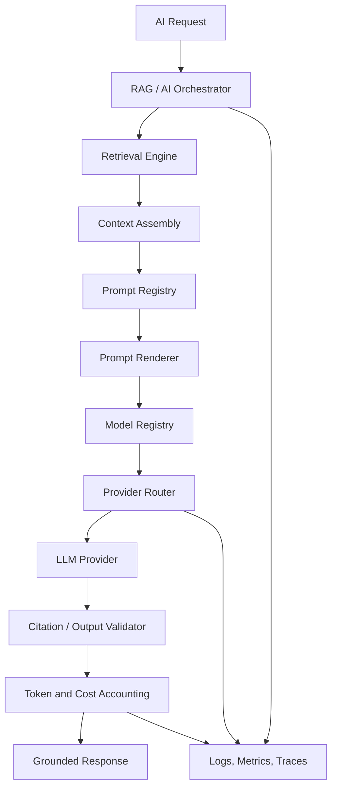
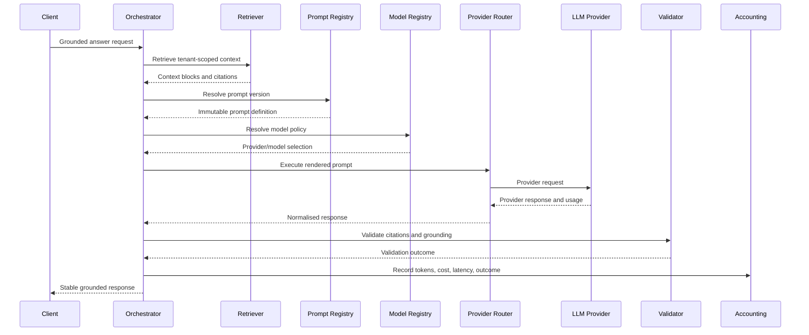

# AI Core Architecture

Version: 1.0
Status: Canonical Draft

## 1. Purpose

Yoranix AI Core is the reusable intelligence layer behind the platform's chatbots, assistants, future agents, internal search, workflow automation, and external API products.

It must remain independent from any single user interface, provider, model, or tenant-specific product flow.

## 2. Core design principles

1. Provider-independent.
2. Prompt-versioned.
3. Model-aware.
4. Tenant-safe.
5. Source-grounded.
6. Cost-observable.
7. Testable without external providers.
8. Reusable across products.
9. Conservative about automation.
10. Explicit about failure states.

## 3. Scope

AI Core includes:

- Prompt Registry
- Prompt Renderer
- Model Registry
- Provider Registry
- Provider Router
- Token Accounting
- Cost Tracking
- RAG Orchestrator
- Conversation Engine
- Citation Validation
- Evaluation Hooks
- Observability Hooks

AI Core excludes:

- Website widget UI
- Dashboard UI
- Organisation-specific branding
- Public marketing pages
- Billing presentation
- Product-specific workflow screens

## 4. High-level architecture



## 5. Component responsibilities

### 5.1 Prompt Registry

Stores logical prompt definitions and immutable prompt versions.

Responsibilities:

- Resolve active prompt version
- Enforce lifecycle states
- Support rollback
- Preserve reproducibility
- Expose provider/model compatibility metadata

Must not:

- Call providers
- Retrieve documents
- Own tenant UI settings

### 5.2 Prompt Renderer

Renders validated templates using approved variables.

Responsibilities:

- Validate required variables
- Enforce size limits
- Escape unsafe content where needed
- Produce stable prompt hash
- Return system and user messages

### 5.3 Model Registry

Stores model capabilities and operational metadata.

Responsibilities:

- Model identifier
- Provider identifier
- Context window
- Supports streaming
- Supports JSON mode
- Supports tools
- Supports vision
- Pricing metadata
- Availability status

### 5.4 Provider Registry

Stores provider adapters and capabilities.

Initial providers:

- deterministic mock
- OpenAI-compatible

Future providers:

- Azure OpenAI
- Anthropic
- Gemini
- Ollama/local

### 5.5 Provider Router

Selects provider and model based on policy.

MVP policy:

- Explicit configured model
- Global fallback model
- Deterministic mock in tests

Future policy inputs:

- Tenant plan
- Cost budget
- Latency target
- Model health
- Data residency
- Capability requirements

### 5.6 Token and Cost Engine

Captures provider usage and estimated cost.

Responsibilities:

- Prompt tokens
- Completion tokens
- Total tokens
- Estimated input cost
- Estimated output cost
- Provider/model metadata
- Tenant/workspace attribution

### 5.7 Conversation Engine

Manages stateful exchanges without owning UI.

Responsibilities:

- Conversation sessions
- Ordered messages
- Message roles
- Provider execution references
- Context-window strategy
- Retention hooks

### 5.8 RAG Orchestrator

Coordinates the full grounded-answer workflow.

Responsibilities:

1. Validate tenant/workspace context.
2. Retrieve active tenant-scoped chunks.
3. Assemble context.
4. Resolve prompt version.
5. Render prompt.
6. Resolve model/provider.
7. Invoke provider.
8. Validate citations and fallback rules.
9. Record usage, cost, latency, and outcome.
10. Return stable response contract.

### 5.9 Citation Validator

Ensures generated citations refer to retrieved context.

MVP behaviour:

- Accept only citation identifiers included in the retrieval context.
- Reject unknown citation numbers.
- Mark answer for fallback or low confidence if citations are missing where required.

### 5.10 Evaluation Hooks

Allow offline and regression evaluation using golden datasets.

Evaluation dimensions:

- Retrieval relevance
- Faithfulness
- Citation correctness
- Fallback correctness
- Tenant isolation
- Latency
- Cost

## 6. Request model

A canonical AI request should eventually include:

- request_id
- organisation_id
- workspace_id
- conversation_id optional
- user_message
- use_case
- prompt_key
- model_policy
- retrieval_options
- response_options
- trace_context

## 7. Response model

A canonical AI response should include:

- request_id
- answer
- answer_state
- citations
- prompt_key
- prompt_version
- prompt_hash
- provider
- model
- usage
- estimated_cost
- latency_ms
- retrieval_summary
- fallback_reason optional

## 8. Execution sequence



## 9. Error model

Normalised AI Core errors:

- prompt_not_found
- prompt_version_unavailable
- prompt_render_failed
- model_not_found
- provider_unavailable
- provider_timeout
- provider_rate_limited
- provider_auth_error
- invalid_provider_response
- retrieval_empty
- citation_validation_failed
- token_budget_exceeded
- cost_budget_exceeded
- tenant_context_invalid
- internal_ai_error

Errors returned to public clients must not expose secrets or provider internals.

## 10. Retry policy

Retry only transient failures:

- timeout
- temporary provider unavailability
- provider rate limit with bounded backoff

Do not retry:

- invalid credentials
- invalid request
- prompt rendering failure
- tenant context failure
- policy rejection

MVP maximum retry count should remain small and configurable.

## 11. Security

Non-negotiable rules:

- Provider keys stay server-side.
- Tenant IDs are required before retrieval or execution.
- Tenant prompt overrides cannot weaken grounding or safety controls.
- Full prompts are not logged by default in production.
- User content and retrieved context are treated as untrusted input.
- Prompt injection cannot alter system-level policies.
- Provider responses are validated before returning.

## 12. Observability

Every execution should emit:

- request ID
- tenant/workspace IDs
- prompt key/version/hash
- provider/model
- retrieval count
- latency by stage
- token usage
- estimated cost
- answer state
- fallback status
- error category

Sensitive prompt/context content should be redacted or omitted by default.

## 13. Caching

Safe caching candidates:

- active prompt resolution
- model registry metadata
- provider capabilities
- repeated deterministic query results in future

Cache keys must include tenant/workspace context where responses are tenant-specific.

## 14. Scaling strategy

Initial deployment:

- AI Core modules live inside the API codebase.

Future extraction path:

- Separate provider execution service
- Separate evaluation service
- Dedicated prompt registry service
- Queue-based long-running workflows

Boundaries should be designed now, but services should not be split prematurely.

## 15. Package boundaries

Recommended logical packages:

```text
packages/
  ai-core/
    orchestrator/
    providers/
    registry/
    accounting/
    conversation/
    validation/
  retrieval-engine/
  prompt-engine/
  evaluation/
```

MVP may implement these as backend modules while preserving the same boundaries.

## 16. Architectural decisions

The following ADRs govern this architecture:

- Provider abstraction
- Prompt versioning
- Model registry and routing
- RAG orchestration boundary
- Multi-tenant isolation

## 17. Implementation sequence

1. Prompt Registry architecture and task.
2. Model Registry architecture and task.
3. Provider Router architecture and task.
4. Token and Cost Engine architecture and task.
5. Conversation Engine architecture and task.
6. RAG Orchestrator architecture and task.
7. Deterministic mock provider implementation.
8. First grounded answer endpoint.
9. OpenAI-compatible provider implementation.
10. Evaluation and regression hardening.

## 18. Acceptance criteria

- AI execution is not coupled directly to a specific provider.
- Prompt text is versioned and reproducible.
- Model and provider capabilities are explicit.
- Every execution is tenant-scoped.
- Token and cost hooks exist before production provider use.
- RAG orchestration is separate from chat UI.
- Tests can run using a deterministic mock provider.
- Public responses use a stable provider-neutral contract.
