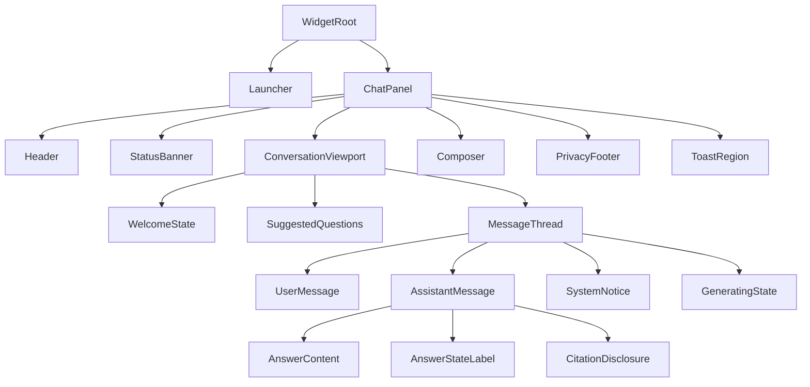
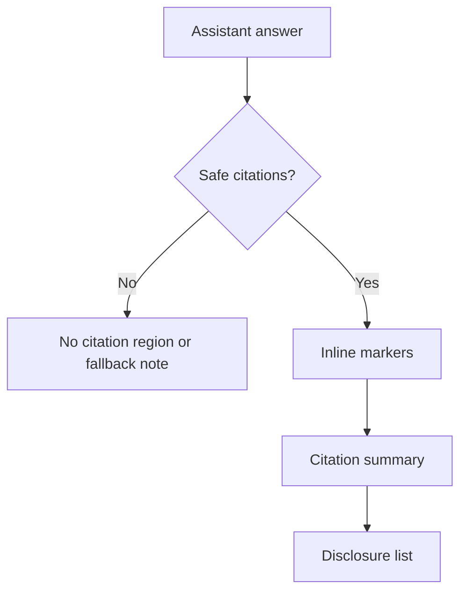
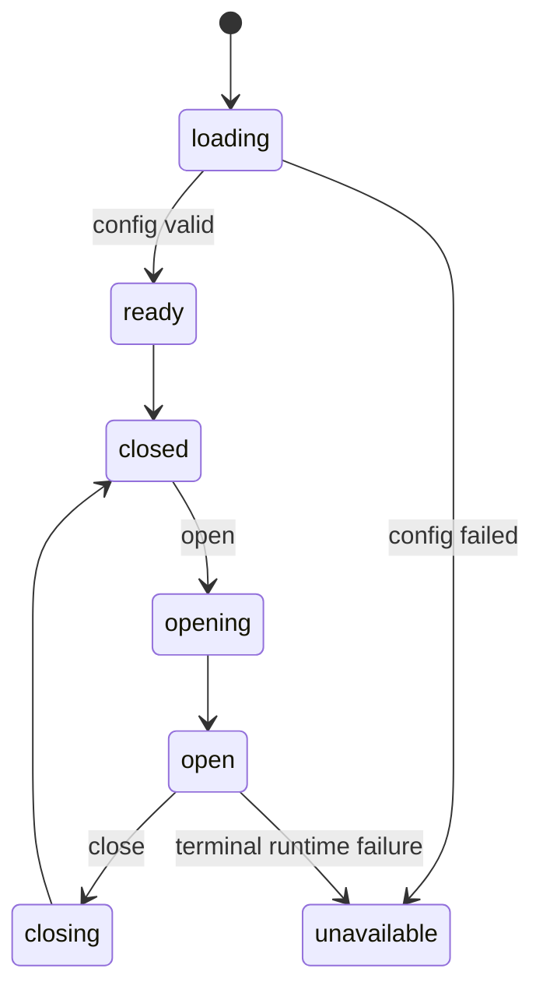
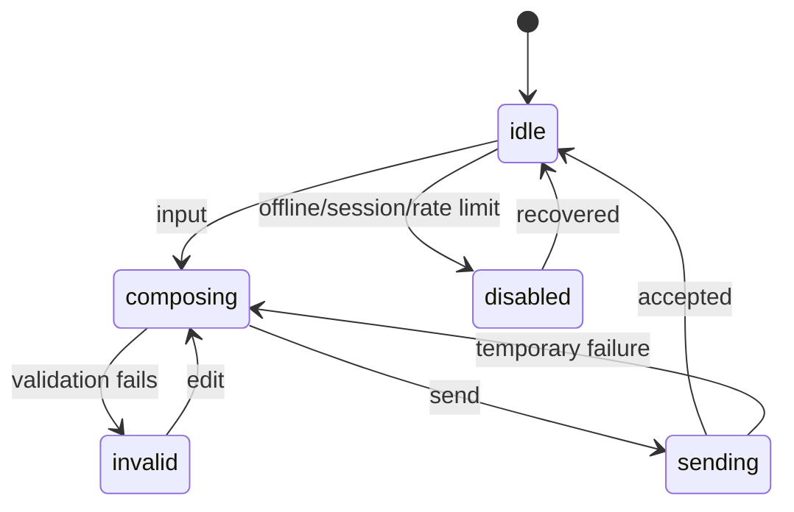
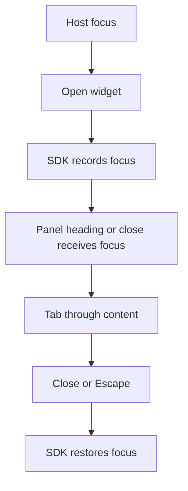
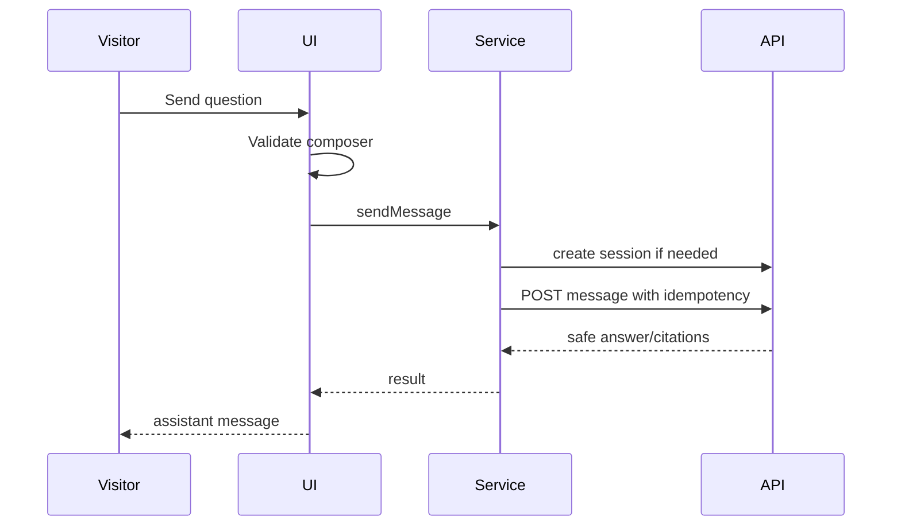
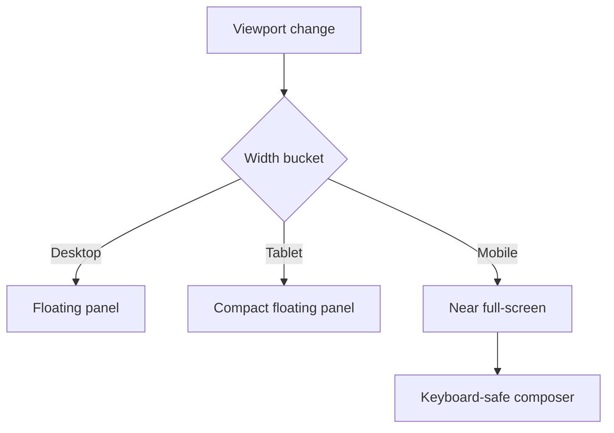
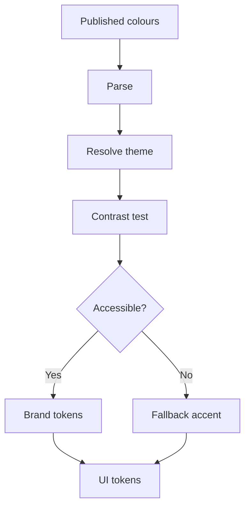
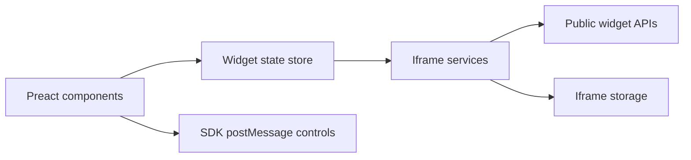

# Widget UI Interaction Architecture

Status: Proposed architecture for TASK-065A
Scope: Architecture, product design, UX, interaction, accessibility, and planning only. No widget components, styles, animations, SDK changes, backend changes, or assets are implemented by this document.

## Purpose

Design the complete visual and interaction architecture for the embeddable Yoranix website-chat widget. The widget must translate controlled Expressionism into a trustworthy, accessible, lightweight enterprise chat experience that can be implemented without visual or behavioural guessing.

The widget should feel distinctive, warm, intelligent, modern, premium, trustworthy, human-centred, compatible with customer branding, and clearly specific to Yoranix rather than a generic AI chatbot.

## Product Boundary

The visual widget owns launcher appearance, open/closed panel presentation, header and identity, welcome state, suggested questions, message thread, user and assistant messages, loading/generation states, citations, fallback and low-confidence communication, composer, character-limit guidance, rate-limit and temporary-error states, session-expiry presentation, privacy and terms access, responsive layouts, accessibility, motion, transitions, and visual theming from published configuration.

The visual widget does not own tenant resolution, session-token security, API authentication, message idempotency, RAG, output sanitisation, backend policy decisions, public SDK lifecycle, arbitrary customer CSS, lead capture, human-agent escalation, analytics dashboards, public history, or backend routes.

Existing constraints:

- The loader SDK remains framework-free and owns iframe mounting, lifecycle, postMessage transport, and host-facing controls.
- The iframe application owns all public config/session/message API calls.
- Session tokens remain in iframe-origin `sessionStorage` or memory and must never enter the host page, iframe URL, postMessage, telemetry, logs, or public state snapshots.
- Backend output is currently sanitised bounded plain text plus safe citations. The UI must render text defensively and must not assume rich Markdown.
- No public conversation-history endpoint exists. The widget displays only current iframe runtime messages.

## Design Principle

Controlled Expressionism x enterprise trust x lightweight conversational warmth.

Expressionism appears through confident typographic contrast, memorable but bounded launcher form, asymmetric detail, expressive message forms, human-centred state language, subtle depth, and purposeful micro-motion. Expressionism must not create chaotic layout, unreadable type, low contrast, overused gradients, excessive glassmorphism, constant animation, ambiguous controls, alarming recoverable errors, childish language, generic neon-AI styling, or decorative noise in the message thread.

Concrete rules:

- Keep the conversation area calm; concentrate expression in launcher, header, welcome, state markers, and message forms.
- Use explicit labels, icons/structure, and colour for trust-critical states; never colour alone.
- Brand colour is an accent, not the full palette.
- Every expressive shape must serve hierarchy or interaction.
- Motion communicates state and must never block input or reading.

## User Journeys

| Journey | Entry | State | Actions | Feedback | Recovery | Accessibility |
| --- | --- | --- | --- | --- | --- | --- |
| Visitor sees launcher | SDK mounted | Launcher loading/ready | Open | Hover/focus/pressed | Unavailable opens safe explanation | Button name, 44px target |
| Opens widget | Launcher activated | Panel opening/config/welcome | Close, wait | Motion or reduced-motion instant | Config failure unavailable | Focus moves inside iframe |
| Config loading | Handshake complete | Neutral loading shell | Close | Status text | Timeout retry/unavailable | `role=status` |
| Welcome appears | Config valid | Identity, welcome, suggestions, composer | Type, send, suggestions | Curated intro | Missing suggestions omitted | Heading and logical tab order |
| Select suggestion | Suggestion focused | Pressed then user message | Send directly | Loading/queued state | Send failure preserves state | Button semantics |
| Write custom question | Composer idle | Multiline input | Type/send | Limit guidance | Invalid input inline | Label and description |
| Lazy session needed | First send | Session creating | Wait | Sending state | Failure keeps draft | Status announcement |
| Assistant preparing | Message accepted | Generating state | Wait/close | Non-human preparation copy | Timeout safe error | Reduced motion alternative |
| Grounded answer | RAG answered | Assistant answer + citations | Inspect, follow up | Source-grounded response | Bad citations become fallback | Message labelled assistant |
| Close/reopen | Open/closed | Thread preserved | Reopen | State restored | Expired session notice | Focus restore |
| Session expires | Local/backend expiry | Session notice | Retry/new send | Calm explanation | New explicit send creates session | Assertive if blocking |
| Rate limited | 429 | Wait notice | Retry later | Retry-After if present | Composer preserves draft | Polite announcement |
| Fallback | Backend fallback | Fallback assistant state | Rephrase/contact | Honest no-evidence copy | Follow-up allowed | Label/icon/structure |
| Low confidence | Backend low confidence | Caution state | Review citations | Uncertainty copy | Follow-up allowed | Not colour-only |
| Unsafe/invalid | Validation/security denial | Inline error/notice | Edit | Neutral explanation | No rule disclosure | Field error association |
| Offline/restored | Browser offline | Offline banner | Draft, retry later | Send disabled | Online reenables send | Live region |
| Mobile keyboard | Mobile open | Keyboard-safe panel | Type/send/close | Composer visible | Orientation recalculates | No off-screen controls |
| Keyboard/screen reader | Any state | Focus trap/live regions | Tab, Escape, Enter | Predictable focus | Blocking errors announced | WCAG 2.2 AA |

## Information Architecture

Primary regions: launcher, shell/panel, header, identity/status area, scrollable conversation region, welcome content, suggested-question region, message thread, citations, system notices, composer, privacy/footer area, and transient notifications.

## Branding And Token Model

Published configuration maps to validated design tokens only.

Clients may control bot name, welcome message, launcher label, suggested questions, primary/secondary colour, logo/avatar, position, theme mode, language, privacy and terms links, and capability visibility. Clients may not control arbitrary CSS, typography families, layout internals, focus styles, semantic state colours, security-error wording categories, citation truthfulness, raw font/asset URLs, HTML, message limits, model/provider/prompt, or unsafe SVG.

Token groups:

- Colour: `surface.canvas`, `surface.elevated`, `surface.inset`, `border.subtle`, `border.strong`, `text.primary`, `text.secondary`, `text.muted`, `accent.primary`, `accent.contrast`, `accent.soft`, `focus.ring`, `state.success`, `state.warning`, `state.danger`, `state.fallback`, `state.lowConfidence`, `message.user`, `message.assistant`, `citation.surface`.
- Typography: system UI stack, identity 16-18px/650, body 14-15px/1.45, small 12-13px, metadata 11-12px, code system mono future, normal letter spacing 0.
- Spacing: 2/4/8/12/16/20/24/32 scale; panel padding 16 desktop and 12 mobile; 44px touch targets.
- Shape: panel radius 20 desktop, message radius 16 with one reduced identity corner, citation radius 10, button radius 10-14, expressive launcher pill/capsule.
- Elevation: soft launcher shadow, layered panel shadow, visible focus ring plus shadow.
- Motion: 120ms fast, 180ms normal, 260ms slow, transform/opacity preferred, reduced-motion alternatives.

Colour derivation:

1. Parse configured colours and reject invalid values.
2. Resolve light/dark base palette from theme mode.
3. Choose accessible accent foreground with at least 4.5:1 contrast for normal text.
4. If a brand colour cannot support accessible control/text pairs, keep it decorative and use fallback accessible accent for controls.
5. Semantic state colours remain platform-owned.
6. Focus ring must meet at least 3:1 against adjacent colours and remain visible in forced-colours mode.

Thresholds: 4.5:1 normal text, 3:1 large text and UI components, 3:1 focus indicators. State is never colour-only.

Theme modes: `light`, `dark`, and `auto`. Published configuration wins. Host theme hints are advisory and must not override explicit configuration. Auto follows iframe `prefers-color-scheme` and may update tokens during a session.

## Launcher, Panel, Header, And Welcome

Launcher states: `loading`, `ready`, `hover`, `focus`, `pressed`, `open`, `unread_future`, `unavailable`, and `reduced_motion`.

MVP launcher:

- Desktop uses an expressive pill with icon/avatar and configured label visible when space allows.
- Mobile uses compact icon/avatar with accessible label.
- Label appears on desktop by default until first open; hover-only text is never the accessible name.
- Target size: 56px desktop, 52px mobile, never below 44px.
- Placement comes from config, default bottom-right with safe-area offsets.
- Missing logo/avatar uses a platform assistant mark.
- Unavailable state may open a safe explanation instead of silently disappearing.

Panel model:

- Desktop target 390 x 620, max 420 x 720 or viewport minus 32px.
- Tablet 360-420 wide and viewport-safe height.
- Mobile near full-screen or full-screen under 480px, safe-area aware, sticky header, composer above keyboard.
- Closed SDK resize bounds cover launcher only and do not block host interaction.
- Open bounds clamp to desktop/tablet/mobile modes and never create accidental full-page obstruction on desktop.

Header includes avatar/logo, bot name, safe descriptor such as `AI assistant`, close control, and optional future reset placeholder. It must not imply a live human or expose provider/model names. The header title labels the panel and remains compact on mobile.

Welcome state includes bot identity, configured welcome message, concise capability cue, suggested questions, privacy/sensitive-data note, and composer. Session may not exist yet. Welcome text clamps with future expansion; no fake initial assistant bubble is required.

Suggested questions:

- Max visible: 4 desktop, 3 mobile.
- Keyboard: normal Tab order for MVP; roving tabindex only if a grid is introduced.
- Long labels clamp to two lines but keep full accessible name.
- Selection sends directly with pressed/loading feedback because suggestions are action prompts, not templates.
- Suggestions collapse or disappear after the first accepted user message.

## Message, Answer, Composer, And Citation Model

Message types: `user`, `assistant`, `assistant_fallback`, `assistant_low_confidence`, `system_notice`, `generating`, `failed_send_future`, and `date_separator_future`.

Thread rules:

- Assistant aligns start; user aligns end.
- Max width: 82% desktop, 92% mobile.
- User and assistant differ by alignment, surface, and identity edge, not colour alone.
- Consecutive messages group visually.
- Long content wraps and long words break safely.
- Text selection is allowed.
- Avoid generic oversized round bubbles; use soft rectangular blocks with one reduced identity corner.

User messages:

- Clear separation from assistant.
- URLs remain wrapped plain text; no rich previews.
- Pending marker while sending.
- Failed retry is future; submitted messages are not editable in MVP.
- Accessible label: `You said` plus content.

Assistant messages:

- Render answer as text, not `innerHTML`.
- Preserve safe line breaks.
- No model/provider/token/cost metadata.
- Current output is plain text; component shape should allow a future reviewed restricted-Markdown renderer.

Answer-state presentation:

| State | Visual | Copy Principle | Action |
| --- | --- | --- | --- |
| `answered` | Normal assistant message | Direct and source-grounded | Inspect citations, follow up |
| `fallback` | Gentle fallback marker | `I could not find this in the available information.` | Rephrase or use contact text |
| `low_confidence` | Caution marker and softened surface | Review sources or rephrase | Inspect citations |
| `temporarily_unavailable` | System notice | Service issue, no fake answer | Retry |
| `unsafe_request` | Neutral notice | Cannot help with that request | Edit/rephrase |
| `rate_limited` | Calm wait notice | Try again after wait | Retry after `Retry-After` |
| `session_expired` | Session notice | New session needed | Next explicit send creates session |

Loading/generation states use non-deceptive language such as `Checking the available information...`; avoid human typing metaphors. The generating indicator is a subtle thinking line or waveform with static reduced-motion fallback.

Composer:

- Multiline textarea, send button, limit guidance, validation text, optional privacy reminder nearby.
- Min height 44px, max 120px desktop and 96px mobile.
- Enter sends; Shift+Enter newline; IME composition never sends prematurely.
- Boundary whitespace trims on send; internal line breaks preserved.
- Send disabled when empty, offline, already sending, terminal session, or over limit.
- Character count appears after 80% of limit.
- Paste is plain text and bounded.
- Draft clears after backend accepts send; temporary failures preserve draft or failed user message as appropriate.
- No file upload, voice, emoji, attachments, or host-page send API.

Scrolling:

- Auto-scroll on user send and assistant response only when near bottom.
- Preserve position when user scrolls upward.
- Show `Jump to latest` when new content arrives while away from bottom.
- Reduced motion uses instant scroll.
- No public history loading in MVP.

Citation UX:

MVP uses inline numbered markers plus an expandable citation region beneath the assistant answer.

Citation fields: index, source title, source type, optional page, optional section, optional quoted text.

Requirements:

- Citations visible without hover.
- Disclosure controls keyboard accessible and screen-reader labelled.
- No internal IDs, paths, URLs, similarity scores, or tenant metadata.
- Long titles clamp visually but remain accessible.
- Missing page/section omitted gracefully.
- Zero-citation fallback is honest and does not show empty source chrome.

Privacy/legal:

- Privacy and terms live near welcome/footer, accessible before first message.
- Sensitive-information warning appears near first-use and footer.
- Links must be HTTPS and use safe new-context attributes.
- Do not invent legal wording; use configured copy plus platform-safe fallback.
- No consent checkbox in MVP.

## Error, Offline, Session, And State Architecture

| Error | Visual State | Composer | Action | Preserve | Announcement |
| --- | --- | --- | --- | --- | --- |
| Invalid widget/config | Unavailable panel | Hidden/disabled | Retry/close | None | Assertive |
| Origin denied | Unavailable | Hidden | Site owner future | None | Assertive |
| Offline | Banner | Draft allowed, send disabled | Retry after online | Draft | Polite |
| Config timeout | Loading -> unavailable | Hidden | Retry | None | Assertive |
| Session failure | Notice | Enabled after failure | Retry send | Draft | Assertive |
| Message timeout | Thread notice | Enabled | Retry same logical send if safe | Draft/message | Polite |
| Rate limit | Wait notice | Disabled or delayed | Try later | Draft | Polite |
| Unsafe/invalid | Inline error/notice | Enabled | Edit | Draft | Assertive |
| Quota exceeded | Quota notice | Disabled/limited | Later/contact | Draft maybe | Assertive |
| Service unavailable | Notice | Depends on phase | Retry | Draft | Polite/assertive |
| Unexpected | Safe generic | Depends | Retry | Draft if possible | Assertive |

Offline behaviour: allow drafting, disable send, do not queue offline messages, update banner on reconnect, require explicit send/retry.

Session lifecycle: session is created lazily by the existing iframe message service on first message. Do not show token or internal session ID. Remaining-message warning may appear only when <=3 remaining and product policy approves. Manual `New conversation` is deferred.

UI state domains:

- Bootstrap: `loading`, `ready`, `unavailable`.
- Panel: `closed`, `opening`, `open`, `closing`.
- Config: `loading`, `ready`, `failed`.
- Session: `none`, `creating`, `active`, `expired`, `invalid`, `limited`.
- Composer: `idle`, `composing`, `invalid`, `sending`, `disabled`.
- Response: `idle`, `generating`, `answered`, `fallback`, `low_confidence`, `failed`.
- Connectivity: `online`, `offline`, `reconnecting`.

Invalid transitions: cannot send before config ready, while offline, while request in progress, or when terminal session state blocks send. Cannot display citations without a safe assistant response. Cannot expose raw API errors in UI state.

## Rendering, Accessibility, Responsive, Motion, And Performance

Rendering framework decision for TASK-065B: use Preact for the iframe visual application while keeping the loader SDK framework-free.

| Option | Strengths | Weaknesses | Decision |
| --- | --- | --- | --- |
| Framework-free DOM | Smallest runtime; current shell pattern | Harder for complex accessible UI | Rejected for full visual UI |
| React | Familiar ecosystem | Larger iframe runtime | Rejected for MVP widget |
| Preact | React-like components, small runtime, testable | Adds dependency and minor ecosystem differences | Chosen |
| Lit/Web Components | Strong encapsulation | Extra custom-element complexity inside iframe | Rejected |
| Svelte | Small output | New compiler path | Rejected |

Rationale: the widget UI has enough state, focus, accessibility, and responsive complexity to justify declarative rendering; Preact keeps bundle impact low, stays inside the iframe, and can consume the existing framework-free services/state store.

Rendering security:

- Render answers and configured text as text nodes, never raw HTML.
- Preserve line breaks safely.
- No `eval`, no dynamic raw HTML, no arbitrary CSS.
- Image assets must already be validated and displayed on controlled surfaces.
- Future restricted Markdown requires a separate reviewed renderer and UI sanitisation layer.

Accessibility target: WCAG 2.2 AA.

Requirements:

- Iframe title plus internal language attribute.
- Dialog or equivalent panel semantics with labelled heading.
- Focus trap inside open widget.
- Focus restoration through SDK on close.
- Escape closes from inside widget.
- Polite live regions for generation/new responses; assertive only for blocking user-triggered errors.
- Composer labels/descriptions and error association.
- 44px touch targets, contrast thresholds, 200-400% zoom/reflow, reduced motion, forced-colours support, keyboard-only access, mobile screen-reader support.

Focus model:

- On open, SDK remembers host focus and moves focus into iframe.
- First-open target is panel heading or close region, not composer, to avoid opening mobile keyboard immediately.
- Subsequent desktop open may focus composer when safe.
- New responses do not steal focus; they announce through live region.
- On close, focus returns to prior connected host element or launcher.

Keyboard:

- Tab/Shift+Tab cycle inside open panel.
- Escape closes panel.
- Enter sends in composer; Shift+Enter inserts newline; IME composition respected.
- Space/Enter activates suggestions and citation disclosures.
- No global host-page shortcuts.

Motion:

- Permitted: launcher state, panel open/close, message arrival, loading/generation, citation disclosure, error/banner transition.
- Durations 120-260ms.
- Transform/opacity preferred; no layout-heavy animation.
- Generating indicator is the only long-running animation and must be subtle.
- Reduced motion uses instant/opacity changes.
- Max concurrent animations: panel plus one local state indicator.

Responsive matrix:

| Viewport | Panel | Header | Composer | Suggestions | Citations | Launcher |
| --- | --- | --- | --- | --- | --- | --- |
| >=1440 | 390x620 target, max 420x720 | Full | 120px max | 4 | Disclosure | Pill with label |
| 1024-1439 | 380-400 wide | Full/compact | 110px max | 4 | Disclosure | Pill |
| 768-1023 | 360-400 wide | Compact | 104px max | 3-4 | Disclosure | Pill/compact |
| 480-767 | Near full-screen | Sticky compact | 96px max | 3 stacked | Accordion | Compact |
| <480 | Full/near full | Sticky compact | 88-96px max | 3 stacked | Accordion | Icon/short |
| Landscape mobile | Height constrained | Compact | Keyboard-safe | 2-3 | Collapsed | Compact |

Internationalisation readiness: English-first defaults, configured `lang`, text expansion, long-word wrapping, no fixed narrow labels, logical properties where practical, future RTL and localised error-copy mapping.

Performance budgets after UI implementation:

- Iframe app JS gzip <=45 KB after foundation and <=70 KB after full MVP UI.
- CSS gzip <=12 KB.
- Open transition <=260ms.
- Input latency under 100ms.
- Render at least 50 in-memory messages without visible jank.
- No external fonts, heavy icon libraries, or heavy animation dependency.

Icon strategy: tiny local SVG component set, consistent stroke, no external icon URLs, no unsafe client SVG. Required icons: close, send, citation, fallback, low confidence, warning, offline, retry, launcher.

Microcopy tone: warm, direct, honest, non-technical, not overconfident, not anthropomorphically deceptive. Default examples: `Ask a question...`, `Checking the available information...`, `I could not find this in the available information.`, `Please wait a moment before sending another message.`, `This chat session expired. Send again to start a new session.`

## Testing And Review Strategy

Implementation tests for TASK-065B:

- Unit/component: launcher, panel, header, welcome, suggestions, messages, answer states, citations, composer, errors, privacy links, theme tokens, contrast fallback, state transitions.
- Accessibility: axe checks, keyboard flows, focus trap/restore, live regions, labels, contrast, reduced motion, forced colours, zoom/reflow.
- Browser: desktop/mobile, virtual keyboard, long content, many messages, offline/retry, session expiry, rate limit, malicious sanitised content, extreme branding, CSP/sandbox, host isolation.
- Visual regression: launcher states, welcome, active conversation, fallback, low confidence, error/offline, mobile, dark mode, extreme branding with deterministic data and tolerant thresholds.

Design review gates before implementation approval:

- Wireframes, token map, launcher variants, desktop/mobile panel, welcome, active conversation, citation disclosure, fallback/low-confidence, error/offline, composer states, keyboard/focus flow, light/dark themes, extreme customer colours, long content.

## Threat And Misuse Review

| Risk | Controls | Residual Risk |
| --- | --- | --- |
| Deceptive human presentation | AI assistant language; no live-agent status | Client bot name could imply human |
| Hidden uncertainty | Fallback/low-confidence labels required | Users may still over-trust |
| Dark patterns | No fake urgency or forced consent | Host page context can pressure users |
| Inaccessible brand colours | Contrast fallback tokens | Brand colour may be softened |
| Malicious configured text | Render as text and bound length | Client wording can still socially engineer |
| Unsafe assets | Backend validation and controlled surfaces | Asset host compromise future risk |
| Long-content layout attacks | Wrapping, max heights, scroll containment | Aesthetics may degrade |
| Clickjacking/overlay | Iframe isolation and bounded resize | Host controls its page |
| Phishing links | HTTPS privacy/terms only, safe attributes | Destination content can change |
| Citation overclaiming | Backend-authorised citations only | Users may not inspect sources |
| Unsafe answer rendering | Text rendering, no innerHTML | Future Markdown requires review |
| Privacy omission | Platform fallback warning | Client legal copy may be weak |

## Failure Matrix

| State | UI | Composer | Retry | Preserved | Announcement |
| --- | --- | --- | --- | --- | --- |
| Config loading | Loading shell | Hidden | Auto bounded | None | Polite |
| Config failure | Unavailable | Hidden | Manual | None | Assertive |
| Session creating | Sending/session notice | Disabled | In-flight coalesced | Draft | Polite |
| Session failure | Notice | Enabled | Manual | Draft | Assertive |
| Validation failure | Inline error | Enabled | Edit | Draft | Assertive |
| Rate limit | Wait notice | Disabled/delayed | After wait | Draft | Polite |
| Unsafe request | Neutral notice | Enabled | Edit | Draft | Assertive |
| Quota | Quota notice | Disabled/limited | Later/contact | Draft maybe | Assertive |
| Request in progress | Pending notice | Disabled | Bounded poll | Message | Polite |
| Network timeout | Timeout notice | Enabled | Manual | Draft/message | Assertive if user-triggered |
| RAG fallback | Fallback answer | Enabled | Follow-up | Thread | Polite |
| Low confidence | Caution answer | Enabled | Follow-up | Thread | Polite |
| Invalid session | Session notice | Enabled after clear | New send | Draft | Assertive |
| Storage unavailable | Subtle notice | Enabled | N/A | Memory only | Polite |

## Additional Diagrams

## Implementation Split

- `TASK-065B1` - Preact rendering foundation, design tokens, theme/branding validation, layout shell, launcher/panel structural states.
- `TASK-065B2` - Welcome state, suggested questions, conversation thread, user/assistant message presentation, loading/fallback/error states.
- `TASK-065B3` - Composer, message-service integration, citations, session/offline/rate-limit recovery, focus/accessibility.
- `TASK-065B4` - Responsive/mobile hardening, motion, visual regression, browser/accessibility/security tests, performance optimisation.

## Acceptance Criteria

TASK-065A is complete when UI/SDK/backend boundaries, user journeys, component architecture, design tokens, customer-brand mapping, accessibility/focus model, message/citation/fallback/error/composer states, responsive and motion systems, rendering framework decision, test/review gates, implementation split, threat/failure models, diagrams, and ADR-0015 are documented, and no UI runtime code is added.

## TASK-065B1 Implementation Note

The iframe widget app now has a Preact rendering foundation for the visual shell. Implemented scope is limited to design tokens, contrast utilities, customer-brand token mapping, launcher/panel/header/viewport/footer structure, safe asset boundary, shell accessibility foundations, and browser/unit coverage.

Still deferred: full welcome state, suggested questions, messages, composer, citations, privacy content, final focus trap, visual regression, telemetry, Markdown rendering, and backend changes.

## TASK-065B2 Implementation Note

The iframe widget now implements the B2 welcome and conversation presentation layer: configured welcome copy, suggested questions as the only visual send mechanism, in-memory message thread, user/assistant states, fallback/low-confidence labels, preparation state, safe retryable failure presentation, and foundational scrolling/live-region behavior. Composer, citation disclosure, and full recovery flows remain deferred.
