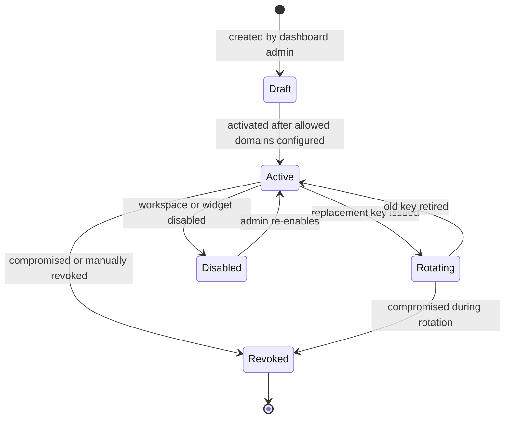
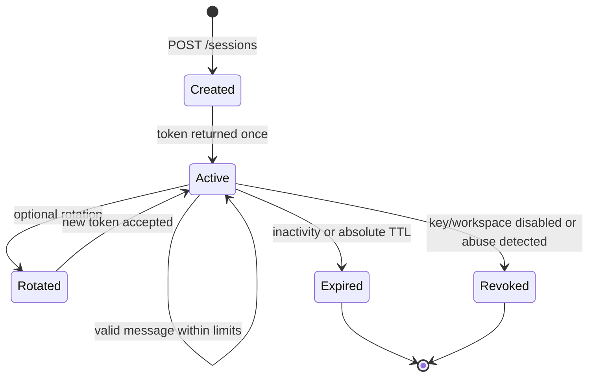
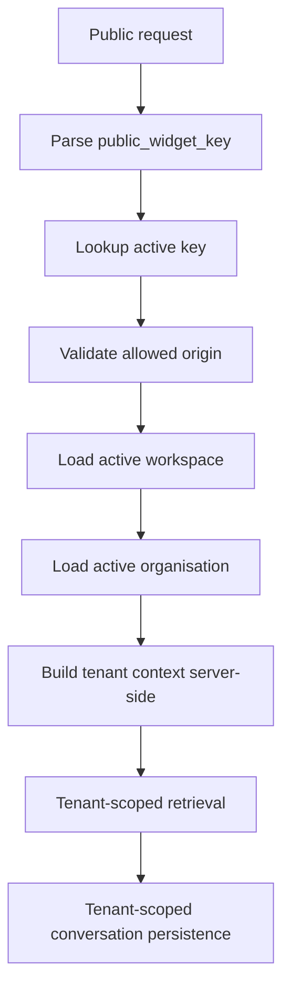
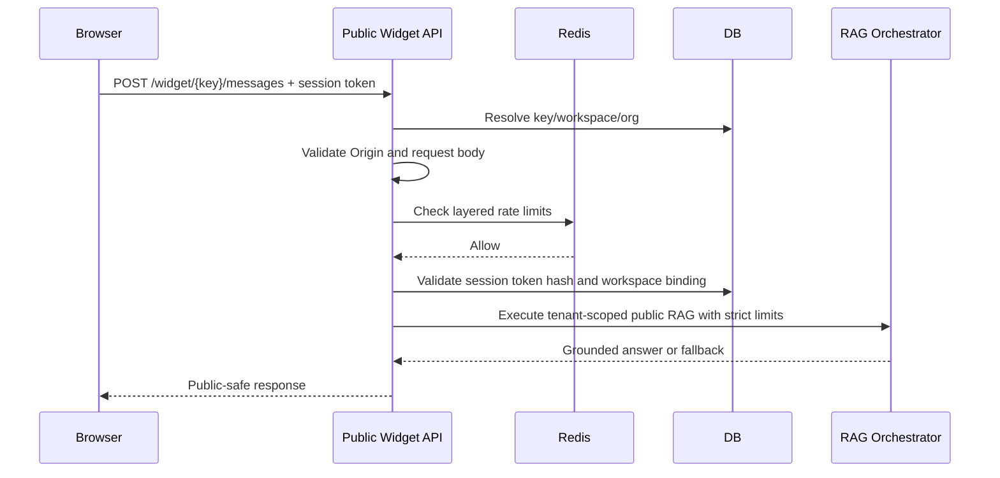
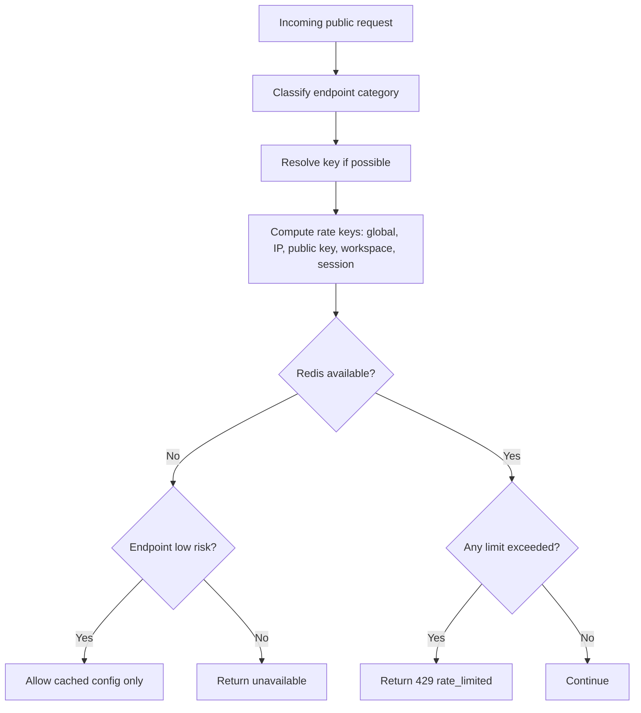
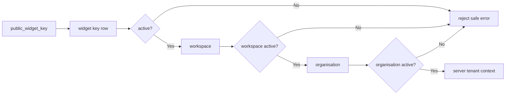

# Public Widget Security Architecture

Version: 0.1
Status: Proposed Architecture
Scope: Planning only. No public widget endpoint is implemented by this document.

## 1. Purpose

This document defines the security boundary for the future embeddable public website chatbot before any anonymous widget API is implemented. The boundary must support thousands of customer websites while preventing tenant leakage, dashboard privilege confusion, abuse, excessive AI cost, data harvesting, prompt attacks, and unauthorised administrative access.

The website widget is a channel. It must reuse tenant-safe platform capabilities only through a public boundary designed for anonymous traffic.

## 2. Security Boundary

The platform has five separate API surfaces:

| Surface | Caller | Authentication | Tenant source | Public |
| --- | --- | --- | --- | --- |
| Authenticated dashboard APIs | Client admins, owners, viewers | Production auth later; development placeholder now | Authenticated membership plus explicit tenant context during development | No |
| Internal development APIs | Local dashboard-test flows | Development headers only | Explicit organisation/workspace during development | No |
| Public widget configuration APIs | Browser widget bootstrap | Public key, domain controls, rate limits | Server-side public key resolution | Yes |
| Public widget chat APIs | Anonymous website visitors | Public key, anonymous session token, domain controls, rate limits | Server-side key and session resolution | Yes |
| Future partner/API integrations | Server-to-server partners | Separate integration credentials | Server-side integration mapping | Not browser-public |

Public widget traffic must never use, accept, trust, or forward dashboard authentication cookies, bearer tokens, `X-Development-User-Email`, `X-Development-Role`, or dashboard-only tenant parameters. Public endpoints must ignore or reject development headers if present.

## 3. Public Workspace Identity

A future `public_widget_keys` table should map browser-visible keys to exactly one workspace.

Required fields:

- `id`
- `organisation_id`
- `workspace_id`
- `public_widget_key`
- `status`: `draft`, `active`, `rotating`, `revoked`, `disabled`
- `environment`: optional `development`, `staging`, `production`
- `allowed_domains`
- `created_at`
- `created_by_user_id`
- `activated_at`
- `rotated_at`
- `revoked_at`
- `revoked_by_user_id`
- `metadata_json`

Rules:

- The public key identifies a workspace but is not a secret.
- Possession of the public key grants no dashboard, admin, document-management, audit, history-review, or configuration-write access.
- Public clients must not supply trusted `organisation_id` or `workspace_id` values.
- Every public request resolves `public_widget_key -> active widget key -> active workspace -> active organisation` server-side before data access.
- All retrieval, prompt rendering, conversation persistence, citations, usage accounting, and audit/security events must use resolved tenant context.
- A workspace may have multiple active keys only during explicit safe rotation.

## 4. Key Lifecycle



Lifecycle requirements:

- Creation: only authenticated `org_owner` or `client_admin` may create keys for workspaces they manage.
- Activation: production keys require at least one allowed domain.
- Rotation: allow multiple active keys for a bounded overlap window.
- Revocation: immediate rejection for config, session, and message APIs.
- Disabled workspace: all keys for the workspace behave as disabled, regardless of key status.
- Compromised key response: revoke key, expire active anonymous sessions where practical, emit security event, and require dashboard confirmation before replacement activation.
- Audit events: `widget_key.created`, `widget_key.activated`, `widget_key.rotated`, `widget_key.revoked`, `widget.disabled`.

## 5. Domain Validation

Allowed-domain validation is useful but is not authentication. Public keys are visible, Origin headers can be absent, and server-to-server abuse can spoof traffic outside normal browser enforcement.

Validation inputs:

- `Origin` header: primary browser signal for CORS and write operations.
- `Referer` header: diagnostic signal only; do not rely on it for authorisation.
- Key environment: development may permit controlled localhost origins.
- Stored allowed domains: exact domain and explicit subdomain rules.

Rules:

- Exact domains: `www.example.edu` matches only `www.example.edu`.
- Subdomains: allow explicit patterns such as `*.example.edu`; do not allow broad public suffixes or unrestricted `*`.
- Apex and subdomain are separate unless both are configured.
- Production widget traffic must use `https`; `http` is allowed only for localhost-style development origins.
- Custom ports require explicit development or staging permission.
- Missing Origin: reject session/message writes by default; config reads may reject or return a degraded minimal response.
- Server-to-server abuse requires rate limits, key status, session tokens, anomaly detection, and cost ceilings.
- Iframe embedding requires request-origin validation plus postMessage origin checks.
- CDN/proxy layers must preserve Origin; do not trust arbitrary forwarding headers.

## 6. Layered Redis Rate Limiting

Redis should enforce atomic token buckets or fixed-window counters by endpoint category and multiple identity dimensions.

Limit dimensions:

- Widget configuration reads.
- Session creation.
- Chat messages.
- Tenant/workspace.
- Public key.
- IP address or trusted proxy client IP.
- Anonymous session.
- Optional future browser fingerprint.
- Global platform emergency limiter.

Example categories:

| Category | Burst | Sustained | Notes |
| --- | ---: | ---: | --- |
| Config reads | 60/min/key | 2,000/day/workspace | Cacheable and lower cost. |
| Session creation | 20/min/key, 10/min/IP | 500/day/workspace | Prevent session floods. |
| Chat messages | 10/min/session, 30/min/key, 10/min/IP | configurable daily workspace quota | AI-cost bearing. |
| Global emergency | operator configured | operator configured | Platform kill switch. |

429 response:

```json
{
  "error": {
    "code": "rate_limited",
    "message": "Too many requests. Try again later."
  }
}
```

Use `Retry-After` when a retry window is known.

Redis outage policy:

- Config reads may fail open only with cached, low-risk public config for a short window.
- Session creation and chat messages should fail closed or return `unavailable` because they create persistence and AI cost.
- Do not reveal Redis internals.
- Emit operational alerts immediately.

## 7. Anonymous Session Model

Public chat must not rely only on a client-supplied conversation ID.

Requirements:

- Server creates a cryptographically random token with at least 128 bits of entropy.
- Store only a hash of the session token where practical.
- Bind session to `organisation_id`, `workspace_id`, `public_widget_key_id`, allowed origin, and limited abuse metadata.
- Absolute expiration, for example 24 hours for MVP.
- Inactivity timeout, for example 30 minutes.
- Optional token rotation on sensitive state changes.
- Reject tokens used with another public key or workspace.
- Maximum conversation lifetime bounded by session expiration.
- Message count cap, for example 30 messages MVP.
- No cross-workspace reuse.



## 8. Request Validation

Public widget APIs must validate before retrieval or AI execution.

Limits:

- Request body size: small fixed maximum, for example 16 KB for messages.
- Message length: bounded by characters and approximate tokens, for example 2,000 characters MVP.
- Unicode: normalise to NFC; reject or strip disallowed control characters except newline/tab where allowed.
- Empty messages: reject after trimming whitespace.
- Repeated messages: detect rapid identical submissions within a session/IP/key window.
- Malformed JSON: return a stable public error without framework tracebacks.
- Unsupported content: text only for MVP; no files, HTML payloads, images, or binary content.
- Conversation history: do not inject full history into RAG until a future memory task; cap any future history window.
- Request frequency: enforce Redis rate limits before retrieval/provider calls.

## 9. Prompt Injection and RAG Abuse Controls

| Threat | Control layer | Required controls |
| --- | --- | --- |
| User says ignore instructions | System prompt, output validation | System prompt states user content is untrusted; output validation prevents prompt disclosure. |
| Requests for system prompts | Input policy, system prompt, output validation | Refuse or fallback without revealing prompt text. |
| Requests to ignore sources | System prompt, citation validation | Require source-grounded answers; fallback when evidence absent. |
| Cross-tenant probing | Tenant resolution, retrieval filtering | Server-resolved tenant only; no public tenant IDs trusted. |
| Citation manipulation | Context assembly, citation validator | Only citations from retrieved tenant-scoped chunks may be returned. |
| Retrieval flooding | Request validation, rate limit, retrieval limit | Cap query length, retrieval count, and context chars. |
| Instructions in retrieved documents | Prompt design, context assembly | Treat retrieved text as untrusted evidence, not instructions. |
| Data exfiltration attempts | Retrieval filtering, output validation, monitoring | Never retrieve outside active tenant/workspace; monitor repeated probing. |
| Denial of wallet | Rate limit, cost ceiling, provider timeout | Enforce per-message token/context/output caps and daily workspace budget placeholder. |

## 10. Data Privacy Rules

Minimum collection:

- Anonymous session ID/token hash.
- Conversation and message content needed to provide chat and dashboard review.
- Operational metadata such as timestamps, answer state, latency, cost, and rate-limit counters.

IP/user-agent/referrer:

- IP address may be processed for rate limiting and abuse prevention; avoid long-term raw IP retention unless required.
- Store hashed or truncated IP for security logs where practical.
- User-agent may be used for abuse diagnostics but should not become a stable identity by default.
- Referrer should not be logged raw by default; store origin/domain where needed.

Policy requirements:

- Configurable retention for public conversations and security logs.
- Future deletion/redaction workflow.
- Consent notice in widget UI before chat begins.
- Personal information warning: tell users not to enter sensitive information unless the client has enabled an explicit workflow.
- Do not collect email, phone, or lead details unless a separate explicit lead-capture workflow is enabled.
- Clients must disclose widget usage, data handling, and knowledge scope on their websites.

## 11. Content Safety

MVP simple-rule handling:

- Reject empty, binary, or obvious spam payloads.
- Rate-limit repeated abusive terms and bot-like floods.
- Safe fallback for requests outside workspace knowledge scope.
- Do not provide sensitive organisational data that is not in approved public knowledge.

Future moderation layer:

- Self-harm or dangerous requests.
- Illegal content.
- Harassment and hate.
- Sexual content involving minors.
- Detailed wrongdoing instructions.
- Automated bot classification.

## 12. Cost Protection

Controls:

- Per-message input token ceiling.
- Retrieval context ceiling: max chunks and max context chars.
- Output token ceiling.
- Session message cap.
- Workspace daily budget placeholder.
- Provider timeout and bounded retry policy.
- Future caching for config and safe repeated deterministic responses.
- Future repeated-query detection by workspace/session/IP.
- Emergency kill switch by workspace, key, organisation, provider, or platform.
- Workspace suspension returns `disabled_widget` or `unavailable` and does not call retrieval/AI.

## 13. Proposed Public API Design

These endpoints are proposed only. Do not implement until a future approved task.

### GET /api/v1/widget/{public_key}/config

Required headers: `Origin` for browser requests; `User-Agent` as optional operational signal.

Tenant resolution: resolve public key server-side; validate key, workspace, organisation, environment, status, and allowed origin.

Response schema:

```json
{
  "data": {
    "widget_name": "Admissions Assistant",
    "theme": {},
    "welcome_message": "How can I help?",
    "allowed_features": { "chat": true },
    "environment": "production"
  }
}
```

Rate-limit category: config read. Privacy: no organisation ID, workspace ID, internal prompt, model, provider, or document metadata.

### POST /api/v1/widget/{public_key}/sessions

Request schema:

```json
{
  "client_context": {
    "page_url": "https://www.example.edu/admissions"
  }
}
```

Response schema:

```json
{
  "data": {
    "session_token": "returned-once",
    "expires_at": "2026-07-13T00:00:00Z",
    "message_limit": 30
  }
}
```

Validation: Origin required unless development explicitly permits localhost; page URL domain must match allowed origin when supplied; no client-supplied tenant IDs. Rate-limit category: session creation.

### POST /api/v1/widget/{public_key}/messages

Required headers: `Origin`; `Authorization: WidgetSession <session_token>` or an explicitly chosen future equivalent.

Request schema:

```json
{
  "message": "When do applications close?",
  "client_message_id": "optional-idempotency-key"
}
```

Response schema:

```json
{
  "data": {
    "message_id": "...",
    "conversation_id": "opaque-public-id-or-omitted",
    "answer": "...",
    "answer_state": "answered",
    "citations": [
      { "citation_index": 1, "source_title": "Admissions Guide", "source_type": "web", "page_number": null, "section_title": "Dates" }
    ]
  }
}
```

Validation: resolve key and session server-side; ensure session workspace/key binding; validate message size, content, rate limits, session caps, and cost caps before RAG. Rate-limit category: chat message.

### Optional GET /api/v1/widget/{public_key}/sessions/{session_token}

Prefer avoiding token in URL because URLs leak through logs/referrers. If status checks are needed, use a POST or Authorization header pattern instead.

## 14. Safe Public Error Model

Public errors must not expose organisation IDs, workspace IDs, existence of other tenants, internal provider names unless intentionally public, stack traces, database details, prompt contents, or security-rule internals.

| Code | HTTP | Meaning |
| --- | ---: | --- |
| `invalid_widget` | 404 | Public key missing, malformed, or not usable. |
| `disabled_widget` | 403 | Widget/workspace/organisation disabled. |
| `origin_not_allowed` | 403 | Origin is not allowed for this widget. |
| `rate_limited` | 429 | Request exceeded rate limits. |
| `invalid_session` | 401 | Session token invalid for this widget. |
| `expired_session` | 401 | Session expired or inactive too long. |
| `message_too_large` | 413 | Message or request exceeds limits. |
| `unavailable` | 503 | Temporary platform/provider/rate-limit dependency issue. |
| `safe_internal_error` | 500 | Generic unexpected failure. |

Shape:

```json
{
  "error": {
    "code": "origin_not_allowed",
    "message": "This widget is not available from this site."
  }
}
```

## 15. CORS and Browser Security

- Reflect only validated allowed origins.
- Do not use `Access-Control-Allow-Origin: *` for session or message endpoints.
- Do not allow browser credentials unless a future design proves need; anonymous session token is explicit.
- Preflight must validate requested methods and headers.
- Classic cookie CSRF is not relevant if no cookies/credentials are used, but token replay and cross-origin abuse remain relevant.
- Render text safely; escape HTML by default.
- Markdown, if supported, must be sanitised with an allowlist.
- Links require `rel="noopener noreferrer"`, validated schemes, and no automatic downloads.
- Do not expose direct private storage links.
- If iframe is used, postMessage must specify exact `targetOrigin`, validate `event.origin`, validate message schema, and avoid sending session tokens through broad channels.
- Widget CSP guidance should document required `script-src`, `frame-src`, and `connect-src` origins.

## 16. Widget Delivery Architecture

| Option | Security isolation | Styling conflicts | Accessibility | Deployment | Branding | CSP/versioning |
| --- | --- | --- | --- | --- | --- | --- |
| Script-injected DOM | Low-medium | High risk | Strong if implemented carefully | Simple | Flexible | Easiest but more XSS/style exposure. |
| Sandboxed iframe | High | Low | Good with focus management | Moderate | Controlled by iframe app | Strong isolation and independent versioning. |
| Web component | Medium | Medium-low with Shadow DOM | Good if built carefully | Simple-moderate | Flexible | Still shares page JS context. |

Preferred MVP: sandboxed iframe widget.

Rationale: strongest isolation from host-page JavaScript/CSS, clearer CORS/postMessage boundaries, independent deployment/versioning, and better containment for rendering mistakes. Trade-offs are focus management, responsive sizing, and customer CSP allowlisting.

## 17. Tenant Isolation Guarantees

Every public request must follow:

```text
public key
-> active widget configuration
-> active workspace
-> active organisation
-> tenant-scoped retrieval
-> tenant-scoped conversation persistence
```

No public API should trust client-supplied `organisation_id`, `workspace_id`, document IDs, chunk IDs, prompt keys, provider keys, or model keys.



## 18. Request Flow Diagrams

### Public message request flow



### Rate-limit decision flow



### Tenant-resolution flow



## 19. Audit and Security Events

Permanent administrative audit events:

- `widget_key.created`
- `widget_key.rotated`
- `widget_key.revoked`
- `widget.disabled`
- `widget.enabled`
- `widget.allowed_domains.changed`

High-volume operational/security events:

- `widget.origin.denied`
- `widget.rate_limited`
- `widget.session.created`
- `widget.session.expired`
- `widget.message.rejected`
- `widget.abuse.detected`
- `widget.invalid_session`

High-volume events should be sampled, aggregated, or stored in an operational event store separate from permanent administrative audit logs.

## 20. Observability

Metrics:

- Sessions created per workspace/key.
- Messages per workspace/key/session.
- Blocked origins.
- Rate-limited requests by limiter dimension.
- Invalid session attempts.
- Provider failures/timeouts.
- Fallback rate and failed-answer rate.
- Estimated cost per workspace/key/day.
- Latency by stage: validation, retrieval, prompt, provider, persistence.
- Abuse signals: repeated messages, origin failures, invalid keys, high IP fan-out.

Security logs must not include raw message content by default. Use request IDs, hashed session IDs, key IDs, workspace IDs, and event categories.

## 21. Threat Model

| Threat | Likelihood | Impact | Controls | Residual risk | Monitoring |
| --- | --- | --- | --- | --- | --- |
| Stolen public key | High | Medium | Key not secret, domain checks, rate limits, revocation | Server-to-server abuse still possible | Invalid origins, unusual IP/key volume |
| Malicious website embedding | Medium | Medium | Allowed origins, iframe postMessage checks, CORS | Origin spoof outside browser | Origin denied events |
| Cross-tenant probing | Medium | High | Server-side key-to-tenant resolution, tenant-scoped retrieval | Bugs in query filters | Tenant isolation tests, retrieval metrics |
| Session-token theft | Medium | Medium | Random token, hash storage, TTL, workspace binding, no URL tokens | Same-origin malware can still steal | Invalid session workspace/key attempts |
| Replay | Medium | Medium | TTL, inactivity timeout, optional rotation, anomaly detection | Same browser replay within TTL | Repeated token/IP anomalies |
| Rate-limit bypass | High | High | Layered key/IP/session/workspace/global limits | Botnets distribute IPs | High workspace cost/message velocity |
| Prompt injection | High | Medium | Prompt policy, retrieved text as untrusted, output validation | Model may still comply imperfectly | Prompt-extraction probes, fallback rates |
| XSS | Medium | High | Iframe isolation, escaped rendering, markdown sanitisation, safe links | Sanitiser bypass possible | CSP reports, client error telemetry |
| Denial of service | Medium | High | Rate limits, request size caps, global emergency limiter | Distributed attacks | 429s, latency, infrastructure alarms |
| Denial of wallet | High | High | Token/context/output caps, daily budgets, timeouts, kill switch | Low-rate costly traffic | Cost per workspace/key/day |
| Sensitive-data leakage | Medium | High | Public approved knowledge only, tenant filters, no prompt leakage | Client may upload sensitive docs as public | Review/fallback queues, document visibility checks |
| Redis outage | Medium | Medium | Fail-closed chat/session, cached config fail-open only | Widget unavailable | Redis health, unavailable errors |
| Provider outage | Medium | Medium | Timeouts, safe fallback/failed state, no stack traces | Reduced answer availability | Provider failure metrics |
| Database outage | Low-medium | High | Return `unavailable`, no stale tenant state for chat | Public chat unavailable | DB health, error budgets |

## 22. Implementation Phases

Future tasks:

1. Widget configuration and public key schema.
2. Key management dashboard/admin API.
3. Domain validation library and tests.
4. Redis layered rate limiter.
5. Anonymous session token model.
6. Public config endpoint.
7. Public session endpoint.
8. Public message endpoint using RAG orchestrator with public limits.
9. Sandboxed iframe widget shell.
10. Sanitised message renderer.
11. Security and abuse test suite.
12. Abuse monitoring and operational dashboards.

## 23. Future Test Strategy

Required tests before public launch:

- Public key maps only to one workspace.
- Revoked key rejected.
- Disabled workspace and organisation rejected.
- Allowed origin accepted.
- Disallowed origin rejected.
- Missing Origin policy enforced.
- Rate limits by key, IP, workspace, and session.
- Session token workspace binding.
- Expired/inactive session rejected.
- Cross-tenant token replay rejected.
- Message size and body size limits.
- Prompt injection probes.
- System prompt extraction attempts.
- XSS and markdown sanitisation.
- Safe public errors.
- Redis outage behaviour.
- Dashboard headers rejected/ignored.
- Development auth headers rejected/ignored.
- Cost ceilings and output token caps.

## 24. Acceptance Criteria

The security architecture is complete when:

- Public and dashboard security boundaries are explicit.
- Widget identity and lifecycle are defined.
- Tenant resolution never trusts public tenant IDs.
- Anonymous session security is defined.
- Rate limiting and cost controls are specified.
- Delivery architecture is selected.
- Threat model is complete.
- Future implementation tasks are clear.
