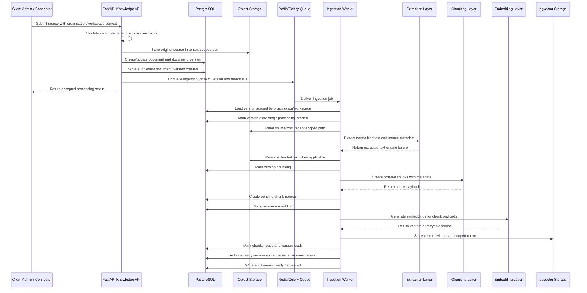

# Task: Ingestion Pipeline Design

## Task ID

TASK-012

## Linked epic/story

- EPIC-003

## Objective

Define a complete engineering specification for the knowledge ingestion pipeline that will turn tenant-scoped source documents into validated text, chunks, embeddings, and retrieval-ready records.

This is an architecture-only task. Do not implement application code, database migrations, API routes, worker code, queue configuration, storage configuration, UI, or external integrations in this task.

## Context for coding agent

Read these files first:

- `.ai/PROJECT_CONTEXT.md`
- `.ai/CURRENT_SPRINT.md`
- `implementation-pack/03_AI/01_RAG_Implementation_Standards.md`
- `implementation-pack/03_AI/02_Knowledge_Platform_Architecture.md`
- `planning/tasks/TASK-010-knowledge-platform-architecture.md`
- `planning/tasks/TASK-011-document-lifecycle-versioning.md`

## 1. High-level architecture

The ingestion pipeline is an asynchronous, tenant-isolated processing path that converts uploaded or synced knowledge sources into retrieval-ready chunks and embeddings.

Primary components:

- Dashboard or future connector initiates a source ingestion request.
- API validates actor, role, organisation, workspace, source type, file size, and metadata.
- Object storage stores original source artifacts under tenant-scoped paths.
- Database stores `documents`, `document_versions`, processing state, and audit events.
- Queue schedules version processing jobs.
- Worker extracts text, normalizes content, creates chunks, and hands chunks to embedding generation.
- Embedding layer stores vectors in pgvector first, attached to chunk records or a future embedding table.
- Retrieval layer only uses active ready tenant-scoped chunks from eligible document versions.

Core design principles:

- Document versions are immutable processing snapshots.
- Ingestion is idempotent per document version.
- Partial output is not retrievable.
- Failed, archived, expired, deleted, superseded, private, or cross-tenant content is excluded from retrieval.
- Source content, extracted text, and user-provided metadata are untrusted input.

## 2. Sequence diagram

## 3. Upload lifecycle

The upload lifecycle covers MVP file and FAQ sources.

Recommended lifecycle:

1. User chooses workspace and source type.
2. API resolves authenticated actor, organisation, workspace, membership, and permission.
3. API validates source type, file extension, MIME type, size, filename, and required metadata.
4. API creates or updates a stable `documents` record.
5. API writes original content to tenant-scoped object storage.
6. API creates immutable `document_versions` row with checksum and source metadata.
7. API marks document/version `uploaded` or `queued`.
8. API enqueues ingestion job.
9. Worker moves version through extraction, chunking, embedding, ready, or failed states.
10. Version activation makes chunks retrievable only after complete success.

Upload response should return an accepted state, not block on full ingestion.

## 4. Queue architecture

Use Redis and Celery for MVP queueing, consistent with current technical direction.

Recommended logical queues:

- `ingestion.default`: normal document processing.
- `ingestion.high_priority`: small admin-triggered retries or urgent pilot fixes.
- `ingestion.embedding`: optional future queue if embedding calls need separate scaling.
- `ingestion.dlq`: dead-letter queue for exhausted jobs.

Queue payload should include:

- `job_id`
- `organisation_id`
- `workspace_id`
- `document_id`
- `document_version_id`
- `attempt_number`
- `requested_by_user_id` where available
- `source_type`
- `idempotency_key`
- `correlation_id`

Queue payload must not include raw file content, extracted text, embeddings, secrets, connector tokens, or hidden prompts.

## 5. Worker responsibilities

Workers are responsible for safe, idempotent processing of document versions.

Responsibilities:

- Validate job payload shape.
- Load document and version using organisation and workspace filters.
- Refuse processing when tenant context does not match.
- Refuse processing when document is archived, expired, deleted, or no longer eligible.
- Lock or claim a document version to prevent duplicate active processing.
- Move version through processing states.
- Read original source from tenant-scoped storage.
- Extract text and structural metadata.
- Persist extracted text where required.
- Create chunks with tenant, document, version, order, token, and source metadata.
- Hand chunks to embedding generation.
- Store embeddings and mark chunks ready only after vectors are available.
- Mark version ready or failed.
- Activate ready version and supersede prior active version atomically where possible.
- Write safe audit, metrics, and logs.

Workers must not generate chat answers or perform retrieval-time prompt assembly.

## 6. Extraction layer

The extraction layer converts source artifacts into normalized text and source-location metadata.

MVP extractors:

- PDF extractor for page-aware text.
- DOCX extractor for headings and paragraphs.
- TXT extractor for plain text.
- CSV extractor for row-aware structured text.
- FAQ extractor for question/answer pairs.

Extraction output should include:

- normalized text blocks
- source location metadata such as page, row, heading, or FAQ ID
- language when detectable
- extraction warnings
- parser name and parser version
- text checksum

Extraction rules:

- Treat source content as untrusted data.
- Do not execute macros, scripts, links, or embedded active content.
- Reject or fail safely on encrypted, corrupt, unsupported, or empty files.
- Store user-safe failure reasons separately from internal diagnostics.
- Preserve enough location metadata for citations.

## 7. Chunking hand-off

The chunking hand-off begins after extraction succeeds.

Worker should pass the chunking layer:

- `organisation_id`
- `workspace_id`
- `document_id`
- `document_version_id`
- normalized text blocks
- source-location metadata
- source type
- chunking configuration version

Chunking output should include:

- ordered chunk index
- chunk content
- token count estimate
- content hash
- source title
- page, row, heading, FAQ, or URL locator metadata
- language

Chunking rules:

- Chunks are created as `pending` or equivalent non-retrievable state.
- Chunks must not mix content from multiple versions.
- Chunks must preserve tenant and version identifiers.
- Empty or low-value chunks should be excluded before embedding.
- Chunking configuration changes should be tracked for future reprocessing decisions.

## 8. Embedding hand-off

The embedding hand-off begins after chunk records or chunk payloads are prepared.

Worker should pass the embedding layer:

- chunk IDs or idempotent chunk hashes
- chunk content
- tenant and workspace context for logging and filtering
- embedding model/provider configuration identifier
- correlation ID

Embedding output should include:

- vector
- embedding model name
- embedding provider identifier
- token usage where available
- latency
- retryable/non-retryable error category where relevant

Embedding rules:

- Embeddings are stored only for eligible chunks.
- Chunks become `ready` only after successful vector storage.
- Failed embedding generation leaves chunks non-retrievable.
- Embedding provider secrets must never be logged or stored in document metadata.
- Embedding cost and latency should be observable per tenant and workspace.

## 9. Retry behaviour

Retries should be bounded, explicit, and safe.

Retryable failures:

- Temporary object storage read/write failure.
- Temporary database connection failure.
- Queue delivery interruption.
- Embedding provider timeout, rate limit, or 5xx response.
- Worker process interruption before final state commit.

Non-retryable failures:

- Unsupported source type.
- File exceeds allowed size.
- Corrupt or encrypted file that cannot be parsed.
- Empty extracted content.
- Tenant mismatch.
- Document or version was archived, expired, deleted, or superseded before processing.
- Permission or ownership mismatch.

Retry rules:

- Use exponential backoff with jitter.
- Cap attempts per stage.
- Preserve the same document version for retries of the same source snapshot.
- Do not create duplicate chunks or embeddings on retry.
- Record attempt count and last safe failure reason.

## 10. Dead-letter queue strategy

Jobs enter the dead-letter queue after retry exhaustion or explicit unrecoverable worker failure.

DLQ records should include:

- job ID
- correlation ID
- organisation ID
- workspace ID
- document ID
- document version ID
- failed stage
- attempt count
- safe failure category
- timestamp

DLQ rules:

- DLQ messages must not contain raw content, extracted text, embeddings, secrets, or connector credentials.
- Moving to DLQ should mark the document version `failed` unless a safer terminal state applies.
- Operators should be able to inspect safe metadata and requeue a job after correcting the cause.
- Requeueing from DLQ must reuse idempotency checks.

## 11. Idempotency

Ingestion must be idempotent at document-version level.

Idempotency keys should be derived from stable inputs such as:

- `organisation_id`
- `workspace_id`
- `document_id`
- `document_version_id`
- source checksum
- processing configuration version

Idempotency requirements:

- Duplicate queue delivery must not duplicate chunks.
- Duplicate upload with same checksum may reuse or skip processing according to future implementation policy.
- Worker retries should safely resume or replace incomplete output for the same version.
- Activation should be atomic so a version is not partially active.
- Prior ready versions should remain retrievable until the new version is fully ready and activated.

## 12. Failure recovery

Failure recovery must preserve data integrity and retrieval safety.

Recovery patterns:

- If extraction fails, mark version failed and create no retrievable chunks.
- If chunking fails, mark version failed and delete or keep pending chunks as non-retrievable according to implementation policy.
- If embedding partially fails, keep all chunks non-retrievable until all required embeddings succeed or the version fails.
- If activation fails after successful processing, retry activation without re-extracting where possible.
- If a new version fails, keep the previous active ready version available unless the document state blocks retrieval.
- If a document is archived or deleted while processing, worker should stop safely and leave version non-retrievable.

Manual recovery actions may include retry version, requeue DLQ job, archive document, restore document, upload replacement, or mark obsolete.

## 13. Processing states

Recommended states are aligned with TASK-011.

Document states:

- `uploaded`
- `processing`
- `ready`
- `failed`
- `archived`
- `expired`
- `deleted`

Document version states:

- `pending`
- `queued`
- `extracting`
- `chunking`
- `embedding`
- `ready`
- `failed`
- `superseded`
- `withdrawn_future`

Chunk states:

- `pending`
- `embedding`
- `ready`
- `failed`
- `excluded`

Job states:

- `queued`
- `claimed`
- `running`
- `retry_scheduled`
- `dead_lettered`
- `completed`
- `cancelled`

State transitions must be auditable for major lifecycle events.

## 14. Observability

The ingestion pipeline must be observable across API, queue, worker, extraction, chunking, embedding, and activation stages.

Observability requirements:

- Correlation ID generated at upload or connector sync start.
- Correlation ID propagated through API response, audit events, queue payloads, worker logs, and metrics.
- Stage-level timing recorded for extraction, chunking, embedding, vector storage, and activation.
- Safe failure categories recorded for operator debugging.
- Tenant-scoped aggregation available for admin analytics and cost review.

Observability must avoid storing raw source content, extracted text, embeddings, secrets, credentials, or hidden prompts in logs or metrics.

## 15. Metrics

Recommended metrics:

- ingestion jobs queued by tenant/workspace/source type
- ingestion jobs completed
- ingestion jobs failed
- ingestion jobs dead-lettered
- processing duration by stage
- queue wait time
- extraction duration
- extracted text length
- chunk count per version
- embedding token count
- embedding duration
- embedding cost estimate
- retry count by failure category
- active document version activation count
- storage bytes by tenant/workspace/source type

Metrics should support pilot operations, capacity planning, provider cost monitoring, and failure trend detection.

## 16. Logging

Logs should be structured and safe.

Required log fields:

- timestamp
- log level
- correlation ID
- job ID where applicable
- organisation ID
- workspace ID
- document ID
- document version ID
- stage
- status
- safe error category
- duration where applicable

Logging rules:

- Do not log raw uploaded content.
- Do not log extracted full text.
- Do not log embeddings.
- Do not log API keys, provider secrets, connector tokens, or signed storage URLs.
- Do not log hidden prompts or system instructions.
- Keep user-facing error messages separate from detailed internal diagnostics.

## 17. Security

Security requirements:

- Validate authentication and role before accepting uploads or manual ingestion requests.
- Validate source type, extension, MIME type, size, and filename.
- Sanitize filenames and never trust client-provided paths.
- Store files under tenant-scoped object-storage prefixes.
- Treat files, extracted text, metadata, and connector content as untrusted input.
- Do not execute embedded content, macros, scripts, or links.
- Use safe parser settings and resource limits.
- Keep provider credentials and connector secrets outside document/version/chunk records.
- Exclude failed, archived, expired, deleted, private, or out-of-scope content from retrieval.
- Use safe fallback in chat runtime when retrieval evidence is unavailable.

## 18. Tenant isolation

Tenant isolation is mandatory at every stage.

Rules:

- API must resolve organisation and workspace context before creating document records.
- Queue payloads must carry organisation and workspace IDs.
- Workers must re-check tenant ownership from the database before reading storage or writing outputs.
- Storage paths must include tenant scope and must not be inferred from user-provided filenames.
- Chunks and embeddings must include or inherit organisation and workspace scope.
- Retrieval must filter by organisation, workspace, active document state, active version, chunk status, and expiry.
- Citations must only reference chunks from the same tenant and workspace as the chat message.
- Metrics and logs must not leak one tenant's source names, errors, or usage into another tenant's views.

## 19. Cost considerations

Cost drivers:

- Object storage for original files and extracted text.
- Database storage for chunks and metadata.
- Vector index storage.
- Embedding token usage.
- Worker CPU and memory for extraction.
- Queue and retry amplification.
- Future connector API usage and sync frequency.

Cost controls:

- File size limits.
- Source type allow-list.
- Checksum-based duplicate detection.
- Chunk count limits per document/version.
- Bounded retries.
- Embedding batching where safe.
- Per-tenant usage metrics.
- Future quotas by organisation or workspace.
- Avoid re-embedding unchanged content.

## 20. Future connectors

Future connectors must feed the same ingestion pipeline and must not change retrieval semantics.

### SharePoint

- Sync files into document versions using SharePoint item IDs and modified timestamps.
- Store connector credentials outside document/version/chunk records.
- Create new versions when checksum or modified timestamp changes.
- Do not call SharePoint during chat answer generation.

### OneDrive

- Treat OneDrive files as external source snapshots.
- Preserve source display name, external ID, and source URL metadata.
- Convert changed files into new document versions.
- Respect workspace-level connector configuration and tenant boundaries.

### Google Drive

- Use Google file IDs and revision metadata for change detection.
- Export supported Google-native document formats into processable snapshots before ingestion.
- Keep permission and credential checks in connector/sync jobs, not retrieval.
- Preserve source metadata needed for citation display.

### Website crawler

- Crawl only configured and allowed domains.
- Respect crawl limits, deduplication, robots/policy decisions, and abuse protections.
- Store each page snapshot as a document version or future crawl collection child document.
- Cite the ingested snapshot URL and page metadata, not live page content at answer time.

### Email

- Future email ingestion should treat messages or selected threads as source snapshots.
- Store sender, subject, message date, and mailbox/source metadata safely.
- Avoid ingesting private mailboxes without explicit admin configuration and permission review.
- Redact or classify sensitive fields where required by future policy.
- Do not expose email connector credentials or raw mailbox metadata in chat citations.

## 21. Acceptance criteria

Future ingestion implementation must satisfy:

- Upload and connector ingestion requests validate tenant, role, source type, size, and metadata.
- Source files are stored in tenant-scoped object storage paths.
- `documents` and immutable `document_versions` are created consistently.
- Jobs are queued with safe metadata and correlation IDs only.
- Workers re-check tenant ownership before processing.
- Extraction, chunking, embedding, and activation are staged and observable.
- Partial outputs are not retrievable.
- Ready versions activate atomically and supersede previous active versions.
- Failed candidate versions do not deactivate previous ready versions unless document state requires it.
- Retry, DLQ, and recovery behaviours are defined and safe.
- Logs and metrics are structured and do not expose secrets or raw content.
- Retrieval can only access active ready tenant-scoped chunks from eligible document versions.
- Future connectors can enter through source acquisition without changing retrieval or citation semantics.

## 22. Future implementation tasks

Recommended future implementation sequence:

1. Define database fields and migrations for document-version processing states and active-version tracking.
2. Add tenant-scoped object storage abstraction for original and extracted files.
3. Implement document upload API with validation and audit events.
4. Implement immutable document-version creation and checksum handling.
5. Add Redis/Celery queue configuration for ingestion jobs.
6. Implement ingestion worker job claim, tenant validation, and state transitions.
7. Implement MVP extraction adapters for PDF, DOCX, TXT, CSV, and FAQ.
8. Implement chunking hand-off and chunk persistence.
9. Implement embedding hand-off and vector storage with pgvector.
10. Implement activation logic and superseded-version handling.
11. Add retry, DLQ, and manual requeue operations.
12. Add tenant-isolation tests for worker, retrieval, and citation boundaries.
13. Add observability metrics, structured logging, and audit event coverage.
14. Add dashboard document status views in a separate approved UI task.
15. Add future connector ingestion tasks only after MVP upload ingestion is stable.
