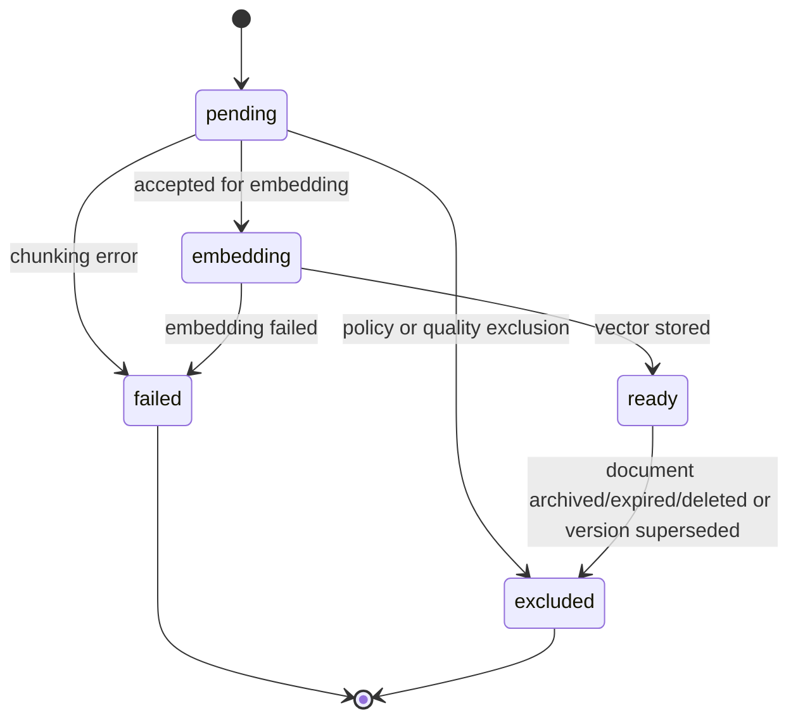

# Task: Chunking Strategy

## Task ID

TASK-013

## Linked epic/story

- EPIC-003

## Objective

Define a complete engineering specification for chunking extracted knowledge into retrieval-ready units that preserve source traceability, tenant isolation, document-version integrity, and RAG answer quality.

This is an architecture-only task. Do not implement application code, database migrations, API routes, worker code, UI, parser adapters, embedding calls, or external integrations in this task.

## Context for coding agent

Read these files first:

- `.ai/PROJECT_CONTEXT.md`
- `.ai/CURRENT_SPRINT.md`
- `implementation-pack/03_AI/01_RAG_Implementation_Standards.md`
- `implementation-pack/03_AI/02_Knowledge_Platform_Architecture.md`
- `planning/tasks/TASK-010-knowledge-platform-architecture.md`
- `planning/tasks/TASK-011-document-lifecycle-versioning.md`
- `planning/tasks/TASK-012-ingestion-pipeline-design.md`

## 1. Purpose of chunking

Chunking converts extracted document content into smaller, ordered, source-aware text units that can be embedded, retrieved, cited, and assembled into grounded chat-answer context.

The chunking layer sits between extraction and embedding:

```text
source document -> extraction -> chunking -> embeddings -> retrieval -> citations -> chat answers
```

Chunking must:

- Preserve enough local context for useful retrieval.
- Keep chunks small enough for high-quality embeddings and prompt assembly.
- Retain source metadata needed for citations.
- Keep all chunks tied to one organisation, workspace, document, and document version.
- Avoid making incomplete, failed, stale, archived, expired, deleted, or cross-tenant content retrievable.

## 2. Why chunking matters for RAG quality

Chunking directly affects answer quality because retrieval returns chunks, not whole documents.

Good chunking improves:

- Semantic match between user questions and stored knowledge.
- Citation precision.
- Answer grounding and faithfulness.
- Prompt-token efficiency.
- Ranking quality during vector search.
- Fallback behaviour when evidence is weak.

Poor chunking can cause:

- Missing context due to chunks being too small.
- Noisy retrieval due to chunks being too large.
- Broken citations because source location metadata is missing.
- Hallucination risk because answers receive incomplete or misleading context.
- Higher embedding and prompt costs.
- Cross-section confusion when unrelated content is combined.

## 3. Supported MVP document types

MVP chunking must support extracted content from:

- `pdf`: page-aware text, headings where detectable, and page numbers.
- `docx`: headings, paragraphs, lists, and tables where extractable.
- `txt`: plain text separated by paragraphs and lightweight headings.
- `csv`: row-aware and table-aware text.
- `faq`: question-and-answer pairs.

Future source types must map into the same chunk model without changing retrieval semantics.

## 4. Chunking strategy by source type

### PDF

- Prefer page-aware blocks from extraction.
- Keep page number metadata on every chunk.
- Avoid merging unrelated pages unless overlap requires a short continuation.
- Preserve detected headings, section titles, and document title where available.
- Treat headers, footers, and repeated boilerplate as candidates for exclusion or down-weighting in future implementation.

### DOCX

- Use heading hierarchy to group paragraphs and lists.
- Keep heading path metadata, such as `Policy > Refunds > International Students`.
- Keep list items with their parent paragraph when splitting would remove meaning.
- Tables should use table-handling rules rather than paragraph-only chunking.

### TXT

- Split by paragraphs and lightweight heading patterns.
- Preserve line order.
- Avoid splitting in the middle of sentences where possible.
- Use document title and inferred section title where available.

### CSV

- Treat rows as structured records.
- Include column names with row values in chunk text.
- Keep row number and column metadata.
- Group small related rows only when doing so preserves meaning and remains within token limits.

### FAQ

- Treat each question-and-answer pair as a primary chunk candidate.
- Include both question and answer in the chunk text.
- Preserve FAQ identifiers and category metadata.
- Do not merge unrelated FAQ entries unless future evaluation proves benefit.

## 5. Token size rules

Initial target rules for MVP:

- Target chunk size: 300-600 tokens.
- Maximum chunk size: 800 tokens unless source-specific rules justify an exception.
- Minimum useful chunk size: approximately 40 tokens, except short FAQ answers may be valid below this threshold.
- Oversized sections should be split at semantic boundaries before hard token limits.
- Extremely small adjacent paragraphs may be merged when they share heading context.

Token sizing should use the tokenizer or estimator aligned with the embedding model where practical. If exact tokenization is unavailable during early implementation, use a conservative estimator and record the estimator version in metadata.

## 6. Overlap rules

Overlap helps preserve continuity across chunk boundaries but increases cost and duplicate retrieval risk.

Recommended MVP overlap:

- Default overlap: 50-100 tokens.
- No overlap for FAQ chunks unless explicitly needed.
- Minimal or no overlap for CSV row chunks.
- Heading and source metadata should be repeated in metadata rather than duplicated heavily in content.
- Overlap must not cross unrelated sections, unrelated table rows, unrelated FAQ entries, or different document versions.

Overlap should be applied only when splitting continuous prose. It should not merge content across tenant, document, version, page, FAQ, or source-type boundaries.

## 7. Heading-aware chunking

Heading-aware chunking should preserve document structure and improve retrieval explainability.

Rules:

- Track heading path from extraction when available.
- Prefer splitting at heading boundaries.
- Include nearest heading and parent heading path in chunk metadata.
- For short sections, include the full section in one chunk if within token limits.
- For long sections, split within the section while retaining heading metadata on each chunk.
- Avoid combining content from sibling sections when headings indicate different topics.

Heading metadata should support both retrieval filtering/reranking later and citation display.

## 8. Table handling

Tables require structure-preserving chunking.

Rules:

- Keep table title or surrounding section heading where available.
- Preserve column names.
- Preserve row order and row numbers.
- Convert rows into readable text with labels, not raw comma-separated values only.
- Avoid splitting one logical row across chunks.
- For small tables, one table can be one chunk if within token limits.
- For large tables, chunk by row groups while repeating column names in each chunk.
- Do not merge unrelated tables into one chunk.

Table chunk metadata should include:

- table index
- table title when available
- row range
- column names
- page number for PDF-derived tables where available
- section heading path

## 9. FAQ handling

FAQ chunking should preserve the direct question-answer relationship.

Rules:

- One FAQ entry should normally produce one chunk.
- Chunk text should include both the question and answer.
- Category, tags, and source title should be metadata.
- Related alternate questions may be stored in metadata or future synonym fields.
- Very long FAQ answers may be split into multiple chunks with the original question repeated or referenced in metadata.
- Empty question or empty answer entries should fail validation or be excluded.

FAQ chunks should be highly citation-friendly because answers are usually direct and short.

## 10. CSV handling

CSV chunking should preserve row and column meaning.

Rules:

- Validate headers before chunking.
- Represent each row with column labels.
- Preserve row number and source filename/title.
- Group rows by stable ordering unless future metadata defines grouping keys.
- Do not infer unsupported relationships between rows.
- Exclude empty rows.
- Handle very wide rows by preserving key identifying columns and splitting remaining fields only when necessary.

CSV chunks should be suitable for factual retrieval but should not be treated as a relational database query engine.

## 11. Metadata requirements

Every chunk must include or inherit:

- `organisation_id`
- `workspace_id`
- `document_id`
- `document_version_id`
- `chunk_index`
- `chunk_id`
- `source_type`
- `source_title`
- `content_hash`
- `token_count`
- `chunking_strategy_version`
- `status`
- `created_at`

Source-specific metadata may include:

- `page_number`
- `page_range`
- `section_title`
- `heading_path`
- `paragraph_range`
- `table_index`
- `table_title`
- `row_number`
- `row_range`
- `column_names`
- `faq_question`
- `faq_id`
- `language`
- `source_uri_future`

Metadata must not include secrets, credentials, raw connector tokens, hidden prompts, or other tenants' identifiers.

## 12. Chunk IDs and versioning

Chunk identity must preserve document-version traceability.

Rules:

- Chunks belong to exactly one document version.
- Chunk IDs should be stable database identifiers once persisted.
- `chunk_index` should be ordered within a document version.
- `content_hash` should represent normalized chunk content and relevant chunking configuration.
- Reprocessing a new document version creates new chunks.
- Chunks from superseded versions may remain for historical citations but must not be retrieved for new answers.
- Chunk IDs must not be reused across document versions.

Retrieval and citations must be able to trace:

```text
citation -> chunk -> document_version -> document -> workspace -> organisation
```

## 13. Parent-child chunking future option

Parent-child chunking is a future enhancement, not required for MVP.

Potential future design:

- Child chunks are smaller units used for vector retrieval.
- Parent chunks or parent sections provide larger context during answer assembly.
- Child chunks store `parent_chunk_id` or `parent_section_id`.
- Parent and child records must share organisation, workspace, document, and version scope.
- Citations should still point to the specific child evidence while answer context may include parent text.

Use cases:

- Long policy documents.
- Complex procedures.
- Tables with explanatory surrounding text.
- Web pages with nested sections.

Risks:

- Increased storage cost.
- More complex citation display.
- Higher prompt cost if parent context is overused.
- Need for careful evaluation before adoption.

## 14. Failure cases

Chunking should fail safely or exclude content when it cannot produce reliable retrievable chunks.

Failure cases:

- Empty extracted text.
- Unsupported extracted structure.
- Token estimator failure.
- Source metadata missing required tenant or version identifiers.
- Chunk count exceeds configured safety limits.
- A single logical unit exceeds maximum token limits and cannot be split safely.
- Table has no headers and cannot be interpreted safely.
- FAQ entry has missing question or answer.
- CSV row is too wide or malformed.
- Document or version becomes archived, expired, deleted, or superseded before chunk persistence.

Failure handling:

- Mark version failed for fatal chunking failures.
- Mark individual chunks `excluded` only when the rest of the version remains valid and policy allows partial exclusion.
- Store safe failure category and diagnostics.
- Do not make partial chunks retrievable before the version is fully ready.

## 15. Tenant isolation rules

Chunking must enforce tenant isolation even though it operates after upload validation.

Rules:

- Worker must load document version using `organisation_id` and `workspace_id` filters.
- Chunk payloads must carry tenant identifiers from trusted database records, not user input.
- Chunk persistence must validate that document, version, and workspace belong to the same organisation.
- Chunking must never combine content from multiple tenants, workspaces, documents, or document versions.
- Retrieval must filter chunks by organisation, workspace, active document status, active version, chunk status, and expiry.
- Metrics and logs must not expose another tenant's document title, source text, or metadata.
- Citations must validate that chunk and chat message share the same tenant and workspace.

## 16. Evaluation strategy

Chunking quality should be evaluated before and after implementation changes.

Evaluation dimensions:

- Retrieval precision for known questions.
- Retrieval recall for answerable questions.
- Citation accuracy.
- Answer faithfulness.
- Fallback rate for answerable content.
- Token cost per answer.
- Duplicate or near-duplicate chunk retrieval rate.
- Chunk boundary quality in manual review.

Recommended evaluation assets:

- Small representative PDFs.
- DOCX policy/procedure documents.
- FAQ set.
- CSV sample with row-based facts.
- Questions with expected source chunks.
- Negative questions that should trigger fallback.

Any change to chunk size, overlap, heading handling, table handling, or embedding model should be evaluated against the same baseline set.

## 17. Edge cases

Future implementation should handle:

- Very short documents.
- Very long single sections.
- PDF text extraction with repeated headers/footers.
- Multi-column PDFs.
- Scanned PDFs with no text layer.
- DOCX nested lists.
- DOCX tables spanning pages.
- CSV files with missing headers.
- CSV files with inconsistent row lengths.
- FAQ answers that are longer than the target chunk size.
- Multiple languages in one document.
- Duplicate content within a document.
- Duplicate content across versions.
- Document title changes without content changes.
- Chunking config changes after existing versions are ready.
- Extraction output includes prompt-injection-like text.
- Version is archived, deleted, or expired while chunking runs.

## 18. Diagrams/state flow

### Pipeline placement


### Chunk state flow



### Version relationship

```text
document
  document_version v1
    chunk 0
    chunk 1
    chunk 2
  document_version v2
    chunk 0
    chunk 1
    chunk 2
```

Chunks are ordered inside their own version. Chunk indexes can repeat across versions, but chunk IDs must not.

## 19. Acceptance criteria

Future chunking implementation must satisfy:

- Supports MVP source types: PDF, DOCX, TXT, CSV, and FAQ.
- Produces ordered chunks scoped to organisation, workspace, document, and document version.
- Uses source-specific strategies for prose, headings, tables, CSV rows, and FAQ entries.
- Applies documented token size and overlap rules.
- Preserves metadata required for retrieval, citations, evaluation, and debugging.
- Keeps chunks non-retrievable until embedding succeeds and the document version is ready/active.
- Does not mix content across tenants, workspaces, documents, or versions.
- Handles fatal and partial chunking failures safely.
- Supports historical citation traceability for superseded versions.
- Provides evaluation fixtures or documented test cases for chunk boundary quality and retrieval quality.
- Avoids storing secrets, connector credentials, hidden prompts, or cross-tenant metadata in chunk records.
- Does not implement parent-child chunking until a future approved task.

## 20. Future implementation tasks

Recommended future implementation sequence:

1. Define chunking configuration constants and version naming.
2. Add chunking input/output schemas for extracted text blocks.
3. Implement token estimation aligned with embedding model selection.
4. Implement generic prose chunker for TXT and extracted PDF/DOCX paragraphs.
5. Implement heading-aware chunking for DOCX and structured extraction output.
6. Implement page-aware PDF chunk metadata handling.
7. Implement table chunking for DOCX/PDF extracted tables.
8. Implement FAQ chunking with one entry per primary chunk.
9. Implement CSV row-aware chunking.
10. Persist chunk metadata and status transitions.
11. Add chunking failure categories and safe diagnostics.
12. Add tenant-isolation tests for chunk persistence and retrieval filters.
13. Add evaluation fixtures and expected retrieval examples.
14. Add metrics for chunk counts, token counts, exclusions, failures, and duplicate rates.
15. Evaluate parent-child chunking only after MVP chunking quality is measured.
